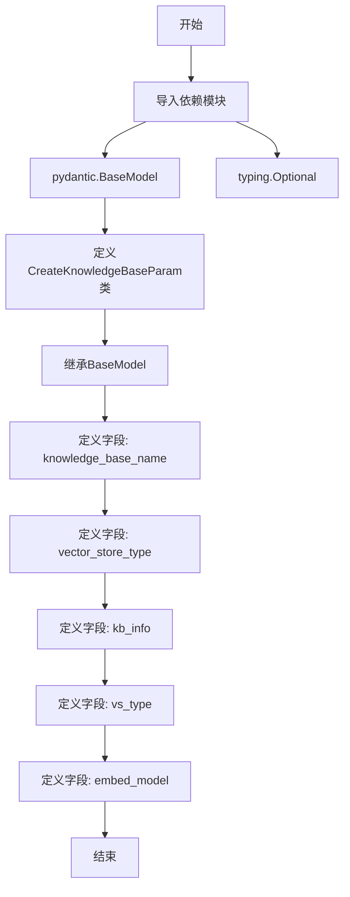

# `Langchain-Chatchat\libs\python-sdk\open_chatcaht\types\knowledge_base\create_knowledge_base_param.py` 详细设计文档

这是一个Pydantic数据模型类，用于定义创建知识库（Knowledge Base）所需的参数结构，包含知识库名称、向量存储类型、知识库信息、向量库类型和向量化模型等字段，主要用于API请求的参数验证和数据传递。

## 整体流程



## 类结构

```
pydantic.BaseModel (Pydantic基类)
└── CreateKnowledgeBaseParam (知识库创建参数模型)
```

## 全局变量及字段


### `CreateKnowledgeBaseParam.knowledge_base_name`
    
知识库名称

类型：`str`
    


### `CreateKnowledgeBaseParam.vector_store_type`
    
向量存储类型

类型：`str`
    


### `CreateKnowledgeBaseParam.kb_info`
    
知识库信息（可选）

类型：`Optional[str]`
    


### `CreateKnowledgeBaseParam.vs_type`
    
向量库类型（可选）

类型：`Optional[str]`
    


### `CreateKnowledgeBaseParam.embed_model`
    
向量化模型（可选）

类型：`Optional[str]`
    
    

## 全局函数及方法


## 关键组件


### CreateKnowledgeBaseParam 类

用于创建知识库时的参数模型，通过 Pydantic 进行数据验证和类型检查，包含知识库名称、向量存储类型、知识库信息、向量化模型等配置字段。

### Field 字段定义

使用 Pydantic 的 Field 为每个字段提供默认值和描述信息，支持可选字段和类型注解。

### 字段类型与验证

字段包含字符串类型和可选类型，使用 Pydantic 的 Optional 进行标记，支持默认值 None。

### Pydantic BaseModel 继承

继承自 pydantic 的 BaseModel 类，获得自动数据验证、序列化和反序列化能力。


## 问题及建议


### 已知问题

-   **字段冗余**：`vector_store_type` 和 `vs_type` 两个字段含义重复，都表示"向量存储类型"，造成字段冗余
-   **默认值类型不一致**：`knowledge_base_name` 类型为 `str`，但默认值设为 `None`，类型注解与默认值不匹配，可能导致类型检查警告
-   **必填字段标记错误**：`knowledge_base_name` 作为知识库名称应该是必填字段，但使用了 `default=None`，不符合业务逻辑
-   **缺乏字段验证**：没有使用 Pydantic 的验证器对字段值进行约束，如知识库名称长度限制、向量存储类型的枚举值校验等
-   **字段命名不一致**：`kb_info` 使用缩写命名，而 `knowledge_base_name` 使用完整命名，风格不统一

### 优化建议

-   统一字段命名规范，避免使用缩写（如 `kb_info` 改为 `knowledge_base_info`）
-   移除冗余字段，保留一个明确的向量存储类型字段
-   将 `knowledge_base_name` 的默认值改为 `...`（必填）或在字段验证器中确保非空
-   添加 Pydantic `validator` 或 `field_validator` 对必填字段和枚举值进行校验
-   考虑为 `vector_store_type` 使用 `Literal` 类型限制可选值范围
-   补充字段的业务含义描述，增强文档可读性

## 其它


### 设计目标与约束

本类用于在创建知识库时进行参数校验和类型约束，确保传入的参数符合业务规则和系统要求。采用Pydantic框架进行数据验证，支持可选字段的默认值设定，遵循类型安全原则，便于API接口的参数标准化接收。

### 错误处理与异常设计

Pydantic框架自动验证必填字段和类型约束，当字段类型不匹配或缺少必填字段时抛出ValidationError异常。knowledge_base_name字段虽声明为str类型但default=None，实际使用时需业务层补充非空校验逻辑。当前设计缺少自定义验证器（如知识库名称长度限制、向量存储类型枚举值校验等），建议增加field_validator装饰器进行业务规则校验。

### 数据流与状态机

数据流路径为：外部请求 → API层 → CreateKnowledgeBaseParam模型实例化 → Pydantic自动执行字段验证 → 验证通过后转换为字典或JSON → 传递至业务层或存储层。该模型作为数据传输对象（DTO），不涉及状态机设计，实例化后即为不可变对象。

### 外部依赖与接口契约

依赖pydantic框架（版本要求2.x）中的Field和BaseModel类。接口契约方面：knowledge_base_name建议作为必填字段（非None），vector_store_type和vs_type功能重叠需明确语义区分，embed_model字段需明确支持的模型列表。输出数据格式支持dict()和model_dump()方法转换为字典。

### 性能考虑

Pydantic v2采用Rust核心，验证性能已优化。该类实例化开销较小，适用于高并发场景。无需缓存或预加载优化，但建议对频繁使用的默认配置进行单例复用。

### 安全性考虑

当前设计未包含敏感信息脱敏或加密处理。如知识库名称包含用户隐私数据，建议在业务层进行脱敏。embed_model字段需校验模型来源可信性，防止注入恶意模型名称。

### 配置管理

字段默认值均为None，建议补充环境变量或配置文件读取机制统一管理默认向量库类型和嵌入模型。vector_store_type与vs_type字段语义重复，建议统一为一个字段并定义枚举类型（如Enum类）约束可选值。

### 测试策略

建议补充单元测试覆盖：正常参数构造、缺失必填字段测试、类型错误测试、自定义业务规则校验测试（如名称长度、类型枚举值校验）。使用pytest框架配合pydantic的__init__方法模拟测试数据。

### 版本兼容性

该代码基于Pydantic v2语法（如Field写法），不兼容Pydantic v1。升级时需注意model_dump()替代了v1的dict()方法，ValidationError异常结构略有差异。Python版本建议3.8以上以支持typing.Optional完整特性。


    