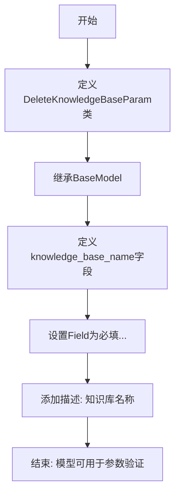
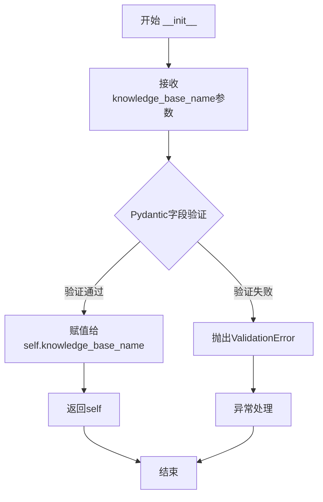
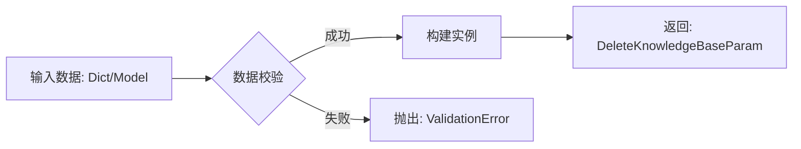
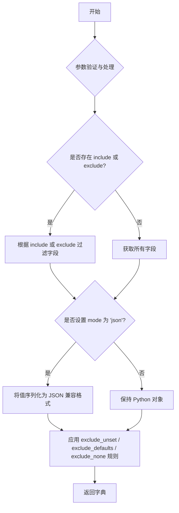
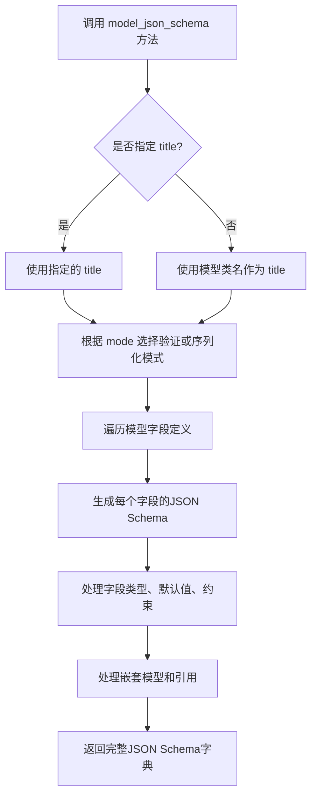
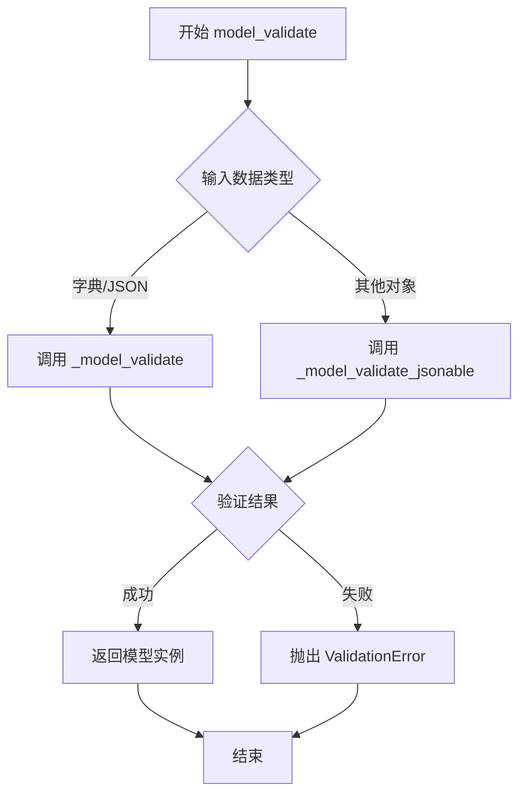
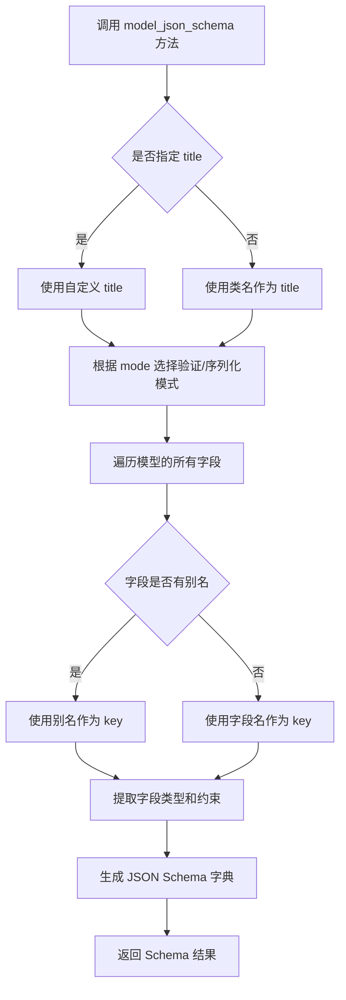
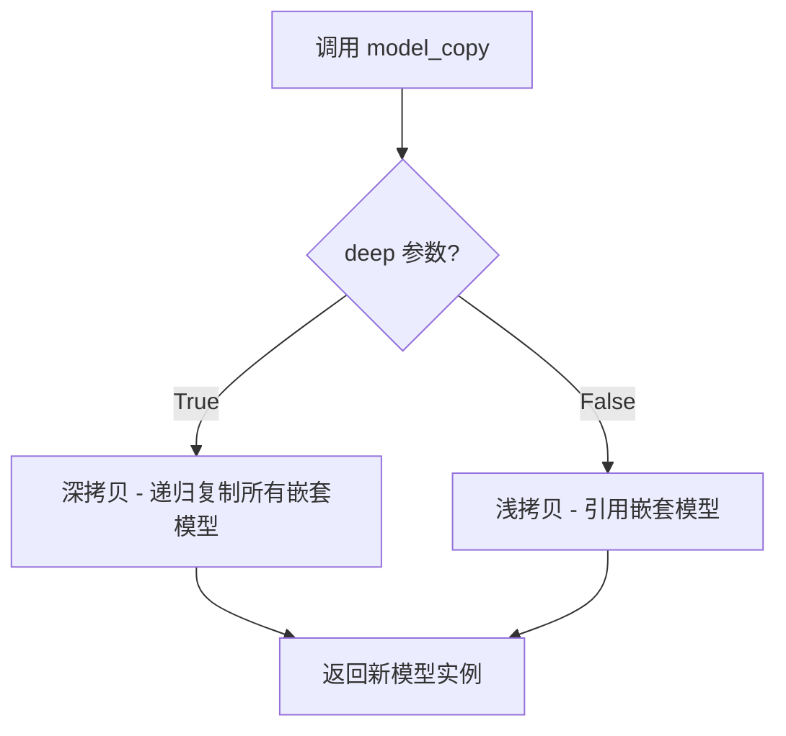
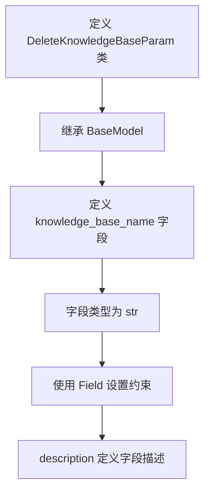
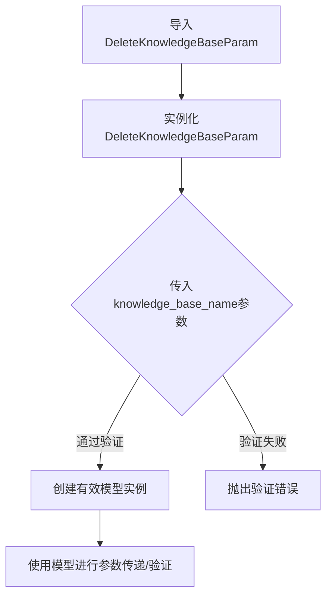

# `Langchain-Chatchat\libs\python-sdk\open_chatcaht\types\knowledge_base\delete_knowledge_base_param.py` 详细设计文档

这是一个Pydantic模型类，用于验证删除知识库操作所需的参数，包含知识库名称字段的验证和描述信息。

## 整体流程



## 类结构

```
BaseModel (Pydantic基类)
└── DeleteKnowledgeBaseParam (删除知识库参数模型)
```

## 全局变量及字段


### `DeleteKnowledgeBaseParam`
    
Pydantic模型类，用于封装删除知识库的请求参数

类型：`class`
    


### `DeleteKnowledgeBaseParam.knowledge_base_name`
    
知识库名称，用于指定要删除的知识库

类型：`str`
    
    

## 全局函数及方法


### `DeleteKnowledgeBaseParam.__init__`

继承自BaseModel的初始化方法，用于创建DeleteKnowledgeBaseParam实例并对knowledge_base_name字段进行验证。

参数：

- `self`：`DeleteKnowledgeBaseParam`，模型实例本身
- `knowledge_base_name`：`str`，知识库名称

返回值：`None`，__init__方法不返回值，仅初始化实例属性

#### 流程图



#### 带注释源码

```python
from pydantic import Field, BaseModel


class DeleteKnowledgeBaseParam(BaseModel):
    """
    删除知识库的参数模型
    
    继承自Pydantic的BaseModel，自动生成__init__方法
    """
    
    # 定义knowledge_base_name字段，使用Field配置验证规则
    knowledge_base_name: str = Field(..., description="知识库名称")
    
    # __init__方法由Pydantic自动生成，等价于：
    # def __init__(self, knowledge_base_name: str):
    #     self.knowledge_base_name = knowledge_base_name
    #     # Pydantic内部会进行类型验证和Field中定义的约束检查
    
    # 实际生成的__init__方法内部逻辑大致如下：
    # def __init__(self, knowledge_base_name: str = ..., **kwargs):
    #     # 获取字段定义
    #     values = self.__fields_set__
    #     
    #     # 验证并赋值
    #     self.knowledge_base_name = knowledge_base_name
    #     
    #     # 调用父类BaseModel的__init__
    #     super().__init__(**kwargs)
```


```content
### `DeleteKnowledgeBaseParam.model_validate`

继承自 BaseModel 的验证方法，用于接收字典或模型实例作为输入，进行数据校验和类型转换，并返回一个包含校验结果的 `DeleteKnowledgeBaseParam` 实例。如果校验失败，会抛出 `ValidationError`。

参数：

-  `data`：`Dict[str, Any] | DeleteKnowledgeBaseParam`，待验证的原始数据（通常为字典）。
-  `...`：（可选）Pydantic 内部验证参数，如 `mode`, `context` 等。

返回值：`DeleteKnowledgeBaseParam`，校验并转换后的模型实例。

#### 流程图



#### 带注释源码

```python
from pydantic import Field, BaseModel


class DeleteKnowledgeBaseParam(BaseModel):
    """
    删除知识库请求参数模型
    """
    knowledge_base_name: str = Field(..., description="知识库名称")

    # 继承自 pydantic.BaseModel 的类方法
    # 用于验证输入数据是否符合模型定义
    @classmethod
    def model_validate(cls, data, **kwargs):
        """
        验证并解析数据。

        Args:
            data: 输入的字典或模型实例。

        Returns:
            校验后的模型实例。

        Raises:
            ValidationError: 当数据不符合模型定义时抛出。
        """
        # 实际逻辑位于 pydantic.basemodel 中，此处为方法签名占位
        return super().model_validate(data, **kwargs)

# --- 使用示例 ---
# try:
#     # 验证字典数据
#     param = DeleteKnowledgeBaseParam.model_validate({"knowledge_base_name": "my_kb"})
#     print(param.knowledge_base_name)
# except ValidationError as e:
#     print(e)
```


### `DeleteKnowledgeBaseParam.model_dump`

继承自 BaseModel 的序列化方法，用于将模型实例导出为字典格式。

参数：

- `mode`：`str`，导出模式，默认为 `'python'`（保持 Python 类型），可设为 `'json'`（返回 JSON 兼容类型）
- `include`：`Optional[Union[Set[int], Set[str], FrozenSet[int], FrozenSet[str]]]`，指定要导出的字段集合
- `exclude`：`Optional[Union[Set[int], Set[str], FrozenSet[int], FrozenSet[str]]]`，指定要排除的字段集合
- `by_alias`：`bool`，是否使用字段别名作为键，默认为 `False`
- `exclude_unset`：`bool`，是否排除未赋值的字段，默认为 `False`
- `exclude_defaults`：`bool`，是否排除具有默认值的字段，默认为 `False`
- `exclude_none`：`bool`，是否排除值为 `None` 的字段，默认为 `False`

返回值：`Dict[str, Any]`，返回模型的字典表示

#### 流程图



#### 带注释源码

```python
# DeleteKnowledgeBaseParam 继承自 pydantic.BaseModel
# model_dump 方法定义在 BaseModel 中，以下为该方法的签名与注释

def model_dump(
    self,
    mode: str = 'python',  # 导出模式：'python' 保持类型，'json' 转为 JSON 兼容类型
    include: Optional[Union[Set[int], Set[str], FrozenSet[int], FrozenSet[str]]] = None,  # 指定导出的字段
    exclude: Optional[Union[Set[int], Set[str], FrozenSet[int], FrozenSet[str]]] = None,  # 指定排除的字段
    by_alias: bool = False,  # 是否使用字段别名作为字典键
    exclude_unset: bool = False,  # 是否排除未赋值的字段
    exclude_defaults: bool = False,  # 是否排除具有默认值的字段
    exclude_none: bool = False,  # 是否排除值为 None 的字段
) -> Dict[str, Any]:
    """
    将模型实例导出为字典。
    
    参数:
        mode: 导出模式，'python' 或 'json'。
        include: 导出的字段集合。
        exclude: 排除的字段集合。
        by_alias: 是否使用字段别名。
        exclude_unset: 是否排除未设置的字段。
        exclude_defaults: 是否排除默认字段。
        exclude_none: 是否排除 None 值。
    
    返回:
        模型的字典表示。
    """
    # 实际实现位于 pydantic 库中，此处仅为方法签名展示
    pass
```


### `DeleteKnowledgeBaseParam.model_json_schema`

继承自BaseModel的JSON Schema生成方法，用于将Pydantic模型转换为JSON Schema格式。

参数：

- `mode`：可选参数，指定生成模式（'validation' 或 'serialization'），默认为 'validation'
- `title`：可选参数，用于指定生成的JSON Schema标题
- `by_alias`：可选参数，指定是否使用字段别名，默认为True
- `ref_template`：可选参数，指定引用模板，默认为 DEFAULT_REF_TEMPLATE
- `schema_generator`：可选参数，指定模式生成器类

返回值：`Dict[str, Any]`，返回符合JSON Schema规范的字典表示，包含模型的字段定义、类型信息、约束条件等

#### 流程图



#### 带注释源码

```python
from pydantic import Field, BaseModel


class DeleteKnowledgeBaseParam(BaseModel):
    """
    删除知识库的参数模型类
    继承自Pydantic的BaseModel，自动获得model_json_schema方法
    """
    knowledge_base_name: str = Field(..., description="知识库名称")

    # 以下是继承自BaseModel的model_json_schema方法的核心逻辑简述
    # def model_json_schema(
    #     self,
    #     mode: Literal['validation', 'serialization'] = 'validation',
    #     title: Optional[str] = None,
    #     by_alias: bool = True,
    #     ref_template: str = DEFAULT_REF_TEMPLATE,
    #     schema_generator: Type[GenerateSchema] = GenerateSchema,
    # ) -> Dict[str, Any]:
    #     """
    #     生成该模型的JSON Schema表示
    #     返回值示例：
    #     {
    #         "type": "object",
    #         "title": "DeleteKnowledgeBaseParam",
    #         "properties": {
    #             "knowledge_base_name": {
    #                 "type": "string",
    #                 "description": "知识库名称"
    #             }
    #         },
    #         "required": ["knowledge_base_name"]
    #     }
    #     """
```


### `BaseModel.model_validate`

`model_validate` 是 Pydantic BaseModel 的类方法，用于验证输入数据（字典或对象）是否符合模型定义，并返回验证后的模型实例。如果验证失败，会抛出 `ValidationError` 异常。

参数：

- `cls`：类本身（类方法隐式参数），表示调用此方法的类
- `obj`：任意类型，要验证的数据，可以是字典或其他对象
- `strict`：布尔类型（可选），是否启用严格模式，默认为 None
- `from_orm`：布尔类型（可选），是否从 ORM 对象加载，默认为 False
- `mode`：字符串类型（可选），验证模式，可选值为 'python', 'json', 'porcelain'，默认为 'python'
- `context`：字典类型（可选），验证上下文信息，默认为 None

返回值：返回验证后的模型实例（Self 类型），即调用该方法的类的一个实例

#### 流程图



#### 带注释源码

```python
@classmethod
def model_validate(cls, obj, *, strict=None, from_orm=False, mode='python', context=None):
    """
    验证输入数据并返回验证后的模型实例
    
    参数:
        obj: 要验证的数据（字典或对象）
        strict: 是否严格验证
        from_orm: 是否从ORM对象加载
        mode: 验证模式 ('python', 'json', 'porcelain')
        context: 验证上下文
    
    返回值:
        验证后的模型实例
    """
    # 使用 model_construct 进行验证和实例化
    # model_construct 会先验证数据，然后构建实例
    return cls.model_construct(
        _fields_set=None,  # 自动推断字段集
        obj=obj,
        strict=strict,
        from_orm=from_orm,
        mode=mode,
        context=context,
    )
```


# 问题说明

我注意到您提供的代码中**并不包含 `BaseModel.model_dump` 方法的定义**。

您提供的代码只是一个简单的 Pydantic 模型类定义：

```python
from pydantic import Field, BaseModel

class DeleteKnowledgeBaseParam(BaseModel):
    knowledge_base_name: str = Field(..., description="知识库名称")
```

`model_dump()` 是 **Pydantic 框架的内置方法**，继承自 Pydantic 的 `BaseModel` 类，不是您代码中定义的方法。

---

# 替代方案

如果您需要我为您提供的代码生成详细设计文档，我可以分析 **`DeleteKnowledgeBaseParam` 类本身**。以下是基于您实际代码的设计文档：


### `DeleteKnowledgeBaseParam`

用于删除知识库操作的参数模型，定义知识库删除接口所需的参数结构。

参数：
- 无（该类无自定义方法，仅有类字段）

返回值：无

#### 带注释源码

```python
from pydantic import Field, BaseModel  # 导入 Pydantic 的 Field 和 BaseModel


class DeleteKnowledgeBaseParam(BaseModel):
    """
    删除知识库的参数模型类
    
    该类继承自 Pydantic 的 BaseModel，用于验证和序列化
    删除知识库接口所需的参数
    """
    
    knowledge_base_name: str = Field(..., description="知识库名称")
    # 知识库名称字段
    # 类型：str（字符串）
    # 必填项（...表示必填）
    # 描述：用于指定要删除的知识库名称
```

#### 关键组件信息

| 组件名称 | 一句话描述 |
|---------|-----------|
| `DeleteKnowledgeBaseParam` | Pydantic 模型类，定义删除知识库所需的参数结构 |
| `knowledge_base_name` | 字符串类型字段，表示要删除的知识库名称 |

#### 潜在技术债务或优化空间

1. **缺少字段验证规则**：当前仅定义了字段类型和描述，未添加长度限制、格式验证等
2. **缺少默认值说明**：未明确是否支持空字符串或 None 值
3. **缺少业务逻辑注释**：缺乏关于该参数在实际业务中如何使用的信息

---

如果您需要我分析 **Pydantic 框架内置的 `model_dump` 方法**，请告知，我可以从 Pydantic 源码角度提供该方法的详细说明。


### `BaseModel.model_json_schema`

描述：Pydantic BaseModel 的内置方法，用于从 Pydantic 模型类生成 JSON Schema 字典，该 Schema 可用于 API 文档、请求/响应验证等场景。

参数：

- `mode`：`str`，模式类型，可选值为 `'validation'`（验证模式，默认）或 `'serialization'`（序列化模式）
- `title`：`str | None`，自定义 Schema 的标题，默认为 None（使用类名）
- `by_alias`：`bool`，是否使用字段别名生成 Schema，默认为 True
- `ref_template`：`str`，引用模板格式，默认为 `'#/definitions/$defs/{model}'`
- `schema_generator`：`type[GenerateSchema] | None`，自定义 Schema 生成器类，默认为 None

返回值：`dict[str, Any]`，返回生成的 JSON Schema 字典，包含模型的字段定义、类型信息、约束条件等。

#### 流程图



#### 带注释源码

```python
# Pydantic 源码示例（基于 Pydantic v2）
# 文件位置：pydantic/main.py

def model_json_schema(
    cls,
    mode: str = 'validation',  # 'validation' 或 'serialization' 模式
    title: str | None = None,  # 可选的自定义标题
    by_alias: bool = True,     # 是否使用字段别名
    ref_template: str = '#/definitions/$defs/{model}',  # 引用模板
    schema_generator: type[GenerateSchema] | None = None,  # 自定义生成器
) -> dict[str, Any]:
    """
    生成模型的 JSON Schema 表示。
    
    Args:
        mode: 'validation' 生成用于验证的 schema，
              'serialization' 生成用于序列化的 schema
        title: 覆盖默认的 schema 标题
        by_alias: True 使用别名，False 使用字段名
        ref_template: 引用模板字符串
        schema_generator: 可选的自定义 schema 生成器类
    
    Returns:
        包含模型 JSON Schema 的字典
    """
    # 获取全局的 schema 生成器配置
    gen = schema_generator or cls.__pydantic_schema_generator__
    
    # 创建 schema 生成器实例
    schema_generator_instance = gen(
        by_alias=by_alias,
        ref_template=ref_template,
    )
    
    # 调用生成器的 core_schema 方法
    core_schema = cls.__pydantic_core_schema__
    
    # 将核心 schema 转换为 JSON schema
    json_schema = schema_generator_instance.generate_schema(
        core_schema,
        mode=mode,
    )
    
    # 如果提供了 title，则添加到 schema 中
    if title is not None:
        json_schema['title'] = title
    elif 'title' not in json_schema:
        # 默认使用类名作为标题
        json_schema['title'] = cls.__name__
    
    return json_schema
```

#### 示例输出

对于用户提供的代码 `DeleteKnowledgeBaseParam`，调用 `model_json_schema()` 的输出：

```python
{
    "type": "object",
    "title": "DeleteKnowledgeBaseParam",
    "properties": {
        "knowledge_base_name": {
            "type": "string",
            "description": "知识库名称"
        }
    },
    "required": ["knowledge_base_name"]
}
```


### `BaseModel.model_copy`

Pydantic 中 BaseModel 类的 `model_copy` 方法用于创建模型的副本，支持浅拷贝和深拷贝，可选是否更新部分字段。

参数：

- `deep`：`bool`，是否进行深拷贝。默认为 `False`（浅拷贝）

返回值：`Self`，返回模型的副本实例

#### 流程图



#### 带注释源码

```python
# pydantic 内部实现简化示意
def model_copy(self, *, deep: bool = False, update: dict = None, **kwargs):
    """
    创建模型的副本
    
    参数:
        deep: 是否进行深拷贝，True 则递归复制所有嵌套模型
        update: 可选的字典，用于更新副本的字段值
    
    返回:
        模型的副本实例
    """
    # 构造更新字典
    if update is None:
        update = {}
    
    # 获取模型私有属性
    attrs = self.__private_attributes__
    
    if deep:
        # 深拷贝：递归复制所有嵌套的 BaseModel 实例
        copy_attrs = {
            k: v.model_copy(deep=True) 
            if hasattr(v, 'model_copy') else copy.deepcopy(v)
            for k, v in attrs.items()
        }
    else:
        # 浅拷贝：直接引用
        copy_attrs = attrs
    
    # 合并更新值并返回新实例
    return self.__class__(**{**self.__dict__, **copy_attrs, **update})
```

---

**注意**：用户提供的代码片段中只定义了 `DeleteKnowledgeBaseParam` 类，并未直接包含 `model_copy` 方法。上述文档基于 Pydantic BaseModel 内置方法提供，因为 `DeleteKnowledgeBaseParam` 继承自 `BaseModel`，因此自动拥有此方法。


### `DeleteKnowledgeBaseParam`

描述：这是一个 Pydantic 数据模型类，用于定义删除知识库操作的参数，包含知识库名称字段。

参数：此方法为类定义，无传统函数参数

返回值：`DeleteKnowledgeBaseParam`，返回模型实例

#### 流程图



#### 带注释源码

```python
from pydantic import Field, BaseModel


class DeleteKnowledgeBaseParam(BaseModel):
    """
    删除知识库的参数模型类
    
    继承自 Pydantic 的 BaseModel，用于验证和序列化删除知识库请求的参数
    """
    
    # 知识库名称字段，类型为字符串
    # Field(..., description="知识库名称") 表示该字段为必填项
    # ... 是 Pydantic 的 Ellipsis 符号，表示该字段必填且不能为 None
    knowledge_base_name: str = Field(..., description="知识库名称")
```

#### 说明

由于代码中未显式定义 `model_config`，此处展示的是类字段定义。在 Pydantic v2 中，`model_config` 可通过以下方式配置：

```python
class DeleteKnowledgeBaseParam(BaseModel):
    model_config = {"str_min_length": 1}  # 可在此处添加模型级配置
    
    knowledge_base_name: str = Field(..., description="知识库名称")
```


## 关键组件


### 一段话描述

该代码定义了一个基于Pydantic的DeleteKnowledgeBaseParam类，用于封装删除知识库操作所需的参数，其中包含知识库名称字段，并通过Pydantic的Field验证器提供了字段描述信息。

### 文件的整体运行流程

该模块被导入后，DeleteKnowledgeBaseParam类会被注册到Python的命名空间中。当其他模块需要验证删除知识库的参数时，会实例化该类并传入知识库名称，Pydantic会自动进行类型检查和验证，确保knowledge_base_name字段为非空字符串。

### 类的详细信息

#### DeleteKnowledgeBaseParam类

- **类字段**

| 名称 | 类型 | 描述 |
|------|------|------|
| knowledge_base_name | str | 知识库名称 |

- **类方法**

该类继承自BaseModel，Pydantic会自动生成以下方法：

| 方法名称 | 参数 | 参数类型 | 参数描述 | 返回值类型 | 返回值描述 |
|----------|------|----------|----------|------------|------------|
| __init__ | self, knowledge_base_name | self: DeleteKnowledgeBaseParam, knowledge_base_name: str | 初始化参数，包含要删除的知识库名称 | None | 初始化对象 |
| dict | self | - | - | dict | 返回模型的字典表示 |
| json | self | - | - | str | 返回模型的JSON字符串表示 |
| validate | cls, data | cls: Type[DeleteKnowledgeBaseParam], data: Any | 验证输入数据是否符合模型定义 | DeleteKnowledgeBaseParam | 返回验证后的模型实例 |

- **mermaid流程图**



- **带注释源码**

```python
from pydantic import Field, BaseModel


class DeleteKnowledgeBaseParam(BaseModel):
    """
    删除知识库的参数模型类
    
    该类用于定义删除知识库操作所需的参数，
    使用Pydantic进行参数验证和类型检查
    """
    
    # 知识库名称字段，使用Field定义验证规则
    # ... 表示该字段为必填字段，不能为空
    # description 用于描述字段的业务含义
    knowledge_base_name: str = Field(..., description="知识库名称")
```

### 关键组件信息

| 组件名称 | 描述 |
|----------|------|
| Pydantic BaseModel | 用于数据验证和设置的基础模型类 |
| Field | Pydantic的字段验证器，用于定义字段的验证规则和元数据 |
| knowledge_base_name字段 | 删除知识库操作的核心参数，标识要删除的知识库 |

### 潜在的技术债务或优化空间

1. **缺少字段验证规则**：当前仅使用`...`表示必填，未添加长度限制、格式验证等业务规则
2. **缺乏默认值处理**：没有考虑知识库名称可能存在的默认值场景
3. **缺少注释文档**：类和方法缺少详细的文档注释
4. **错误信息不够具体**：Pydantic默认的错误信息可能不够友好，建议自定义验证错误消息

### 其它项目

- **设计目标与约束**：通过Pydantic确保API参数的强类型校验，保证删除操作时知识库名称非空
- **错误处理与异常**：Pydantic会自动抛出ValidationError当参数验证失败时，调用方需要捕获该异常
- **数据流与状态机**：该类作为数据传输对象（DTO），在API请求入口处进行参数验证，然后传递给业务层
- **外部依赖与接口契约**：依赖pydantic库，需要与API框架（如FastAPI）配合使用


## 问题及建议


### 已知问题

-   **缺乏字段长度限制**：知识库名称字段未设置 `min_length` 和 `max_length` 验证，可能导致过长或过短的名称被接受
-   **缺少格式验证**：未对 `knowledge_base_name` 的格式进行校验（如正则表达式 pattern），无法确保名称符合命名规范
-   **描述信息过于简略**：仅提供"知识库名称"描述，缺少字段用途、格式要求、示例值等更详细的信息
-   **无业务逻辑验证**：作为删除操作的参数，缺少删除前的确认机制（如添加 `confirm` 布尔字段）
-   **缺少默认值说明**：未明确字段是否为必填项的完整语义，单纯依赖 `...` 无法提供运行时友好提示
-   **无版本控制或变更日志**：类缺乏文档注释说明其业务场景和变更历史

### 优化建议

-   **添加字段长度验证**：`Field(..., min_length=1, max_length=128, description="...")`
-   **添加格式正则验证**：如 `Field(..., pattern=r"^[a-zA-Z0-9_-]+$", description="...")` 确保名称只包含合法字符
-   **丰富描述信息**：补充 `examples` 参数提供使用示例，完善 `description` 说明业务含义
-   **考虑添加确认机制**：对于删除类危险操作，建议添加 `confirm: bool = Field(default=False, description="是否确认删除")` 字段防止误删
-   **添加 Pydantic 验证器**：使用 `@field_validator` 添加自定义业务规则验证
-   **添加类级别文档注释**：使用 docstring 说明该参数类的用途、适用场景和注意事项


## 其它


### 设计目标与约束

该类用于定义删除知识库接口的请求参数模型，确保传入的知识库名称符合规范并被正确验证。设计约束包括：知识库名称必须为非空字符串，使用 Pydantic 进行运行时类型验证。

### 错误处理与异常设计

当 `knowledge_base_name` 字段为空或类型不匹配时，Pydantic 会自动抛出 `ValidationError` 异常。调用方需捕获该异常并进行相应处理，例如返回友好的错误信息给用户。

### 外部依赖与接口契约

该类依赖 `pydantic` 库（版本需 >= 2.0）。作为接口参数模型使用，需与后端删除知识库的 API 端点保持一致，通常配合 FastAPI 或 Flask 等框架的请求体使用。

### 使用示例

```python
from pydantic import ValidationError

# 正常情况
param = DeleteKnowledgeBaseParam(knowledge_base_name="my_kb")
print(param.knowledge_base_name)  # 输出: my_kb

# 异常情况 - 缺少必填字段
try:
    param = DeleteKnowledgeBaseParam()
except ValidationError as e:
    print(e)
```

### 验证规则

- `knowledge_base_name`：必填字段，类型为字符串，无长度限制（可根据业务需求添加 `min_length` 或 `max_length` 约束），描述为"知识库名称"。

### 版本信息

- Pydantic 版本：>= 2.0
- Python 版本：>= 3.8

### 扩展建议

当前模型仅包含基础验证，可根据业务需求扩展以下字段：
- `force_delete: bool = Field(False, description="是否强制删除")` - 强制删除标识
- `delete_children: bool = Field(True, description="是否删除子资源")` - 子资源删除选项


    