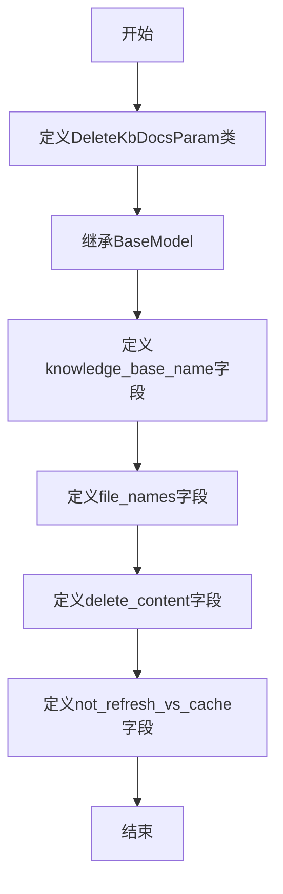

# `Langchain-Chatchat\libs\python-sdk\open_chatcaht\types\knowledge_base\doc\delete_kb_docs_param.py` 详细设计文档

定义了一个用于删除知识库文档的参数模型（DeleteKbDocsParam），基于Pydantic的BaseModel实现，用于验证和管理知识库文档删除操作的请求参数，包括知识库名称、文件名列表、内容删除标志和向量库缓存刷新选项。

## 整体流程



## 类结构

```
BaseModel (pydantic基类)
└── DeleteKbDocsParam (删除知识库文档参数模型)
```

## 全局变量及字段


### `DeleteKbDocsParam.knowledge_base_name`
    
知识库名称

类型：`str`
    


### `DeleteKbDocsParam.file_names`
    
要删除的文件名列表

类型：`List[str]`
    


### `DeleteKbDocsParam.delete_content`
    
是否删除内容，默认为False

类型：`bool`
    


### `DeleteKbDocsParam.not_refresh_vs_cache`
    
是否不刷新向量库缓存（用于FAISS），默认为False

类型：`bool`
    
    

## 全局函数及方法


## 关键组件


### DeleteKbDocsParam

一个Pydantic数据模型类，用于定义删除知识库文档时的参数结构，包含知识库名称、文件名列表、是否删除内容以及是否刷新向量缓存等配置项。

### 字段：knowledge_base_name

字符串类型字段，表示要删除文档所在的知识库名称，示例值为"samples"，为必填字段。

### 字段：file_names

字符串列表类型字段，表示要删除的文件名列表，示例值为["file_name.md", "test.txt"]，为必填字段。

### 字段：delete_content

布尔类型字段，默认为False，表示是否删除实际内容，设置为True时将删除文档内容。

### 字段：not_refresh_vs_cache

布尔类型字段，默认为False，描述为"暂不保存向量库（用于FAISS）"，用于控制是否刷新向量搜索缓存，设置为True时不会保存向量库，适用于FAISS等向量数据库场景。

### pydantic.BaseModel

Pydantic框架的基础模型类，提供了数据验证、序列化和类型检查功能，DeleteKbDocsParam继承自此类以实现参数自动验证。

### Field

Pydantic的Field函数，用于定义模型字段的元数据，包括默认值、描述信息和示例值等。

### typing.List

Python标准库中的类型提示工具，用于标注List类型，在此处指定file_names字段为字符串列表类型。


## 问题及建议


### 已知问题

-   **字段命名不清晰**：`not_refresh_vs_cache` 字段名中的 "vs" 缩写不直观，容易造成理解困难
-   **字段描述存在歧义**：`not_refresh_vs_cache` 的描述 "暂不保存向量库（用于FAISS）" 与字段名逻辑相反（描述保存但字段名表示不刷新），语义不够清晰
-   **缺少参数校验**：未对 `file_names` 进行空列表校验，可能导致无效的删除操作
-   **类型安全不足**：`delete_content` 为布尔类型，但未使用 `Literal` 或 `Enum` 限制可能值，扩展性受限
-   **缺乏文档注释**：类缺少文档字符串（docstring），无法快速了解该类的用途
-   **examples 简化**：Field 中的 examples 较为简单，未能覆盖更多边界情况

### 优化建议

-   **重命名字段**：将 `not_refresh_vs_cache` 改为 `refresh_vector_store_cache`（含义更清晰，且与语义逻辑一致），或使用更明确的名称如 `skip_cache_refresh`
-   **修正描述**：将描述修改为 "是否跳过刷新向量库缓存（用于 FAISS）" 以消除歧义
-   **添加验证器**：使用 `validator` 或 `model_validator` 对 `file_names` 进行非空校验
-   **增强类型定义**：考虑使用 `Literal[True, False]` 明确 `delete_content` 的类型边界
-   **添加类文档**：添加类级别的 docstring 说明该模型用于删除知识库文档的场景
-   **完善 examples**：为 `delete_content` 和 `not_refresh_vs_cache` 添加具体的 example 值


## 其它


### 设计目标与约束

本代码的设计目标是定义一个用于删除知识库文档的参数模型，通过Pydantic的BaseModel提供数据验证和序列化能力。约束包括：knowledge_base_name和file_names为必填字段，delete_content和not_refresh_vs_cache为可选字段，均有默认值。

### 错误处理与异常设计

本模型依赖Pydantic进行数据验证，会自动抛出ValidationError当数据类型或必填字段缺失时。调用方需要捕获pydantic.ValidationError异常并提供友好的错误信息。暂无自定义业务异常需求。

### 外部依赖与接口契约

本模型依赖pydantic库（版本要求2.x）的BaseModel和Field类。接口契约：调用方需传入knowledge_base_name（字符串）和file_names（字符串列表），其他字段可选。返回类型为DeleteKbDocsParam实例，可序列化为JSON。

### 性能考虑

本模型为轻量级数据验证类，性能开销极低。Pydantic v2采用Rust实现，验证性能已优化。暂无性能瓶颈，无需额外优化。

### 安全性考虑

当前模型无敏感字段验证。建议调用方对knowledge_base_name进行权限校验，确保用户有权操作指定知识库。file_names需进行路径遍历检查，防止删除非预期文件。

### 可扩展性设计

当前模型可通过继承BaseModel添加新字段。若需支持更多删除选项（如软删除、批量操作），建议使用枚举类型定义操作模式，保持接口一致性。

### 版本兼容性

本代码基于Pydantic v2语法（Field(...)而非v1的Required）。需确保项目依赖pydantic>=2.0.0。升级前需验证Field的description参数在目标版本的支持情况。

### 使用示例

```python
from your_module import DeleteKbDocsParam

# 创建参数实例
param = DeleteKbDocsParam(
    knowledge_base_name="samples",
    file_names=["file_name.md", "test.txt"],
    delete_content=True
)

# 序列化为字典
param_dict = param.model_dump()

# 序列化为JSON
param_json = param.model_dump_json()
```

### 变更历史

- v1.0.0（当前）：初始版本，定义删除知识库文档的基础参数模型，包含knowledge_base_name、file_names、delete_content和not_refresh_vs_cache字段。

    