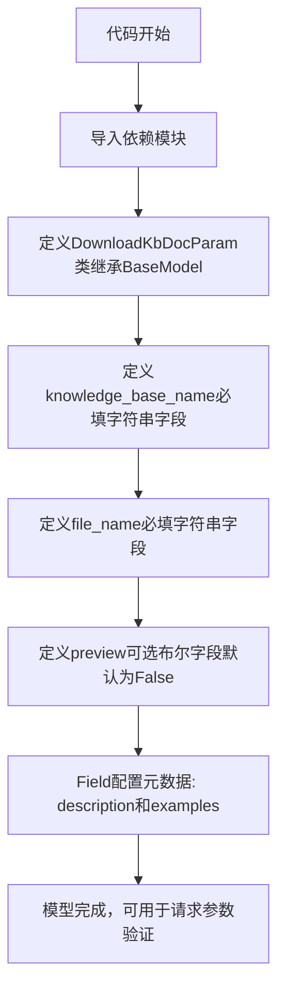
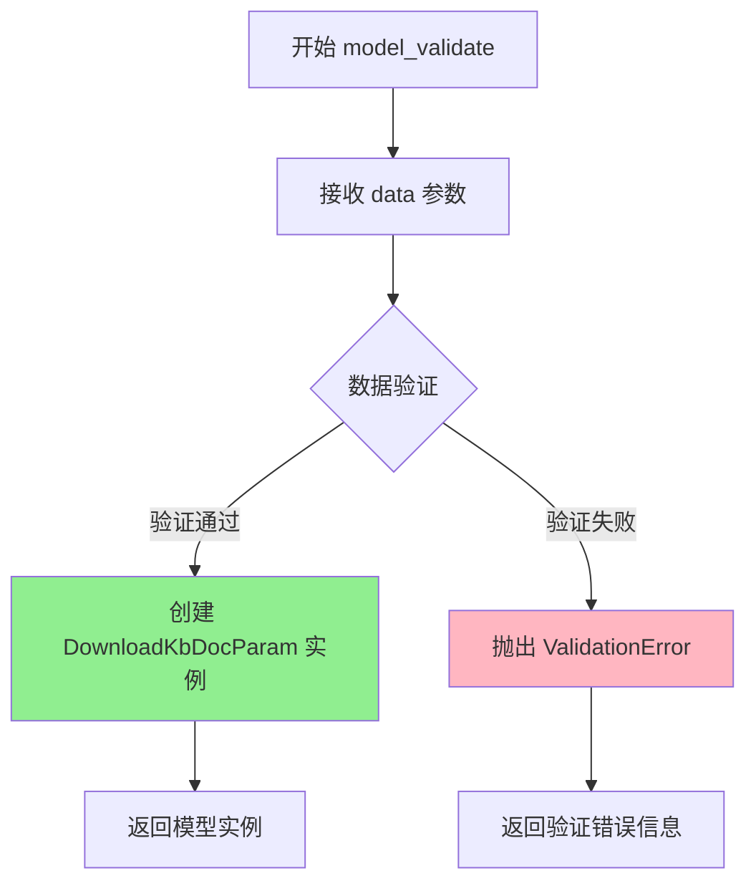
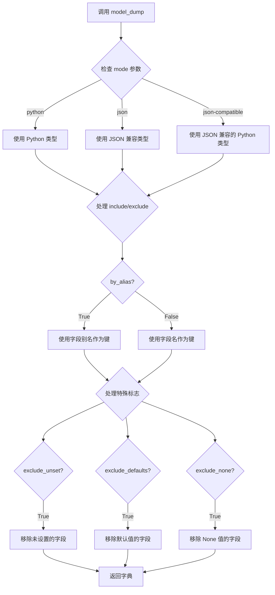
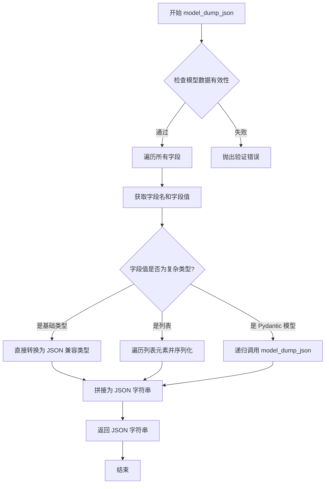
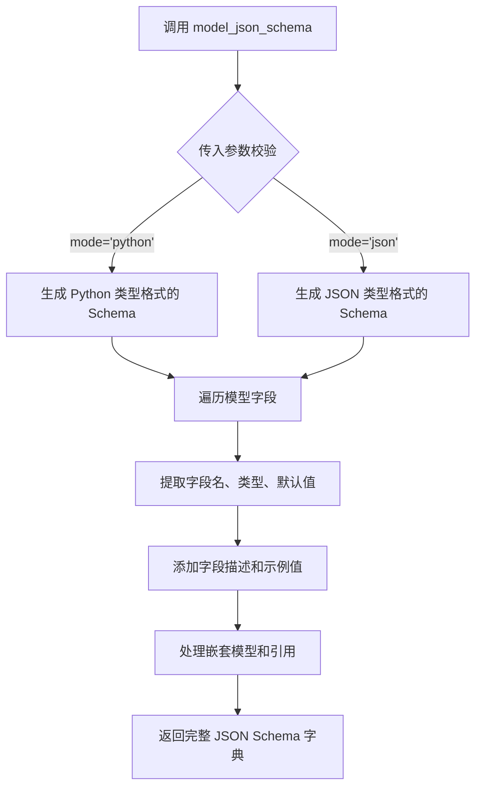
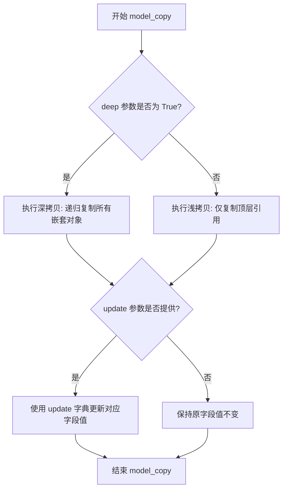
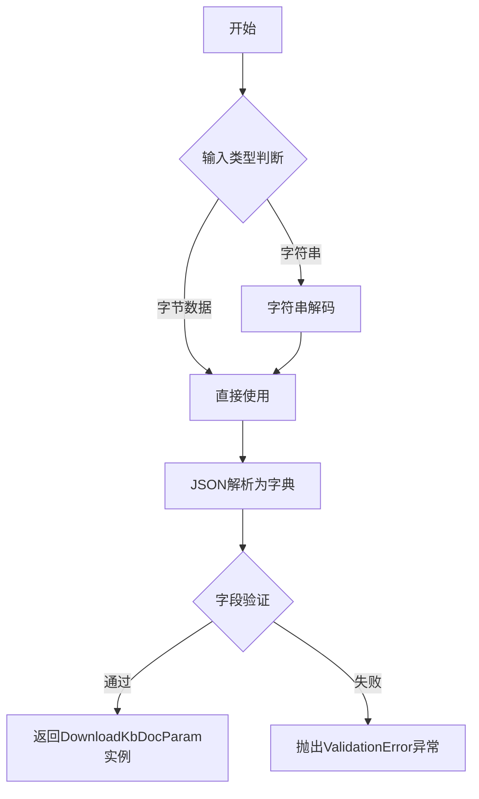

# `Langchain-Chatchat\libs\python-sdk\open_chatcaht\types\knowledge_base\doc\download_kb_doc_param.py` 详细设计文档

定义了一个基于Pydantic的数据模型类，用于封装下载知识库文档时的请求参数，包含知识库名称、文件名和预览选项三个字段，并利用Pydantic的内置机制进行数据验证和类型转换

## 整体流程



## 类结构

```
BaseModel (pydantic.v2 基础模型类)
└── DownloadKbDocParam (知识库文档下载参数模型)
```

## 全局变量及字段


### `DownloadKbDocParam.knowledge_base_name`
    
知识库名称，必填字符串字段

类型：`str`
    


### `DownloadKbDocParam.file_name`
    
文件名称，必填字符串字段

类型：`str`
    


### `DownloadKbDocParam.preview`
    
预览选项，可选布尔字段，默认为False

类型：`bool`
    
    

## 全局函数及方法


### `DownloadKbDocParam.model_validate`

验证并创建模型实例，用于将字典类型的数据验证并转换为 `DownloadKbDocParam` 模型实例。

参数：

- `data`：`Any`，待验证的数据字典，包含知识库名称、文件名称和预览标识

返回值：`DownloadKbDocParam`，经验证后返回的模型实例

#### 流程图



#### 带注释源码

```python
from typing import List

from pydantic import BaseModel, Field


class DownloadKbDocParam(BaseModel):
    """
    下载知识库文档参数模型
    
    用于定义从知识库下载文件时所需的参数，
    包含知识库名称、文件名称和预览选项
    """
    
    # 知识库名称，必填字段
    knowledge_base_name: str = Field(
        ...,  # ... 表示必填
        description="知识库名称",
        examples=["samples"]
    )
    
    # 文件名称，必填字段
    file_name: str = Field(
        ...,  # ... 表示必填
        description="文件名称",
        examples=["test.txt"]
    )
    
    # 预览标识，可选字段，默认为 False
    preview: bool = Field(
        False,  # 默认值为 False，表示下载而非预览
        description="是：浏览器内预览；否：下载"
    )


# model_validate 是 Pydantic BaseModel 的类方法
# 继承自父类，用于验证数据并创建模型实例
# 用法示例：
# data = {
#     "knowledge_base_name": "samples",
#     "file_name": "test.txt",
#     "preview": False
# }
# param = DownloadKbDocParam.model_validate(data)
```


### `DownloadKbDocParam.model_dump`

将 Pydantic 模型实例序列化为 Python 字典。这是 Pydantic BaseModel 的内置方法，用于将模型数据转换为字典格式，支持多种序列化选项。

参数：

- `mode`：`str`，指定序列化模式，可选值为 `'python'`（默认）、`'json'` 或 `'json-compatible'`
- `include`：`Set[int | str] | Mapping[int | str, Any] | None`，指定需要包含的字段
- `exclude`：`Set[int | str] | Mapping[int | str, Any] | None`，指定需要排除的字段
- `context`：`Any | None`，序列化上下文字典，可用于自定义序列化器
- `by_alias`：`bool`，是否使用字段别名进行序列化，默认为 `False`
- `exclude_unset`：`bool`，是否排除未设置的值，默认为 `False`
- `exclude_defaults`：`bool`，是否排除默认值的字段，默认为 `False`
- `exclude_none`：`bool`，是否排除值为 `None` 的字段，默认为 `False`
- `round_trip`：`bool`，是否启用往返序列化（序列化后再反序列化），默认为 `False`
- `warnings`：`bool | None`，是否显示验证警告，默认为 `True`
- `serialize_as_any`：`bool`，是否将未配置序列化的类型序列化为字典，默认为 `False`

返回值：`dict[str, Any]`，返回包含模型数据的字典对象

#### 流程图



#### 带注释源码

```python
from typing import List
from pydantic import BaseModel, Field


class DownloadKbDocParam(BaseModel):
    """
    下载知识库文档参数模型
    
    用于定义从知识库下载文件时所需的参数，
    支持浏览器内预览或直接下载两种模式。
    """
    knowledge_base_name: str = Field(
        ...,  # ... 表示必填字段
        description="知识库名称",
        examples=["samples"]
    )
    file_name: str = Field(
        ...,  # 必填字段
        description="文件名称",
        examples=["test.txt"]
    )
    preview: bool = Field(
        False,  # 默认值为 False
        description="是：浏览器内预览；否：下载"
    )


# ============================================================
# model_dump 方法使用示例
# ============================================================

# 1. 创建模型实例
param = DownloadKbDocParam(
    knowledge_base_name="samples",
    file_name="test.txt",
    preview=False
)

# 2. 基本序列化：转换为 Python 字典
# 返回: {'knowledge_base_name': 'samples', 'file_name': 'test.txt', 'preview': False}
result = param.model_dump()

# 3. 使用 JSON 兼容模式序列化
# 将日期、UUID 等类型转换为 JSON 兼容的字符串
result_json = param.model_dump(mode='json')

# 4. 使用别名序列化（如果字段定义了别名）
result_alias = param.model_dump(by_alias=True)

# 5. 只包含特定字段
result_include = param.model_dump(include={'knowledge_base_name', 'file_name'})

# 6. 排除特定字段
result_exclude = param.model_dump(exclude={'preview'})

# 7. 排除未设置的值（仅包含用户实际设置的值）
param_partial = DownloadKbDocParam(knowledge_base_name="samples")
result_unset = param_partial.model_dump(exclude_unset=True)
# 返回: {'knowledge_base_name': 'samples'}

# 8. 排除默认值的字段
result_defaults = param.model_dump(exclude_defaults=True)
# 返回: {'knowledge_base_name': 'samples', 'file_name': 'test.txt'}

# 9. 排除 None 值的字段
result_none = param.model_dump(exclude_none=True)

# 10. 组合使用多种选项
result_combined = param.model_dump(
    exclude_unset=True,
    exclude_none=True,
    by_alias=True
)
```

#### 技术说明

`model_dump` 方法是 Pydantic v2 中的核心序列化方法，它：

1. **递归处理嵌套模型**：如果字段是另一个 Pydantic 模型，会自动递归调用其 `model_dump`
2. **支持自定义序列化器**：通过 `field_serializer` 装饰器定义的序列化逻辑会被执行
3. **验证数据一致性**：在序列化前会先验证模型数据的有效性
4. **性能优化**：使用 `mode='json'` 时会进行更彻底的类型转换，适合网络传输


### `DownloadKbDocParam.model_dump_json`

将 Pydantic 模型实例序列化为 JSON 格式字符串的方法，继承自 Pydantic 的 BaseModel 基类，用于将模型数据转换为可传输或存储的 JSON 字符串格式。

参数：

- `self`：隐式参数，当前模型实例（`DownloadKbDocParam`），表示要序列化的模型对象

返回值：`str`，返回符合 JSON 格式的字符串表示

#### 流程图



#### 带注释源码

```python
from typing import List

from pydantic import BaseModel, Field


class DownloadKbDocParam(BaseModel):
    """
    下载知识库文档的参数模型
    
    属性:
        knowledge_base_name: 知识库名称
        file_name: 文件名称
        preview: 是否在浏览器内预览
    """
    
    knowledge_base_name: str = Field(
        ..., description="知识库名称", examples=["samples"]
    ),
    file_name: str = Field(..., description="文件名称", examples=["test.txt"]),
    preview: bool = Field(False, description="是：浏览器内预览；否：下载"),


# 创建模型实例
param = DownloadKbDocParam(
    knowledge_base_name="samples",
    file_name="test.txt",
    preview=False
)

# 调用 model_dump_json 方法将模型序列化为 JSON 字符串
# 这是 Pydantic BaseModel 的内置方法
json_str = param.model_dump_json()

# 输出结果示例：
# {"knowledge_base_name":"samples","file_name":"test.txt","preview":false}

# 带格式化的输出（使用 indent 参数）
json_str_formatted = param.model_dump_json(indent=2)
```

#### 备注

- `model_dump_json` 是 Pydantic 框架为所有 `BaseModel` 子类自动提供的内置方法，无需手动定义
- 该方法会自动处理所有模型字段的序列化，包括类型转换和验证
- 默认情况下会包含所有字段，除非使用 `exclude` 参数进行过滤
- 返回的 JSON 字符串中，字段名使用 Python 的蛇峰命名（snake_case），可通过 `by_alias=True` 参数使用 Pydantic 定义的别名


### `DownloadKbDocParam.model_json_schema`

该方法继承自 Pydantic 的 `BaseModel` 类，用于将 `DownloadKbDocParam` 模型转换为 JSON Schema 字典，描述模型的字段结构、类型和验证规则。

参数：

- `mode`: `str`，可选，模式类型，默认为 "python"，支持 "json" 模式
- `title`: `str | None`，可选，覆盖默认生成的标题
- `by_alias`: `bool`，可选，是否使用字段别名作为属性名，默认为 False
- `ref_template`: `str`，可选，自定义引用模板，默认为 "{$defs}/{model}"
- `schema_generator`: `type[GenerateJsonSchema]`，可选，自定义 JSON Schema 生成器类
- `**field_metadata`: `Any`，可选，额外的字段元数据

返回值：`dict`，返回生成的 JSON Schema，包含了模型的所有字段定义、类型约束和描述信息

#### 流程图



#### 带注释源码

```python
def model_json_schema(
    mode: str = "python",
    title: str | None = None,
    by_alias: bool = False,
    ref_template: str = "{$defs}/{model}",
    schema_generator: type[GenerateJsonSchema] = GenerateJsonSchema,
    **field_metadata: Any
) -> dict[str, Any]:
    """
    生成当前模型的 JSON Schema 表示。
    
    参数:
        mode: 模式类型，"python" 返回 Python 类型标注，"json" 返回 JSON 类型
        title: 可选的标题，将覆盖自动生成的标题
        by_alias: 是否使用字段别名（alias）作为属性名
        ref_template: 定义如何生成引用路径的模板
        schema_generator: 自定义的 Schema 生成器类
        **field_metadata: 额外的字段元数据
    
    返回:
        包含模型完整结构的 JSON Schema 字典
    """
    # 使用 Pydantic 内部机制生成 Schema
    return model_cntx.generating_json_schema(
        mode=mode,
        by_alias=by_alias,
        ref_template=ref_template,
        schema_generator=schema_generator,
        field_title_generator=title,
        **field_metadata,
    )

# 以下是上述代码应用于 DownloadKbDocParam 时生成的示例 Schema：
{
    "description": "DownloadKbDocParam 模型参数",
    "properties": {
        "knowledge_base_name": {
            "description": "知识库名称",
            "examples": ["samples"],
            "title": "Knowledge Base Name",
            "type": "string"
        },
        "file_name": {
            "description": "文件名称",
            "examples": ["test.txt"],
            "title": "File Name",
            "type": "string"
        },
        "preview": {
            "default": False,
            "description": "是：浏览器内预览；否：下载",
            "title": "Preview",
            "type": "boolean"
        }
    },
    "required": ["knowledge_base_name", "file_name"],
    "title": "DownloadKbDocParam",
    "type": "object"
}
```


### `DownloadKbDocParam.model_copy`

创建当前 Pydantic 模型的副本，支持深拷贝或浅拷贝，并可选择性地更新指定字段。

参数：

- `update`：`Dict[str, Any] | None`，可选参数，用于在复制时更新指定字段值的字典，默认为 None
- `deep`：`bool`，可选参数，指定是否进行深拷贝，True 表示深拷贝（递归复制嵌套对象），False 表示浅拷贝（仅复制顶层对象），默认为 False

返回值：`DownloadKbDocParam`，返回当前模型实例的副本（一个新创建的相同类型的 Pydantic 模型对象）

#### 流程图



#### 带注释源码

```python
# model_copy 方法是 Pydantic BaseModel 内置方法
# 以下为该方法的使用示例和功能说明

# 1. 浅拷贝（默认）- 嵌套对象仍共享引用
original = DownloadKbDocParam(
    knowledge_base_name="samples",
    file_name="test.txt",
    preview=False
)
shallow_copied = original.model_copy()  # 创建浅拷贝副本

# 2. 深拷贝 - 完全独立的嵌套对象
deep_copied = original.model_copy(deep=True)  # 创建深拷贝副本

# 3. 带更新的拷贝 - 创建副本的同时修改指定字段
updated_copied = original.model_copy(
    update={
        "file_name": "new_test.txt",  # 只更新 file_name 字段
        "preview": True               # 同时更新 preview 字段
    }
)
# knowledge_base_name 保持不变，其他字段使用原始值
```


### `DownloadKbDocParam.model_validate_json`

该方法是 Pydantic BaseModel 的内置类方法，用于将 JSON 格式的字符串解析并验证为 `DownloadKbDocParam` 模型实例。

参数：

- `data`：`str | bytes | bytearray`，要解析的 JSON 字符串或字节数据
- `\*`：`任意位置参数`，传递给 model_validate 的其他参数
- `\*\*`：任意关键字参数

返回值：`DownloadKbDocParam`，经过验证的模型实例

#### 流程图



#### 带注释源码

```python
# 注意：model_validate_json 是 Pydantic BaseModel 的内置类方法
# 以下为该方法的核心逻辑源码

@classmethod
def model_validate_json(cls, data: Union[str, bytes], **kwargs):
    """
    从JSON字符串验证并创建模型实例
    
    参数:
        data: JSON格式的字符串或字节数据
        **kwargs: 传递给model_validate的其他参数
    
    返回值:
        经验证后的模型实例
    
    异常:
        ValidationError: 当JSON数据不符合模型定义时抛出
    """
    # 将输入解析为字典
    obj_dict = json.loads(data)
    
    # 调用model_validate进行验证
    return cls.model_validate(obj_dict, **kwargs)
```

#### 实际使用示例

```python
# JSON字符串
json_str = '{"knowledge_base_name": "samples", "file_name": "test.txt", "preview": true}'

# 使用model_validate_json创建实例
param = DownloadKbDocParam.model_validate_json(json_str)
print(param.knowledge_base_name)  # 输出: samples
print(param.file_name)            # 输出: test.txt
print(param.preview)              # 输出: True
```


## 关键组件


### 一段话描述

该代码定义了一个 Pydantic 数据模型 `DownloadKbDocParam`，用于封装下载知识库文档所需的参数，包括知识库名称、文件名以及是否在浏览器内预览的选项。

### 文件的整体运行流程

该文件是一个独立的参数模型定义文件，不涉及实际的业务流程执行。主要流程为：
1. 导入 Pydantic 依赖
2. 定义 `DownloadKbDocParam` 类继承自 `BaseModel`
3. 通过 Pydantic 的 `Field` 定义各字段的元数据（描述和示例值）
4. 该模型可供其他模块导入使用，用于请求参数验证和数据序列化

### 类的详细信息

#### 类字段

| 名称 | 类型 | 描述 |
|------|------|------|
| knowledge_base_name | str | 知识库名称，用于指定要下载文档所在的知识库 |
| file_name | str | 文件名称，指定要下载的具体文件 |
| preview | bool | 预览标识，True 表示浏览器内预览，False 表示下载 |

#### 类方法

该类继承自 Pydantic 的 `BaseModel`，自动获得以下常用方法：

| 方法名称 | 参数 | 返回类型 | 描述 |
|----------|------|----------|------|
| model_validate | dict/JSON | DownloadKbDocParam | 验证并创建模型实例 |
| model_dump | - | dict | 导出为字典 |
| model_dump_json | - | str | 导出为JSON字符串 |
| model_copy | - | DownloadKbDocParam | 创建模型副本 |

### 关键组件信息

#### DownloadKbDocParam 模型类

用于下载知识库文档的参数封装类，基于 Pydantic 的 BaseModel 实现，提供自动参数验证、序列化和反序列化功能。

#### Field 元数据定义

使用 Pydantic 的 Field 为每个字段定义描述信息和示例值，增强 API 文档的可读性和可用性。

### 潜在的技术债务或优化空间

1. **缺少字段验证器**：knowledge_base_name 和 file_name 缺乏格式验证（如长度限制、字符集限制），可能导致后续处理错误
2. **预览选项默认值**：preview 默认为 False，但未在注释中说明下载与预览的具体行为差异
3. **文档完整性**：缺少类级别的文档字符串（docstring），影响代码可维护性
4. **扩展性限制**：当前仅支持单文件下载，如需支持批量下载需重新设计模型结构

### 其它项目

#### 设计目标与约束

- **设计目标**：提供清晰的下载参数接口定义，支持参数验证和文档自动生成
- **约束**：依赖 Pydantic 库，遵循其 v2 版本 API 规范

#### 错误处理与异常设计

- 参数验证失败时，Pydantic 会抛出 `ValidationError` 异常
- 建议调用方捕获该异常并返回友好的错误信息

#### 外部依赖与接口契约

- **依赖库**：pydantic >= 2.0
- **接口契约**：该模型可被 FastAPI、Flask 等框架直接用于请求体参数定义


## 问题及建议


### 已知问题

-   **字段验证不足**：knowledge_base_name 和 file_name 仅使用基础 str 类型，缺少长度限制、格式验证和非法字符检查，存在路径遍历攻击风险（如 file_name 包含 "../" 或绝对路径）
-   **字段描述不完整**：preview 字段描述不够清晰，"是：浏览器内预览；否：下载" 的表述冗余，且未说明默认值的实际行为
-   **缺少必填字段示例**：Field(...) 定义的必填字段未提供 examples，在 API 文档生成时不够友好
-   **缺乏业务层验证**：缺少对知识库名称存在性的校验逻辑，该验证通常需要依赖外部服务
-   **错误处理缺失**：未定义校验失败时的自定义错误信息，pydantic 默认错误可能不够业务友好
-   **可扩展性受限**：未来若需添加下载路径、用户 ID、权限参数等，需直接修改类结构
-   **类型提示不精确**：file_name 应考虑使用 Path 或更具体的字符串模式（如 FileName），而非泛用 str
-   **配置与逻辑混合**：参数模型与业务逻辑未分离，若多个接口复用该参数可能导致代码重复

### 优化建议

-   为 file_name 添加正则验证或自定义校验器，防止路径遍历攻击
-   使用 pydantic 的 constr 或 @field_validator 增强字段验证（如限制名称长度、禁止特殊字符）
-   完善 examples，为必填字段提供有意义的示例值
-   考虑将 preview 的描述简化为更清晰的表述
-   分离参数模型与业务逻辑，或使用 Mixin/组合模式提高复用性
-   定义自定义异常类或错误响应模型，提升错误信息的业务语义
-   评估是否需要添加更多字段（如 download_path、user_id）以适应未来需求，或设计更通用的基类
-   引入 Path 类型或创建自定义类型别名，增强类型安全性和可读性


## 其它


### 设计目标与约束

本数据模型旨在定义从知识库下载文档的接口参数规范，确保API请求的参数符合预期的数据类型和业务规则。使用Pydantic v2进行数据验证，支持字段描述和示例值提供。

### 错误处理与异常设计

- 参数验证失败时，Pydantic会抛出ValidationError异常
- knowledge_base_name和file_name为必填字段，缺失时返回验证错误
- preview字段为布尔类型，非布尔值会导致验证失败

### 数据流与状态机

本模型为静态数据承载类，不涉及状态机和复杂数据流。数据流为：外部请求 → Pydantic验证 → 模型实例化 → 传递给业务逻辑层。

### 外部依赖与接口契约

- 依赖库：pydantic (>=2.0)
- 本模型作为API请求参数Schema，与下游业务逻辑解耦
- 示例值用于API文档自动生成（如OpenAPI/Swagger）

### 使用示例

```python
# 创建参数实例
param = DownloadKbDocParam(
    knowledge_base_name="samples",
    file_name="test.txt",
    preview=True
)

# 转换为字典
param.model_dump()
# {'knowledge_base_name': 'samples', 'file_name': 'test.txt', 'preview': True}
```

### 安全性考虑

- 本模型不包含敏感信息处理
- 建议对knowledge_base_name和file_name进行输入长度限制和特殊字符过滤
- 预览功能需考虑权限控制

### 兼容性考虑

- 基于Pydantic v2设计，不兼容Pydantic v1
- 建议在项目早期确定Pydantic版本，避免后续迁移成本

    