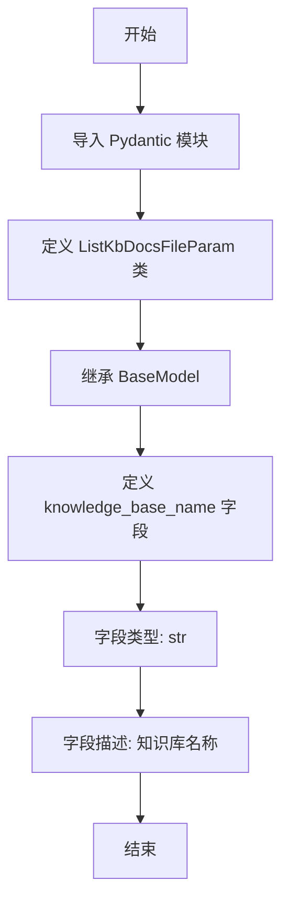
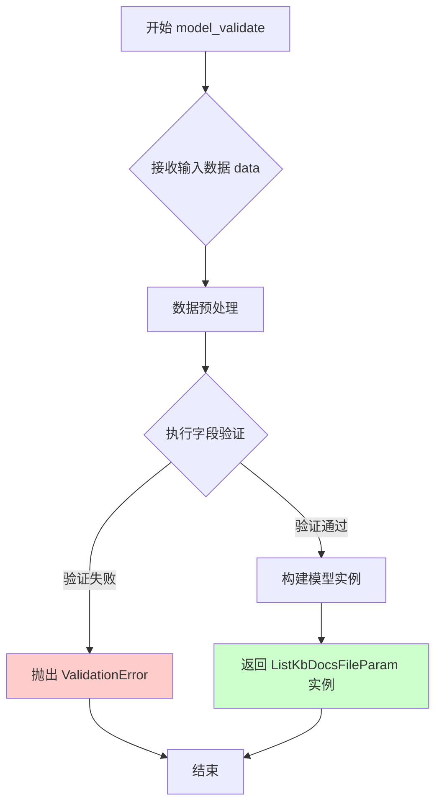
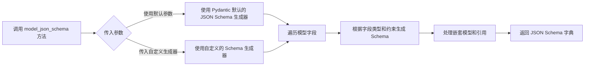

# `Langchain-Chatchat\libs\python-sdk\open_chatcaht\types\knowledge_base\doc\list_kb_docs_file_param.py` 详细设计文档

该文件定义了一个 Pydantic 数据模型 ListKbDocsFileParam，用于封装列出知识库文档文件所需的参数，包含一个知识库名称字段（knowledge_base_name），用于在 API 请求中传递目标知识库的名称信息。

## 整体流程



## 类结构

```
BaseModel (Pydantic 基础模型)
└── ListKbDocsFileParam (知识库文档文件列表参数模型)
```

## 全局变量及字段


### `ListKbDocsFileParam.knowledge_base_name`
    
知识库名称

类型：`str`
    
    

## 全局函数及方法


### `ListKbDocsFileParam.model_dump`

Pydantic BaseModel 的内置方法，将当前 `ListKbDocsFileParam` 模型实例转换为字典格式，常用于序列化输出或转换为 JSON 兼容格式。

参数：

- `mode`: `Literal['python', 'json', 'json-compatible']`，指定导出的模式。`'python'` 返回 Python 原生类型；`'json'` 返回 JSON 兼容类型（会自动处理日期等对象）。默认 `'python'`。
- `exclude`: `Set[int | str] | Mapping[int | str, Any] | None`，指定要从输出中排除的字段名或集合。
- `include`: `Set[int | str] | Mapping[int | str, Any] | None`，指定要包含在输出中的字段名或集合。
- `exclude_unset`: `bool`，如果为 `True`，则只导出在实例初始化时被显式赋予值的字段，忽略默认值。默认 `False`。
- `exclude_defaults`: `bool`，如果为 `True`，则忽略具有默认值的字段。默认 `False`。
- `exclude_none`: `bool`，如果为 `True`，则忽略值为 `None` 的字段。默认 `False`。
- `by_alias`: `bool`，如果为 `True`，则使用字段的别名（`Field(alias=...)`）作为键；否则使用属性名。默认 `False`。

返回值：`Dict[str, Any]`，返回包含模型数据的字典。

#### 流程图

```mermaid
flowchart TD
    A[开始: 调用 model_dump] --> B{检查参数 mode}
    B -- 'python' --> C[保持 Python 原生对象类型]
    B -- 'json' --> D[转换为 JSON 兼容类型<br>e.g. datetime -> str]
    C --> E{处理过滤条件}
    D --> E
    E --> F{应用 exclude/include}
    E --> G{应用 exclude_unset<br>exclude_defaults<br>exclude_none}
    F --> H[生成字典结构]
    G --> H
    H --> I[返回 Dict[str, Any]]
```

#### 带注释源码

```python
from pydantic import BaseModel, Field

# 定义模型类
class ListKbDocsFileParam(BaseModel):
    knowledge_base_name: str = Field(description="知识库名称")

# 创建实例
param = ListKbDocsFileParam(knowledge_base_name="test_kb")

# 调用 model_dump 方法
# 1. 导出为 Python 字典 (默认)
dict_data = param.model_dump()
print(dict_data) 
# Output: {'knowledge_base_name': 'test_kb'}

# 2. 导出为 JSON 兼容格式 (将模型序列化为可 json.dumps 的结构)
json_compatible_dict = param.model_dump(mode='json')
print(json_compatible_dict)

# 3. 仅导出非默认值的字段 (exclude_unset)
param_with_default = ListKbDocsFileParam(knowledge_base_name="custom_kb")
# 假设有其他可选字段未设置，则可以使用 exclude_unset
# result = param_with_default.model_dump(exclude_unset=True)
```


### `ListKbDocsFileParam.model_validate`

Pydantic v2 自动生成的方法，用于从字典或 JSON 数据创建并验证模型实例，确保数据符合模型定义的类型和约束。

参数：

- `data`: `Dict[str, Any] | Any`，待验证的输入数据，可以是字典、JSON 字符串或其他可迭代对象
- `strict`: `bool | None`，是否启用严格模式（默认 None）
- `context`: `Any | None`，验证上下文（可选）

返回值：`ListKbDocsFileParam`，返回验证通过并实例化的模型对象

#### 流程图



#### 带注释源码

```python
from pydantic import BaseModel, Field


class ListKbDocsFileParam(BaseModel):
    """
    知识库文档列表查询参数模型
    
    用于封装知识库名称等查询参数，提供数据验证功能
    """
    knowledge_base_name: str = Field(description="知识库名称")


# Pydantic v2 自动生成的核心验证逻辑（简化示意）
# 实际实现位于 pydantic.main 模块

class _ModelValidator:
    @classmethod
    def model_validate(cls, data, **kwargs):
        """
        从字典或 JSON 创建并验证模型实例
        
        Args:
            data: 输入数据（字典、JSON字符串等）
            **kwargs: 额外参数（strict, context等）
        
        Returns:
            验证通过的模型实例
        
        Raises:
            ValidationError: 当数据不符合模型定义时抛出
        """
        # 1. 解析数据（支持多种输入格式）
        if isinstance(data, str):
            import json
            data = json.loads(data)
        
        # 2. 构建模型实例（触发字段验证）
        instance = cls(**data)
        
        # 3. 返回验证后的实例
        return instance


# 使用示例
if __name__ == "__main__":
    # 正确数据
    valid_data = {"knowledge_base_name": "my_knowledge_base"}
    param = ListKbDocsFileParam.model_validate(valid_data)
    print(f"验证成功: {param.knowledge_base_name}")
    
    # 错误数据（会抛出 ValidationError）
    try:
        invalid_data = {"knowledge_base_name": 12345}  # 类型错误
        param = ListKbDocsFileParam.model_validate(invalid_data)
    except Exception as e:
        print(f"验证失败: {e}")
```


### `ListKbDocsFileParam.model_json_schema`

Pydantic 自动生成的方法，用于将 Pydantic 模型类转换为 JSON Schema 格式的字典表示。

参数：

- `mode`：`ValidationMode`（可选），验证模式的类型，默认为 "python"
- `title`：`str | None`（可选），JSON Schema 的标题
- `by_alias`：`bool`（可选），是否使用别名，默认为 True
- `ref_template`：`str`（可选），引用模板，默认为 "{$defs/{model}}"
- `schema_generator`：`type[GenerateJsonSchema]`（可选），JSON Schema 生成器类，默认为 `model_json_schema`

返回值：`dict[str, Any]`，返回模型的 JSON Schema 表示（字典形式）

#### 流程图



#### 带注释源码

```python
def model_json_schema(
    mode: ValidationMode = "python",
    title: str | None = None,
    by_alias: bool = True,
    ref_template: str = "{$defs/{model}}",
    schema_generator: type[GenerateJsonSchema] = GenerateJsonSchema,
) -> dict[str, Any]:
    """
    生成该 Pydantic 模型的 JSON Schema 表示。
    
    参数:
        mode: 验证模式，可选值为 "python", "validation", "serialization"
        title: 生成的 JSON Schema 的标题，如果为 None 则使用模型类名
        by_alias: 是否使用字段别名而不是字段名
        ref_template: 引用模板，定义如何生成 $ref
        schema_generator: 自定义的 JSON Schema 生成器类
    
    返回:
        包含模型 JSON Schema 的字典
    
    示例:
        >>> class MyModel(BaseModel):
        ...     name: str
        >>> MyModel.model_json_schema()
        {
            'title': 'MyModel',
            'type': 'object',
            'properties': {
                'name': {'type': 'string', 'title': 'name'}
            },
            'required': ['name']
        }
    """
    # 调用 Pydantic 内部的 JSON Schema 生成逻辑
    return self.__class__.model_json_schema(
        mode=mode,
        title=title,
        by_alias=by_alias,
        ref_template=ref_template,
        schema_generator=schema_generator,
    )
```

#### 实际调用示例

```python
# 创建模型实例
param = ListKbDocsFileParam(knowledge_base_name="my_kb")

# 调用 model_json_schema 方法获取 JSON Schema
schema = param.model_json_schema()

# 输出的 Schema 结构
# {
#     'title': 'ListKbDocsFileParam',
#     'type': 'object',
#     'properties': {
#         'knowledge_base_name': {
#             'type': 'string',
#             'description': '知识库名称',
#             'title': 'knowledge_base_name'
#         }
#     },
#     'required': ['knowledge_base_name']
# }
```


## 关键组件


### ListKbDocsFileParam

Pydantic BaseModel类，用于封装知识库文档文件列表查询的参数，提供数据验证和序列化功能。

### knowledge_base_name 字段

字符串类型字段，存储知识库名称，用于指定要查询的知识库标识。


## 问题及建议


### 已知问题

- **字段不足**：仅包含 `knowledge_base_name`，缺少分页参数（如 `limit`、`offset`、`page`），无法支持大量数据的分页查询
- **缺少输入验证**：未对 `knowledge_base_name` 长度、格式进行约束，可能导致无效输入传入下游服务
- **字段描述不够详细**：仅简单说明"知识库名称"，未说明是否必填、格式要求、长度限制等
- **命名可读性问题**：`Kb` 缩写不够直观，建议使用完整单词 `Knowledge` 或明确注释
- **缺少文档字符串**：类本身无 docstring，无法快速理解其用途
- **缺乏扩展性**：未来可能需要添加排序、筛选等参数，需频繁修改模型
- **未定义响应模型**：仅有请求参数模型，缺少对应的响应模型定义

### 优化建议

- **添加分页参数**：引入 `limit: int = Field(default=20, ge=1, le=100)` 和 `offset: int = Field(default=0, ge=0)` 支持分页
- **添加字段验证**：使用 `min_length`、`max_length`、`pattern` 等约束 `knowledge_base_name`，如 `Field(min_length=1, max_length=128, pattern=r'^[a-zA-Z0-9_-]+$')`
- **完善字段描述**：补充说明字段的约束条件、示例值、默认值等，如 `description="知识库名称，支持字母、数字、下划线和连字符，长度1-128"`
- **添加类文档字符串**：在类定义前添加 `"""ListKbDocsFileParam 用于列出知识库文档文件的请求参数"""` 
- **考虑添加排序参数**：如 `order_by: str = Field(default="created_at")` 和 `order: Literal["asc", "desc"] = Field(default="desc")`
- **统一命名规范**：考虑 `KnowledgeBaseName` 或在注释中说明 `Kb` 含义
- **添加可选参数**：考虑 `file_type: Optional[str] = None` 用于筛选特定文件类型

## 其它


### 设计目标与约束

本模块的设计目标是为知识库文档列表查询功能提供清晰的参数定义与验证能力，确保API接口接收到有效的知识库名称。采用Pydantic框架进行数据校验，利用其内置的类型检查和约束验证机制，在数据进入业务逻辑前完成前置验证，降低业务层处理异常数据的复杂度。设计约束方面，该模型仅支持单参数输入，不涉及复杂嵌套结构，后续扩展需考虑向后兼容性。

### 错误处理与异常设计

当前模型未定义额外的自定义验证规则，错误处理主要依赖Pydantic框架的默认行为。当knowledge_base_name字段为空、类型不匹配或不符合预期格式时，Pydantic会自动抛出ValidationError异常，错误信息包含字段名称、错误类型和具体值。建议在调用方捕获ValidationError并转换为用户友好的错误响应，同时可考虑在模型中添加自定义validator以实现业务级别的校验逻辑，例如知识库名称的正则匹配、长度限制等。

### 数据流与状态机

数据流较为简单：客户端请求 → API入口 → Pydantic模型验证 → 业务逻辑处理 → 返回结果。该模型处于数据入口位置，承担着请求参数的结构化与校验职责，不涉及复杂的状态管理。knowledge_base_name字段为必需字段，不存在可选状态，验证通过后即流转至下一业务环节。若验证失败，数据流中断并返回错误响应。

### 外部依赖与接口契约

主要依赖为pydantic框架的BaseModel和Field组件。BaseModel提供数据验证和序列化能力，Field用于定义字段的元数据包括description信息。对外接口契约方面，该模型定义了在查询知识库文档列表时必须传递的参数规范，调用方需确保knowledge_base_name参数非空且为字符串类型。未来若知识库查询接口增加分页、排序等参数，可通过扩展该模型或创建新的参数类来实现。

### 安全考虑

当前模型未包含敏感信息处理逻辑，但需注意knowledge_base_name可能涉及业务敏感命名。建议在后续扩展中加入输入 sanitization 机制，防止特殊字符注入风险。同时，若该参数来源于用户输入，需在API层面增加访问控制校验，确保用户仅能查询其授权范围内的知识库。

### 性能要求

该模型仅为参数定义类，不涉及计算密集型操作，性能开销主要集中在Pydantic的反射元编程和验证逻辑上，整体性能消耗可忽略不计。在高频调用场景下，可考虑实例复用或使用model_cache机制优化，但当前规模下暂无必要。

### 版本历史

当前版本为1.0.0，初始版本仅包含基础的knowledge_base_name字段定义。后续迭代计划：添加自定义validator支持业务规则校验、增加可选参数如分页和排序配置、考虑添加模型兼容性标记以支持版本演进。


    