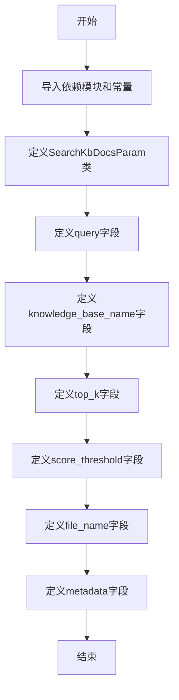
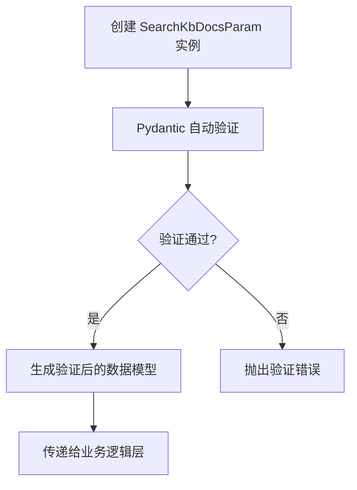

# `Langchain-Chatchat\libs\python-sdk\open_chatcaht\types\knowledge_base\doc\search_kb_docs_param.py` 详细设计文档

这是一个用于定义知识库文档搜索参数的 Pydantic 模型类，通过字段验证器确保查询内容、知识库名称、返回结果数量、相似度阈值、文件名过滤和元数据过滤等参数的合法性和一致性。

## 整体流程



## 类结构

```
BaseModel (Pydantic 基础模型)
└── SearchKbDocsParam (知识库文档搜索参数模型)
```

## 全局变量及字段


### `VECTOR_SEARCH_TOP_K`
    
向量搜索返回的top-k结果数量，默认匹配向量数

类型：`int`
    


### `SCORE_THRESHOLD`
    
知识库匹配相关度阈值，用于过滤低相关性结果

类型：`float`
    


### `SearchKbDocsParam.query`
    
检索内容

类型：`str`
    


### `SearchKbDocsParam.knowledge_base_name`
    
知识库名称

类型：`str`
    


### `SearchKbDocsParam.top_k`
    
匹配向量数，默认为VECTOR_SEARCH_TOP_K

类型：`int`
    


### `SearchKbDocsParam.score_threshold`
    
知识库匹配相关度阈值，取值范围0-1

类型：`float`
    


### `SearchKbDocsParam.file_name`
    
文件名称，支持sql通配符

类型：`str`
    


### `SearchKbDocsParam.metadata`
    
根据metadata进行过滤，仅支持一级键

类型：`dict`
    
    

## 全局函数及方法


## 关键组件


### SearchKbDocsParam 类

SearchKbDocsParam 是一个 Pydantic 数据验证模型，用于封装知识库文档检索的请求参数，通过字段级验证器确保搜索查询的合法性和准确性。

### 文件运行流程

该模块定义了 SearchKbDocsParam 类，供其他模块导入使用。当外部系统调用知识库检索功能时，会创建该类的实例，Pydantic 自动进行数据验证，确保所有字段符合预设的约束条件（如 score_threshold 必须在 0-1 之间，top_k 使用默认值等），验证通过后传递给后续业务逻辑处理。

### 类详细信息

#### SearchKbDocsParam 类

**类字段：**

| 字段名 | 类型 | 描述 |
|--------|------|------|
| query | str | 检索内容，用户输入的查询文本 |
| knowledge_base_name | str | 知识库名称，指定要检索的目标知识库 |
| top_k | int | 匹配向量数，返回最相似的 Top K 结果 |
| score_threshold | float | 知识库匹配相关度阈值，取值范围 0-1 |
| file_name | str | 文件名称，支持 SQL 通配符过滤 |
| metadata | dict | 根据 metadata 进行过滤，仅支持一级键 |

**类方法：**

该类继承自 Pydantic BaseModel，继承了完整的验证和序列化能力，无自定义方法定义。

**mermaid 流程图：**



**带注释源码：**

```python
from pydantic import BaseModel, Field

# 从配置模块导入默认常量
from open_chatcaht._constants import VECTOR_SEARCH_TOP_K, SCORE_THRESHOLD


class SearchKbDocsParam(BaseModel):
    """
    知识库文档检索参数模型
    
    用于定义检索知识库时的输入参数，包含查询内容、目标知识库、
    返回数量、相关性阈值、文件名过滤和元数据过滤等配置项
    """
    
    # 检索内容字段，必填项
    query: str = Field(description="检索内容")
    
    # 知识库名称字段，必填项
    knowledge_base_name: str = Field(description="知识库名称")
    
    # 匹配向量数，使用系统默认常量作为默认值
    top_k: int = Field(default=VECTOR_SEARCH_TOP_K, description="匹配向量数")
    
    # 相关度阈值，限制在 0-1 范围内，使用系统默认常量
    score_threshold: float = Field(
        default=SCORE_THRESHOLD,
        ge=0.0,  # 最小值约束
        le=1.0,  # 最大值约束
        description="知识库匹配相关度阈值，取值范围在0-1之间，"
                    "SCORE越小，相关度越高，"
                    "取到1相当于不筛选，建议设置在0.5左右"
    )
    
    # 文件名称过滤，支持 SQL 通配符，空字符串作为默认值
    file_name: str = Field("", description="文件名称，支持 sql 通配符"),
    
    # 元数据过滤字典，支持根据文档元数据进行过滤，仅支持一级键
    metadata: dict = Field({}, description="根据 metadata 进行过滤，仅支持一级键"),
```

### 关键组件信息

| 组件名称 | 描述 |
|----------|------|
| Pydantic BaseModel | 数据验证基类，提供自动类型转换和验证能力 |
| Field 验证器 | 用于定义字段元数据、默认值和约束条件 |
| score_threshold 约束 | ge/le 约束确保阈值在有效范围内 |
| 默认常量引用 | VECTOR_SEARCH_TOP_K 和 SCORE_THRESHOLD 来自配置模块 |

### 潜在的技术债务或优化空间

1. **元组类型问题**：file_name 字段定义后带有逗号，Python 会将其解析为元组而非字符串，建议移除逗号
2. **metadata 过滤限制**：当前仅支持一级键过滤，可考虑扩展为支持嵌套结构的 JSONPath 查询
3. **缺少排序字段**：未提供结果排序方式的配置选项
4. **缺少分页支持**：未定义分页相关参数（如 offset、page_size）

### 其它项目

**设计目标与约束：**

- 目标：提供简洁的检索参数定义，兼顾灵活性和安全性
- 约束：score_threshold 强制在 [0, 1] 区间，top_k 依赖系统常量

**错误处理与异常设计：**

- Pydantic 自动捕获类型错误、值域溢出等异常，抛出 ValidationError

**数据流与状态机：**

- 该类作为请求入口模型，数据流为：HTTP 请求 → Pydantic 验证 → 业务服务层

**外部依赖与接口契约：**

- 依赖 open_chatcaht._constants 模块获取系统默认配置
- 依赖 pydantic 库进行数据验证


## 问题及建议


### 已知问题

-   **类型定义错误**：`file_name` 字段定义末尾存在多余逗号，导致该字段类型从 `str` 变为 tuple，而非预期的字符串类型，这将导致运行时类型不匹配。
-   **类型注解不够精确**：`metadata` 字段使用 `dict` 泛型类型时应配合 `typing.Dict` 或 Python 3.9+ 的 `dict[str, Any]` 写法，以便静态类型检查工具准确识别。
-   **缺少必填字段验证**：`query` 和 `knowledge_base_name` 作为检索核心参数未设置 `min_length` 或非空约束，可能接受空字符串导致后续业务异常。
-   **描述信息不完整**：`top_k` 字段的描述未说明具体默认值是多少（实际为 VECTOR_SEARCH_TOP_K），使用者无法快速获知。

### 优化建议

-   修正 `file_name` 字段定义，移除行尾逗号以确保类型为 `str`。
-   为 `metadata` 字段添加更具体的类型注解，如 `Dict[str, Any]`，或使用 `typing.Optional[Dict[str, Any]]`。
-   为 `query` 和 `knowledge_base_name` 添加 `min_length=1` 约束，确保必填参数有效。
-   完善 `top_k` 字段描述，明确其默认值来源和具体数值。
-   考虑为 `score_threshold` 添加自定义验证器，确保其与 `top_k` 存在合理的业务逻辑关系（如阈值过高可能导致结果为空）。
-   建议将 `file_name` 改为可选字段 `Optional[str]` 并设置默认值为 `None`，以更准确表达"不筛选"的语义。


## 其它


### 设计目标与约束

本类用于定义知识库文档检索的参数模型，确保参数传递的型安全和默认值管理。约束条件包括：score_threshold 取值范围为 0.0-1.0，top_k 使用系统默认常量 VECTOR_SEARCH_TOP_K，file_name 支持 SQL 通配符匹配，metadata 仅支持一级键值对过滤。

### 错误处理与异常设计

Pydantic 会自动验证字段类型和约束条件，当 score_threshold 超出 0-1 范围时抛出 ValidationError；当 top_k、file_name、metadata 类型不匹配时自动触发验证错误。开发者可通过 try-except 捕获 pydantic.ValidationError 并进行格式化处理。

### 外部依赖与接口契约

依赖 open_chatcaht._constants 模块中的 VECTOR_SEARCH_TOP_K 和 SCORE_THRESHOLD 常量。调用方需传入符合字段定义的参数，query 和 knowledge_base_name 为必填字段，其余为可选字段。返回值为 Pydantic 模型实例，供下游向量检索服务使用。

### 使用示例

```python
# 基本使用
param = SearchKbDocsParam(
    query="如何安装Python",
    knowledge_base_name="技术文档"
)

# 自定义参数
param = SearchKbDocsParam(
    query="机器学习入门",
    knowledge_base_name="AI知识库",
    top_k=10,
    score_threshold=0.7,
    file_name="%.pdf",
    metadata={"author": "张三"}
)
```

### 验证规则详解

- query: 字符串类型，必填，描述检索内容
- knowledge_base_name: 字符串类型，必填，指定知识库名称
- top_k: 整数类型，默认 VECTOR_SEARCH_TOP_K，限制返回结果数量
- score_threshold: 浮点数，默认 SCORE_THRESHOLD，必须在 0.0-1.0 范围内
- file_name: 字符串类型，默认空字符串，支持 SQL LIKE 通配符（% 和 _）
- metadata: 字典类型，默认空字典，仅支持一级键值过滤，不支持嵌套结构


    