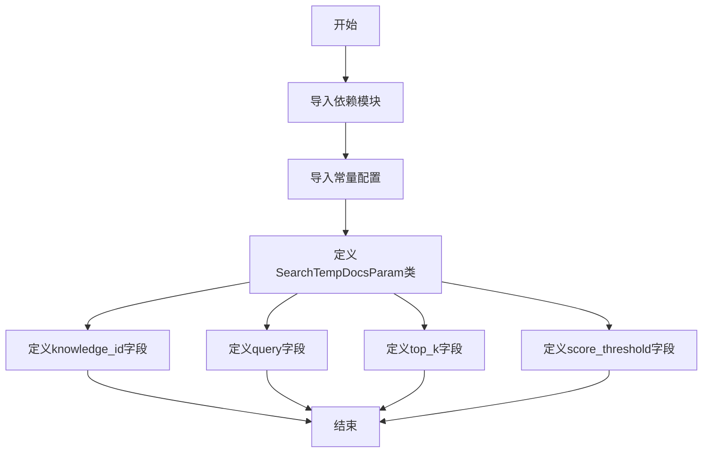
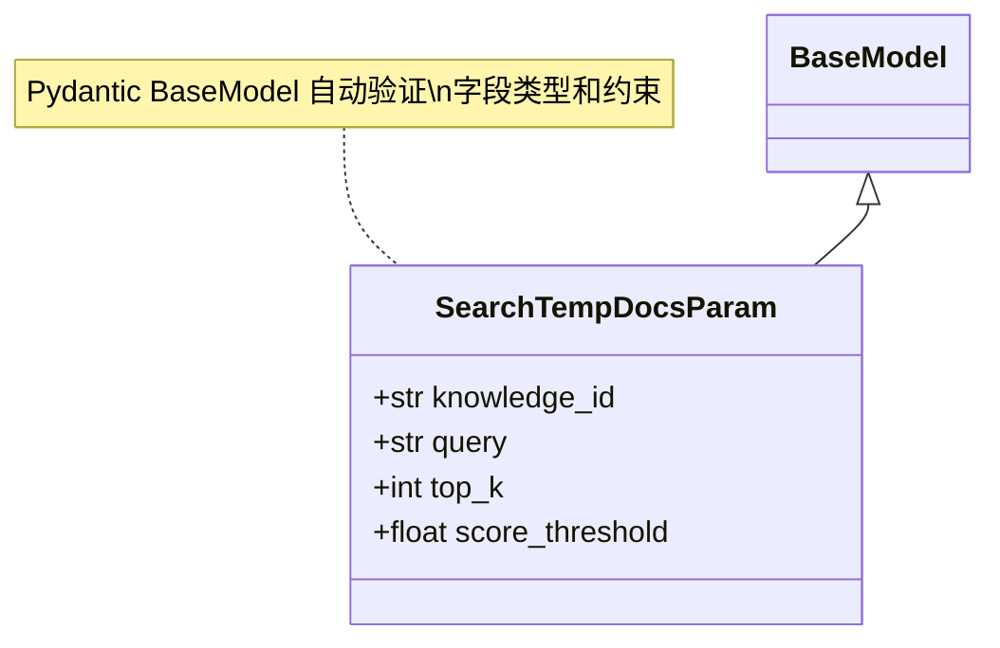
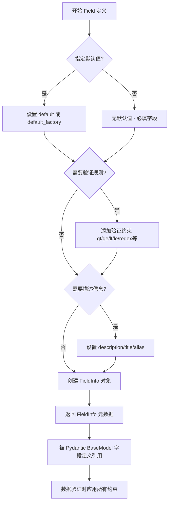
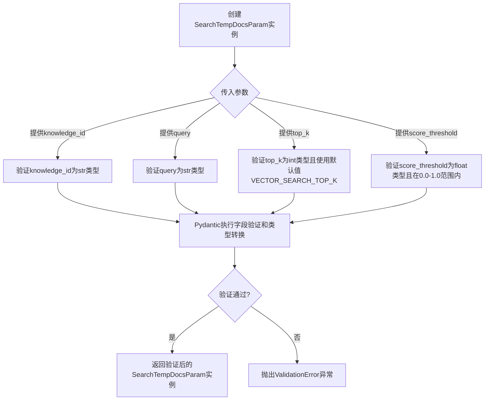
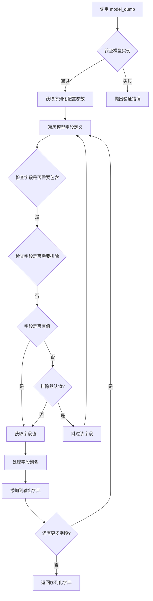
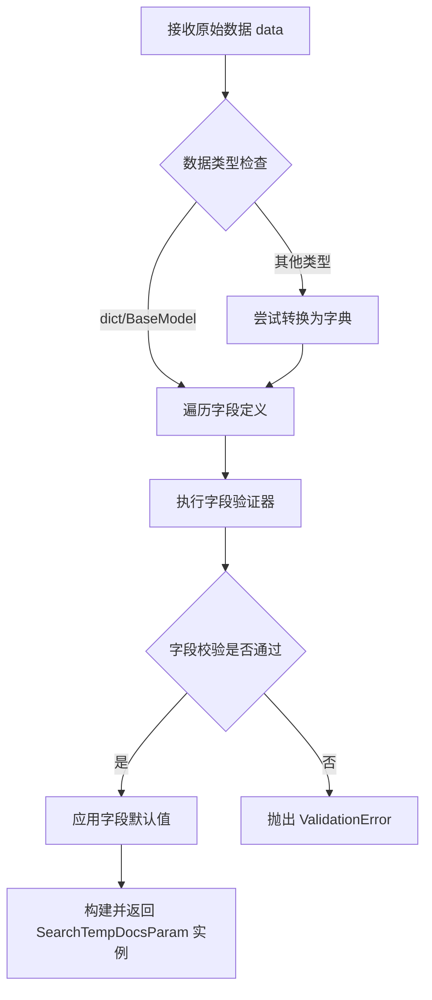

# `Langchain-Chatchat\libs\python-sdk\open_chatcaht\types\knowledge_base\doc\search_temp_docs_param.py` 详细设计文档

这是一个基于Pydantic的数据验证模型类，用于定义搜索临时文档的参数结构，包含知识库ID、查询字符串、匹配向量数和知识库匹配相关度阈值等字段，并提供了参数验证和默认值设置功能。

## 整体流程



## 类结构

```
BaseModel (Pydantic基类)
└── SearchTempDocsParam (搜索临时文档参数模型)
```

## 全局变量及字段


### `VECTOR_SEARCH_TOP_K`
    
向量搜索返回的Top K结果数量，默认配置常量

类型：`int`
    


### `SCORE_THRESHOLD`
    
知识库匹配相关度阈值常量，取值范围0-1，默认配置值

类型：`float`
    


### `SearchTempDocsParam.knowledge_id`
    
知识库的唯一标识ID，用于指定搜索目标知识库

类型：`str`
    


### `SearchTempDocsParam.query`
    
用户查询文本，用于在知识库中匹配相似文档

类型：`str`
    


### `SearchTempDocsParam.top_k`
    
返回的匹配向量数量，默认为VECTOR_SEARCH_TOP_K配置值

类型：`int`
    


### `SearchTempDocsParam.score_threshold`
    
知识库匹配相关度阈值，取值范围0-1，值越小相关度越高，默认值为SCORE_THRESHOLD配置值

类型：`float`
    
    

## 全局函数及方法


### SearchTempDocsParam

该类是一个 Pydantic 数据模型，用于定义知识库临时文档检索的参数结构，封装了知识库ID、查询文本、返回结果数量以及相似度阈值等检索所需的核心配置信息。

参数：

- `knowledge_id`：`str`，知识库的唯标识符，用于指定从哪个知识库中进行检索
- `query`：`str`，用户输入的查询文本，用于在知识库中进行向量相似度匹配
- `top_k`：`int`，返回最相似的 Top K 个结果，默认为 VECTOR_SEARCH_TOP_K
- `score_threshold`：`float`，知识库匹配的相似度阈值，取值范围 0.0-1.0，数值越小表示相关性越高，默认为 SCORE_THRESHOLD

返回值：`SearchTempDocsParam`，返回该 Pydantic 模型类的实例，包含上述四个字段的值

#### 流程图



#### 带注释源码

```python
from pydantic import BaseModel, Field  # 导入 pydantic 的 BaseModel 和 Field

# 导入项目内部的常量配置
from open_chatcaht._constants import VECTOR_SEARCH_TOP_K, SCORE_THRESHOLD


class SearchTempDocsParam(BaseModel):
    """
    知识库临时文档检索参数模型
    
    该类继承自 Pydantic 的 BaseModel，用于定义检索知识库时所需的参数结构。
    Pydantic 会在实例化时自动进行数据验证和类型转换。
    """
    
    knowledge_id: str  # 知识库的唯标识符
    
    query: str  # 用户查询文本
    
    top_k: int = Field(
        default=VECTOR_SEARCH_TOP_K,  # 默认匹配向量数
        description="匹配向量数"  # 字段描述信息
    )
    
    score_threshold: float = Field(
        default=SCORE_THRESHOLD,  # 默认相似度阈值
        ge=0.0,  # greater than or equal，最小值为 0.0
        le=1.0,  # less than or equal，最大值为 1.0
        description="知识库匹配相关度阈值，取值范围在0-1之间，"
                    "SCORE越小，相关度越高，"
                    "取到1相当于不筛选，建议设置在0.5左右"
    )
```


### `Field (pydantic)`

`Field` 是 Pydantic 库中用于定义数据模型字段元数据的核心类，允许为模型字段指定默认值、验证规则、描述信息等，常用于 API 参数校验和数据模型定义。

参数：

- `default`：可选，字段的默认值
- `default_factory`：可选，一个无参 callable，用于生成默认值
- `alias`：可选，字段的别名
- `title`：可选，字段的标题描述
- `description`：可选，字段的详细描述信息
- `gt`：可选，大于验证（greater than）
- `ge`：可选，大于等于验证（greater than or equal）
- `lt`：可选，小于验证（less than）
- `le`：可选，小于等于验证（less than or equal）
- `multiple_of`：可选，倍数验证
- `regex`：可选，正则表达式验证
- `**kwargs`：其他自定义字段选项

返回值：`FieldInfo`，返回字段的元数据对象，包含字段的所有配置信息

#### 流程图



#### 带注释源码

```python
from pydantic import BaseModel, Field  # 导入 Pydantic 的基础模型类和字段定义器

# 从常量模块导入向量搜索配置
from open_chatcaht._constants import VECTOR_SEARCH_TOP_K, SCORE_THRESHOLD


class SearchTempDocsParam(BaseModel):
    """
    临时文档搜索参数模型类
    用于定义知识库检索的输入参数结构
    """
    
    # 知识库 ID - 必填字段
    knowledge_id: str
    
    # 查询字符串 - 必填字段
    query: str
    
    # 匹配向量数量 - 使用 Field 定义默认值和描述
    # default=VECTOR_SEARCH_TOP_K: 默认返回前 N 条最相似结果
    # description: 向量匹配数量的说明信息
    top_k: int = Field(default=VECTOR_SEARCH_TOP_K, description="匹配向量数")
    
    # 知识库匹配相关度阈值 - 使用 Field 定义多层次验证规则
    # ge=0.0: greater than or equal，限制最小值为 0.0
    # le=1.0: less than or equal，限制最大值为 1.0
    # description: 说明分数越小相关度越高，建议设置为 0.5 左右
    score_threshold: float = Field(
        default=SCORE_THRESHOLD,
        ge=0.0,  # 验证：必须大于等于 0.0
        le=1.0,  # 验证：必须小于等于 1.0
        description="知识库匹配相关度阈值，取值范围在0-1之间，"
                    "SCORE越小，相关度越高，"
                    "取到1相当于不筛选，建议设置在0.5左右"
    )
```

#### 字段详细信息

| 字段名称 | 类型 | 描述 |
|---------|------|------|
| knowledge_id | str | 知识库的唯一标识符，用于指定从哪个知识库进行检索 |
| query | str | 用户查询文本，用于在知识库中进行向量相似度匹配 |
| top_k | int | 返回最相似的 Top K 条结果，默认值为 VECTOR_SEARCH_TOP_K |
| score_threshold | float | 相关度阈值过滤条件，取值范围 [0.0, 1.0]，分数低于此值的结果才会返回 |

#### 技术说明

1. **Field 的核心作用**：在 Pydantic 模型中，`Field` 提供了比简单类型注解更丰富的字段配置能力，包括默认值设置、数据验证规则、字段描述等元数据。

2. **验证约束的应用**：代码中 `ge=0.0` 和 `le=1.0` 会在数据解析时自动触发验证，确保 `score_threshold` 参数始终在有效范围内。

3. **默认值来源**：`top_k` 和 `score_threshold` 的默认值从外部配置文件 `_constants` 导入，这种设计便于统一管理和修改系统参数。


### SearchTempDocsParam.__init__

该方法是 `SearchTempDocsParam` 类的初始化方法，继承自 Pydantic 的 `BaseModel`，用于实例化一个知识库搜索参数对象，包含知识库ID、查询内容、向量搜索数量上限和相似度阈值等字段，并自动进行数据验证和类型转换。

参数：

- `knowledge_id`：`str`，知识库的标识ID，用于指定要搜索的知识库
- `query`：`str`，用户查询内容，用于在知识库中进行向量相似度匹配
- `top_k`：`int`，匹配向量数，默认为 `VECTOR_SEARCH_TOP_K`，指定返回最相似的Top K条结果
- `score_threshold`：`float`，知识库匹配相关度阈值，取值范围在0-1之间，SCORE越小相关度越高，默认为 `SCORE_THRESHOLD`，建议设置在0.5左右

返回值：`SearchTempDocsParam`，返回初始化后的搜索参数模型实例，该实例已通过Pydantic验证

#### 流程图



#### 带注释源码

```python
class SearchTempDocsParam(BaseModel):
    """
    知识库搜索参数模型类
    
    该类继承自Pydantic的BaseModel，用于定义知识库文档搜索时的
    参数结构和验证规则。包含四个字段：知识库ID、查询内容、
    向量搜索数量上限和相似度阈值。
    """
    
    # 知识库ID字段，必填项，字符串类型
    knowledge_id: str
    
    # 查询内容字段，必填项，字符串类型
    query: str
    
    # 匹配向量数字段，可选，默认为VECTOR_SEARCH_TOP_K
    # description用于API文档生成，描述该字段的用途
    top_k: int = Field(default=VECTOR_SEARCH_TOP_K, description="匹配向量数")
    
    # 知识库匹配相关度阈值字段，可选，默认为SCORE_THRESHOLD
    # ge=0.0, le=1.0 限制取值范围在0到1之间
    # description说明：SCORE越小，相关度越高，取到1相当于不筛选
    score_threshold: float = Field(
        default=SCORE_THRESHOLD,
        ge=0.0,  # greater than or equal to 0.0
        le=1.0,  # less than or equal to 1.0
        description="知识库匹配相关度阈值，取值范围在0-1之间，"
                    "SCORE越小，相关度越高，"
                    "取到1相当于不筛选，建议设置在0.5左右"
    )
    
    def __init__(self, **data):
        """
        SearchTempDocsParam的初始化方法
        
        继承自BaseModel的__init__，自动处理：
        1. 接收任意关键字参数
        2. 对每个字段进行类型验证
        3. 应用字段的默认值
        4. 执行字段约束检查（如ge, le）
        5. 生成验证后的实例
        
        Args:
            **data: 包含knowledge_id, query, top_k, score_threshold的字典
            
        Returns:
            SearchTempDocsParam: 验证通过后的实例
            
        Raises:
            ValidationError: 当参数不满足字段约束时抛出
        """
        # 调用父类BaseModel的__init__方法
        # Pydantic会自动进行所有字段的验证和转换
        super().__init__(**data)
```


### `SearchTempDocsParam.model_dump`

描述：该方法是 Pydantic BaseModel 内置的模型方法，用于将 SearchTempDocsParam 模型实例序列化为字典格式，支持多种序列化配置选项（如包含/排除字段、别名处理、默认值处理等），常用于 API 请求参数序列化或数据导出场景。

参数：

- `self`：隐含参数，当前模型实例
- `mode`：`str`，序列化模式，默认为 `'python'`，可选 `'python'`、`'json'` 等
- `include`：`Optional[Union[Set[int | str], int, str, Callable[[Any], bool]]]`，指定需要包含的字段
- `exclude`：`Optional[Union[Set[int | str], int, str, Callable[[Any], bool]]]`，指定需要排除的字段
- `by_alias`：`bool`，是否使用字段别名进行序列化，默认为 `False`
- `exclude_unset`：`bool`，是否排除未设置的字段，默认为 `False`
- `exclude_defaults`：`bool`，是否排除默认值的字段，默认为 `False`
- `exclude_none`：`bool`，是否排除值为 `None` 的字段，默认为 `False`

返回值：`Dict[str, Any]`，返回包含模型数据的字典对象

#### 流程图



#### 带注释源码

```python
def model_dump(
    self,
    mode: str = 'python',
    include: Optional[Union[Set[int | str], int, str, Callable[[Any], bool]]] = None,
    exclude: Optional[Union[Set[int | str], int, str, Callable[[Any], bool]]] = None,
    by_alias: bool = False,
    exclude_unset: bool = False,
    exclude_defaults: bool = False,
    exclude_none: bool = False,
    round_trip: bool = False,
    warnings: bool | None = True,
    serialize_as_any: bool = False,
) -> Dict[str, Any]:
    """
    将模型实例序列化为字典
    
    参数说明:
    - mode: 'python' 返回 Python 原生类型, 'json' 返回 JSON 兼容类型
    - include: 仅序列化指定字段
    - exclude: 排除指定字段
    - by_alias: 使用字段别名作为键
    - exclude_unset: 不包含未显式设置的字段
    - exclude_defaults: 不包含有默认值的字段
    - exclude_none: 不包含值为 None 的字段
    
    示例用法:
    # 基本序列化
    param = SearchTempDocsParam(knowledge_id="123", query="测试")
    param.model_dump()
    # 输出: {'knowledge_id': '123', 'query': '测试', 'top_k': 5, 'score_threshold': 0.5}
    
    # 排除默认值字段
    param.model_dump(exclude_defaults=True)
    # 输出: {'knowledge_id': '123', 'query': '测试'}
    
    # JSON 模式序列化
    param.model_dump(mode='json')
    # 返回 JSON 兼容的字典
    """
    # ... Pydantic 内部实现
    return self.__dict__  # 返回模型数据字典
```


### `SearchTempDocsParam.model_validate`

该方法是 Pydantic BaseModel 的内置验证方法，用于接收原始数据（字典或其他可校验类型）并将其解析为 `SearchTempDocsParam` 模型的实例，同时执行字段类型校验和自定义约束验证（如 `score_threshold` 的取值范围 0.0-1.0）。

参数：

- `data`：`dict` | `BaseModel` | `typing.Any`，待验证的原始数据，通常为字典形式，包含 `knowledge_id`、`query`、`top_k`、`score_threshold` 等字段
- `...`（其他 Pydantic model_validate 支持的参数，如 `context`、`mode` 等）

返回值：`SearchTempDocsParam`，验证通过后返回的模型实例，包含所有已类型转换和校验后的字段值

#### 流程图



#### 带注释源码

```python
# 该方法继承自 Pydantic v2 的 BaseModel，非本类自定义实现
# 源码为 Pydantic 框架内部实现，以下为调用示例

# class SearchTempDocsParam(BaseModel):
#     knowledge_id: str                           # 知识库ID，必填字段
#     query: str                                  # 用户查询内容，必填字段
#     top_k: int = Field(default=VECTOR_SEARCH_TOP_K, description="匹配向量数")  # 可选，默认从常量获取
#     score_threshold: float = Field(...)        # 可选，范围约束 [0.0, 1.0]

# 使用示例：
raw_data = {
    "knowledge_id": "kb_123",
    "query": "如何创建索引？",
    "top_k": 5,
    "score_threshold": 0.7
}

# 调用 model_validate 方法进行验证
# 内部流程：
# 1. 将 raw_data 转换为字典（如有必要）
# 2. 对每个字段进行类型检查和验证
#    - knowledge_id: 必须是 str
#    - query: 必须是 str
#    - top_k: 必须是 int，默认值 VECTOR_SEARCH_TOP_K
#    - score_threshold: 必须是 float，且满足 0.0 <= value <= 1.0
# 3. 验证通过后返回 SearchTempDocsParam 实例
param = SearchTempDocsParam.model_validate(raw_data)

# 验证失败示例（score_threshold 超出范围）
invalid_data = {
    "knowledge_id": "kb_123",
    "query": "测试",
    "score_threshold": 1.5  # 超出 0.0-1.0 范围
}
# param = SearchTempDocsParam.model_validate(invalid_data)
# 将抛出 ValidationError: score_threshold must be less than or equal to 1.0
```

## 关键组件


### SearchTempDocsParam 类

搜索临时文档的参数模型，基于Pydantic BaseModel实现，用于定义知识库检索的参数结构

### knowledge_id 字段

知识库ID，字符串类型，用于指定要搜索的知识库唯一标识

### query 字段

查询字符串，字符串类型，用于指定要搜索的文本内容

### top_k 字段

匹配向量数，整数类型，默认值为VECTOR_SEARCH_TOP_K常量，用于指定返回最相似的Top K条结果

### score_threshold 字段

知识库匹配相关度阈值，浮点数类型，取值范围0.0-1.0，默认值为SCORE_THRESHOLD常量，用于过滤低相关度的匹配结果，值越小相关度越高

### Field 验证器

Pydantic字段验证器，用于提供默认值和字段描述，并对score_threshold进行数值范围约束（0.0-1.0）

### VECTOR_SEARCH_TOP_K 常量

从open_chatcaht._constants导入的默认向量搜索Top K数量，用于设置返回结果的数量上限

### SCORE_THRESHOLD 常量

从open_chatcaht._constants导入的默认分数阈值，用于设置相关性筛选的默认阈值


## 问题及建议


### 已知问题

-   **导入路径拼写错误**：`from open_chatcaht._constants` 中的 `open_chatcaht` 疑似拼写错误，可能是 `open_chatgpt` 或其他正确名称，这将导致模块导入失败
-   **注释描述逻辑错误**：注释中写“SCORE越小，相关度越高”，但在向量检索场景中，score_threshold 通常表示相似度阈值，阈值越大表示要求的相关度越高，描述与实际语义相反
- **缺少类文档字符串**：SearchTempDocsParam 类没有 docstring，无法快速了解该模型的用途和使用场景
- **top_k 缺乏下界验证**：仅设置了默认值，未像 score_threshold 一样设置 ge 约束，无法防止负数或零值输入

### 优化建议

-   修正导入路径拼写，确保模块可正常导入
-   纠正注释描述，或添加更清晰的说明：如“score_threshold 越大，相关度越高，低于该阈值的文档将被过滤”
-   为类添加文档字符串，说明该模型用于临时文档检索的参数定义
-   为 top_k 添加最小值验证，如 `ge=1`，确保返回有效的检索结果数量
-   考虑将 description 内容提取为常量或外部配置，提高可维护性


## 其它


### 设计目标与约束

本类用于定义知识库检索功能的请求参数模型，确保参数的类型安全、默认值合理以及取值范围可控。设计约束包括：top_k必须为正整数，默认值为VECTOR_SEARCH_TOP_K；score_threshold必须在0.0-1.0之间，默认值为SCORE_THRESHOLD。

### 错误处理与异常设计

参数验证在Pydantic框架层面自动完成，当传入无效值时会抛出ValidationError。knowledge_id为空或格式不正确时触发验证错误；query为空时触发验证错误；top_k为负数或超过系统限制时触发验证错误；score_threshold超出0-1范围时触发验证错误。

### 数据流与状态机

本类作为请求参数模型，不涉及复杂的状态机逻辑。其生命周期为：客户端构造SearchTempDocsParam实例 -> Pydantic自动进行字段验证 -> 验证通过后传递给后续的向量检索服务 -> 服务使用这些参数执行知识库查询。

### 外部依赖与接口契约

本类依赖open_chatcaht._constants模块中的VECTOR_SEARCH_TOP_K和SCORE_THRESHOLD常量。VECTOR_SEARCH_TOP_K定义默认返回的向量匹配数量，SCORE_THRESHOLD定义默认的相关度阈值。接口契约方面，knowledge_id应为有效的知识库标识符字符串，query应为待检索的文本内容，返回的检索结果应基于这些参数进行过滤和排序。

### 使用示例

```python
# 创建SearchTempDocsParam实例
param = SearchTempDocsParam(
    knowledge_id="kb_12345",
    query="如何配置系统参数",
    top_k=5,
    score_threshold=0.7
)

# 使用默认参数
param_default = SearchTempDocsParam(
    knowledge_id="kb_12345",
    query="系统设置"
)
```

### 配置说明

top_k参数控制返回的相似文档数量，值越大返回结果越多但相关性可能下降，建议根据实际场景调整。score_threshold参数用于过滤低相关性结果，值越小要求相关性越高，取1.0表示不过滤返回所有结果，建议设置在0.5左右以平衡召回率和精确率。

### 验证规则

knowledge_id：字符串类型，必填，不能为空。query：字符串类型，必填，不能为空。top_k：整数类型，可选，默认VECTOR_SEARCH_TOP_K，必须大于0。score_threshold：浮点数类型，可选，默认SCORE_THRESHOLD，必须在0.0到1.0之间（含边界）。

### 版本历史

当前版本为1.0.0，初始版本定义了知识库检索的四个核心参数：knowledge_id、query、top_k和score_threshold。


    