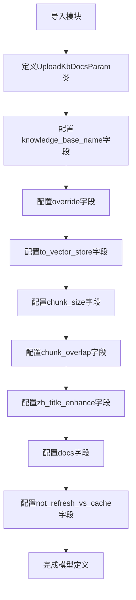
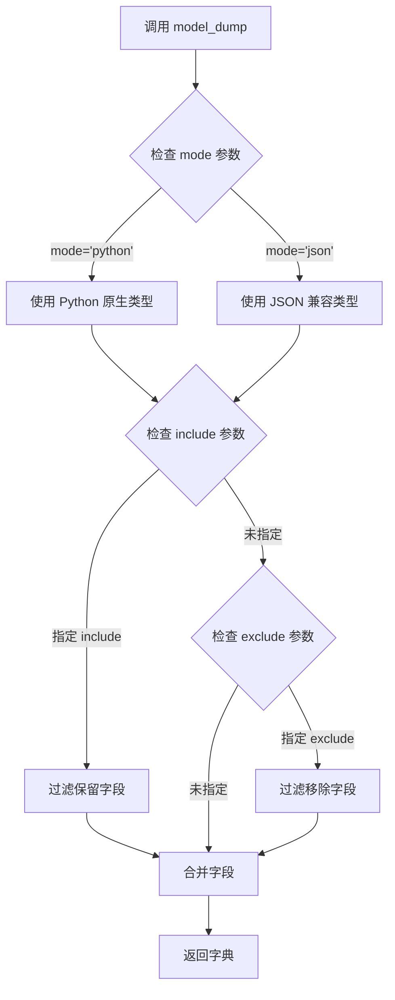
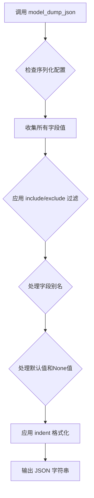
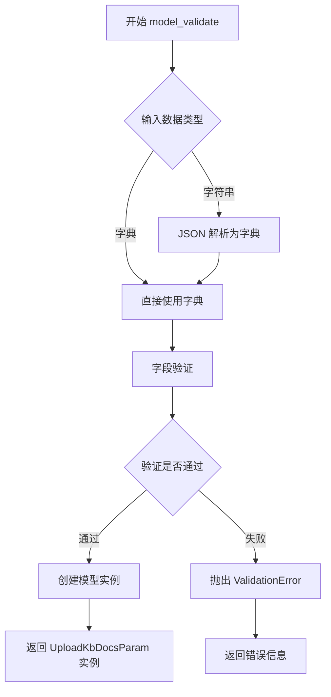
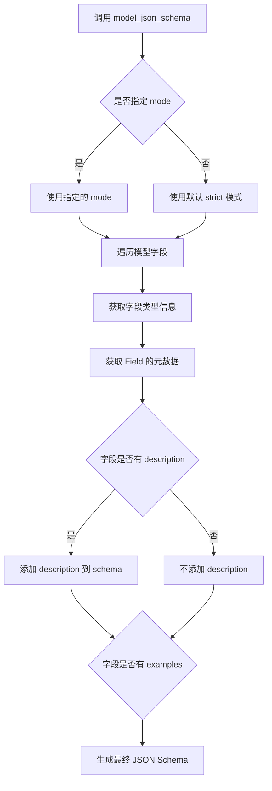

# `Langchain-Chatchat\libs\python-sdk\open_chatcaht\types\knowledge_base\doc\upload_kb_docs_param.py` 详细设计文档

定义了一个Pydantic参数模型UploadKbDocsParam，用于封装知识库文档上传时的配置信息，包括知识库名称、覆盖策略、向量化选项、文本分块参数等。

## 整体流程



## 类结构

```
BaseModel (pydantic基类)
└── UploadKbDocsParam (知识库文档上传参数模型)
```

## 全局变量及字段


### `CHUNK_SIZE`
    
文本分块大小常量，用于控制知识库中单段文本的最大长度

类型：`int`
    


### `OVERLAP_SIZE`
    
文本重叠大小常量，用于控制相邻文本块之间的重合长度

类型：`int`
    


### `ZH_TITLE_ENHANCE`
    
中文标题增强标志常量，控制是否启用中文标题加强功能

类型：`bool`
    


### `UploadKbDocsParam.knowledge_base_name`
    
知识库名称，用于指定要上传文档的目标知识库

类型：`str`
    


### `UploadKbDocsParam.override`
    
是否覆盖已有文件，指定是否覆盖知识库中已存在的同名文件

类型：`bool`
    


### `UploadKbDocsParam.to_vector_store`
    
上传后是否向量化，控制上传文件后是否立即进行向量化处理

类型：`bool`
    


### `UploadKbDocsParam.chunk_size`
    
单段文本最大长度，定义知识库中每个文本分块的最大字符数

类型：`int`
    


### `UploadKbDocsParam.chunk_overlap`
    
相邻文本重合长度，定义相邻文本块之间的重叠字符数

类型：`int`
    


### `UploadKbDocsParam.zh_title_enhance`
    
是否开启中文标题加强，控制是否对中文文档启用标题增强处理

类型：`bool`
    


### `UploadKbDocsParam.docs`
    
自定义的docs JSON字符串，用于传递自定义文档处理配置

类型：`str`
    


### `UploadKbDocsParam.not_refresh_vs_cache`
    
是否暂不保存向量库，控制是否跳过向量库缓存刷新（适用于FAISS等向量存储）

类型：`bool`
    
    

## 全局函数及方法


### `UploadKbDocsParam.model_dump`

将 Pydantic 模型实例导出为字典（字典格式），支持多种导出模式和字段过滤。

参数：

- `self`：`UploadKbDocsParam` 实例，Pydantic 模型自身
- `mode`：`str`，导出模式，可选 `'python'`、`'json'` 等，默认为 `'python'`
- `include`：`Optional[Union[Set[str], Mapping[str, Any]]]`，可选，仅导出的字段集合或映射
- `exclude`：`Optional[Union[Set[str], Mapping[str, Any]]]`，可选，排除的字段集合或映射
- `context`：`Optional[Any]`，可选，上下文对象，用于自定义编码器
- `**kwargs`：其他关键字参数，支持传递给底层序列化器的额外参数

返回值：`Dict[str, Any]`，返回模型实例的字典表示，包含所有字段及其值

#### 流程图



#### 带注释源码

```python
# 注意：model_dump 是 Pydantic BaseModel 的内置方法，非用户自定义实现
# 以下为 Pydantic v2 中 model_dump 的典型实现逻辑

def model_dump(
    self,
    mode: str = 'python',          # 导出模式：'python' 或 'json'
    include: Optional[Union[Set[str], Mapping[str, Any]]] = None,  # 仅导出的字段
    exclude: Optional[Union[Set[str], Mapping[str, Any]]] = None,  # 排除的字段
    context: Optional[Any] = None, # 上下文对象
    **kwargs                       # 其他序列化参数
) -> Dict[str, Any]:
    """
    将 Pydantic 模型实例导出为字典
    
    参数:
        mode: 'python' 返回 Python 原生类型 (如 datetime, UUID 等)
              'json' 返回 JSON 兼容类型 (如 str, float, list, dict 等)
        include: 仅包含指定的字段，支持集合或字典映射
        exclude: 排除指定的字段，支持集合或字典映射
        context: 传递给自定义编码器的上下文
    
    返回:
        包含所有字段值的字典对象
    """
    # 1. 获取模型的字段定义
    fields = self.model_fields
    
    # 2. 根据 include/exclude 过滤字段
    # 3. 对每个字段调用序列化器
    # 4. 根据 mode 选择序列化器类型
    # 5. 返回构造的字典
```

#### 使用示例

```python
# 创建 UploadKbDocsParam 实例
param = UploadKbDocsParam(
    knowledge_base_name="samples",
    override=True,
    chunk_size=500
)

# 导出为 Python 字典
result = param.model_dump()
# {
#     'knowledge_base_name': 'samples',
#     'override': True,
#     'to_vector_store': True,
#     'chunk_size': 500,
#     'chunk_overlap': 50,
#     'zh_title_enhance': False,
#     'docs': '',
#     'not_refresh_vs_cache': False
# }

# 仅导出特定字段
result = param.model_dump(include={'knowledge_base_name', 'override'})
# {'knowledge_base_name': 'samples', 'override': True}

# 导出为 JSON 兼容格式
result = param.model_dump(mode='json')
# {'knowledge_base_name': 'samples', 'override': True, ...}
```


### `UploadKbDocsParam.model_dump_json`

将 `UploadKbDocsParam` 模型实例序列化为 JSON 字符串，用于 API 请求参数传输或配置持久化。

参数：

- `mode`：`str`，序列化模式，默认为 `'json'`，支持 `'python'` 模式
- `indent`：`int | None`，JSON 缩进空格数，默认 `None`（无缩进）
- `include`：`IncEx`，要包含的字段集合，默认为 `None`（包含所有字段）
- `exclude`：`IncEx`，要排除的字段集合，默认为 `None`（不排除任何字段）
- `by_alias`：`bool`，是否使用字段别名序列化，默认 `False`
- `exclude_unset`：`bool`，是否排除未设置值的字段，默认 `False`
- `exclude_defaults`：`bool`，是否排除默认值的字段，默认 `False`
- `exclude_none`：`bool`，是否排除 `None` 值的字段，默认 `False`
- `round_trip`：`bool`，是否启用往返序列化（验证往返一致性），默认 `False`
- `warnings`：`bool`，是否显示验证警告，默认 `True`

返回值：`str`，符合 JSON 格式的字符串表示

#### 流程图



#### 带注释源码

```python
# 该方法是 Pydantic BaseModel 的内置方法，定义在 pydantic.main 模块中
# UploadKbDocsParam 类继承自 BaseModel，因此自动获得此方法

# 示例用法：
param = UploadKbDocsParam(
    knowledge_base_name="samples",
    override=False,
    to_vector_store=True,
    chunk_size=1000,
    chunk_overlap=200,
    zh_title_enhance=False,
    docs='{"key": "value"}',
    not_refresh_vs_cache=False
)

# 导出为 JSON 字符串
json_str = param.model_dump_json()

# 输出结果示例：
# {"knowledge_base_name":"samples","override":false,"to_vector_store":true,
#  "chunk_size":1000,"chunk_overlap":200,"zh_title_enhance":false,
#  "docs":"{\"key\": \"value\"}","not_refresh_vs_cache":false}

# 格式化输出（带缩进）
formatted_json = param.model_dump_json(indent=2)

# 只包含特定字段
selected_json = param.model_dump_json(include={"knowledge_base_name", "chunk_size"})

# 排除默认值字段
no_defaults_json = param.model_dump_json(exclude_defaults=True)
```


### `UploadKbDocsParam.model_validate`

从字典或JSON数据验证并创建 `UploadKbDocsParam` 模型实例的方法。继承自 Pydantic 的 `BaseModel` 类，提供数据验证、类型转换和错误处理功能，确保输入数据符合模型定义的结构和约束。

参数：

- `data`：`Union[Dict[str, Any], str]` (必需)，待验证的字典或 JSON 字符串，包含知识库文档上传参数
- `strict`： `Optional[bool]`，是否使用严格模式验证，默认继承模型设置
- `context`：`Optional[Dict[str, Any]]`，验证上下文信息，用于自定义验证器

返回值：`UploadKbDocsParam`，验证并转换后的模型实例，包含所有字段的 Python 类型值

#### 流程图



#### 带注释源码

```python
from pydantic import BaseModel, Field
from open_chatcaht._constants import CHUNK_SIZE, OVERLAP_SIZE, ZH_TITLE_ENHANCE


class UploadKbDocsParam(BaseModel):
    """
    知识库文档上传参数模型
    
    用于验证和管理知识库文档上传的配置参数，
    继承 Pydantic BaseModel 自动提供 model_validate 类方法
    """
    
    # 知识库名称 - 必填字段
    knowledge_base_name: str = Field(
        ...,  # ... 表示必填
        description="知识库名称", 
        examples=["samples"]
    ),
    
    # 是否覆盖已有文件 - 默认 False
    override: bool = Field(False, description="覆盖已有文件"),
    
    # 上传后是否向量化 - 默认 True
    to_vector_store: bool = Field(True, description="上传文件后是否进行向量化"),
    
    # 文本分块大小 - 默认常量值
    chunk_size: int = Field(CHUNK_SIZE, description="知识库中单段文本最大长度"),
    
    # 文本分块重叠大小 - 默认常量值
    chunk_overlap: int = Field(OVERLAP_SIZE, description="知识库中相邻文本重合长度"),
    
    # 中文标题增强 - 默认常量值
    zh_title_enhance: bool = Field(ZH_TITLE_ENHANCE, description="是否开启中文标题加强"),
    
    # 自定义 docs 字符串 - 默认为空字符串
    docs: str = Field("", description="自定义的docs，需要转为json字符串"),
    
    # 是否刷新向量库缓存 - 默认 False（用于 FAISS）
    not_refresh_vs_cache: bool = Field(False, description="暂不保存向量库（用于FAISS）"),


# ============================================================
# model_validate 使用示例
# ============================================================

# 示例1：从字典验证创建实例
param_dict = {
    "knowledge_base_name": "my_knowledge_base",
    "override": True,
    "chunk_size": 500
}
# 调用 model_validate（隐式继承自 BaseModel）
instance = UploadKbDocsParam.model_validate(param_dict)

# 示例2：从 JSON 字符串验证
json_str = '{"knowledge_base_name": "test_kb", "to_vector_store": false}'
instance_from_json = UploadKbDocsParam.model_validate(json_str)

# 示例3：带上下文的验证
context = {"user_role": "admin"}
instance_with_context = UploadKbDocsParam.model_validate(
    param_dict, 
    context=context
)
```


### `UploadKbDocsParam.model_json_schema`

该方法是 Pydantic BaseModel 的内置方法，用于生成 UploadKbDocsParam 模型的 JSON Schema 定义，描述了知识库文档上传参数的数据结构规范。

参数：

-  `mode`：`str | None`，可选参数，JSON Schema 生成模式，默认为 None
-  `title`：`str | None`，可选参数，schema 标题，默认为 None

返回值：`dict`，返回符合 JSON Schema 标准的字典结构，包含了模型的所有字段定义、类型约束和描述信息。

#### 流程图



#### 带注释源码

```python
def model_json_schema(
    mode: str | None = None,
    title: str | None = None,
    ...
) -> dict[str, Any]:
    """
    生成该 Pydantic 模型的 JSON Schema 表示。
    
    该方法是继承自 pydantic.BaseModel 的内置方法，会自动遍历
    UploadKbDocsParam 类中定义的所有字段，并生成对应的 JSON Schema。
    
    主要包含以下字段的 schema 定义：
    - knowledge_base_name: 知识库名称 (string)
    - override: 是否覆盖 (boolean)
    - to_vector_store: 是否向量化 (boolean)
    - chunk_size: 分块大小 (integer)
    - chunk_overlap: 分块重叠大小 (integer)
    - zh_title_enhance: 中文标题增强 (boolean)
    - docs: 自定义 docs (string)
    - not_refresh_vs_cache: 不刷新向量库缓存 (boolean)
    
    Returns:
        dict: 符合 JSON Schema Draft 2020-12 标准的字典
    """
    # 返回的 schema 示例结构：
    # {
    #     "type": "object",
    #     "properties": {
    #         "knowledge_base_name": {
    #             "type": "string",
    #             "description": "知识库名称",
    #             "examples": ["samples"]
    #         },
    #         "override": {
    #             "type": "boolean",
    #             "description": "覆盖已有文件",
    #             "default": False
    #         },
    #         ...
    #     },
    #     "required": ["knowledge_base_name"]
    # }
    return super().model_json_schema(mode=mode, title=title)
```


## 关键组件


### 核心功能概述

该代码定义了一个Pydantic数据模型`UploadKbDocsParam`，用于封装知识库文档上传时的各项配置参数，包括知识库名称、覆盖策略、向量化选项、文本分块参数、中文标题增强等，为知识库管理系统提供结构化的参数验证和类型提示。

### 文件整体运行流程

该文件是一个独立的参数定义模块，不涉及运行时流程。其工作方式为：当其他模块需要上传知识库文档时，实例化`UploadKbDocsParam`类并传入相应参数，Pydantic会自动进行参数验证、类型转换和默认值填充，确保传入的参数符合知识库系统的要求。

### 类的详细信息

#### UploadKbDocsParam 类

**类描述**: 用于知识库文档上传的参数模型类，继承自Pydantic的BaseModel，提供参数验证和序列化功能。

**类字段**:

| 字段名称 | 类型 | 描述 |
|---------|------|------|
| knowledge_base_name | str | 知识库名称，用于指定目标知识库 |
| override | bool | 覆盖已有文件的标志，默认为False |
| to_vector_store | bool | 上传后是否进行向量化处理的标志，默认为True |
| chunk_size | int | 知识库中单段文本的最大长度，默认为CHUNK_SIZE常量值 |
| chunk_overlap | int | 知识库中相邻文本的重合长度，默认为OVERLAP_SIZE常量值 |
| zh_title_enhance | bool | 是否开启中文标题加强功能，默认为ZH_TITLE_ENHANCE常量值 |
| docs | str | 自定义的docs内容，需要转为json字符串，默认为空字符串 |
| not_refresh_vs_cache | bool | 暂不保存向量库的标志（用于FAISS），默认为False |

**类方法**: 该类继承自BaseModel，隐式继承了validate、construct、dict、json等方法，具体方法实现需参考Pydantic源码。

### 关键组件信息

#### UploadKbDocsParam

知识库文档上传参数模型，封装了上传过程中的所有可配置选项，包括目标知识库、覆盖策略、向量化处理、文本分块参数等。

#### 导入常量 (CHUNK_SIZE, OVERLAP_SIZE, ZH_TITLE_ENHANCE)

从`open_chatcaht._constants`模块导入的默认值常量，用于为分块大小、重叠大小和中文标题增强提供系统级默认值，体现配置的中心化管理。

#### knowledge_base_name 字段

必填字段，用于指定文档上传的目标知识库名称，是知识库操作的唯一标识符。

#### chunk_size 与 chunk_overlap 字段

文本分块相关参数，控制知识库中文本的处理粒度。chunk_size决定单段文本的最大长度，chunk_overlap决定相邻段落之间的重叠区域大小，这两个参数直接影响向量检索的质量。

#### not_refresh_vs_cache 字段

用于FAISS向量存储的特殊配置项，控制在向量库操作时是否刷新缓存，提供了细粒度的性能优化选项。

### 潜在的技术债务或优化空间

1. **docs字段语义模糊**: `docs`字段的描述为"自定义的docs，需要转为json字符串"，其具体用途和格式不够明确，可能导致使用者困惑，建议增加更详细的文档说明或枚举可选的docs格式。

2. **缺乏参数间关联验证**: 当前模型没有定义不同参数之间的约束关系，例如当`to_vector_store`为False时，`chunk_size`等分块参数是否还有意义，缺乏业务逻辑层面的验证。

3. **常量依赖外部模块**: CHUNK_SIZE、OVERLAP_SIZE、ZH_TITLE_ENHANCE依赖外部模块导入，如果该模块不可用会导致整个模型无法使用，增加了部署和迁移的复杂度。

4. **字段命名一致性**: 部分字段使用下划线命名（如chunk_size），部分使用缩写（如vs），命名风格不够统一，可能影响代码可读性。

### 其它项目

#### 设计目标与约束

- **设计目标**: 提供结构化的知识库文档上传参数定义，实现参数的自动验证和类型转换
- **约束**: 依赖Pydantic库和open_chatcaht._constants模块，所有字段必须符合Pydantic的验证规则

#### 错误处理与异常设计

- 参数验证失败时，Pydantic会抛出ValidationError异常，包含详细的字段验证错误信息
- 缺失必填字段(knowledge_base_name)时，模型实例化会失败

#### 数据流与状态机

- 该模型为静态配置类，不涉及运行时状态管理
- 数据流为：用户输入 → Pydantic验证 → 验证通过后传递给下游处理逻辑

#### 外部依赖与接口契约

- 依赖`pydantic`库(version >= 2.0)的BaseModel类
- 依赖`open_chatcaht._constants`模块提供的系统级配置常量
- 接口契约：调用方需提供knowledge_base_name参数，其他参数均有默认值


## 问题及建议


### 已知问题

-   `docs` 字段类型为 `str`，描述要求"需要转为json字符串"，这种设计将 JSON 解析逻辑转嫁给调用方，增加了使用复杂度，容易因格式错误导致运行时异常
-   `knowledge_base_name` 字段缺少格式验证（长度限制、特殊字符过滤等），可能导致后续向量存储操作失败
-   `chunk_size` 和 `chunk_overlap` 字段缺少数值范围验证，未限制最小值为正整数，也未限制 `chunk_overlap` 不应超过 `chunk_size`
-   `docs` 字段默认值为空字符串 `""`，但使用 `Field(...)` 语法表示必填字段，语义不一致
-   缺少业务逻辑层面的验证，例如 `chunk_overlap` 不应大于等于 `chunk_size`，否则会导致分块重叠无效
-   依赖外部常量 `CHUNK_SIZE`、`OVERLAP_SIZE`、`ZH_TITLE_ENHANCE`，若常量未正确定义会导致导入失败，缺乏防御性编程

### 优化建议

-   将 `docs` 字段类型从 `str` 改为 `list[dict]` 或 `list[str]`，利用 Pydantic 自动处理 JSON 解析和验证
-   为 `knowledge_base_name` 添加正则表达式验证或 `constr` 约束，限制名称格式
-   使用 `Field` 的 `gt` 参数添加数值下限验证，确保 `chunk_size > 0` 和 `chunk_overlap >= 0`
-   添加模型级验证器 `model_validator`，校验 `chunk_overlap < chunk_size` 的业务规则
-   统一 `docs` 字段的必填/可选语义，若为可选则移除 `Field(...)` 标记
-   考虑使用 `Literal` 或 `Enum` 类型替代部分布尔标志字段，提高类型安全性和可读性
-   为关键字段添加更丰富的 `examples`，提升 API 文档的可用性


## 其它


### 设计目标与约束

该类作为知识库文档上传操作的参数验证模型，核心目标是确保API接收的参数符合业务规则和系统约束。主要设计约束包括：知识库名称为必填字段且需遵循命名规范；数值型参数（chunk_size、chunk_overlap）需在合理范围内；布尔型参数控制向量化流程的关键决策点；docs字段需为有效的JSON字符串格式。

### 错误处理与异常设计

Pydantic BaseModel自动提供字段类型校验和必填项验证。knowledge_base_name缺失时抛出ValidationError；chunk_size或chunk_overlap为负数时触发验证错误；docs字段内容不是有效JSON时会引发解析异常。业务层可在调用处捕获ValidationError并转化为用户友好的错误提示信息。

### 外部依赖与接口契约

该类依赖两个外部组件：一是pydantic库的BaseModel和Field，用于数据验证和元数据定义；二是open_chatcaht._constants模块提供的系统级配置常量（CHUNK_SIZE、OVERLAP_SIZE、ZH_TITLE_ENHANCE）。作为API请求体的参数模型，其字段定义构成与前端或调用方的接口契约，任何字段的变更都需同步更新接口文档。

### 配置管理与参数校验规则

字段的默认值从系统配置常量读取，确保与全局配置保持一致。chunk_size默认值为CHUNK_SIZE常量值，chunk_overlap默认值为OVERLAP_SIZE，zh_title_enhance默认值为ZH_TITLE_ENHANCE。这种设计使得系统级配置变更时，参数默认值自动同步更新。字段描述（description）明确标注了参数的用途和约束条件，为API文档生成提供元数据支持。

### 安全性与权限控制

知识库名称（knowledge_base_name）字段可能涉及访问控制验证，业务层需在参数校验后额外检查用户是否有权操作指定知识库。override参数涉及数据覆盖操作，需评估是否需要权限提升或二次确认机制。

### 版本兼容性与演化考虑

该类采用Pydantic v2语法（Field而非Field的旧写法）。若未来需支持Pydantic v1，需调整导入和字段定义方式。docs字段设计为JSON字符串而非直接的对象列表，为未来扩展文档格式留有余地，同时保持与现有JSON序列化流程的兼容性。

### 测试策略建议

应编写单元测试验证：必填字段缺失时的ValidationError抛出；各字段类型正确时的实例化成功；默认值正确加载常量配置；docs字段传入无效JSON时的异常捕获；边界值（如chunk_size=0或负数）的校验行为。

### 部署与运维注意事项

该模型类本身无状态，属于无服务器（serverless）友好设计。运行时依赖的open_chatcaht._constants模块需确保已正确安装和配置。生产环境中建议通过环境变量或配置中心管理CHUNK_SIZE、OVERLAP_SIZE、ZH_TITLE_ENHANCE等常量值，以便在不重新部署应用的情况下调整系统行为。

    