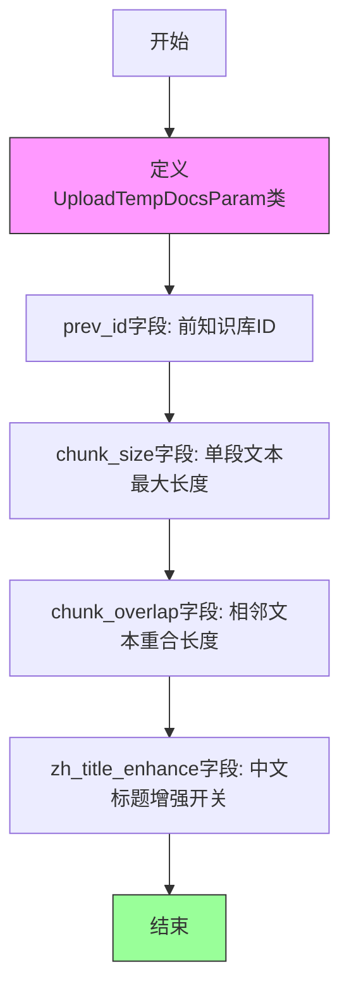

# `Langchain-Chatchat\libs\python-sdk\open_chatcaht\types\knowledge_base\doc\upload_temp_docs_param.py` 详细设计文档

该代码定义了一个Pydantic模型类UploadTempDocsParam，用于封装文档上传时的参数配置，包括知识库ID、文本分块大小、重合长度以及中文标题增强等设置，为文档处理流程提供配置输入。

## 整体流程



## 类结构

```
BaseModel (Pydantic基类)
└── UploadTempDocsParam (文档上传参数模型)
```

## 全局变量及字段


### `CHUNK_SIZE`
    
知识库中单段文本最大长度

类型：`int`
    


### `OVERLAP_SIZE`
    
知识库中相邻文本重合长度

类型：`int`
    


### `ZH_TITLE_ENHANCE`
    
是否开启中文标题加强

类型：`bool`
    


### `UploadTempDocsParam.prev_id`
    
前知识库ID

类型：`str`
    


### `UploadTempDocsParam.chunk_size`
    
知识库中单段文本最大长度

类型：`int`
    


### `UploadTempDocsParam.chunk_overlap`
    
知识库中相邻文本重合长度

类型：`int`
    


### `UploadTempDocsParam.zh_title_enhance`
    
是否开启中文标题加强

类型：`bool`
    
    

## 全局函数及方法


## 关键组件


### UploadTempDocsParam

知识库临时文档上传参数配置类，用于封装文档处理的相关配置，包括知识库ID、文本分块大小、重合长度以及中文标题增强选项。

### prev_id

前知识库ID字段，字符串类型，用于指定关联的前一个知识库标识。

### chunk_size

知识库中单段文本最大长度字段，整数类型，默认值为CHUNK_SIZE常量，控制文本分块的最大字符数。

### chunk_overlap

知识库中相邻文本重合长度字段，整数类型，默认值为OVERLAP_SIZE常量，用于设置文本块之间的重叠字符数。

### zh_title_enhance

是否开启中文标题加强字段，布尔类型，默认值为ZH_TITLE_ENHANCE常量，控制是否对中文文档启用标题增强功能。

### pydantic BaseModel

Pydantic数据验证基类，提供自动数据验证、序列化和类型转换功能。

### Field

Pydantic字段装饰器，用于定义模型字段的元数据，包括默认值、描述信息等。

### 常量导入

从open_chatcaht._constants模块导入的三个常量：CHUNK_SIZE、OVERLAP_SIZE、ZH_TITLE_ENHANCE，用于提供默认配置值。


## 问题及建议


### 已知问题

-   **类型与默认值不匹配**：`prev_id` 字段声明类型为 `str`，但默认值是 `None`，这会导致类型检查器警告，应使用 `Optional[str]` 或 `Union[str, None]`
-   **未使用的导入**：`typing` 模块中导入了 `Union` 和 `List`，但在代码中未使用
-   **Pydantic Field 语法兼容性**：在 Pydantic v2 中，`Field(None, ...)` 的写法已废弃，应使用 `Field(default=None, ...)` 或直接赋值 `= None`
-   **常量作为默认值的陷阱**：直接将 `CHUNK_SIZE`、`OVERLAP_SIZE`、`ZH_TITLE_ENHANCE` 作为默认值，在 Pydantic 初始化时会被求值，若常量后续被修改，不会反映到模型默认值中
-   **缺少类文档字符串**：类和方法没有文档说明，降低了代码可维护性和可读性

### 优化建议

-   将 `prev_id` 类型修改为 `Optional[str]`，并添加 `default=None`
-   移除未使用的 `Union` 和 `List` 导入，或按需保留
-   使用 Pydantic v2 推荐写法：`Field(default=CHUNK_SIZE, description=...)` 或使用 `Field(default=...)` 配合别名
-   考虑添加类级别的 `model_config` 或 `Config` 类，以统一配置验证规则
-   为 `UploadTempDocsParam` 类添加文档字符串，说明其用途和业务场景
-   可选字段建议放在必填字段之后，保持字段声明顺序的一致性


## 其它


### 设计目标与约束

定义上传临时文档时的参数模型，支持知识库文本分块配置。约束：chunk_size和chunk_overlap需为正整数，zh_title_enhance为布尔值。

### 错误处理与异常设计

字段验证失败时由Pydantic自动抛出ValidationError。chunk_size和chunk_overlap需满足chunk_size >= chunk_overlap的逻辑约束。

### 数据流与状态机

该类作为请求参数模型，不涉及状态机。数据流：用户请求 -> UploadTempDocsParam验证 -> 传递给后续处理逻辑。

### 外部依赖与接口契约

依赖pydantic基类模型和open_chatcaht._constants常量模块。接口契约：该类实例可序列化JSON，用于API请求体。

### 性能考虑

Pydantic v2使用Rust核心验证，性能较高。该模型为轻量级配置对象，无性能瓶颈。

### 安全性考虑

无敏感数据处理。所有字段均为公开配置参数。

### 兼容性考虑

依赖pydantic库，需确保版本兼容性（代码使用pydantic v2语法）。字段使用Field定义默认值，支持动态配置。

### 配置说明

CHUNK_SIZE：默认单段文本最大长度
OVERLAP_SIZE：默认相邻文本重合长度  
ZH_TITLE_ENHANCE：默认是否启用中文标题加强

### 使用示例

```python
# 默认参数
params = UploadTempDocsParam()

# 自定义参数
params = UploadTempDocsParam(
    prev_id="kb_123",
    chunk_size=500,
    chunk_overlap=50,
    zh_title_enhance=True
)
```

### 版本历史

初版：定义上传临时文档参数模型，包含知识库配置相关字段。

    