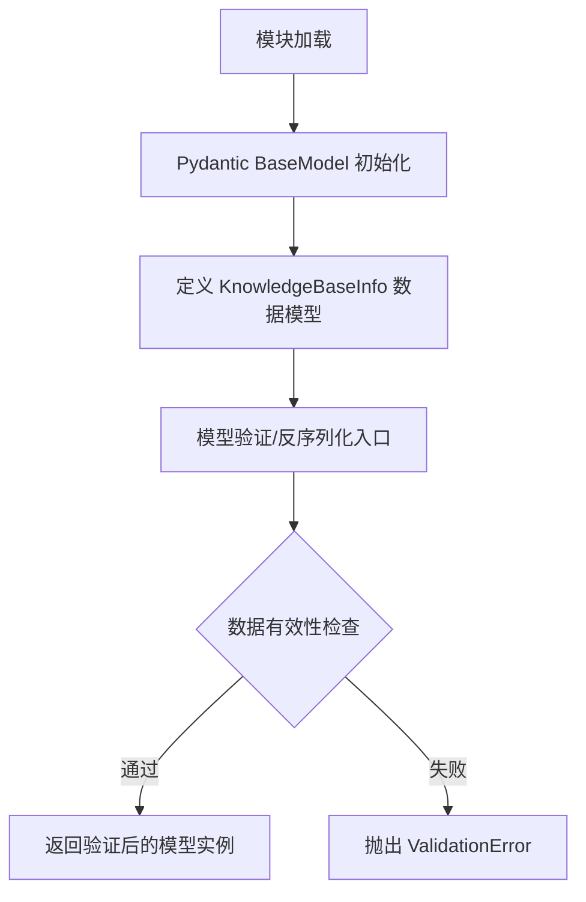
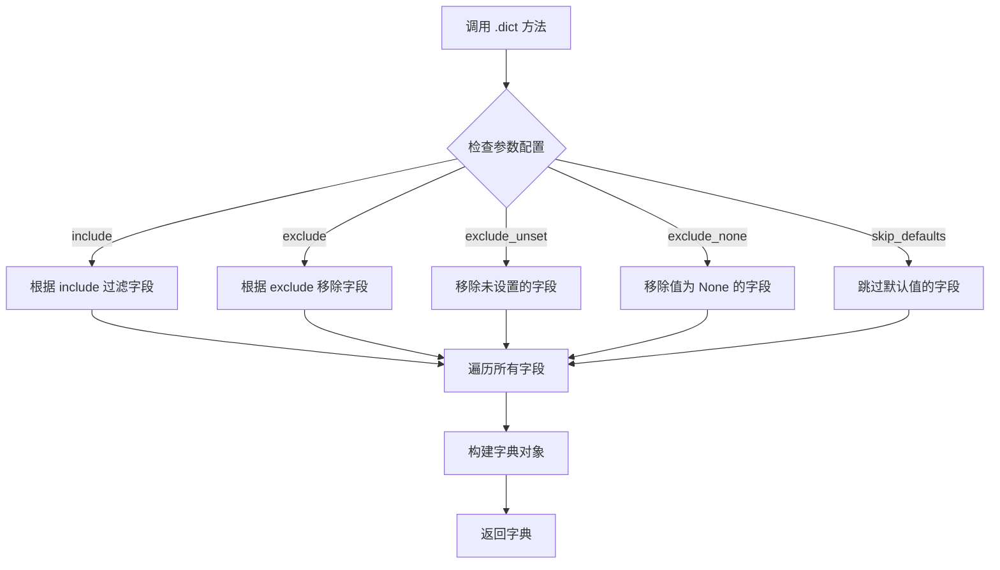
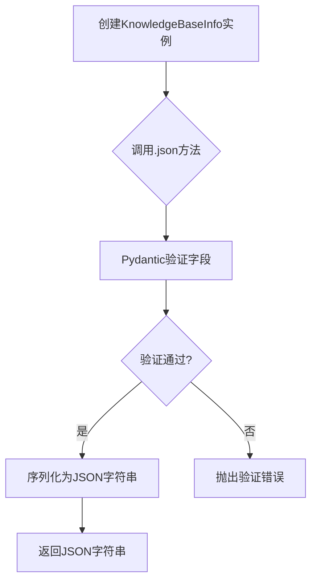
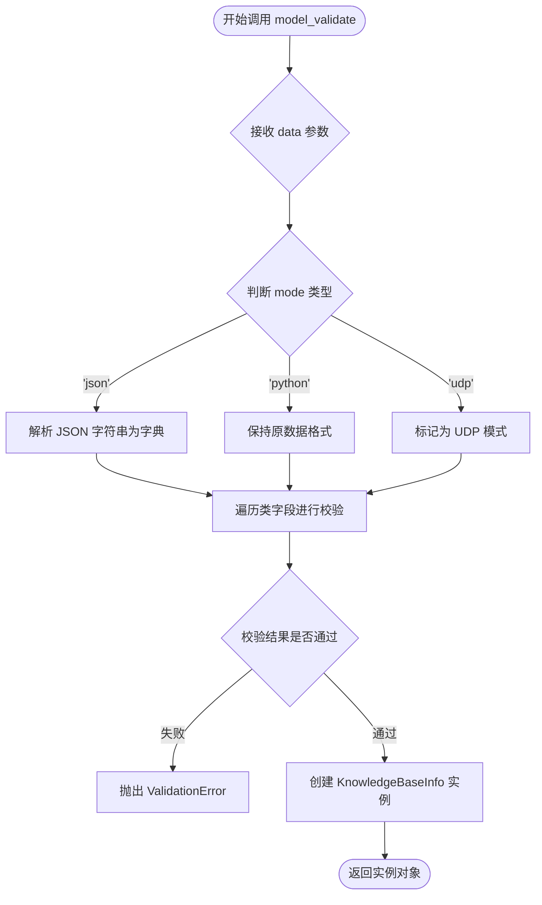
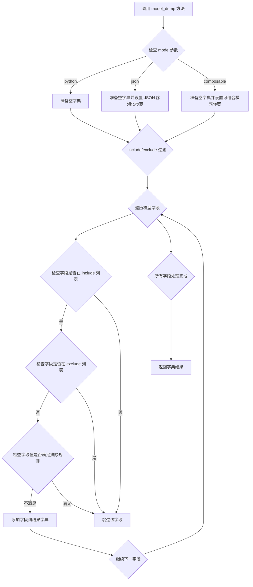

# `Langchain-Chatchat\libs\python-sdk\open_chatcaht\types\knowledge_base\knowledge_base.py` 详细设计文档

该代码定义了一个基于Pydantic的知识库信息数据模型类KnowledgeBaseInfo，用于在系统中表示和验证知识库的相关元数据信息，包括知识库ID、名称、描述、向量库类型、向量化模型、文件数量和创建时间等字段。

## 整体流程



## 类结构

```
BaseModel (pydantic 抽象基类)
└── KnowledgeBaseInfo (数据模型类)
```

## 全局变量及字段


### `KnowledgeBaseInfo.id`
    
知识库ID

类型：`int`
    


### `KnowledgeBaseInfo.kb_name`
    
知识库名称

类型：`str`
    


### `KnowledgeBaseInfo.kb_info`
    
知识库信息描述

类型：`Optional[str]`
    


### `KnowledgeBaseInfo.vs_type`
    
向量库类型

类型：`Optional[str]`
    


### `KnowledgeBaseInfo.embed_model`
    
向量化模型

类型：`Optional[str]`
    


### `KnowledgeBaseInfo.file_count`
    
文件数量

类型：`Optional[int]`
    


### `KnowledgeBaseInfo.create_time`
    
创建时间

类型：`Optional[datetime]`
    
    

## 全局函数及方法


### `KnowledgeBaseInfo.__init__`

该方法是Pydantic BaseModel的构造函数，由Pydantic框架自动生成并继承。用于初始化知识库信息对象，接收知识库的各个属性字段（ID、名称、信息、向量库类型、向量化模型、文件数量、创建时间），并进行数据验证和类型转换，最终返回一个KnowledgeBaseInfo实例。

参数：

- `**data`：`Any`，关键字参数集合，包含知识库的各项属性值

返回值：`KnowledgeBaseInfo`，返回初始化并验证后的知识库信息对象实例

#### 流程图

```mermaid
flowchart TD
    A[开始 __init__] --> B[接收 **data 关键字参数]
    B --> C[Pydantic 执行字段验证]
    C --> D{验证是否通过}
    D -->|通过| E[创建 KnowledgeBaseInfo 实例]
    D -->|失败| F[抛出 ValidationError]
    E --> G[返回实例]
    
    subgraph 字段验证
    C1[id: int] --> C
    C2[kb_name: str] --> C
    C3[kb_info: Optional[str]] --> C
    C4[vs_type: Optional[str]] --> C
    C5[embed_model: Optional[str]] --> C
    C6[file_count: Optional[int]] --> C
    C7[create_time: Optional[datetime]] --> C
    end
```

#### 带注释源码

```python
from typing import Optional, Any
from pydantic import BaseModel, Field
from datetime import datetime


class KnowledgeBaseInfo(BaseModel):
    """
    知识库信息数据模型
    
    继承自Pydantic BaseModel，自动生成 __init__、__validators__ 等方法
    用于数据结构验证和序列化
    """
    
    # 知识库ID - 整型，默认值为None
    id: int = Field(default=None, description="知识库id")
    
    # 知识库名称 - 字符串类型，默认值为None
    kb_name: str = Field(default=None, description="知识库名称")
    
    # 知识库信息 - 可选的字符串类型，用于存储知识库的描述信息
    kb_info: Optional[str] = Field(default=None, description="知识库信息")
    
    # 向量库类型 - 可选的字符串类型，如faiss、milvus等
    vs_type: Optional[str] = Field(default=None, description="向量库类型")
    
    # 向量化模型 - 可选的字符串类型，如text-embedding-ada-002
    embed_model: Optional[str] = Field(default=None, description="向量化模型")
    
    # 文件数量 - 可选的整型，记录知识库中的文件总数
    file_count: Optional[int] = Field(default=None, description="文件数量")
    
    # 创建时间 - 可选的datetime类型，记录知识库的创建时间
    create_time: Optional[datetime] = Field(default=None, description="创建时间")
    
    # 注意：以下 __init__ 方法由 Pydantic 框架自动生成
    # 此处为注释说明其功能，实际代码由框架注入
    
    def __init__(self, **data: Any) -> None:
        """
        Pydantic 自动生成的构造函数
        
        参数:
            **data: 包含所有字段值的字典或关键字参数
            
        流程:
            1. 接收任意关键字参数
            2. 对每个字段进行类型检查和验证
            3. 应用 Field 定义的默认值和约束
            4. 验证通过后创建实例
            5. 验证失败则抛出 ValidationError
            
        示例用法:
            # 方式1：使用关键字参数
            kb = KnowledgeBaseInfo(id=1, kb_name="我的知识库")
            
            # 方式2：使用字典
            kb = KnowledgeBaseInfo(**{"id": 1, "kb_name": "我的知识库"})
        """
        # 框架内部调用，开发者无需手动实现
        super().__init__(**data)
```


### `KnowledgeBaseInfo.dict`

该方法继承自 Pydantic 的 `BaseModel` 类，用于将 `KnowledgeBaseInfo` 模型实例转换为字典格式，使其能够被序列化（如转换为 JSON 或字典），常用于 API 响应返回或数据持久化场景。

参数：

- `self`：隐式参数，表示模型实例本身
- `include`：可选，设置要包含的字段
- `exclude`：可选，设置要排除的字段
- `by_alias`：可选，是否使用字段别名作为键
- `skip_defaults`：可选，是否跳过默认值字段
- `exclude_unset`：可选，是否排除未设置的字段
- `exclude_none`：可选，是否排除 None 值的字段

返回值：`dict`，返回包含模型字段及其值的字典对象

#### 流程图



#### 带注释源码

```python
from typing import Optional

from pydantic import BaseModel, Field
from datetime import datetime


class KnowledgeBaseInfo(BaseModel):
    """
    知识库信息数据模型
    用于存储和验证知识库的相关信息
    """
    id: int = Field(default=None, description="知识库id")
    kb_name: str = Field(default=None, description="知识库名称")
    kb_info: Optional[str] = Field(default=None, description="知识库信息")
    vs_type: Optional[str] = Field(default=None, description="向量库类型")
    embed_model: Optional[str] = Field(default=None, description="向量化模型")
    file_count: Optional[int] = Field(default=None, description="文件数量")
    create_time: Optional[datetime] = Field(default=None, description="创建时间")

    # .dict() 方法是继承自 BaseModel 的内置方法
    # 使用示例：
    # kb_info = KnowledgeBaseInfo(id=1, kb_name="测试库")
    # result = kb_info.dict()  # 返回字典格式
    # 输出: {'id': 1, 'kb_name': '测试库', 'kb_info': None, 'vs_type': None, ...}
    
    # 常用参数示例：
    # kb_info.dict(exclude_none=True)  # 排除值为 None 的字段
    # kb_info.dict(exclude_unset=True) # 排除未设置的字段
```


### `KnowledgeBaseInfo`

描述：Pydantic数据模型类，用于定义知识库的基本信息结构，包含知识库ID、名称、描述、向量库类型、嵌入模型、文件数量和创建时间等字段，并集成JSON序列化能力。

参数：
- 无（类定义不接受外部参数，字段通过Field配置定义）

返回值：`str`，返回模型的JSON字符串表示（通过继承自BaseModel的`.json()`方法）

#### 流程图



#### 带注释源码

```
from typing import Optional  # 导入Optional类型用于定义可选字段

from pydantic import BaseModel, Field  # 导入Pydantic的BaseModel和Field
from datetime import datetime  # 导入datetime类型用于创建时间字段


class KnowledgeBaseInfo(BaseModel):
    """
    知识库信息数据模型类
    继承自Pydantic的BaseModel，自动提供数据验证和JSON序列化功能
    """
    
    # 知识库ID，默认为None，描述为"知识库id"
    id: int = Field(default=None, description="知识库id")
    
    # 知识库名称，默认为None，描述为"知识库名称"
    kb_name: str = Field(default=None, description="知识库名称")
    
    # 知识库信息，可选字符串字段，描述为"知识库信息"
    kb_info: Optional[str] = Field(default=None, description="知识库信息")
    
    # 向量库类型，可选字符串字段，描述为"向量库类型"
    vs_type: Optional[str] = Field(default=None, description="向量库类型")
    
    # 向量化模型，可选字符串字段，描述为"向量化模型"
    embed_model: Optional[str] = Field(default=None, description="向量化模型")
    
    # 文件数量，可选整数字段，描述为"文件数量"
    file_count: Optional[int] = Field(default=None, description="文件数量")
    
    # 创建时间，可选datetime字段，描述为"创建时间"
    create_time: Optional[datetime] = Field(default=None, description="创建时间")
```

#### 使用示例

```python
# 创建模型实例
kb_info = KnowledgeBaseInfo(
    id=1,
    kb_name="测试知识库",
    kb_info="这是一个测试知识库",
    vs_type="faiss",
    embed_model="text-embedding-ada-002",
    file_count=10,
    create_time=datetime.now()
)

# 转换为JSON字符串（继承自BaseModel的方法）
json_str = kb_info.json()
# 输出: '{"id": 1, "kb_name": "测试知识库", ...}'

# 转换为字典
dict_data = kb_info.dict()
# 输出: {'id': 1, 'kb_name': '测试知识库', ...}

# 从JSON创建模型
kb_from_json = KnowledgeBaseInfo.parse_raw(json_str)
```


### `KnowledgeBaseInfo.model_validate`

继承自 Pydantic v2 `BaseModel` 的类方法（Class Method）。该方法用于接收原始数据（字典、JSON 字符串或其他兼容对象），根据 `KnowledgeBaseInfo` 类中定义的字段（如 `id`, `kb_name`, `vs_type` 等）进行自动类型检查、校验和实例化，最终返回一个经过严格验证的模型实例。如果数据不符合模型定义（如类型错误、缺少必填字段），将抛出 `ValidationError`。

参数：

- `cls`：`type[KnowledgeBaseInfo]`，隐含的类引用（Class Method 的第一个参数）。
- `data`：`Dict[str, Any] | BaseModel | str`，待验证的原始数据。通常是一个包含字段键值对的字典，也可以是 JSON 字符串或另一个 Pydantic 模型实例。
- `mode`：`Literal['python', 'json', 'udp']`，可选，验证模式。默认为 `'python'`。`'python'` 模式直接验证输入对象；`'json'` 模式先将字符串解析为字典再验证；`'udp'` 模式允许忽略额外未定义的字段。

返回值：`KnowledgeBaseInfo`，返回校验通过后的模型实例。如果校验失败，将抛出 `ValidationError`。

#### 流程图



#### 带注释源码

```python
# 假设已有类定义
class KnowledgeBaseInfo(BaseModel):
    id: int = Field(default=None, description="知识库id")
    kb_name: str = Field(default=None, description="知识库名称")
    kb_info: Optional[str] = Field(default=None, description="知识库信息")
    vs_type: Optional[str] = Field(default=None, description="向量库类型")
    embed_model: Optional[str] = Field(default=None, description="向量化模型")
    file_count: Optional[int] = Field(default=None, description="文件数量")
    create_time: Optional[datetime] = Field(default=None, description="创建时间")

# --- 使用 model_validate 进行实例化与校验 ---

# 1. 准备原始数据 (通常来自 API 请求体或数据库查询结果)
raw_data = {
    "id": 1001,
    "kb_name": "AI 知识库",
    "kb_info": "存储关于 LLM 的文档",
    "vs_type": "faiss",
    "file_count": 25
}

# 2. 调用 model_validate 方法
#    - 它会检查 'id' 是否为 int 类型
#    - 它会检查 'kb_name' 是否为 str 类型
#    - 如果字段在定义中有 default 值，未传入时将自动填充默认值
try:
    # 验证数据并实例化模型
    kb_instance = KnowledgeBaseInfo.model_validate(raw_data)
    print(f"实例化成功: {kb_instance.kb_name}")
except Exception as e:
    print(f"数据校验失败: {e}")
```


### `KnowledgeBaseInfo.model_dump`

将 `KnowledgeBaseInfo` 模型实例序列化为字典格式，继承自 Pydantic v2 的 `BaseModel` 基类，用于导出模型数据（支持 Python 字典、JSON 字符串等输出模式）。

#### 参数

- `self`：`KnowledgeBaseInfo` 实例，当前模型对象
- `mode`：`Literal["python", "json", "composable"] | None`，输出模式，默认为 `"python"`（返回 Python 原生类型），`"json"` 会尝试序列化 datetime 等类型为 JSON 兼容格式
- `include`：`IncEx`，可选，包含字段的白名单（可以是字段名集合或映射）
- `exclude`：`IncEx`，可选，排除字段的黑名单
- `by_alias`：`bool`，默认为 `False`，是否使用字段别名（alias）作为键名
- `exclude_unset`：`bool`，默认为 `False`，是否排除未设置值的字段
- `exclude_defaults`：`bool`，默认为 `False`，是否排除默认值字段
- `exclude_none`：`bool`，默认为 `False`，是否排除值为 `None` 的字段
- `round_trip`：`bool`，默认为 `False`，是否启用往返序列化（用于验证序列化后再反序列化的一致性）

#### 流程图



#### 带注释源码

```python
# Pydantic v2 BaseModel 中 model_dump 方法的简化实现逻辑
# 实际源码位于 pydantic.main 模块

def model_dump(
    self,
    *,
    mode: Literal['python', 'json', 'composable'] | None = 'python',
    include: IncEx = None,
    exclude: IncEx = None,
    by_alias: bool = False,
    exclude_unset: bool = False,
    exclude_defaults: bool = False,
    exclude_none: bool = False,
    round_trip: bool = False,
    warnings: bool | None = True,
) -> dict[str, Any]:
    """
    将模型实例导出为字典格式
    
    参数:
        mode: 输出模式
            - "python": 返回 Python 原生类型（datetime 保持为 datetime 对象）
            - "json": 返回 JSON 兼容类型（datetime 序列化为 ISO 格式字符串）
            - "composable": 允许嵌套模型的组合模式
        include: 仅导出的字段集合
        exclude: 排除的字段集合
        by_alias: 是否使用字段别名
        exclude_unset: 排除未显式设置的字段
        exclude_defaults: 排除具有默认值的字段
        exclude_none: 排除值为 None 的字段
        round_trip: 验证序列化往返一致性
    
    返回:
        包含模型数据的字典
    """
    # 获取模型的所有字段定义
    fields = self.model_fields
    
    # 初始化结果字典
    result = {}
    
    # 遍历所有字段
    for field_name, field_info in fields.items():
        # 1. 检查 include 过滤
        if include is not None and field_name not in include:
            continue
            
        # 2. 检查 exclude 过滤
        if exclude is not None and field_name in exclude:
            continue
            
        # 获取字段值
        value = getattr(self, field_name)
        
        # 3. 检查 exclude_unset：未通过构造函数设置的字段
        if exclude_unset and field_name not in self.model_fields_set:
            continue
            
        # 4. 检查 exclude_defaults：值为默认值的字段
        if exclude_defaults:
            default = field_info.default
            if value == default:
                continue
                
        # 5. 检查 exclude_none：值为 None 的字段
        if exclude_none and value is None:
            continue
            
        # 6. 确定输出键名（使用 alias 还是字段名）
        key = field_info.alias if by_alias else field_name
        
        # 7. 根据 mode 处理值
        if mode == 'json':
            # JSON 模式：尝试序列化非 JSON 兼容类型
            if hasattr(value, 'model_dump'):
                value = value.model_dump(mode='json')
            elif isinstance(value, datetime):
                value = value.isoformat()
        elif mode == 'composable':
            # 可组合模式：保留 Pydantic 模型实例
            pass
        # python 模式：保持 Python 原生类型
        
        result[key] = value
    
    return result
```

> **备注**: `model_dump` 是 Pydantic v2 继承自 `BaseModel` 的内置方法，并非在 `KnowledgeBaseInfo` 类中显式定义。上述源码展示了该方法的内部实现逻辑。该方法的核心功能是将 Pydantic 模型实例转换为字典格式，支持多种过滤和转换选项。

## 关键组件


### KnowledgeBaseInfo

Pydantic 数据模型类，用于定义知识库的基本信息结构，包含知识库的ID、名称、信息、向量库类型、向量化模型、文件数量和创建时间等属性。

### id 字段

知识库唯一标识符，整数类型，用于唯一标识一个知识库。

### kb_name 字段

知识库名称，字符串类型，用于存储知识库的名称。

### kb_info 字段

知识库详细信息，可选字符串类型，用于存储知识库的描述或说明信息。

### vs_type 字段

向量库类型，可选字符串类型，用于指定所使用的向量数据库类型（如FAISS、Milvus等）。

### embed_model 字段

向量化模型，可选字符串类型，用于指定文本向量化所使用的模型名称。

### file_count 字段

文件数量，可选整数类型，用于记录知识库中包含的文件总数。

### create_time 字段

创建时间，可选 datetime 类型，用于记录知识库的创建时间戳。


## 问题及建议


### 已知问题

-   **类型与默认值不匹配**：`id: int` 和 `kb_name: str` 的类型注解与默认值 `None` 不一致，应使用 `Optional[int]` 和 `Optional[str]` 或提供有意义的默认值
-   **缺少必要字段校验**：未对 `kb_name` 进行非空字符串校验，可能导致空字符串或仅包含空白字符的名称被接受
-   **数值范围未约束**：`file_count` 未约束最小值为 0，可能接受负数；`id` 未约束为正整数
-   **缺少更新时间字段**：仅包含 `create_time`，缺少 `update_time` 字段用于记录最后修改时间
-   **字段命名不够明确**：`vs_type` 和 `embed_model` 字段命名较为缩写，可读性不佳
-   **缺乏文档注释**：类和各字段缺少 docstring 文档说明
-   **配置选项缺失**：未配置 Pydantic Model 的行为选项，如 `populate_by_name`、`str_strip_whitespace` 等

### 优化建议

-   修正类型注解：将 `id: int` 改为 `id: Optional[int]`，`kb_name: str` 改为 `kb_name: Optional[str]`，或提供非 None 默认值
-   添加字段验证器：使用 `@field_validator` 对 `kb_name` 进行非空校验，对 `file_count` 添加 `ge=0` 约束
-   扩展字段：添加 `update_time: Optional[datetime]` 字段，并考虑将 `create_time` 的默认值设为 `datetime.now`
-   改进命名：`vs_type` 可改为 `vector_store_type`，`embed_model` 可改为 `embedding_model`
-   添加 Model Config：配置 `model_config = ConfigDict(populate_by_name=True, str_strip_whitespace=True)` 等选项
-   完善文档：为类和字段添加详细的 docstring，说明业务含义
-   添加示例值：使用 `examples` 参数提供字段的示例值，提升 API 文档的可读性


## 其它


### 设计目标与约束

本代码的核心目标是通过Pydantic的BaseModel定义一个标准化的知识库信息数据结构，用于在系统中传递和验证知识库相关的数据。设计约束包括：必须兼容Python类型注解体系，支持可选字段的默认值处理，字段描述需清晰明确以便于API文档生成和前端展示，所有字段均设计为可选以支持部分信息更新的场景。

### 错误处理与异常设计

本代码作为数据模型定义层，自身不包含业务逻辑错误处理机制。错误处理将在调用层实现：当通过BaseModel的构造方法创建实例时，Pydantic会自动进行类型校验和数据验证。若字段类型不匹配或必填字段缺失，Pydantic将抛出ValidationError异常。调用方应使用try-except捕获pydantic.error_wrappers.ValidationError异常，并从中提取详细的错误信息返回给上游。

### 数据流与状态机

该数据模型本身不涉及状态机设计，属于纯数据承载对象（DTO）。数据流方向如下：外部系统（如REST API请求体、数据库查询结果）将原始数据传递至BaseModel构造方法，Pydantic内部执行类型转换和验证，验证通过后生成KnowledgeBaseInfo实例供业务逻辑层使用。该模型也可反向序列化（调用dict()或json()方法）用于响应返回或数据持久化。

### 外部依赖与接口契约

本代码依赖两个外部包：pydantic（版本需支持BaseModel和Field）和typing（Python内置）。接口契约方面，KnowledgeBaseInfo类实现了__init__、__repr__、dict、json、copy等继承自BaseModel的标准方法。调用方应按以下方式使用：创建实例时传入字典或关键字参数，访问字段时使用obj.field_name格式，序列化时调用obj.dict()或obj.json()方法。所有字段均为Optional类型，调用方需自行判断字段是否存在（值为None）后再进行业务处理。

### 安全考虑

当前代码未涉及敏感数据加密或访问控制逻辑。由于kb_info等字段可能包含知识库的业务描述信息，建议在后续扩展中加入字段级别的敏感信息标记。API层在返回该模型数据时，应根据用户权限过滤敏感字段。

### 性能考虑

Pydantic BaseModel在数据量较小时性能表现良好，但在大规模对象创建场景下可考虑使用pydantic的BaseModel.Config下的orm_mode或自定义validator优化。对于高频创建KnowledgeBaseInfo实例的场景，建议使用dict作为传输格式而非多次实例化。

### 扩展性设计

该模型具有良好的扩展性，后续可通过以下方式扩展：1）在类中添加新字段以支持更多知识库属性；2）使用Pydantic的validator装饰器添加自定义业务校验规则；3）通过继承该类创建细分领域模型（如TextKBInfo、GraphKBInfo）；4）可考虑实现__setattr__方法添加字段变更追踪机制。

### 测试策略

建议为该模型编写以下测试用例：1）使用有效数据成功创建实例；2）使用无效类型数据触发ValidationError；3）验证各字段的默认值行为；4）测试dict()和json()序列化输出格式；5）测试copy()和update()方法；6）验证字段描述信息可被外部工具正确提取。

### 版本兼容性

本代码基于Python 3.7+和Pydantic v1.x设计。向Pydantic v2.x迁移时需注意：pydantic.import为pydantic模块导入路径变化，Field的default参数行为可能有细微差异，建议查阅官方迁移指南进行适配。

### 项目结构关联

该模型在项目中通常位于数据层（data/models或schemas目录），与数据库ORM模型、业务服务层、API路由层存在上下游关系。建议配合SQLAlchemy或Tortoise等ORM框架的ORM模型共同使用，通过Pydantic模型实现API层与数据库层的解耦。


    