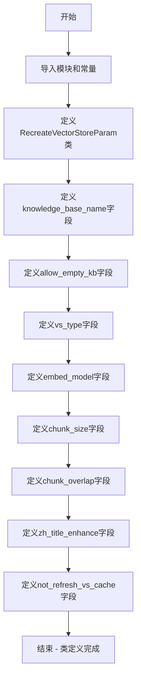

# `Langchain-Chatchat\libs\python-sdk\open_chatcaht\types\knowledge_base\recreate_vector_store_param.py` 详细设计文档

该代码定义了一个Pydantic数据模型RecreateVectorStoreParam，用于封装重建向量知识库所需的各种配置参数，包括知识库名称、向量库类型、嵌入模型、文本分块大小等，支持知识库的灵活配置与重建操作。

## 整体流程



## 类结构

```
RecreateVectorStoreParam (Pydantic BaseModel)
└── 字段列表:
    ├── knowledge_base_name
    ├── allow_empty_kb
    ├── vs_type
    ├── embed_model
    ├── chunk_size
    ├── chunk_overlap
    ├── zh_title_enhance
    └── not_refresh_vs_cache
```

## 全局变量及字段


### `VS_TYPE`
    
向量库类型常量，定义默认使用的向量存储类型

类型：`str`
    


### `EMBEDDING_MODEL`
    
向量模型常量，定义默认使用的嵌入模型名称

类型：`str`
    


### `CHUNK_SIZE`
    
文本分块大小常量，定义知识库中单段文本的最大长度

类型：`int`
    


### `OVERLAP_SIZE`
    
文本重叠大小常量，定义知识库中相邻文本块的重合长度

类型：`int`
    


### `ZH_TITLE_ENHANCE`
    
中文标题增强常量，定义是否默认开启中文标题加强功能

类型：`bool`
    


### `RecreateVectorStoreParam.knowledge_base_name`
    
知识库名称，用于指定要操作的向量知识库

类型：`str`
    


### `RecreateVectorStoreParam.allow_empty_kb`
    
是否允许空知识库，True 允许创建空知识库，默认为 True

类型：`bool`
    


### `RecreateVectorStoreParam.vs_type`
    
向量库类型，指定使用的向量存储后端类型，如 FAISS、Milvus 等

类型：`str`
    


### `RecreateVectorStoreParam.embed_model`
    
向量模型，指定用于文本向量化的嵌入模型

类型：`str`
    


### `RecreateVectorStoreParam.chunk_size`
    
知识库中单段文本最大长度，控制文本分块时的块大小

类型：`int`
    


### `RecreateVectorStoreParam.chunk_overlap`
    
知识库中相邻文本重合长度，控制文本分块时的重叠区域大小

类型：`int`
    


### `RecreateVectorStoreParam.zh_title_enhance`
    
是否开启中文标题加强，用于提升中文文档的标题语义处理能力

类型：`bool`
    


### `RecreateVectorStoreParam.not_refresh_vs_cache`
    
暂不保存向量库标志，用于 FAISS 等不支持持久化的向量库，默认为 False

类型：`bool`
    
    

## 全局函数及方法


## 关键组件


### RecreateVectorStoreParam

Pydantic数据模型类，用于封装重新创建向量知识库时的所有配置参数，包含知识库名称、向量库类型、嵌入模型、分块策略、中文标题增强等9个配置字段，通过Field定义默认值和描述信息。

### knowledge_base_name

字符串类型字段，定义要操作的知识库名称，支持示例值"samples"，是向量存储重创建的核心标识参数。

### allow_empty_kb

布尔类型字段，默认值为True，控制是否允许操作空知识库，用于向量库创建的灵活性配置。

### vs_type

字符串类型字段，通过VS_TYPE常量赋值，定义向量库的存储类型（如FAISS、Milvus等），决定底层向量搜索引擎。

### embed_model

字符串类型字段，通过EMBEDDING_MODEL常量赋值，指定用于生成文本向量嵌入的模型，影响语义搜索质量。

### chunk_size

整数类型字段，通过CHUNK_SIZE常量赋值，定义知识库中单段文本的最大长度，用于文本分块处理。

### chunk_overlap

整数类型类型字段，通过OVERLAP_SIZE常量赋值，定义相邻文本块之间的重叠长度，保证上下文连续性。

### zh_title_enhance

布尔类型字段，通过ZH_TITLE_ENHANCE常量赋值，控制是否启用中文标题加强功能，提升中文文档检索效果。

### not_refresh_vs_cache

布尔类型字段，默认False，控制在重创建过程中是否刷新向量库缓存，用于特定场景下的缓存管理。


## 问题及建议


### 已知问题

-   **参数验证不足**：`chunk_overlap`（重叠长度）没有验证是否小于 `chunk_size`（分块大小），可能导致逻辑错误
-   **类型安全较弱**：`vs_type` 和 `embed_model` 使用字符串类型，缺少枚举或 Literal 类型约束，容易传入非法值
-   **字段描述不完整**：`allow_empty_kb` 字段的默认值为 `True`，但 description 中未说明其含义
-   **命名可读性差**：`not_refresh_vs_cache` 字段命名较长且语义不清晰，description 中仅提及"用于FAISS"，解释不够充分
-   **缺少业务规则校验**：未对 `knowledge_base_name` 进行格式验证（如特殊字符、空格等）
-   **常量依赖隐式**：依赖 `open_chatcaht._constants` 模块的常量，但未在类中标注这些常量的来源和用途

### 优化建议

-   使用 `Enum` 或 `Literal` 类型定义 `vs_type` 的可选值范围，增强类型安全
-   添加 Pydantic `validator` 装饰器，校验 `chunk_overlap` 不超过 `chunk_size` 的合理比例
-   完善 `allow_empty_kb` 和 `not_refresh_vs_cache` 字段的 description，明确说明默认值的行为和适用场景
-   考虑为 `knowledge_base_name` 添加正则表达式校验或命名规范约束
-   可以在类级别添加 docstring，说明该参数类用于"重新创建向量存储时的配置"
-   将常量默认值在 Field 描述中标注来源，增强可维护性


## 其它


### 设计目标与约束

该代码定义了一个 Pydantic 数据模型 RecreateVectorStoreParam，用于封装创建/重建向量存储所需的所有配置参数。设计目标是为知识库系统提供统一、类型安全、可验证的参数配置接口，确保在创建向量存储时所有必要参数都被正确设置。约束条件包括：所有字段必须符合预定义常量或业务规则，如知识库名称不能为空，向量库类型必须支持，数值参数必须在合理范围内。

### 错误处理与异常设计

Pydantic 自动进行字段验证，当传入参数不符合 Field 定义的约束时，会抛出 ValidationError。知识库名称字段使用 ... (Ellipsis) 表示必填，缺失时验证失败；allow_empty_kb 默认为 True 允许空知识库；not_refresh_vs_cache 用于控制是否持久化向量库（特定场景如 FAISS 需要注意）。调用方需要捕获 pydantic.error_wrappers.ValidationError 异常并提供友好的错误提示。

### 数据流与状态机

该参数类作为输入数据载体，从调用方流向向量存储创建逻辑。典型流程为：用户/系统提供知识库名称和配置参数 → Pydantic 模型验证参数有效性 → 验证通过后参数传递至向量存储创建模块 → 根据 vs_type 选择对应向量库实现（如 FAISS、Milvus、Elasticsearch 等）→ 使用 embed_model 生成向量嵌入 → 按 chunk_size 和 chunk_overlap 进行文档分块 → 创建向量索引并可选缓存。

### 外部依赖与接口契约

该类依赖以下外部组件：pydantic 库（用于数据验证和类型提示），open_chatcaht._constants 模块（提供 VS_TYPE、EMBEDDING_MODEL、CHUNK_SIZE、OVERLAP_SIZE、ZH_TITLE_ENHANCE 等常量）。接口契约要求：knowledge_base_name 为字符串类型且必填；vs_type 必须为系统支持的向量库类型；embed_model 必须为可用的嵌入模型名称；chunk_size 和 chunk_overlap 为正整数；zh_title_enhance 为布尔值。

### 配置管理

所有配置项都定义了默认值，这些默认值从 _constants 模块导入。默认值包括：VS_TYPE（向量库类型）、EMBEDDING_MODEL（嵌入模型）、CHUNK_SIZE（默认分块大小）、OVERLAP_SIZE（默认重叠大小）、ZH_TITLE_ENHANCE（默认中文标题增强状态）。这种设计允许调用者仅提供必要参数，其余使用系统默认值，简化了 API 调用。

### 验证规则

各字段验证规则如下：knowledge_base_name 为必填字符串，无默认值；allow_empty_kb 布尔值默认 True；vs_type 字符串，默认从常量读取，受 VS_TYPE 常量约束；embed_model 字符串，默认从常量读取，受 EMBEDDING_MODEL 常量约束；chunk_size 和 chunk_overlap 为整数，默认值分别来自 CHUNK_SIZE 和 OVERLAP_SIZE 常量；zh_title_enhance 布尔值默认来自 ZH_TITLE_ENHANCE 常量；not_refresh_vs_cache 布尔值默认 False。

### 使用示例

```python
# 使用默认配置创建参数
params = RecreateVectorStoreParam(knowledge_base_name="my_kb")

# 自定义部分配置
params = RecreateVectorStoreParam(
    knowledge_base_name="my_kb",
    vs_type="faiss",
    embed_model="text-embedding-ada-002",
    chunk_size=500,
    chunk_overlap=50
)

# 完整自定义配置
params = RecreateVectorStoreParam(
    knowledge_base_name="samples",
    allow_empty_kb=False,
    vs_type="milvus",
    embed_model="bge-base-zh-v1.5",
    chunk_size=1024,
    chunk_overlap=128,
    zh_title_enhance=True,
    not_refresh_vs_cache=False
)
```

### 版本兼容性

该代码基于 Pydantic v1（使用 pydantic.BaseModel），如果升级到 Pydantic v2，语法完全兼容但内部实现有优化。_constants 模块提供的常量值取决于具体部署环境的配置，需要确保常量模块与该参数类版本匹配。

### 性能考虑

该类本身为轻量级数据容器，不涉及复杂计算。性能关键点在于后续向量存储创建过程：embed_model 决定向量生成速度，chunk_size 影响分块数量和索引大小，not_refresh_vs_cache 为 True 时可避免不必要的持久化操作提升性能。对于大规模知识库，建议根据文档长度和硬件资源调整 chunk_size 和 chunk_overlap 参数。

### 安全考虑

knowledge_base_name 作为知识库标识，应避免注入风险，建议实现名称白名单或格式验证。vs_type 和 embed_model 参数应限制为预定义的安全选项，防止加载未授权的向量库实现或嵌入模型。not_refresh_vs_cache 标志涉及缓存管理，需确保缓存目录的访问权限控制。

    