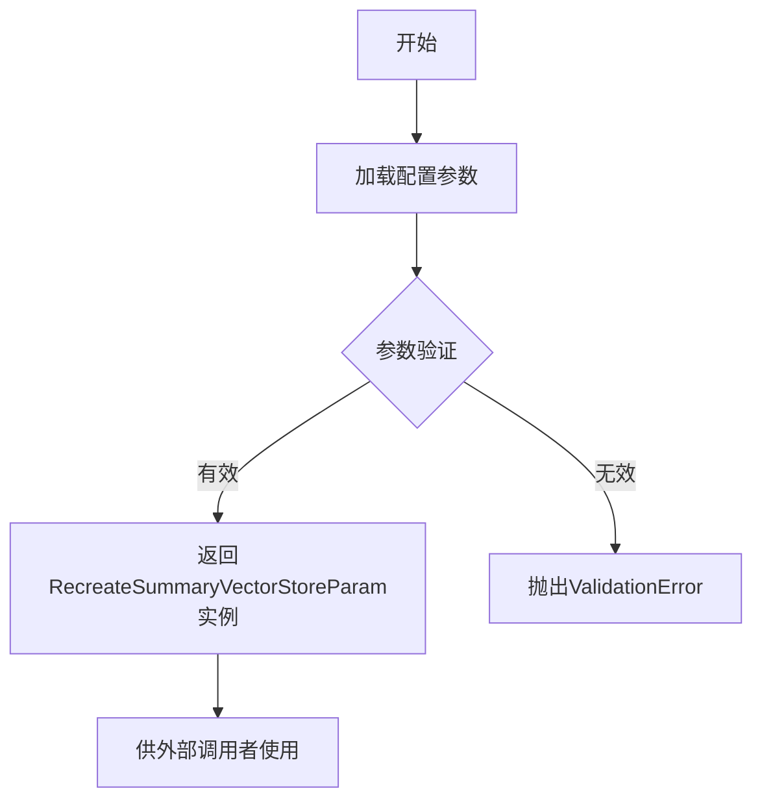

# `Langchain-Chatchat\libs\python-sdk\open_chatcaht\types\knowledge_base\summary\recreate_summary_vector_store_param.py` 详细设计文档

这是一个Pydantic参数模型类，用于配置重建摘要向量存储（RecreateSummaryVectorStore）的相关参数，包括知识库名称、向量存储类型、嵌入模型、LLM模型配置等。

## 整体流程



## 类结构

```
BaseModel (Pydantic基类)
└── RecreateSummaryVectorStoreParam (配置参数模型)
```

## 全局变量及字段


### `VS_TYPE`
    
向量存储类型常量（来自open_chatcaht._constants）

类型：`str`
    


### `EMBEDDING_MODEL`
    
嵌入模型常量（来自open_chatcaht._constants）

类型：`str`
    


### `RecreateSummaryVectorStoreParam.knowledge_base_name`
    
知识库名称

类型：`str`
    


### `RecreateSummaryVectorStoreParam.allow_empty_kb`
    
是否允许空知识库

类型：`bool`
    


### `RecreateSummaryVectorStoreParam.vs_type`
    
向量存储类型

类型：`str`
    


### `RecreateSummaryVectorStoreParam.embed_model`
    
嵌入模型名称

类型：`str`
    


### `RecreateSummaryVectorStoreParam.file_description`
    
文件描述

类型：`str`
    


### `RecreateSummaryVectorStoreParam.model_name`
    
LLM模型名称

类型：`Optional[str]`
    


### `RecreateSummaryVectorStoreParam.temperature`
    
LLM采样温度

类型：`float`
    


### `RecreateSummaryVectorStoreParam.max_tokens`
    
LLM最大生成Token数

类型：`Optional[int]`
    
    

## 全局函数及方法


## 关键组件


### RecreateSummaryVectorStoreParam

用于配置重新创建摘要向量存储的参数模型，继承自 Pydantic BaseModel，用于在创建摘要向量存储时进行参数校验和配置。

### knowledge_base_name 字段

字符串类型，必填字段，用于指定知识库名称，示例值为 "samples"。

### allow_empty_kb 字段

布尔类型，默认值为 True，用于控制是否允许创建空知识库。

### vs_type 字段

字符串类型，从常量 VS_TYPE 获取默认值，用于指定向量存储类型。

### embed_model 字段

字符串类型，从常量 EMBEDDING_MODEL 获取默认值，用于指定嵌入模型。

### file_description 字段

字符串类型，默认值为空字符串，用于提供文件描述信息。

### model_name 字段

字符串类型，可选字段，用于指定 LLM 模型名称。

### temperature 字段

浮点数类型，默认值为 0.01，取值范围为 0.0 到 1.0，用于控制 LLM 采样温度。

### max_tokens 字段

整数类型，可选字段，用于限制 LLM 生成的 Token 数量，默认 None 代表使用模型的最大值。


## 问题及建议


### 已知问题

-   **类型注解不一致**：`model_name` 字段声明类型为 `str`，但默认值为 `None`，导致类型注解与实际值不匹配，应使用 `Optional[str]`。
-   **验证器缺失**：缺少对 `vs_type` 和 `embed_model` 字段的枚举验证，可能接受无效值而无法在早期发现错误。
-   **字段描述不完整**：`file_description` 字段的描述为空字符串 `""`，缺乏实际说明。
-   **缺乏业务逻辑验证**：未对 `knowledge_base_name` 的格式或长度进行校验，可能导致后续处理异常。
-   **默认值设计不合理**：`temperature` 默认值为 `0.01`，这是一个非标准的采样温度值（通常为 0.0-0.2 之间），缺乏说明为何选择此特定值。

### 优化建议

-   将 `model_name` 的类型修改为 `Optional[str]`，并调整 `Field` 的默认值为 `None`。
-   为 `vs_type` 和 `embed_model` 添加 `Literal` 类型或枚举验证，确保值来源于预定义的常量集合。
-   为 `file_description` 添加有意义的描述字段，说明其用途。
-   使用 Pydantic 的 `validator` 装饰器为 `knowledge_base_name` 添加长度和格式验证（如不允许特殊字符）。
-   考虑将 `temperature` 的默认值调整为更通用的值（如 0.7）或添加注释说明为何使用 0.01。
-   考虑将 `RecreateSummaryVectorStoreParam` 重命名为更简洁的名称，如 `VectorStoreRecreateParam`。
-   为 `max_tokens` 参数添加更详细的描述或合理的取值范围建议。

## 其它


### 设计目标与约束

本类用于封装重新创建摘要向量存储时的参数配置，核心目标是提供一种类型安全、可验证的参数传递机制。约束方面，temperature字段限制在0.0到1.0之间，max_tokens为可选字段且受LLM模型最大限制约束，向量存储类型和嵌入模型需与系统常量保持一致。

### 错误处理与异常设计

本类主要依赖Pydantic进行数据验证，常见验证错误包括：knowledge_base_name为空或格式不符、temperature超出范围、max_tokens为负数等。错误信息通过Pydantic的ValidationError返回，调用方需捕获该异常并提供友好的错误提示。当前设计未包含自定义业务异常，建议在实际使用场景中根据vs_type和embed_model的有效性补充额外的业务级校验逻辑。

### 数据流与状态机

该参数类本身为无状态的数据模型，仅负责接收和验证外部输入。典型数据流为：用户通过API或配置层传入参数 → Pydantic自动进行类型转换和验证 → 验证通过后传递给下游向量存储重建逻辑。状态机方面，该类不涉及复杂状态管理，属于一次性使用的请求参数对象。

### 外部依赖与接口契约

主要依赖包括：pydantic库（数据验证与建模）、open_chatcaht._constants模块（VS_TYPE和EMBEDDING_MODEL常量）。接口契约方面，该类实例化时必须提供knowledge_base_name参数，其他字段均有默认值；返回值为经过Pydantic验证的BaseModel子类实例，可直接序列化或传递给下游函数。

### 配置管理建议

建议将vs_type和embed_model的默认值从常量改为可配置项，以增强灵活性。model_name字段当前允许None值，但实际使用时需确保LLM服务可用，建议补充运行时校验。max_tokens的默认值None依赖于具体LLM模型的上下文窗口限制，建议添加文档说明或运行时警告机制。

### 使用示例与最佳实践

典型调用方式为直接实例化并传递关键字参数，如RecreateSummaryVectorStoreParam(knowledge_base_name="test_kb")。建议在业务层封装该类的创建逻辑，统一处理默认值填充和参数校验，避免在多个调用点重复配置相同的默认参数。

    