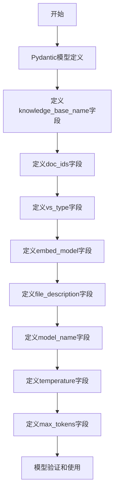

# `Langchain-Chatchat\libs\python-sdk\open_chatcaht\types\knowledge_base\summary\summary_doc_ids_to_vector_store_param.py` 详细设计文档

这是一个Pydantic数据模型类，用于定义知识库文档摘要转换为向量存储时的参数配置，包含知识库名称、文档ID列表、向量存储类型、嵌入模型、文件描述以及LLM模型参数等配置项。

## 整体流程



## 类结构

```
BaseModel (Pydantic基类)
└── SummaryDocIdsToVectorStoreParam (知识库文档转向量存储参数模型)
```

## 全局变量及字段


### `VS_TYPE`
    
Vector store type constant imported from _constants module

类型：`str`
    


### `EMBEDDING_MODEL`
    
Embedding model constant imported from _constants module

类型：`str`
    


### `SummaryDocIdsToVectorStoreParam.knowledge_base_name`
    
知识库名称，用于指定目标知识库

类型：`str`
    


### `SummaryDocIdsToVectorStoreParam.doc_ids`
    
文档ID列表，指定需要向量化到向量库的文档

类型：`List`
    


### `SummaryDocIdsToVectorStoreParam.vs_type`
    
向量库类型，使用VS_TYPE常量作为默认值

类型：`str`
    


### `SummaryDocIdsToVectorStoreParam.embed_model`
    
嵌入模型名称，使用EMBEDDING_MODEL常量作为默认值

类型：`str`
    


### `SummaryDocIdsToVectorStoreParam.file_description`
    
文件描述信息，默认为空字符串

类型：`str`
    


### `SummaryDocIdsToVectorStoreParam.model_name`
    
LLM模型名称，用于指定生成摘要的模型

类型：`Optional[str]`
    


### `SummaryDocIdsToVectorStoreParam.temperature`
    
LLM采样温度，控制生成随机性，范围0.0-1.0，默认0.01

类型：`float`
    


### `SummaryDocIdsToVectorStoreParam.max_tokens`
    
限制LLM生成Token数量，默认None代表模型最大值

类型：`Optional[int]`
    
    

## 全局函数及方法


## 关键组件


### SummaryDocIdsToVectorStoreParam

主数据模型类，用于封装文档摘要转换为向量存储的全部配置参数，基于Pydantic BaseModel实现数据验证和类型约束。

### knowledge_base_name

知识库名称字段，字符串类型，指定目标知识库的唯一标识，用于定位向量存储的目标集合。

### doc_ids

待处理文档ID列表字段，List类型，支持批量文档处理，允许传入一个或多个文档UUID进行向量化。

### vs_type

向量存储类型字段，字符串类型，引用自VS_TYPE常量，定义底层向量数据库的实现方案（如FAISS、Milvus等）。

### embed_model

嵌入模型字段，字符串类型，引用自EMBEDDING_MODEL常量，指定文本向量化的模型选择。

### file_description

文件描述字段，字符串类型，提供文档的额外语义信息，可用于增强向量检索的准确性。

### model_name

LLM模型名称字段，字符串类型，指定用于摘要生成的底层语言模型。

### temperature

LLM采样温度字段，浮点类型，约束范围[0.0, 1.0]，控制生成文本的随机性与确定性平衡。

### max_tokens

最大Token数量字段，整数类型可选值，限制LLM单次生成的最大输出长度。


## 问题及建议


### 已知问题

-   **类型注解错误**：`model_name` 字段定义为 `str` 类型，但默认值是 `None`，这会导致类型检查失败，应该改为 `Optional[str]`
-   **泛型类型不完整**：`doc_ids: List = Field(...)` 缺少泛型参数，应改为 `List[str]` 以确保类型安全
-   **字段冗余定义**：`vs_type` 和 `embed_model` 在 `Field()` 中重复定义了默认值（从常量导入），与直接使用常量默认值功能重复，造成冗余
-   **缺少类文档字符串**：类本身没有 docstring，缺少对整个参数模型用途的说明
-   **枚举类型缺失**：`vs_type` 和 `embed_model` 使用字符串常量而非枚举类型，缺少编译时类型检查和 IDE 自动补全支持

### 优化建议

-   将 `model_name` 的类型修改为 `Optional[str]`，与默认值 `None` 匹配
-   为 `doc_ids` 添加泛型参数：`List[str]`
-   移除 `Field()` 中对 `vs_type` 和 `embed_model` 的重复默认值定义，直接使用 `Field(default=VS_TYPE)` 形式或考虑使用 `Field(default=...)` 替代常量导入方式
-   考虑使用 `Enum` 或 `Literal` 类型替代字符串常量，增强类型安全和自动补全
-   为类添加 docstring，说明该模型用于封装向量存储参数的目的和用途


## 其它


### 设计目标与约束

该类作为将文档摘要ID转换为向量存储的参数模型，主要目标是为向量存储操作提供结构化、类型安全的参数配置。设计约束包括：1）必须基于Pydantic的BaseModel实现，利用其内置的参数验证功能；2）依赖外部常量VS_TYPE和EMBEDDING_MODEL作为默认值，确保与系统配置的一致性；3）所有LLM相关参数需符合OpenAI API的调用要求（如temperature范围0.0-1.0）。

### 错误处理与异常设计

该类的错误处理主要依托Pydantic框架的自动验证机制。当传入参数不符合字段定义时，Pydantic会抛出ValidationError异常。具体包括：knowledge_base_name为空时抛出验证错误；temperature值超出0.0-1.0范围时触发约束验证失败；max_tokens为负数时拒绝通过。开发者使用该类时需捕获ValidationError以处理参数异常。

### 数据流与状态机

该类作为数据模型而非处理类，其数据流较为简单：外部调用者构造SummaryDocIdsToVectorStoreParam实例→Pydantic验证参数合法性→验证通过后传递给向量存储处理模块→处理模块读取各字段值执行向量存储操作。该模型无状态机设计，仅作为参数容器流转于各处理环节之间。

### 外部依赖与接口契约

外部依赖包括：1）pydantic库（BaseModel、Field用于数据验证和字段定义）；2）open_chatcaht._constants模块（VS_TYPE和EMBEDDING_MODEL常量）。接口契约方面，该类实例化时接受所有字段作为可选或必选参数，字段类型需与类型注解一致，返回值为验证后的Pydantic模型实例，可直接被后续函数调用或序列化。

### 安全性考虑

由于该类涉及LLM调用参数和知识库操作，需注意：1）model_name参数需进行白名单验证，防止注入恶意模型名称；2）knowledge_base_name和doc_ids作为数据库查询标识，需防止路径遍历或注入攻击；3）file_description字段内容如来自用户输入，需进行适当的输出编码或长度限制。

### 性能考虑

该类本身为轻量级数据模型，性能开销主要集中在Pydantic的首次验证过程。优化建议：1）对于高频调用的场景，可考虑对验证通过的实例进行缓存；2）doc_ids为List类型未指定泛型，建议明确类型以提高验证效率；3）大量文档ID处理时Lazy Load或分批处理。

### 兼容性说明

需确保pydantic版本与代码兼容（建议v2.x）；VS_TYPE和EMBEDDING_MODEL常量需在open_chatcaht._constants模块中正确定义；max_tokens为Optional[int]类型，传递时需注意与具体LLM API的兼容性。


    