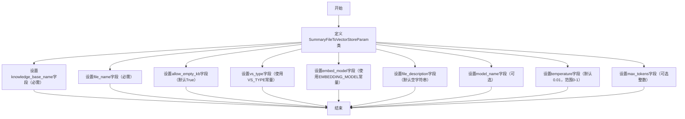

# `Langchain-Chatchat\libs\python-sdk\open_chatcaht\types\knowledge_base\summary\summary_file_to_vector_store_param.py` 详细设计文档

这是一个Pydantic数据模型类，用于定义将文件摘要添加到向量存储时的参数配置，包含知识库名称、文件名、向量存储类型、嵌入模型、文件描述以及LLM模型参数（如模型名称、温度、最大token数等）。

## 整体流程



## 类结构

```
BaseModel (pydantic基类)
└── SummaryFileToVectorStoreParam (数据模型类)
```

## 全局变量及字段


### `VS_TYPE`
    
向量存储类型常量，从open_chatcaht._constants导入

类型：`str`
    


### `EMBEDDING_MODEL`
    
嵌入模型名称常量，从open_chatcaht._constants导入

类型：`str`
    


### `SummaryFileToVectorStoreParam.knowledge_base_name`
    
知识库名称，用于指定目标知识库

类型：`str`
    


### `SummaryFileToVectorStoreParam.file_name`
    
要处理的文件名称，包括文件扩展名

类型：`str`
    


### `SummaryFileToVectorStoreParam.allow_empty_kb`
    
是否允许操作空知识库，默认为True

类型：`bool`
    


### `SummaryFileToVectorStoreParam.vs_type`
    
向量存储类型，使用默认值VS_TYPE

类型：`str`
    


### `SummaryFileToVectorStoreParam.embed_model`
    
嵌入模型名称，使用默认值EMBEDDING_MODEL

类型：`str`
    


### `SummaryFileToVectorStoreParam.file_description`
    
文件的描述信息，用于补充文件相关元数据

类型：`str`
    


### `SummaryFileToVectorStoreParam.model_name`
    
LLM模型名称，用于生成文件摘要

类型：`Optional[str]`
    


### `SummaryFileToVectorStoreParam.temperature`
    
LLM采样温度，控制生成随机性，范围0.0-1.0

类型：`float`
    


### `SummaryFileToVectorStoreParam.max_tokens`
    
限制LLM生成的Token数量，None表示使用模型默认值

类型：`Optional[int]`
    
    

## 全局函数及方法


## 关键组件


### 一段话描述

该代码定义了一个 Pydantic 数据模型 `SummaryFileToVectorStoreParam`，用于封装将文件摘要添加到向量存储所需的所有配置参数，包括知识库信息、文件元数据、向量存储类型、嵌入模型配置以及 LLM 生成参数。

### 文件的整体运行流程

该模块作为参数配置类被导入使用，不涉及实际运行流程。它通过 Pydantic 的数据验证机制确保传入的参数符合预定义的类型和约束条件，主要用于 API 请求参数校验和配置传递。

### 类的详细信息

#### SummaryFileToVectorStoreParam

- **类类型**: Pydantic BaseModel
- **类描述**: 用于配置文件摘要向量存储参数的模型类

##### 类字段

| 字段名 | 类型 | 描述 |
|--------|------|------|
| knowledge_base_name | str | 知识库名称，用于指定目标知识库 |
| file_name | str | 文件名称，指定要处理的文件 |
| allow_empty_kb | bool | 是否允许空知识库，默认为 True |
| vs_type | str | 向量存储类型，从常量 VS_TYPE 读取 |
| embed_model | str | 嵌入模型名称，从常量 EMBEDDING_MODEL 读取 |
| file_description | str | 文件描述信息，默认为空字符串 |
| model_name | Optional[str] | LLM 模型名称，可选参数 |
| temperature | float | LLM 采样温度，范围 0.0-1.0，默认 0.01 |
| max_tokens | Optional[int] | LLM 生成的最大 token 数量，可选 |

##### 类方法

该类继承自 BaseModel，自动获得以下方法：
- `model_dump()`: 将模型转换为字典
- `model_dump_json()`: 将模型转换为 JSON 字符串
- `model_validate()`: 从字典或 JSON 验证并创建模型实例
- `model_validate_json()`: 从 JSON 字符串验证并创建模型实例

### 关键组件信息

### SummaryFileToVectorStoreParam

核心配置模型类，封装文件摘要向量存储所需的全部参数

### knowledge_base_name

知识库名称字段，指定目标知识库的标识

### file_name

文件名字段，指定待处理的文件

### vs_type

向量存储类型字段，从常量 VS_TYPE 获取默认值

### embed_model

嵌入模型字段，从常量 EMBEDDING_MODEL 获取默认值

### model_name

LLM 模型名称字段，用于指定生成摘要的模型

### temperature

LLM 采样温度参数，控制生成随机性

### max_tokens

最大 token 限制参数，控制生成内容长度

### 潜在的技术债务或优化空间

1. **硬编码默认值**: `vs_type` 和 `embed_model` 直接从常量导入，如果常量未正确初始化可能导致问题
2. **缺乏嵌套配置**: LLM 相关配置（model_name、temperature、max_tokens）可以封装为独立的配置类，提高复用性
3. **文档完善**: 字段的 examples 示例值可以更加丰富和多样化
4. **验证逻辑**: 可以添加自定义验证器（如 knowledge_base_name 的命名规范检查）

### 其它项目

#### 设计目标与约束

- 使用 Pydantic v2 版本（通过 `BaseModel` 继承方式判断）
- 参数必须符合类型约束和数值范围（如 temperature 必须在 0.0-1.0 之间）
- 知识库名称和文件名称为必填字段

#### 错误处理与异常

- Pydantic 自动进行字段验证，类型不匹配或值超出约束时抛出 `ValidationError`
- 可通过自定义验证器添加业务逻辑验证

#### 数据流与状态机

- 该类作为数据传输对象（DTO），用于 API 请求/响应的参数序列化和反序列化
- 不涉及状态管理或复杂的数据流处理

#### 外部依赖与接口契约

- 依赖 `pydantic` 库（v1 或 v2）
- 依赖本地常量模块 `open_chatcaht._constants`
- 常量 `VS_TYPE` 和 `EMBEDDING_MODEL` 必须在 `_constants` 模块中正确定义


## 问题及建议


### 已知问题

-   **类型不一致**：`model_name`字段类型定义为`str`，但默认值是`None`，应该是`Optional[str]`以保持类型一致性
-   **验证缺失**：`max_tokens`字段仅标记为`Optional[int]`，但没有添加`ge`（大于等于）约束来防止负数或零值
-   **格式验证不足**：`knowledge_base_name`和`file_name`缺少长度限制和格式验证（如特殊字符检查）
-   **常量值无校验**：`vs_type`和`embed_model`直接使用常量赋值，但运行时没有验证这些常量值是否为有效选项
-   **文档缺失**：类本身没有docstring文档，开发者难以快速理解该类的用途和使用场景
-   **魔法数字**：`temperature`的默认值`0.01`缺乏说明，应该通过常量或配置说明该值的业务含义
-   **字段命名一致性**：字段使用snake_case命名，但部分字段（如`knowledge_base_name`）可能在跨语言API调用时需要转换为camelCase

### 优化建议

-   将`model_name`的类型修改为`Optional[str]`，与默认值`None`保持一致
-   为`max_tokens`添加`ge=1`约束，确保至少能生成一个token
-   为`knowledge_base_name`和`file_name`添加`min_length`和`max_length`约束，考虑使用` constr()`添加正则验证
-   考虑添加`validator`装饰器来校验`vs_type`和`embed_model`是否为有效选项
-   为类添加docstring，描述其用途为"将文件摘要添加到向量存储的参数模型"
-   将`temperature`的默认值`0.01`提取为具名常量，如`DEFAULT_TEMPERATURE = 0.01`
-   考虑添加`model_config`配置类，设置`str_strip_whitespace=True`等优化选项
-   如有前端集成需求，可添加`Field`别名(alias)以支持camelCase命名


## 其它


### 设计目标与约束

本类旨在为文件摘要向量存储操作提供统一的参数配置接口，确保参数的类型安全、默认值合理、校验规则明确。设计约束包括：knowledge_base_name 和 file_name 为必填字段，其他参数均有默认值；vs_type 和 embed_model 从全局常量读取，确保与系统配置一致；temperature 限制在 [0.0, 1.0] 范围内，max_tokens 支持可选以使用模型默认最大值。

### 错误处理与异常设计

Pydantic 会在数据验证阶段自动抛出 ValidationError，常见错误场景包括：knowledge_base_name 或 file_name 为空或类型不匹配时触发必填字段校验失败；temperature 超出 [0.0, 1.0] 范围时触发数值范围校验失败；max_tokens 传入负数时触发校验失败。建议调用方使用 try-except 捕获 pydantic.ValidationError 并提供友好的错误提示信息。

### 数据流与状态机

该类为参数模型，不涉及状态机设计。数据流如下：调用方构造 SummaryFileToVectorStoreParam 实例时传入参数 → Pydantic 进行类型校验和默认值填充 → 生成最终的参数字典传递给后续业务逻辑 → 业务逻辑使用 vs_type 和 embed_model 初始化向量存储，使用 model_name、temperature、max_tokens 配置 LLM 生成摘要。

### 外部依赖与接口契约

主要依赖包括：pydantic 库用于数据建模和验证；open_chatcaht._constants 模块提供 VS_TYPE 和 EMBEDDING_MODEL 全局常量。接口契约方面，该类实例化时接受关键字参数，返回的模型实例可直接传递给需要 BaseModel 类型参数的函数，模型实例的 dict() 方法可序列化为字典用于 API 请求或日志记录。

### 配置文件与常量定义

knowledge_base_name 默认无默认值（必填），file_name 默认无默认值（必填），allow_empty_kb 默认为 True，vs_type 默认为全局常量 VS_TYPE，embed_model 默认为全局常量 EMBEDDING_MODEL，file_description 默认为空字符串，model_name 默认为 None，temperature 默认为 0.01，max_tokens 默认为 None。

### 使用示例与最佳实践

```python
# 完整参数示例
param = SummaryFileToVectorStoreParam(
    knowledge_base_name="my_kb",
    file_name="document.pdf",
    allow_empty_kb=False,
    file_description="技术文档",
    model_name="gpt-3.5-turbo",
    temperature=0.5,
    max_tokens=1000
)

# 使用默认值示例
param = SummaryFileToVectorStoreParam(
    knowledge_base_name="my_kb",
    file_name="document.pdf"
)
```


    