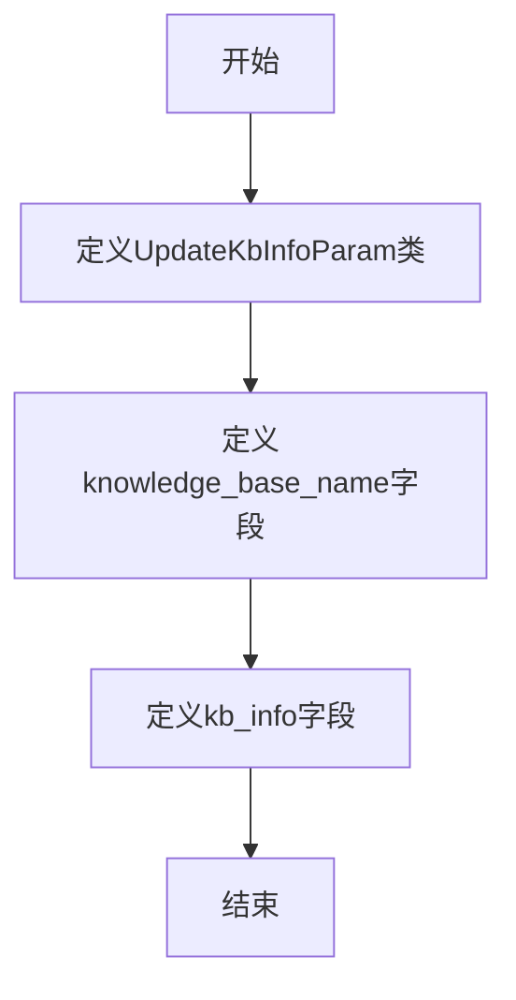

# `Langchain-Chatchat\libs\python-sdk\open_chatcaht\types\knowledge_base\update_kb_info_param.py` 详细设计文档

该代码定义了一个Pydantic数据模型类UpdateKbInfoParam，用于接收和验证更新知识库信息的请求参数，包含知识库名称和知识库介绍两个必填字段。

## 整体流程



## 类结构

```
BaseModel (Pydantic基类)
└── UpdateKbInfoParam (知识库信息更新参数模型)
```

## 全局变量及字段


### `UpdateKbInfoParam.knowledge_base_name`
    
知识库名称

类型：`str`
    


### `UpdateKbInfoParam.kb_info`
    
知识库介绍

类型：`str`
    
    

## 全局函数及方法


## 关键组件


### UpdateKbInfoParam 类

这是一个 Pydantic 数据模型类，用于定义知识库信息更新接口的参数结构，包含知识库名称和知识库介绍两个必填字段。

### knowledge_base_name 字段

知识库名称字段，类型为字符串（str），为必填项，用于指定需要更新的目标知识库名称。

### kb_info 字段

知识库介绍字段，类型为字符串（str），为必填项，用于设置知识库的描述或介绍信息。


## 问题及建议


### 已知问题

-   **字段验证不足**：`knowledge_base_name` 和 `kb_info` 均为必填字段，但缺少长度限制，可能接受空字符串或超长输入
-   **缺乏格式校验**：知识库名称未限制字符类型，可能包含非法字符（如特殊符号、空格等）
-   **类型约束单一**：`knowledge_base_name` 和 `kb_info` 仅支持 `str` 类型，未考虑枚举或 Union 类型以增强语义
-   **文档示例单薄**：仅各提供一个示例值，未覆盖边界情况或典型场景
-   **缺少审计字段**：无创建时间、更新时间、版本号等元数据，不利于追踪和管理
-   **可扩展性受限**：未预留额外自定义字段，扩展成本较高

### 优化建议

-   **添加长度约束**：使用 `Field` 的 `min_length` 和 `max_length` 参数限制字段长度，例如 `min_length=1, max_length=255`
-   **增加格式校验**：对 `knowledge_base_name` 使用 `regex` 参数限制格式，如 `regex=r"^[a-zA-Z0-9_\u4e00-\u9fa5]+$"` 只允许中文、英文、数字和下划线
-   **完善文档示例**：为每个字段增加多个示例值，覆盖正常值和边界值场景
-   **考虑审计需求**：如需版本控制，可继承 `BaseModel` 并添加 `version` 字段用于乐观锁
-   **预留扩展字段**：评估业务需求，可添加 `extra` 字段或使用 Pydantic 的 `Extra` 配置允许动态扩展


## 其它


### 设计目标与约束

**设计目标**：定义一个简洁的参数模型，用于封装更新知识库信息时所需的输入数据，确保API接口的参数传递符合类型安全和数据验证要求。

**约束条件**：
- 依赖 Pydantic v2+ 版本
- 知识库名称为必填字段
- 知识库介绍为必填字段
- 使用 Field 定义字段的描述和示例值

### 错误处理与异常设计

**验证失败场景**：
- 知识库名称为空或类型不匹配时：Pydantic 会抛出 ValidationError
- 知识库介绍为空或类型不匹配时：Pydantic 会抛出 ValidationError

**异常处理方式**：
- 由调用方捕获 pydantic.ValidationError 异常
- 提供清晰的错误信息，包含字段名称和验证失败原因

### 外部依赖与接口契约

**外部依赖**：
- pydantic.BaseModel：Pydantic 数据验证基类
- pydantic.Field：用于定义字段元数据

**接口契约**：
- 该类作为 API 请求体的数据模型
- 输入：knowledge_base_name (str) 和 kb_info (str)
- 输出：符合 schema 的字典或 JSON 数据
- 使用示例值提供 API 文档生成支持

### 安全考虑

- 当前实现无敏感数据处理
- 建议在后续添加字段长度限制防止 DoS 攻击
- 知识库名称需考虑注入风险，建议添加正则校验

### 性能考虑

- Pydantic v2 使用 Rust 实现，验证性能优秀
- 当前模型字段数量少，序列化/反序列化开销低

### 可扩展性

**当前局限**：
- 仅支持两个必填字段
- 无默认值支持
- 无可选字段

**扩展建议**：
- 添加可选字段如 kb_id、category、tags 等
- 支持默认值以提高 API 灵活性
- 可继承该类创建更具体的参数模型

### 版本兼容性

- 当前代码使用 Pydantic v2 语法（Field 直接作为函数调用）
- 不兼容 Pydantic v1（v1 中 Field 参数使用方式不同）
- 如需兼容 v1，需调整 Field 的使用方式

### 测试考虑

**单元测试建议**：
- 测试有效数据验证通过
- 测试必填字段缺失时的 ValidationError
- 测试类型错误时的 ValidationError
- 测试示例值正确性
- 测试模型序列化/反序列化

### 配置管理

- 当前无配置项
- 可通过环境变量或配置文件扩展验证规则（如最大长度、最小长度等）

### 日志记录

- 当前无日志记录需求
- 建议在调用方记录参数接收和验证结果


    