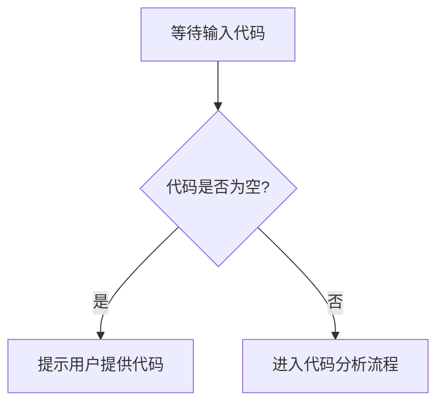

# `Langchain-Chatchat\libs\python-sdk\open_chatcaht\types\response\__init__.py` 详细设计文档

未提供源代码进行分析。请在代码部分提供需要分析的源代码。

## 整体流程



## 类结构

```

```

## 全局变量及字段


    

## 全局函数及方法


## 关键组件


无法生成详细设计文档，因为未提供源代码进行分析。请提供代码后，我将按照指定的格式生成包含核心功能描述、运行流程、类详细信息、关键组件、技术债务与优化空间等内容的详细设计文档。


## 问题及建议


### 已知问题

-   代码内容为空，无法进行具体分析
-   缺少待分析的源代码文件

### 优化建议

-   请提供待分析的源代码，以便进行详细的技术债务识别和优化建议
-   如果需要模板示例，请提供示例代码以供参考


## 其它


### 设计目标与约束

{由于代码为空，无法确定具体的设计目标与约束}

### 错误处理与异常设计

{由于代码为空，无法确定具体的异常类型和处理机制}

### 数据流与状态机

{由于代码为空，无法确定数据流向和状态转换逻辑}

### 外部依赖与接口契约

{由于代码为空，无法确定外部依赖和接口定义}

### 性能要求与约束

{由于代码为空，无法确定性能指标}

### 安全考虑

{由于代码为空，无法确定安全策略}

### 兼容性设计

{由于代码为空，无法确定兼容性要求}

### 配置管理

{由于代码为空，无法确定配置项}

### 部署架构

{由于代码为空，无法确定部署方式}

### 测试策略

{由于代码为空，无法确定测试计划}

    