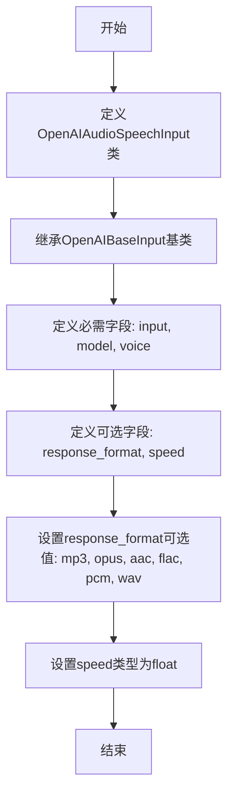

# `Langchain-Chatchat\libs\python-sdk\open_chatcaht\types\standard_openai\audio_speech_input.py` 详细设计文档

定义了一个用于音频语音生成的输入模型类，继承自OpenAIBaseInput，封装了文本转语音所需的输入参数，包括待转换文本、语音模型、语音音色、输出格式和播放速度等配置项。

## 整体流程



## 类结构

```
OpenAIBaseInput (基类)
└── OpenAIAudioSpeechInput (音频语音输入模型)
```

## 全局变量及字段


### `OpenAIAudioSpeechInput.input`
    
要转换为语音的输入文本

类型：`str`
    


### `OpenAIAudioSpeechInput.model`
    
使用的语音合成模型

类型：`str`
    


### `OpenAIAudioSpeechInput.voice`
    
生成的语音音色/声音

类型：`str`
    


### `OpenAIAudioSpeechInput.response_format`
    
输出音频格式，支持mp3/opus/aac/flac/pcm/wav

类型：`Optional[Literal["mp3", "opus", "aac", "flac", "pcm", "wav"]]`
    


### `OpenAIAudioSpeechInput.speed`
    
语音播放速度

类型：`Optional[float]`
    
    

## 全局函数及方法


## 关键组件


### 核心功能概述

该代码定义了一个用于 OpenAI 音频语音合成（Text-to-Speech）请求的输入数据模型类，封装了输入文本、模型选择、声音类型、响应格式和播放速度等参数。

### 文件运行流程

该模块作为数据模型定义文件，不涉及实际执行流程。主要被其他模块导入并实例化，用于验证和传递音频合成请求参数到 OpenAI API。

### 类详细信息

#### 类名：OpenAIAudioSpeechInput

**类字段：**

| 字段名 | 类型 | 描述 |
|--------|------|------|
| input | str | 要转换为语音的输入文本内容 |
| model | str | 指定的音频合成模型标识符 |
| voice | str | 用于合成的声音类型 |
| response_format | Optional[Literal["mp3", "opus", "aac", "flac", "pcm", "wav"]] | 音频输出格式，默认为None |
| speed | Optional[float] | 音频播放速度，默认为None |

**继承关系：**
- 父类：OpenAIBaseInput

### 关键组件信息

### 张量索引与惰性加载

本代码为数据模型类，不涉及张量索引或惰性加载机制。

### 反量化支持

本代码不涉及反量化操作。

### 量化策略

本代码不涉及量化策略。

### 潜在的技术债务或优化空间

1. **参数验证缺失**：未对 input 字段的长度、model 和 voice 的有效值进行校验
2. **默认值处理**：response_format 和 speed 为 Optional 类型，但未定义合理的默认值
3. **文档完善**：缺少类级别和方法级别的文档注释
4. **扩展性限制**：voice 字段使用字符串类型而非字面量联合类型，无法限制有效值范围

### 其它项目

**设计目标：**
- 提供类型安全的音频合成请求参数结构
- 与 OpenAI API 规范保持一致

**约束：**
- 必须继承自 OpenAIBaseInput 基类
- 遵循 OpenAI 官方定义的参数规范

**错误处理：**
- 依赖 Pydantic 或类似框架的自动验证机制
- 运行时类型检查由父类处理

**数据流：**
- 作为请求输入数据模型，被服务层实例化后传递给 API 客户端

**外部依赖：**
- open_chatcaht.types.standard_openai.base.OpenAIBaseInput：基类定义
- typing：标准类型注解库


## 问题及建议


### 已知问题

-   **导入路径拼写错误**：模块名 `open_chatcaht` 疑似拼写错误（可能应为 `open_chatgpt`），会导致模块导入失败或维护困难
-   **缺少必需字段显式标记**：`input`、`model`、`voice` 作为必需字段没有使用 `Field(...)` 或其他方式显式标记，缺乏运行时验证
-   **字段缺少文档注释**：所有字段均无注释说明用途和约束，影响代码可读性和可维护性
-   **speed 参数无范围验证**：浮点类型无上下限约束，实际 API 要求范围为 0.25-4.0
-   **缺少类级别文档字符串**：类本身无 docstring，无法说明其用途和业务场景
-   **未定义 __all__ 导出**：模块公共接口不明确

### 优化建议

-   修正导入路径拼写，或确认是否为内部特殊命名规范
-   使用 Pydantic 的 `Field` 添加必填标记和验证逻辑，如 `Field(default=..., min_length=1)`
-   为 `speed` 字段添加范围验证：`Field(default=1.0, ge=0.25, le=4.0)`
-   为 `response_format` 添加默认值说明文档
-   添加类级别和字段级别的文档字符串（docstring）
-   考虑继承 Pydantic BaseModel 以获得更强大的验证能力


## 其它


### 设计目标与约束

本类旨在为OpenAI的文本转语音（Text-to-Speech）API提供结构化的输入参数封装，支持多种音频格式和语音类型的选择。设计约束包括：model字段仅支持OpenAI提供的TTS模型（如tts-1、tts-1-hd等），voice字段仅支持OpenAI定义的语音类型（如alloy、echo、fable、onyx、nova、shimmer等），response_format支持mp3、opus、aac、flac、pcm、wav六种格式，speed参数范围通常在0.25至4.0之间。

### 错误处理与异常设计

本类的参数验证主要依赖Pydantic或类似的基类OpenAIBaseInput进行自动校验。当传入无效的response_format值时，会抛出验证错误；当speed值超出合理范围时，基类应进行约束校验；model和voice字段的值正确性需要在调用API时由OpenAI服务端进行验证，本地仅做类型检查。

### 数据流与状态机

该类作为数据模型类，不涉及复杂的状态机逻辑。其数据流为：用户构造OpenAIAudioSpeechInput实例 → 基类进行参数验证 → 将参数序列化为JSON或字典形式 → 传递给HTTP客户端用于调用OpenAI TTS API → 接收音频二进制响应 → 返回给调用方。整个过程是单向的，无状态转换。

### 外部依赖与接口契约

主要外部依赖为open_chatcaht.types.standard_openai.base模块中的OpenAIBaseInput基类。接口契约方面，本类实例化时必须提供input（字符串，必填）、model（字符串，必填）、voice（字符串，必填）三个核心参数，response_format和speed为可选参数，具有默认值。当与OpenAI API交互时，所有字段将作为请求体的一部分发送。

### 配置与参数验证

input字段无长度限制，但受OpenAI API的token限制约束；model字段需要是有效的TTS模型标识符；voice字段需要是OpenAI支持的语音名称字符串；response_format默认由API服务端决定，通常为mp3；speed参数默认为1.0（正常速度），建议范围为0.25至4.0。参数验证主要在基类OpenAIBaseInput中通过Pydantic的字段类型定义和Optional装饰器实现。

### 使用示例

```python
# 基础用法
speech_input = OpenAIAudioSpeechInput(
    input="你好，这是一个测试语音",
    model="tts-1",
    voice="alloy"
)

# 完整参数用法
speech_input = OpenAIAudioSpeechInput(
    input="你好，这是一个测试语音",
    model="tts-1-hd",
    voice="nova",
    response_format="mp3",
    speed=1.0
)
```

### 潜在优化空间

当前类设计较为简洁，可考虑增加自定义验证器对voice和model字段进行更严格的枚举值校验，可预先定义支持的模型和语音列表以提供更好的开发时错误提示。此外，可考虑添加元数据字段如request_id用于追踪，以及音频生成的附加选项如 Instructions 参数（在较新的OpenAI API中支持）。


    