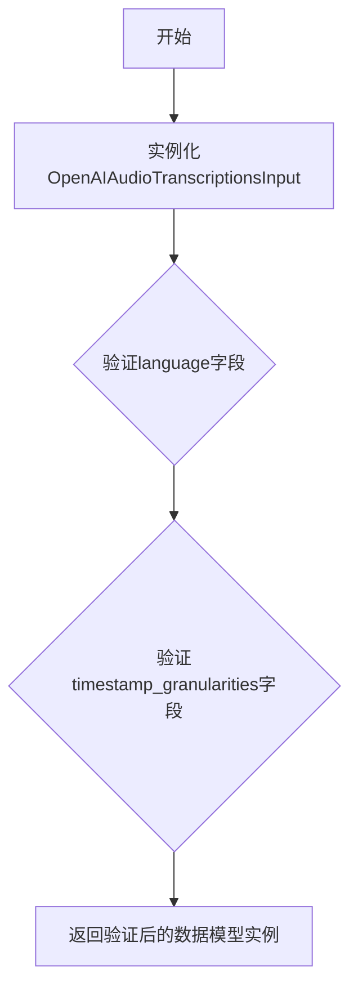

# `Langchain-Chatchat\libs\python-sdk\open_chatcaht\types\standard_openai\audio_transcriptions_input.py` 详细设计文档

这是一个用于OpenAI音频转录功能的输入数据模型类，继承自OpenAIAudioTranslationsInput，添加了语言选择和时间戳粒度两个可选配置字段，用于定制化音频转录服务。

## 整体流程



## 类结构

```
OpenAIAudioTranslationsInput (父类)
└── OpenAIAudioTranscriptionsInput (当前类)
```

## 全局变量及字段


### `OpenAIAudioTranscriptionsInput.language`
    
可选的转录语言参数

类型：`Optional[str]`
    


### `OpenAIAudioTranscriptionsInput.timestamp_granularities`
    
可选的时间戳粒度参数

类型：`Optional[List[Literal['word', 'segment']]]`
    


### `OpenAIAudioTranslationsInput.从父类继承的字段`
    
从父类继承的字段

类型：`继承`
    
    

## 全局函数及方法


## 关键组件


### 类继承结构

该类继承自 `OpenAIAudioTranslationsInput`，表明其是音频转录输入类型的扩展，在音频翻译输入的基础上增加了转录特有的参数。

### language 字段

可选的字符串类型字段，用于指定音频转录所使用的语言，支持多语言音频的转录功能。

### timestamp_granularities 字段

可选的列表类型字段，用于指定输出时间戳的粒度，可选值为 "word"（词级）或 "segment"（片段级），实现精细的时间戳控制。

### 类型注解支持

使用 Python typing 模块的 Optional、List、Literal 提供强类型约束，确保输入参数的类型安全和IDE自动补全支持。

### 量化策略与扩展性设计

该类通过继承机制实现功能的扩展和量化策略的可插拔性，便于后续添加更多转录相关参数而无需修改基类。


## 问题及建议


### 已知问题

-   **继承关系可能存在错误**：类名 `OpenAIAudioTranscriptionsInput`（转录）与父类 `OpenAIAudioTranslationsInput`（翻译）在 OpenAI API 中是两个完全不同的端点，继承关系可能不符合实际业务逻辑
-   **文档缺失**：类本身没有任何文档字符串（docstring），无法快速了解该类的用途、使用场景和设计意图
-   **字段验证缺失**：`language` 和 `timestamp_granularities` 字段缺乏运行时验证，调用方可能传入非法值而在运行时才发现问题
-   **类型注解冗余**：从父类继承的字段类型注解在当前类中不可见，需要查阅父类才能了解完整的数据结构

### 优化建议

-   **重新评估继承结构**：建议检查 `OpenAIAudioTranslationsInput` 的具体内容，如果两个类只是恰好字段相似而非真正的"is-a"关系，应考虑使用组合或提取公共基类
-   **添加类级别文档**：补充 docstring 说明该类用于音频转录（而非翻译），以及各字段的用途和 OpenAI API 对应关系
-   **增加字段验证**：可考虑添加 Pydantic 验证器或自定义 `__init__` 方法，对 `language` 的有效语言代码和 `timestamp_granularities` 的取值范围进行校验
-   **考虑使用 Pydantic 模型**：如果尚未使用，建议继承自 Pydantic 的 BaseModel，可以自动获得字段验证、序列化等能力
-   **显式声明继承字段**：即使字段从父类继承，也可在当前类中显式声明并添加文档注释，提高代码可读性和可维护性


## 其它


### 设计目标与约束

该类用于封装OpenAI音频转录（Audio Transcriptions）API的输入参数，继承自OpenAIAudioTranslationsInput类，添加了language和timestamp_granularities两个可选字段。设计目标是提供一个类型安全、可扩展的输入参数类，支持音频转录的额外配置选项。约束条件包括：language仅支持单语言字符串，timestamp_granularities只能是"word"或"segment"的列表。

### 错误处理与异常设计

由于该类仅定义数据模型（dataclass），不包含业务逻辑，因此错误处理主要依赖于Pydantic或数据验证框架的自动验证。timestamp_granularities字段使用Literal类型约束，确保只能传入预定义的值。类型不匹配或值超出范围时，将由验证框架抛出ValidationError。建议在调用API前对Optional字段进行显式检查，确保业务逻辑的健壮性。

### 数据流与状态机

该类作为数据传递对象（DTO），主要作用是序列化和反序列化输入参数。数据流方向为：用户业务层 → OpenAIAudioTranscriptionsInput实例 → API调用层 → OpenAI API。状态机不适用，因为该类不涉及状态管理，仅作为静态配置载体。

### 外部依赖与接口契约

主要外部依赖包括：
- open_chatcaht.types.standard_openai.audio_translations_input：父类OpenAIAudioTranslationsInput，定义了基础音频输入字段
- typing模块：用于类型注解（Optional、List、Literal）

接口契约方面，该类遵循Liskov替换原则，可完全替代父类使用。调用方需要保证传入的timestamp_granularities列表元素为有效字面量，否则将触发类型检查错误。

### 安全性考虑

该类本身不涉及敏感数据处理，但需要注意：
1. language字段可能包含区域信息，需按隐私保护要求处理
2. Optional类型字段可能为None，需在后续处理中做空值检查
3. 建议对用户输入的language参数进行白名单验证，防止注入攻击

### 性能要求

作为纯数据类，该类的性能开销主要来自实例化和字段验证。timestamp_granularities使用Literal类型可在运行时提供类型检查性能优化。建议实例化时复用对象，避免频繁创建相同配置的对象。

### 兼容性考虑

该类继承自OpenAIAudioTranslationsInput，需确保与父类的字段兼容。后续版本扩展时应保持向后兼容，避免破坏现有调用方。Literal类型的timestamp_granularities字段如需扩展新值（如"sentence"），应作为非破坏性变更处理。

    