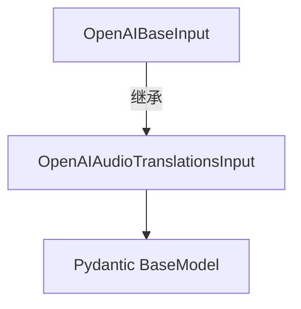

# `Langchain-Chatchat\libs\python-sdk\open_chatcaht\types\standard_openai\audio_translations_input.py` 详细设计文档

这是一个用于OpenAI音频翻译API的Pydantic输入模型类，定义了音频翻译所需的参数结构，包括音频文件、模型选择、可选提示词、响应格式和温度参数。

## 整体流程

```mermaid
graph TD
    A[导入模块] --> B[定义OpenAIAudioTranslationsInput类]
    B --> C[继承OpenAIBaseInput基类]
    C --> D[定义file字段: Union[Any, AnyUrl]]
    D --> E[定义model字段: str]
    E --> F[定义prompt字段: Optional[str]]
    F --> G[定义response_format字段: Optional[str]]
    G --> H[定义temperature字段: float = TEMPERATURE]
```

## 类结构

```
OpenAIBaseInput (抽象基类)
└── OpenAIAudioTranslationsInput (音频翻译输入模型)
```

## 全局变量及字段


### `TEMPERATURE`
    
全局温度参数常量，用于控制生成文本的随机性，默认值通常为0.7

类型：`float`
    


### `OpenAIAudioTranslationsInput.file`
    
要翻译的音频文件，支持任意类型或URL格式

类型：`Union[Any, AnyUrl]`
    


### `OpenAIAudioTranslationsInput.model`
    
使用的模型标识符，指定用于音频翻译的模型

类型：`str`
    


### `OpenAIAudioTranslationsInput.prompt`
    
可选的提示词，用于引导翻译结果的方向

类型：`Optional[str]`
    


### `OpenAIAudioTranslationsInput.response_format`
    
可选的响应格式，指定返回数据的格式类型

类型：`Optional[str]`
    


### `OpenAIAudioTranslationsInput.temperature`
    
生成文本的温度参数，控制输出的随机性，默认值为TEMPERATURE常量

类型：`float`
    
    

## 全局函数及方法


## 关键组件


### 核心功能概述

该代码定义了一个用于OpenAI音频翻译功能的Pydantic输入模型类，封装了音频文件、模型选择、提示词、响应格式和温度参数等输入字段，继承自OpenAIBaseInput基类以保持与标准OpenAI输入类型的一致性。

### 类详细信息

#### OpenAIAudioTranslationsInput

**类字段：**

| 字段名称 | 类型 | 描述 |
|---------|------|------|
| file | Union[Any, AnyUrl] | 要翻译的音频文件，支持任意类型或URL |
| model | str | 指定的翻译模型标识符 |
| prompt | Optional[str] | 可选的提示文本，用于引导翻译方向 |
| response_format | Optional[str] | 可选的响应格式参数 |
| temperature | float | 控制输出随机性的温度参数，默认值为TEMPERATURE常量 |

**类方法：**

该类未定义额外方法，依赖Pydantic基类的自动验证机制。

**继承关系：**



### 关键组件信息

### 字段类型联合

使用`Union[Any, AnyUrl]`支持本地文件对象和远程URL两种音频文件输入方式

### Pydantic模型继承

继承`OpenAIBaseInput`以复用通用的输入验证逻辑和保持API一致性

### 默认值管理

通过`TEMPERATURE`常量统一管理默认温度值，便于配置管理

### 潜在技术债务或优化空间

1. **类型定义宽松**：file字段使用`Union[Any, AnyUrl]`过于宽泛，Any类型降低了类型安全性和IDE提示能力
2. **缺少验证器**：缺少对file字段的有效URL格式验证和对temperature范围的约束（如0-2）
3. **文档缺失**：缺少类级别和字段级别的docstring文档
4. **硬编码默认值**：response_format没有默认值但类型为Optional，可能导致不一致行为
5. **常量依赖**：TEMPERATURE常量来源不明确，建议添加类型注解

### 其它项目

**设计目标与约束：**
- 遵循Pydantic v2设计规范
- 与OpenAI API音频翻译端点参数保持一致

**错误处理与异常：**
- 由Pydantic自动处理类型验证失败和必填字段缺失

**数据流与状态机：**
- 作为输入模型被API客户端层使用，验证通过后传递给底层HTTP客户端

**外部依赖与接口契约：**
- 依赖：pydantic、open_chatcaht._constants、open_chatcaht.types.standard_openai.base
- 被open_chatcaht包内部模块消费


## 问题及建议


### 已知问题

-   **类型定义不当**: `file: Union[Any, AnyUrl]` 中使用 `Any` 是冗余且不合理的。`Any` 包含所有类型，使得该联合类型等同于 `Any`，失去了类型检查的意义。
-   **类型注解可简化**: `prompt` 和 `response_format` 使用 `Optional[str]`，在 Python 3.10+ 环境中可简化为 `str | None`，使代码更简洁。
-   **缺乏字段验证**: `response_format` 字段缺少对有效值（如 "json", "text", "srt" 等）的约束，可能导致运行时错误。
-   **缺少文档注释**: 类和字段均无 docstring 或注释，难以理解各字段的业务含义和使用约束。
-   **temperature 默认值来源不透明**: 依赖 `TEMPERATURE` 常量但未在该类中注明其含义和有效范围。

### 优化建议

-   将 `file` 字段类型改为 `AnyUrl` 或根据实际需求使用更具体的类型（如 `str`、`bytes` 或自定义类型），移除冗余的 `Any`。
-   考虑升级类型注解语法以使用 Python 3.10+ 的内置联合类型 `str | None`。
-   为 `response_format` 添加枚举约束或 validator，限制为 API 支持的合法值。
-   为类和关键字段添加 docstring，说明业务用途、取值范围和默认值含义。
-   在类中或 `TEMPERATURE` 常量处补充文档说明 temperature 参数的有效范围（如 0.0-2.0）。

## 其它


### 1. 一段话描述

OpenAIAudioTranslationsInput是一个Pydantic数据模型类，用于封装OpenAI音频翻译API的输入参数，包括待翻译的音频文件、模型选择、可选的提示词、响应格式和温度参数，继承自OpenAIBaseInput基类以遵循统一的输入处理规范。

### 2. 文件的整体运行流程

该模块在应用启动时被导入，作为数据验证层的一部分。当用户发起音频翻译请求时，请求数据会经过Pydantic模型的字段验证，确保所有必需参数符合类型要求和业务规则，验证通过后将数据传递给下游的API调用层。

### 3. 类的详细信息

#### 3.1 类字段信息

| 字段名称 | 类型 | 一句话描述 |
|---------|------|-----------|
| file | Union[Any, AnyUrl] | 待翻译的音频文件，支持本地文件或URL |
| model | str | 指定的翻译模型标识符 |
| prompt | Optional[str] | 可选的提示文本，用于引导翻译方向 |
| response_format | Optional[str] | 可选的响应格式参数 |
| temperature | float | 生成文本的随机性控制参数，默认值为TEMPERATURE常量 |

#### 3.2 类方法信息

该类继承自OpenAIBaseInput，未定义额外的方法，所有验证逻辑由Pydantic自动处理。

#### 3.3 全局变量信息

| 变量名称 | 类型 | 一句话描述 |
|---------|------|-----------|
| TEMPERATURE | float | 从open_chatcaht._constants模块导入的温度默认值常量 |

### 4. 关键组件信息

| 组件名称 | 一句话描述 |
|---------|-----------|
| OpenAIBaseInput | 统一的OpenAI API输入基类，定义通用字段和验证逻辑 |
| AnyUrl | Pydantic内置类型，用于验证URL格式的有效性 |
| TEMPERATURE | 全局常量，定义默认温度值为0.7 |

### 5. 潜在的技术债务或优化空间

1. **类型定义过于宽泛**：file字段使用Union[Any, AnyUrl]导致类型安全性降低，建议明确区分本地文件路径（Path）和远程URL（AnyUrl）
2. **缺少字段验证器**：未对temperature范围、model有效性、response_format可选值进行约束
3. **文档注释缺失**：类和方法缺少docstring，影响代码可维护性
4. **硬编码依赖**：直接导入TEMPERATURE常量，缺乏灵活性配置

### 6. 其它项目

#### 6.1 设计目标与约束

- **设计目标**：提供类型安全的音频翻译请求数据模型，与OpenAI API接口规范保持一致
- **约束条件**：必须继承OpenAIBaseInput以保持API输入的统一性，temperature值应符合OpenAI API的有效范围（0-2）

#### 6.2 错误处理与异常设计

- Pydantic自动验证字段类型和必填项，验证失败时抛出ValidationError
- file字段若为无效URL或不存在文件路径，将导致验证失败
- 建议在业务层捕获ValidationError并转换为用户友好的错误信息

#### 6.3 数据流与状态机

该模型作为请求数据的静态容器，不涉及状态机逻辑。数据流为：用户请求 → Pydantic模型验证 → 序列化JSON → OpenAI API调用

#### 6.4 外部依赖与接口契约

- **依赖项**：pydantic库用于数据验证，open_chatcaht._constants模块提供常量
- **接口契约**：需与OpenAIBaseInput保持字段兼容，output字段需与其他OpenAI输入模型保持一致的结构

#### 6.5 配置管理建议

建议将temperature默认值、TEMPERATURE常量值、response_format可选值等配置抽离至独立配置文件，支持运行时动态调整。

    