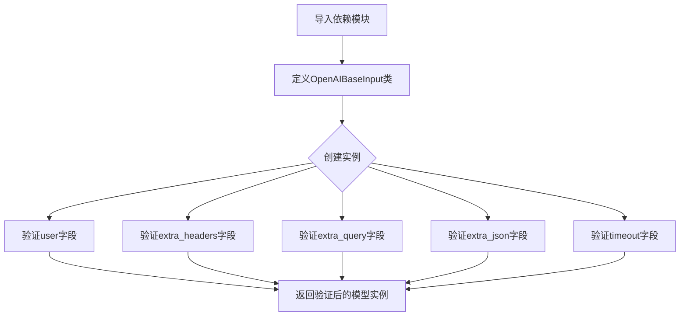
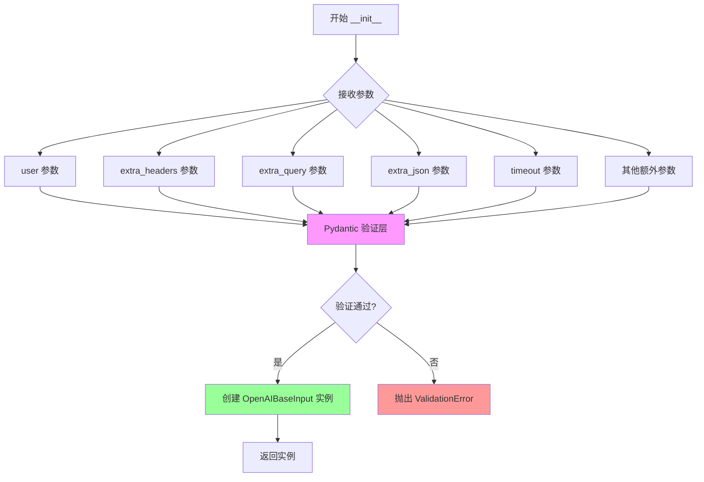
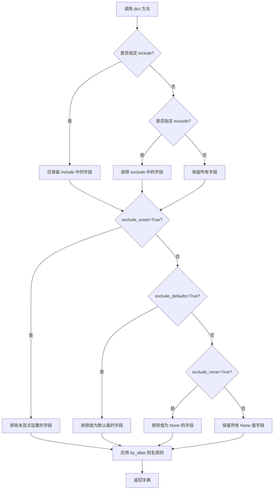
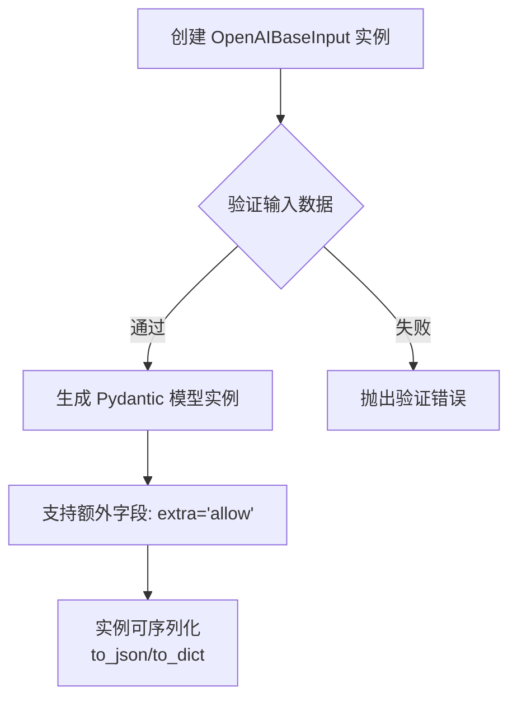
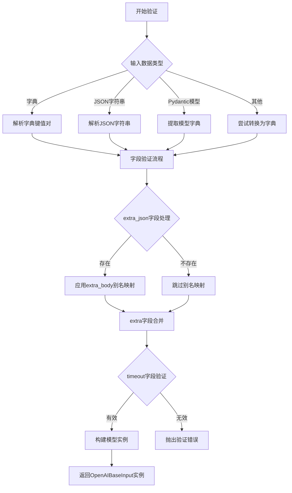
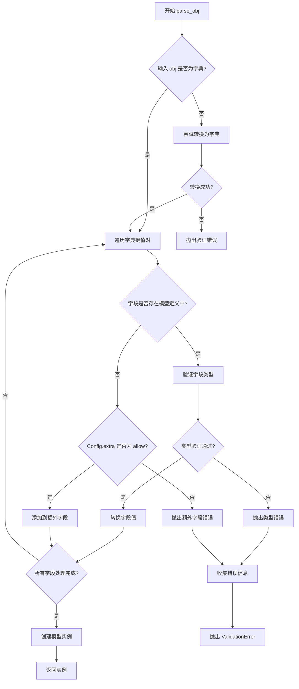
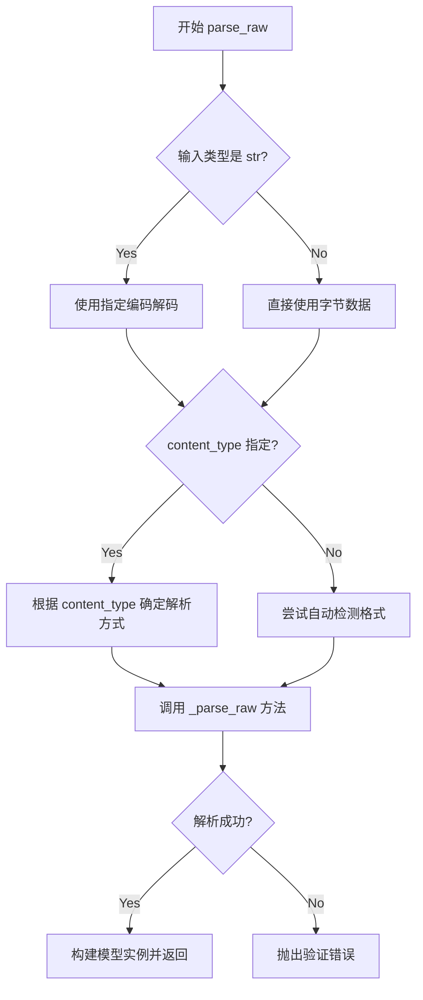

# `Langchain-Chatchat\libs\python-sdk\open_chatcaht\types\standard_openai\base.py` 详细设计文档

该代码定义了一个Pydantic BaseModel类OpenAIBaseInput，用于封装OpenAI API调用的输入参数，支持用户消息、可选的头部/查询/JSON扩展字段以及超时设置，并允许传递额外的参数。

## 整体流程



## 类结构

```
BaseModel (pydantic基类)
└── OpenAIBaseInput (OpenAI输入模型)
```

## 全局变量及字段


### `OpenAIBaseInput.user`
    
用户消息内容

类型：`Optional[str]`
    


### `OpenAIBaseInput.extra_headers`
    
额外的HTTP头部参数

类型：`Optional[Dict]`
    


### `OpenAIBaseInput.extra_query`
    
额外的查询参数

类型：`Optional[Dict]`
    


### `OpenAIBaseInput.extra_json`
    
额外的JSON请求体参数(别名:extra_body)

类型：`Optional[Dict]`
    


### `OpenAIBaseInput.timeout`
    
请求超时时间(秒)

类型：`Optional[float]`
    
    

## 全局函数及方法


### OpenAIBaseInput.__init__

该方法是 Pydantic BaseModel 的初始化方法，用于创建 OpenAIBaseInput 实例，自动处理所有字段的验证和类型转换，并支持额外参数的传递。

参数：

- `user`：`Optional[str]`，可选参数，表示用户标识或用户上下文
- `extra_headers`：`Optional[Dict]`，可选参数，用于传递额外的 HTTP 请求头
- `extra_query`：`Optional[Dict]`，可选参数，用于传递额外的 URL 查询参数
- `extra_json`：`Optional[Dict]`，可选参数，用于传递额外的 JSON 请求体（别名：`extra_body`）
- `timeout`：`Optional[float]`，可选参数，用于设置请求超时时间（秒）

返回值：`OpenAIBaseInput` 实例，该实例是一个 Pydantic 模型对象，包含所有传入的字段值并经过验证

#### 流程图



#### 带注释源码

```python
def __init__(self, **data):
    """
    OpenAIBaseInput 的初始化方法，继承自 Pydantic BaseModel
    
    该方法自动处理以下功能：
    1. 接收所有字段作为关键字参数
    2. 验证参数类型和约束
    3. 应用默认值
    4. 处理字段别名
    5. 支持额外字段（extra = "allow"）
    
    参数:
        **data: 包含所有模型字段的字典，支持以下预定义字段:
            - user: Optional[str] = None
            - extra_headers: Optional[Dict] = None  
            - extra_query: Optional[Dict] = None
            - extra_json: Optional[Dict] = Field(None, alias="extra_body")
            - timeout: Optional[float] = None
            - 以及任何其他额外的键值对（因为 Config 中 extra = "allow"）
    
    返回:
        OpenAIBaseInput: 验证后的模型实例
    
    异常:
        ValidationError: 当字段验证失败时抛出
    """
    # 调用 Pydantic BaseModel 的 __init__ 进行验证
    super().__init__(**data)
    
    # 内部流程：
    # 1. BaseModel.__init__ 会调用 validator 对所有字段进行验证
    # 2. 应用字段的默认值（如 user=None, timeout=None 等）
    # 3. 处理别名映射（如 extra_json <-> extra_body）
    # 4. 存储验证后的数据到实例
    # 5. 因为 Config 中 extra = "allow"，会保留所有额外的键值对
```


### `OpenAIBaseInput.dict`

该方法是 Pydantic BaseModel 内置的模型序列化方法，用于将 `OpenAIBaseInput` 模型实例转换为字典格式，支持多种过滤和转换选项。

参数：

- `include`: `Optional[Union[Set[str], str, FrozenSet[str]]]`，可选字段，包含在输出字典中的字段
- `exclude`: `Optional[Union[Set[str], str, FrozenSet[str]]]`，可选字段，从输出字典中排除的字段
- `by_alias`: `Optional[bool] = False`，是否使用字段别名（如 `extra_body` 替代 `extra_json`）
- `exclude_unset`: `Optional[bool] = False`，是否排除未显式设置值的字段
- `exclude_defaults`: `Optional[bool] = False`，是否排除值为默认值的字段
- `exclude_none`: `Optional[bool] = False`，是否排除值为 None 的字段
- `exclude_embeddings`: `Optional[bool] = False`，是否排除嵌入向量字段

返回值：`Dict[str, Any]`，返回模型的字典表示形式

#### 流程图



#### 带注释源码

```python
def dict(
    self,
    # 包含字段：仅返回指定的字段
    include: Optional[Union[Set[str], str, FrozenSet[str]]] = None,
    # 排除字段：移除指定的字段
    exclude: Optional[Union[Set[str], str, FrozenSet[str]]] = None,
    # 别名模式：是否使用字段别名（如 extra_body）
    by_alias: Optional[bool] = False,
    # 排除未设置：仅返回显式赋值的字段
    exclude_unset: Optional[bool] = False,
    # 排除默认值：排除值为模型默认值的字段
    exclude_defaults: Optional[bool] = False,
    # 排除 None：排除值为 None 的字段
    exclude_none: Optional[bool] = False,
    # 排除嵌入：排除嵌入向量字段
    exclude_embeddings: Optional[bool] = False,
) -> Dict[str, Any]:
    """
    将模型实例转换为字典格式
    
    Pydantic BaseModel 内置方法，自动处理：
    - 字段验证
    - 别名转换 (extra_json -> extra_body)
    - 字段过滤 (include/exclude)
    - 默认值处理
    - None 值处理
    
    Returns:
        Dict[str, Any]: 模型的字典表示
    """
    # 示例调用：
    # model = OpenAIBaseInput(user="test", timeout=30.0)
    # model.dict() 
    # -> {'user': 'test', 'extra_headers': None, 'extra_query': None, 
    #     'extra_json': None, 'timeout': 30.0}
    #
    # model.dict(exclude_unset=True)
    # -> {'user': 'test', 'timeout': 30.0}
    #
    # model.dict(by_alias=True)
    # -> {'user': 'test', 'extra_body': None, 'timeout': 30.0}
    pass
```


### `OpenAIBaseInput`

一个 Pydantic 数据模型类，用于定义 OpenAI API 调用的基础输入参数。该类继承自 BaseModel，提供用户消息、额外的 HTTP 头、查询参数、JSON 请求体以及超时设置等可选字段，支持动态扩展额外参数。

参数：

-  `user`：`Optional[str]`，用户消息内容，可选字段
-  `extra_headers`：`Optional[Dict]`，额外的 HTTP 请求头，用于传递非标准请求头
-  `extra_query`：`Optional[Dict]`，额外的 URL 查询参数
-  `extra_json`：`Optional[Dict]`，额外的 JSON 请求体（别名：extra_body）
-  `timeout`：`Optional[float]`，请求超时时间（秒）

返回值：`无`，该类为数据模型类，不返回任何值

#### 流程图



#### 带注释源码

```python
from typing import Optional, Dict  # 导入类型注解模块

from pydantic import BaseModel, Field  # 导入 Pydantic 核心组件


class OpenAIBaseInput(BaseModel):
    """
    OpenAI API 调用的基础输入参数模型
    用于定义与 OpenAI API 交互时的可选配置项
    """
    
    # 用户消息内容，可选参数
    user: Optional[str] = None
    
    # 额外的 HTTP 请求头字典
    # 当需要传递标准参数之外的请求头时使用
    # 此处定义的值优先于客户端级别或方法级别的相同参数
    extra_headers: Optional[Dict] = None
    
    # 额外的 URL 查询参数字典
    # 用于添加非标准查询参数到请求中
    extra_query: Optional[Dict] = None
    
    # 额外的 JSON 请求体字典
    # Field 别名为 'extra_body'，用于兼容不同版本的 API 参数命名
    extra_json: Optional[Dict] = Field(None, alias="extra_body")
    
    # 请求超时时间（秒）
    # 控制单个请求的最大等待时间
    timeout: Optional[float] = None

    class Config:
        """
        Pydantic 模型配置
        """
        # 允许模型接受额外未定义的字段
        # 这确保了与未来 API 版本的兼容性
        extra = "allow"
```

#### 关键组件信息

| 组件名称 | 一句话描述 |
|---------|-----------|
| BaseModel | Pydantic 的基础模型类，提供数据验证和序列化功能 |
| Field | Pydantic 的字段装饰器，用于定义字段元数据和别名 |
| extra = "allow" | 模型配置，允许接受未在类中定义的额外字段 |

#### 潜在技术债务与优化空间

1. **字段命名不一致**：`extra_json` 使用别名 `extra_body`，这可能导致代码可读性问题和维护困难，建议统一命名规范
2. **缺少字段验证**：当前字段缺少更细粒度的验证规则（如 `timeout` 应为正数、字典类型验证等），可增加 Pydantic 验证器
3. **文档注释不足**：类级别和字段级别的文档字符串可以更详细，说明每个字段的具体用途和取值范围
4. **缺少默认值说明**：可考虑为 `timeout` 添加合理的默认超时值，而非仅依赖 API 客户端默认值
5. **类型注解精度**：`Dict` 可改为更具体的 `Dict[str, Any]` 以提高类型安全

#### 其他设计考量

- **设计目标**：提供一个灵活且可扩展的输入模型，适配 OpenAI API 的各种调用场景
- **约束条件**：继承自 Pydantic BaseModel，需遵循 Pydantic v1 的配置风格
- **错误处理**：Pydantic 自动处理类型验证错误，抛出 `ValidationError`
- **数据流**：实例化时接收字典或关键字参数，经 Pydantic 验证后生成模型实例，可序列化为 JSON
- **外部依赖**：依赖 `pydantic` 库（版本 1.x）


### `OpenAIBaseInput.validate`

该方法是 Pydantic BaseModel 的类方法，用于验证输入数据并返回 OpenAIBaseInput 实例。由于代码中未显式定义此方法，它继承自 Pydantic 的 BaseModel 基类。

参数：

- `cls`：`Type[OpenAIBaseInput]`，表示类本身（类方法隐式参数）
- `data`：`Union[Dict[str, Any], BaseModel, str, bytes, Tuple[Any, ...], List[Any], None]`（或 `Any`），待验证的输入数据，可以是字典、另一个 Pydantic 模型、JSON 字符串、字节数据、元组、列表或 None

返回值：`OpenAIBaseInput`，验证并构造后的模型实例

#### 流程图



#### 带注释源码

```
# 注意：此方法继承自 Pydantic BaseModel，代码中未显式定义
# 以下为 Pydantic BaseModel.validate 的典型实现逻辑参考

@classmethod
def validate(cls, data: Any) -> "OpenAIBaseInput":
    """
    验证输入数据并返回模型实例的类方法。
    
    参数:
        data: 待验证的数据，支持多种格式
              - 字典: 直接作为字段值
              - JSON字符串: 解析后作为字段值
              - 另一个Pydantic模型: 转换为字典
              - 其他可迭代对象: 尝试转换为字典
    
    返回值:
        验证并构造后的 OpenAIBaseInput 实例
    
    验证流程:
        1. 接收原始输入数据
        2. 根据数据类型进行解析转换
        3. 对每个字段进行类型检查和值验证
        4. 处理特殊字段如 extra_json (alias: extra_body)
        5. 应用 Config 配置（如 extra = "allow"）
        6. 返回验证通过的模型实例或抛出验证错误
    """
    # Pydantic 内部验证逻辑...
    # 1. 如果 data 是字典，直接使用
    # 2. 如果是 JSON 字符串，使用 json.loads 解析
    # 3. 如果是 Pydantic 模型，使用 model_dump() 提取字典
    # 4. 对 extra_json 字段应用 alias="extra_body" 映射
    #    即传入的 extra_body 参数会自动映射到 extra_json 字段
    # 5. 对于 extra_headers, extra_query, timeout 等字段进行类型检查
    # 6. user 字段为 Optional[str]，默认为 None
    # 7. 由于 Config 中 extra = "allow"，允许传入额外未定义的字段
    # 8. 验证通过后返回模型实例
    pass
```


### `OpenAIBaseInput.parse_obj`

继承自 Pydantic BaseModel 的类方法，用于将字典或其他对象解析为 OpenAIBaseInput 模型实例，支持数据验证和类型转换。

参数：

- `obj`：`Any`，要解析的字典或其他对象

返回值：`OpenAIBaseInput`，返回验证后的模型实例

#### 流程图



#### 带注释源码

```python
@classmethod
def parse_obj(cls, obj: Any) -> Self:
    """
    从字典或其他对象解析并创建模型实例
    
    参数:
        obj: 字典或其他可迭代对象，包含模型字段数据
    
    返回:
        验证后的模型实例
    """
    # 调用 pydantic 基础实现进行数据验证和实例化
    return super().parse_obj(obj)

# 该方法主要继承自 pydantic.BaseModel，核心逻辑包括：
# 1. 接收字典或类似字典的对象作为输入
# 2. 遍历对象的所有键值对
# 3. 对每个字段进行类型检查和转换
# 4. 处理 extra="allow" 配置，允许额外字段
# 5. 如果验证失败，抛出 ValidationError
# 6. 成功验证后返回模型实例
```


### `BaseModel.parse_raw` (继承自 `OpenAIBaseInput`)

`parse_raw` 是 Pydantic BaseModel 的类方法，用于将 JSON 字符串或字节数据直接解析为模型实例。它是继承自父类 `BaseModel` 的方法，`OpenAIBaseInput` 类本身并未重写该方法。

参数：

- `b`：`Union[str, bytes]`，要解析的 JSON 字符串或字节数据
- `content_type`：`Optional[str]`（关键字参数），HTTP Content-Type 头，用于指定数据类型
- `encoding`：`str`（关键字参数），字符编码，默认为 'utf-8'
- `proto`：`Optional[Protocol]`（关键字参数），解析协议，默认为 JSON
- `allow_pickle`：`bool`（关键字参数），是否允许反序列化 pickle 数据，默认为 False

返回值：`BaseModel`，返回一个新的模型实例

#### 流程图



#### 带注释源码

```
# 这是继承自 Pydantic BaseModel 的 parse_raw 方法
# OpenAIBaseInput 类本身并未重写此方法

@classmethod
def parse_raw(
    cls,  # 类本身
    b: Union[str, bytes],  # 输入：JSON 字符串或字节
    *,  # 以下为关键字参数
    content_type: str = None,  # 可选：Content-Type 头
    encoding: str = 'utf-8',  # 默认编码
    proto: Protocol = None,  # 可选：解析协议
    allow_pickle: bool = False  # 是否允许 pickle
) -> 'BaseModel':
    """
    将 JSON 字符串解析为模型实例
    
    参数:
        b: JSON 字符串或字节数据
        content_type: 指定数据类型（如 application/json）
        encoding: 字符编码
        proto: 数据协议
        allow_pickle: 是否允许使用 pickle 协议
    
    返回:
        新的模型实例
    """
    # 内部调用 _parse_raw 进行实际解析
    return cls._parse_raw(
        b,
        content_type=content_type,
        encoding=encoding,
        proto=proto,
        allow_pickle=allow_pickle
    )
```


## 关键组件


### 核心功能概述

该代码定义了一个Pydantic基础模型类`OpenAIBaseInput`，用于封装OpenAI API调用的通用输入参数，包括用户标识、额外HTTP头、额外查询参数、额外请求体以及超时配置，支持动态扩展额外参数。

### 文件运行流程

该模块作为数据验证层被导入使用，运行流程为：导入pydantic模块 → 定义OpenAIBaseInput类 → 当外部创建该类实例时，pydantic自动进行数据验证和类型转换 → 支持通过alias访问extra_body字段。

### 类详细信息

#### OpenAIBaseInput类

**类字段：**

- `user`: Optional[str] = None - 用户标识字段，可选字符串类型，用于指定API调用的用户
- `extra_headers`: Optional[Dict] = None - 额外HTTP请求头字典，用于添加非标准请求头
- `extra_query`: Optional[Dict] = None - 额外URL查询参数字典，用于添加非标准查询参数
- `extra_json`: Optional[Dict] = Field(None, alias="extra_body") - 额外请求体JSON数据，支持通过extra_body别名访问
- `timeout`: Optional[float] = None - 请求超时时间配置，支持浮点数秒级精度
- `Config`: 内部配置类，设置extra="allow"允许动态添加额外字段

**类方法：**

该类继承自BaseModel，继承的验证方法包括：
- `__init__` - 初始化方法，接收上述参数进行实例化
- `dict()` - 转换为字典方法
- `json()` - 转换为JSON字符串方法
- `model_dump()` - Pydantic V2新版本的数据导出方法
- `model_validate()` - Pydantic V2新版本的数据验证方法

### 关键组件信息

### OpenAIBaseInput

用于OpenAI API调用的基础输入参数模型，支持动态扩展和灵活配置

### extra_json字段的alias机制

通过Field的alias参数实现"extra_body"别名映射，提升API兼容性

### Config内部配置类

使用pydantic的extra="allow"配置，允许动态添加未预定义的额外参数

### 潜在技术债务与优化空间

1. **类型安全不足**: extra_headers、extra_query、extra_json使用Dict类型缺乏泛型约束，应改为Dict[str, Any]以提供更严格的类型提示
2. **超时配置粒度**: timeout仅支持float类型，可考虑支持整型和timeout对象以区分连接超时和读取超时
3. **字段命名一致性**: extra_json使用alias映射到extra_body，但extra_body未作为正式字段定义，可能造成混淆
4. **文档缺失**: 缺少类级别的docstring和字段描述注释，影响API可发现性

### 其它项目

**设计目标与约束：**

- 提供最小化的通用OpenAI API输入参数封装
- 遵循Pydantic V2的API设计规范
- 支持向后兼容的extra_body参数别名

**错误处理与异常设计：**

- 依赖Pydantic内置的类型验证和转换机制
- 额外字段超出范围时由Pydantic的extra="allow"策略处理

**数据流与状态机：**

- 单向数据流：外部传入参数 → Pydantic验证 → 模型实例化 → 序列化输出
- 无状态设计，每次API调用创建独立实例

**外部依赖与接口契约：**

- 依赖pydantic>=2.0版本（使用Field而非Field的旧API）
- 作为基础输入类，被其他具体API请求模型继承扩展


## 问题及建议


### 已知问题

-   **类型注解不够具体**：`Optional[Dict]` 缺少泛型参数，应改为 `Optional[Dict[str, str]]` 或 `Optional[Dict[str, Any]]`，以提高类型安全性和 IDE 支持
-   **Pydantic 版本兼容性问题**：使用 Pydantic v1 的 `class Config` 写法，在 Pydantic v2 中应迁移至 `model_config = ConfigDict(extra="allow")`
-   **timeout 缺少范围验证**：float 类型没有限制是否为负数或零，应添加 `Field(ge=0)` 约束确保 timeout 值合法
-   **注释冗余且有语法错误**：两段注释重复描述同一功能，第二段开头 "The following extra values" 与前文衔接不畅
-   **缺少文档字符串**：类和字段均无 docstring，不利于后续维护和 API 使用者理解
-   **Field 别名语义不明确**：`extra_json` 别名为 `"extra_body"`，但未提供注释说明为何使用不同命名

### 优化建议

-   明确 Dict 的泛型类型，如 `Dict[str, str]` 或 `Dict[str, Any]`
-   迁移至 Pydantic v2：`model_config = ConfigDict(extra="allow")`
-   为 timeout 添加非负约束：`Field(default=None, ge=0, description="Request timeout in seconds")`
-   合并注释为一条清晰的说明，并修正语法
-   为类和关键字段添加 docstring
-   统一命名或添加注释解释 `extra_body` 别名的用途
-   考虑将 `extra = "allow"` 改为更严格的配置，明确允许的额外字段白名单


## 其它


### 设计目标与约束

设计目标：该类作为 OpenAI API 请求的基类模型，提供了灵活的参数扩展机制，支持用户自定义请求头、查询参数、JSON body 以及超时设置，同时保持与 Pydantic v1 兼容的配置方式。

设计约束：
- 必须继承自 Pydantic 的 BaseModel
- 使用 Pydantic v1 风格的 Config 类配置
- extra_body 字段使用 alias 以兼容不同版本的 API 参数命名
- 所有可选字段使用 Optional 类型并设置默认值 None

### 错误处理与异常设计

Pydantic 会在模型验证失败时抛出 ValidationError，常见的验证错误场景包括：
- timeout 参数为负数或零时
- extra_headers、extra_query、extra_json 字段类型不匹配时
- 字段值不符合 Pydantic 验证规则时

开发者需要捕获 `pydantic.error_wrappers.ValidationError` 异常并进行相应处理。

### 外部依赖与接口契约

外部依赖：
- pydantic >= 1.0：用于模型定义和验证
- typing：Python 标准库，用于类型提示

接口契约：
- 该类作为输入模型，被 OpenAI 客户端或其他调用方使用
- extra_json 字段实际映射到 API 请求的 extra_body 参数
- 所有字段均为可选，调用方可根据需要选择性设置

### 兼容性考虑

Pydantic 版本兼容性：
- 当前代码使用 Pydantic v1 风格的 Config 类
- alias="extra_body" 确保与某些 API 版本中使用的 extra_body 参数名兼容
- extra = "allow" 允许动态添加未定义的额外字段

### 使用示例

```python
# 基本使用
input_data = OpenAIBaseInput(user="test user")

# 扩展参数使用
input_data = OpenAIBaseInput(
    user="test user",
    extra_headers={"X-Custom-Header": "value"},
    extra_query={"debug": "true"},
    extra_body={"custom_field": "value"},
    timeout=30.0
)

# 获取字典表示
input_dict = input_data.dict(by_alias=True)
```

### 性能考虑

- 该类为轻量级数据模型，实例化开销极低
- Pydantic 会在模型定义时进行类型检查缓存
- 不涉及网络请求或复杂计算

### 安全性考虑

- extra_headers 可能包含敏感信息，需注意日志记录和传输安全
- timeout 参数应设置合理范围防止无限等待
- 用户输入应进行适当的输入验证和清理


    