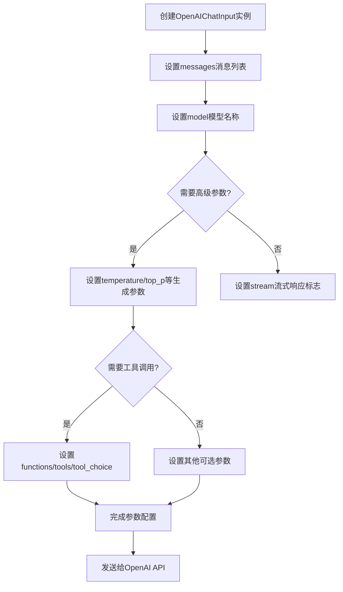

# `Langchain-Chatchat\libs\python-sdk\open_chatcaht\types\standard_openai\chat_input.py` 详细设计文档

这是一个用于封装OpenAI聊天API输入参数的类，继承自OpenAIBaseInput，定义了与OpenAI Chat Completion API对应的所有请求参数，包括消息列表、模型选择、生成参数、工具调用等配置。

## 整体流程



## 类结构

```
OpenAIBaseInput (抽象基类)
└── OpenAIChatInput (聊天输入类)
```

## 全局变量及字段


### `LLM_MODEL`
    
默认的LLM模型名称，用于聊天完成请求

类型：`str`
    


### `TEMPERATURE`
    
生成文本的随机性参数，控制输出的创造性

类型：`float`
    


### `OpenAIChatInput.messages`
    
聊天消息列表，包含用户和助手的对话历史

类型：`List[Union[Dict, ChatCompletionMessageParam]]`
    


### `OpenAIChatInput.model`
    
用于聊天的LLM模型标识符

类型：`str`
    


### `OpenAIChatInput.frequency_penalty`
    
频率惩罚参数，用于减少重复词汇

类型：`Optional[float]`
    


### `OpenAIChatInput.function_call`
    
指定要调用的函数名称

类型：`Optional[completion_create_params.FunctionCall]`
    


### `OpenAIChatInput.functions`
    
可用函数定义列表，用于函数调用功能

类型：`List[completion_create_params.Function]`
    


### `OpenAIChatInput.logit_bias`
    
词汇偏差字典，用于调整特定词的概率

类型：`Optional[Dict[str, int]]`
    


### `OpenAIChatInput.logprobs`
    
是否返回对数概率

类型：`Optional[bool]`
    


### `OpenAIChatInput.max_tokens`
    
生成内容的最大token数量限制

类型：`Optional[int]`
    


### `OpenAIChatInput.n`
    
返回的候选项数量

类型：`Optional[int]`
    


### `OpenAIChatInput.presence_penalty`
    
存在惩罚参数，用于鼓励生成新话题

类型：`Optional[float]`
    


### `OpenAIChatInput.response_format`
    
响应格式约束，如JSON模式

类型：`completion_create_params.ResponseFormat`
    


### `OpenAIChatInput.seed`
    
随机种子，用于可重复的生成结果

类型：`Optional[int]`
    


### `OpenAIChatInput.stop`
    
停止序列，生成遇到时停止

类型：`Union[Optional[str], List[str]]`
    


### `OpenAIChatInput.stream`
    
是否使用流式响应模式

类型：`Optional[bool]`
    


### `OpenAIChatInput.temperature`
    
采样温度，控制输出的随机性和创造性

类型：`Optional[float]`
    


### `OpenAIChatInput.tool_choice`
    
指定使用哪个工具或函数

类型：`Optional[Union[ChatCompletionToolChoiceOptionParam, str]]`
    


### `OpenAIChatInput.tools`
    
可用工具定义列表，用于工具调用功能

类型：`List[Union[ChatCompletionToolParam, str]]`
    


### `OpenAIChatInput.top_logprobs`
    
返回最高概率的logprobs数量

类型：`Optional[int]`
    


### `OpenAIChatInput.top_p`
    
核采样参数，控制候选词的多样性

类型：`Optional[float]`
    
    

## 全局函数及方法


## 关键组件


### OpenAIChatInput 类

用于构建OpenAI聊天完成API请求的输入参数类，封装了所有支持的OpenAI API参数，包括消息、模型、温度、工具调用等配置。

### messages 字段

聊天消息列表，支持字典或ChatCompletionMessageParam类型，用于传递对话历史。

### model 字段

指定使用的语言模型，默认为LLM_MODEL常量。

### temperature 字段

控制生成随机性的采样温度，默认为TEMPERATURE常量。

### stream 字段

控制是否启用流式响应，默认为True启用流式输出。

### tools 和 tool_choice 字段

支持工具调用功能，tools定义可用工具列表，tool_choice指定选择哪个工具执行。

### functions 和 function_call 字段

支持函数调用功能，functions定义可调用函数列表，function_call指定调用方式。

### frequency_penalty 和 presence_penalty 字段

用于控制生成文本中词频的惩罚参数，影响词汇多样性。

### max_tokens 字段

限制生成内容的最大token数量。

### response_format 字段

指定输出格式，如JSON对象模式。

### top_p 和 seed 字段

核采样参数和随机种子，用于控制生成的可预测性。

### logit_bias 和 logprobs 字段

用于偏置特定token的对数概率和返回token的对数概率。


## 问题及建议


### 已知问题

-   **类型注解不一致**：`functions` 和 `tools` 字段类型定义为 `List[...]` 但默认值为 `None`，应使用 `Optional[List[...]]` 以保持类型安全
-   **默认值为空列表**：`function_call` 字段类型为 `Optional[completion_create_params.FunctionCall]`，但默认值为空列表 `[]`，类型语义不明确
-   **可选字段类型标注不当**：`response_format` 字段类型为 `completion_create_params.ResponseFormat` 但默认值为 `None`，应标注为 `Optional[completion_create_params.ResponseFormat]`
-   **可变对象默认值**：`messages` 字段默认值为空列表 `[]`，虽然位于类属性而非函数参数中，但最佳实践建议使用 `None` 配合初始化逻辑
-   **stream 默认值可能不当**：将 `stream` 默认值设为 `True` 可能导致意外行为，因为流式响应需要特殊处理调用方代码
-   **缺失类文档字符串**：类缺少文档说明，无法快速了解该类的用途和设计意图
- **字段注释缺失**：所有字段均无注释说明其用途和约束条件

### 优化建议

- 将 `functions` 和 `tools` 的类型注解修改为 `Optional[List[...]]`
- 将 `function_call` 的默认值改为 `None`，与类型注解保持一致
- 将 `response_format` 的类型注解修改为 `Optional[completion_create_params.ResponseFormat]`
- 将 `messages` 的默认值改为 `None`，在类初始化或使用时动态创建空列表
- 将 `stream` 的默认值改为 `None` 或 `False`，让调用者显式选择是否启用流式响应
- 为类添加文档字符串，说明其作为 OpenAI Chat 接口输入模型的用途
- 为关键字段添加注释，说明其对应的 OpenAI API 参数含义和约束条件


## 其它


### 设计目标与约束

该类旨在提供一个强类型的、符合 OpenAI Chat Completion API 规范的输入参数封装结构，支持所有标准的聊天完成参数，同时提供合理的默认值。设计约束包括：必须继承自 OpenAIBaseInput 以保持一致性；所有字段必须与 OpenAI 官方 API 参数保持名称和类型一致；默认值设置需符合常见使用场景（如 stream 默认为 True）。

### 错误处理与异常设计

该类主要作为数据容器，不包含复杂的业务逻辑错误处理。潜在的异常场景包括：类型检查失败（如 messages 传入非列表类型）、值域越界（如 temperature 超出 0-2 范围）。建议在调用 OpenAI API 前进行参数校验，可通过 Pydantic 等校验框架增强类型安全。

### 数据流与状态机

该类作为请求参数的载体，不涉及状态机设计。数据流方向为：用户创建 OpenAIChatInput 实例并填充参数 -> 传递给底层 API 客户端 -> 序列化为 JSON 发送给 OpenAI 服务。无内部状态转换，属于被动数据对象（POCO/POD）。

### 外部依赖与接口契约

主要外部依赖包括：`openai` 包（提供 ChatCompletionMessageParam、ChatCompletionToolParam 等类型定义）、`open_chatcaht._constants` 模块（提供 LLM_MODEL 和 TEMPERATURE 默认值）、`typing` 标准库。接口契约要求：所有字段必须与 OpenAI create chat completion API 的请求参数一一对应，类型需兼容 TypeScript 接口定义。

### 性能考虑

作为纯数据类，该类本身无性能瓶颈。序列化时的性能取决于字段数量和嵌套复杂度。建议：如果对性能敏感，可考虑使用 `__slots__` 减少内存开销；对于大规模并发请求，可考虑对象池化或预创建策略。

### 兼容性考虑

该类需兼容 OpenAI API 的版本演进。由于直接引用 `completion_create_params` 中的类型，当 OpenAI 库升级时可能需要同步更新。建议在依赖版本管理中锁定 openai 包版本，并在升级前进行充分测试。Python 版本兼容性需确保 >= 3.8 以支持 `typing.Union` 的现代语法。

### 配置与扩展性

该类预留了良好的扩展性：通过 `functions` 和 `tools` 字段支持函数调用能力；通过 `response_format` 支持 JSON 模式；通过 `logit_bias` 支持令牌级别控制。后续可考虑添加自定义字段支持或钩子机制以满足特定业务场景需求。


    