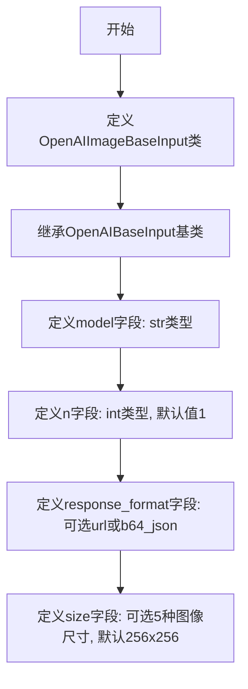

# `Langchain-Chatchat\libs\python-sdk\open_chatcaht\types\standard_openai\image_base_input.py` 详细设计文档

这是一个用于OpenAI图像生成API的输入数据模型类，继承自OpenAIBaseInput，定义了图像生成所需的模型、生成数量、响应格式和图像尺寸等参数。

## 整体流程



## 类结构

```
OpenAIBaseInput (抽象基类)
└── OpenAIImageBaseInput (图像输入模型类)
```

## 全局变量及字段


### `OpenAIImageBaseInput.model`
    
指定用于图像生成的模型标识符

类型：`str`
    


### `OpenAIImageBaseInput.n`
    
生成图像的数量，默认为1

类型：`int`
    


### `OpenAIImageBaseInput.response_format`
    
返回图像的格式，可选url或base64编码的json，默认为None

类型：`Optional[Literal["url", "b64_json"]]`
    


### `OpenAIImageBaseInput.size`
    
生成图像的尺寸规格，默认为256x256

类型：`Optional[Literal["256x256", "512x512", "1024x1024", "1792x1024", "1024x1792"]]`
    
    

## 全局函数及方法


## 关键组件


### OpenAIImageBaseInput 类

继承自 OpenAIBaseInput 的图像生成基础输入类，用于封装图像生成 API 的输入参数。

### model 字段

字符串类型，必填字段，指定用于图像生成的大语言模型名称。

### n 字段

整数类型，默认值为 1，指定单次请求生成的图像数量。

### response_format 字段

可选字段，支持 "url" 或 "b64_json" 两种Literal类型，指定图像返回格式为URL或Base64编码的JSON。

### size 字段

可选字段，支持多种图像尺寸（256x256、512x512、1024x1024、1792x1024、1024x1792），默认值为 "256x256"，指定生成图像的分辨率。

### Literal 类型约束

使用 typing.Literal 限制 response_format 和 size 字段的可选值，确保API调用的参数合法性。


## 问题及建议


### 已知问题

- **默认值与Optional类型不一致**：`size`字段声明为`Optional[Literal[...]]`类型，意味着`None`是合法值，但默认值设为`"256x256"`，语义上存在歧义，可能导致调用方误解
- **缺少输入验证**：字段`n`未验证是否为正整数，`model`未验证是否为空字符串，缺少数据合法性校验
- **缺乏文档说明**：类和各字段均无文档字符串（docstring），降低代码可维护性和可理解性
- **扩展性受限**：图像尺寸和响应格式采用硬编码的Literal类型，若OpenAI API新增选项需修改源码，不符合开闭原则
- **API变更风险**：完全依赖OpenAIBaseInput基类，但对该基类内容无掌控，基类变更可能影响本类功能
- **类型定义冗余**：`response_format`使用`Optional[Literal[...]]`但直接设为`None`作为默认值，实际上可以直接用`Literal["url", "b64_json", None]`简化

### 优化建议

- 统一Optional与默认值的语义：若允许None值，则默认值为None；若不允许，则移除Optional
- 添加Pydantic或dataclass装饰器实现字段验证，如`n`需大于0，`model`非空
- 为类添加类级别文档字符串，为关键字段添加属性docstring说明用途和取值范围
- 考虑将尺寸列表、格式列表提取为常量或配置文件，提高可维护性
- 添加typing.Protocol或抽象基类定义接口规范，降低对具体实现的耦合
- 简化类型注解：`response_format`可直接定义为`Literal["url", "b64_json", None]`


## 其它


### 一段话描述

OpenAIImageBaseInput 是一个用于配置 OpenAI 图像生成 API 请求参数的数据模型类，继承自 OpenAIBaseInput，定义了图像生成所需的模型选择、生成数量、响应格式和图像尺寸等核心配置字段。

### 文件的整体运行流程

该类作为数据模型被实例化，用于封装和验证图像生成请求的参数。在应用流程中，开发者创建该类的实例并填充相应字段，随后该实例被传递给图像生成服务或 API 客户端，用于构造符合 OpenAI 图像生成接口规范的请求参数。

### 类的详细信息

#### 类字段

| 字段名称 | 类型 | 描述 |
|---------|------|------|
| model | str | 指定用于图像生成的模型标识符 |
| n | int | 请求生成的图像数量，默认为 1 |
| response_format | Optional[Literal["url", "b64_json"]] | 响应返回格式，可选 URL 或 Base64 编码的 JSON |
| size | Optional[Literal["256x256", "512x512", "1024x1024", "1792x1024", "1024x1792"]] | 生成图像的尺寸规格，默认为 256x256 |

#### 类方法

该类未定义额外的方法，仅继承自父类 OpenAIBaseInput 的相关功能。

### 全局变量和全局函数

该代码片段中未定义全局变量或全局函数。

### 关键组件信息

| 组件名称 | 描述 |
|---------|------|
| OpenAIBaseInput | 父类基础输入模型，提供通用的输入参数配置接口 |
| typing.Literal | 用于限制字段可选值的字面量类型 |
| typing.Optional | 用于标识可选字段的类型提示 |

### 潜在的技术债务或优化空间

1. **类型定义冗余**：size 字段的 Literal 类型定义较长，可以考虑提取为常量或类型别名以提高可维护性
2. **默认值验证缺失**：当前仅依赖类型提示验证，未在类中实现运行时验证逻辑
3. **文档注释缺失**：类及其字段缺少 docstring 文档说明
4. **扩展性限制**：不支持自定义尺寸或其他响应格式的扩展

### 设计目标与约束

- **设计目标**：提供符合 OpenAI 图像生成 API 规范的类型安全配置类，简化请求参数构造流程
- **约束条件**：必须继承自 OpenAIBaseInput 以保持接口一致性；字段类型必须符合 OpenAI API 规范要求

### 错误处理与异常设计

- 类型检查在运行时通过 Python 类型注解进行验证，生产环境建议配合 Pydantic 或 dataclass 使用以实现自动验证
- 不符合类型约束的值将在实例化或序列化时触发 TypeError 或 ValidationError

### 数据流与状态机

该类作为请求参数的数据载体，不涉及复杂的状态机逻辑。其数据流为：用户创建实例 → 填充字段 → 传递给 API 客户端 → 序列化为请求体 → 发送至 OpenAI 服务。

### 外部依赖与接口契约

- **依赖包**：typing（标准库）、open_chatcaht.types.standard_openai.base
- **接口契约**：必须实现与 OpenAIBaseInput 兼容的接口，支持序列化导出为字典格式供 API 调用使用
- **上游依赖**：依赖 OpenAIBaseInput 父类的实现
- **下游使用**：供图像生成服务或 API 客户端构造请求参数使用


    