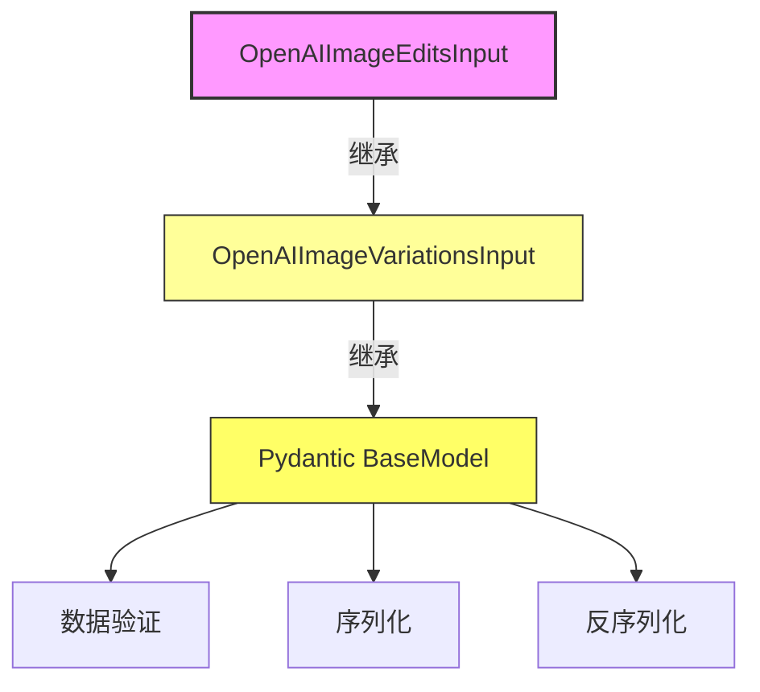
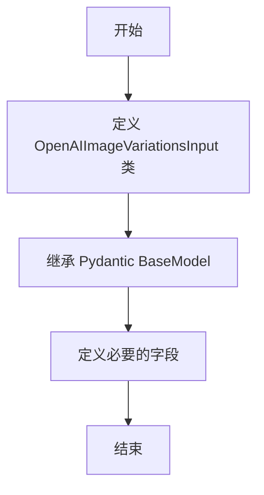

# `Langchain-Chatchat\libs\python-sdk\open_chatcaht\types\standard_openai\image_edits_input.py` 详细设计文档

这是一个基于Pydantic的OpenAI图像编辑输入模型类，继承自OpenAIImageVariationsInput，用于定义图像编辑API的请求参数结构，包含文本提示词(prompt)和可选的蒙版图像(mask)字段。

## 整体流程

```mermaid
graph TD
    A[开始] --> B[导入依赖模块]
B --> C[定义OpenAIImageEditsInput类]
C --> D{继承OpenAIImageVariationsInput}
D --> E[定义prompt字段: str类型]
E --> F[定义mask字段: Union[Any, AnyUrl]类型]
F --> G[结束 - 类定义完成]
```

## 类结构

```
ModelBase (抽象基类)
└── OpenAIImageVariationsInput (图像变体输入基类)
    └── OpenAIImageEditsInput (图像编辑输入模型)
```

## 全局变量及字段


### `OpenAIImageEditsInput.prompt`
    
图像编辑的文本提示词

类型：`str`
    


### `OpenAIImageEditsInput.mask`
    
可选的蒙版图像URL或对象

类型：`Union[Any, AnyUrl]`
    
    

## 全局函数及方法


### `OpenAIImageEditsInput`

这是一个用于OpenAI图像编辑API的Pydantic输入模型，继承自`OpenAIImageVariationsInput`类，增加了`prompt`（编辑提示词）和`mask`（可选遮罩图像）两个字段，用于结构化图像编辑请求的输入数据。

#### 类字段

- `prompt`：`str`，用户提供的图像编辑提示词，描述期望的编辑操作
- `mask`：`Union[Any, AnyUrl]`，可选的遮罩图像，用于指定图像中需要编辑的区域

#### 继承自父类的方法

由于未提供父类`OpenAIImageVariationsInput`的完整代码，以下为基于Pydantic模型继承关系的通用方法说明：

**注意**：完整的父类方法需要查看`open_chatcaht.types.standard_openai.image_variations_input`模块的源码。

#### 流程图



#### 带注释源码

```python
from typing import Any, Union

from pydantic import AnyUrl

from open_chatcaht.types.standard_openai.image_variations_input import OpenAIImageVariationsInput


class OpenAIImageEditsInput(OpenAIImageVariationsInput):
    """
    OpenAI图像编辑输入模型类
    
    该类继承自OpenAIImageVariationsInput，用于处理图像编辑API的输入数据。
    增加了prompt字段用于指定编辑指令，mask字段用于指定编辑区域。
    """
    
    # 必需的提示词字段，描述期望的图像编辑操作
    prompt: str
    
    # 可选的遮罩图像，用于指定需要编辑的区域
    # 支持AnyUrl类型（URL）或Any类型（文件对象）
    mask: Union[Any, AnyUrl]
```

#### 关键组件信息

- **OpenAIImageVariationsInput**：父类，提供图像变体输入的基础模型结构
- **Pydantic BaseModel**：Pydantic基类，提供数据验证、序列化和反序列化功能

#### 潜在的技术债务或优化空间

1. **缺少父类源码**：无法完整列出继承自父类的所有方法，需要补充父类代码
2. **mask字段类型宽泛**：`Union[Any, AnyUrl]`类型定义较为宽泛，建议限制为更具体的类型
3. **缺少字段验证**：未对`prompt`长度、格式进行限制，可能导致API调用失败
4. **文档缺失**：类和方法缺少详细的docstring文档

#### 其它项目

**设计目标与约束**：
- 目标：提供类型安全的OpenAI图像编辑API输入模型
- 约束：必须兼容父类`OpenAIImageVariationsInput`的结构

**错误处理与异常设计**：
- 依赖Pydantic的内置验证机制处理类型错误
- 建议添加自定义验证器处理业务逻辑错误

**数据流与状态机**：
- 输入数据 → Pydantic验证 → 序列化为JSON → 发送给OpenAI API

**外部依赖与接口契约**：
- 依赖：`pydantic`库
- 父类依赖：`open_chatcaht.types.standard_openai.image_variations_input.OpenAIImageVariationsInput`


### `OpenAIImageVariationsInput`

该类为图像变体输入的 Pydantic 模型基类，用于处理与 OpenAI 图像变体相关的输入数据。由于源码未直接提供，`OpenAIImageVariationsInput` 的具体字段需参考导入的模块定义。从代码中可以看到，`OpenAIImageEditsInput` 继承自该类并扩展了 `prompt` 和 `mask` 字段，推断其父类可能包含图像文件相关的基础字段。

参数：

- 由于未提供 `OpenAIImageVariationsInput` 的直接源码，无法确定具体参数。请参考 `open_chatcaht.types.standard_openai.image_variations_input` 模块的实际定义。

返回值：`OpenAIImageVariationsInput`，返回图像变体输入的 Pydantic 模型实例

#### 流程图



#### 带注释源码

```python
# 由于用户要求提取 OpenAIImageVariationsInput，但提供的代码中只包含导入语句
# 和继承该类的 OpenAIImageEditsInput，因此无法直接获取其完整源码
# 以下为基于代码上下文的推断

from typing import Any, Union

from pydantic import AnyUrl

# 这是一个推断的导入，实际的 OpenAIImageVariationsInput 源码需要查看源文件
# from open_chatcaht.types.standard_openai.image_variations_input import OpenAIImageVariationsInput


# 推断的 OpenAIImageVariationsInput 类结构
# class OpenAIImageVariationsInput(BaseModel):
#     """图像变体输入的基类"""
#     image: Union[Any, AnyUrl]  # 图像文件，支持本地文件或 URL
#     # 可能还包含其他字段如 n, size, response_format 等
```


## 关键组件


### 类定义：OpenAIImageEditsInput

用于处理OpenAI图像编辑功能的输入模型类，继承自OpenAIImageVariationsInput，扩展支持prompt和mask参数。

### 字段：prompt

字符串类型，存储用户提供的编辑指令文本，用于描述期望的图像编辑操作。

### 字段：mask

Union[Any, AnyUrl]类型，支持任意值或URL格式，用于指定图像编辑过程中的掩码区域。

### 父类依赖：OpenAIImageVariationsInput

从open_chatcaht包导入的父类，提供图像变体输入的基础结构支持。

### 类型注解：Union[Any, AnyUrl]

灵活的mask字段类型设计，同时支持本地数据和远程URL两种掩码来源。


## 问题及建议


### 已知问题

-   **继承关系不合理**：`OpenAIImageEditsInput` 继承自 `OpenAIImageVariationsInput`，但 Edits（图像编辑）和 Variations（图像变体）是两个完全不同的 API 功能，不应使用继承关系，可能导致父类中不必要的字段被错误引入。
-   **类型定义过于宽泛**：`mask: Union[Any, AnyUrl]` 中使用 `Any` 作为联合类型的一部分没有实际意义，`Any` 已包含 `AnyUrl`，使类型约束失效。
-   **缺少字段类型注解**：`prompt` 字段没有显式的类型注解（应为 `str`），降低了代码的可读性和类型安全性。
-   **缺少文档字符串**：类没有文档说明其用途、适用场景及与父类的区别。
-   **mask 字段设计不精确**：图像编辑 API 的 mask 参数可以是 URL 或二进制图像数据，当前类型定义无法准确表达此约束。

### 优化建议

-   **解除继承关系**：考虑让 `OpenAIImageEditsInput` 直接继承自 `BaseModel`（pydantic），而非继承 `OpenAIImageVariationsInput`，避免错误的字段聚合。
-   **修正类型定义**：将 `mask` 类型改为 `Union[str, bytes, AnyUrl]` 或使用更精确的 pydantic 类型（如 `UploadFile`），移除无意义的 `Any`；为 `prompt` 添加显式类型注解 `prompt: str`。
-   **添加文档字符串**：为类添加 docstring，说明其用于 DALL-E 图像编辑 API 的输入参数。
-   **考虑拆分模型**：如果父类 `OpenAIImageVariationsInput` 包含通用字段（如 `image`），可考虑使用组合或 Mixin 模式复用通用逻辑，而非直接继承。

## 其它


### 设计目标与约束

该类旨在为OpenAI图像编辑API提供输入数据模型，继承自OpenAIImageVariationsInput以复用图像变体输入的通用字段。约束包括：prompt必须为非空字符串，mask支持任意类型或AnyUrl格式。

### 错误处理与异常设计

使用Pydantic内置的数据验证机制，当字段类型不匹配或必填字段缺失时，将抛出ValidationError。prompt字段缺少时会有明确错误提示，mask字段支持灵活类型但建议使用AnyUrl以符合API规范。

### 外部依赖与接口契约

依赖pydantic库进行数据验证，继承自open_chatcaht.types.standard_openai.image_variations_input.OpenAIImageVariationsInput类。输出数据将传递给OpenAI图像编辑API的请求体。

### 使用示例

```python
from open_chatcaht.types.standard_openai.image_edits_input import OpenAIImageEditsInput

# 基本用法
edit_input = OpenAIImageEditsInput(
    image="path/to/image.png",
    prompt="将图像中的天空改为日落",
    mask="path/to/mask.png"
)

# 使用URL
edit_input_url = OpenAIImageEditsInput(
    image="https://example.com/image.png",
    prompt="添加彩虹效果",
    mask="https://example.com/mask.png"
)
```

### 版本历史

- v1.0.0 (初始版本): 支持图像编辑输入，包含prompt和mask字段

### 安全性考虑

mask字段接受Any类型可能带来安全风险，建议在生产环境中对输入进行额外校验，确保mask为可信的URL或本地文件路径，防止路径遍历攻击。

### 扩展性设计

该类采用继承结构，便于扩展其他图像处理相关的输入模型。可通过重写父类字段或添加新字段来支持更复杂的图像编辑场景。

    