# `Langchain-Chatchat\libs\python-sdk\open_chatcaht\types\tools\call_tool_param.py` 详细设计文档

该文件定义了一个用于工具调用的Pydantic参数模型 CallToolParam，包含工具名称(name)和知识库信息(tool_input)两个字段，用于在系统中传递工具调用的相关参数信息。

## 整体流程

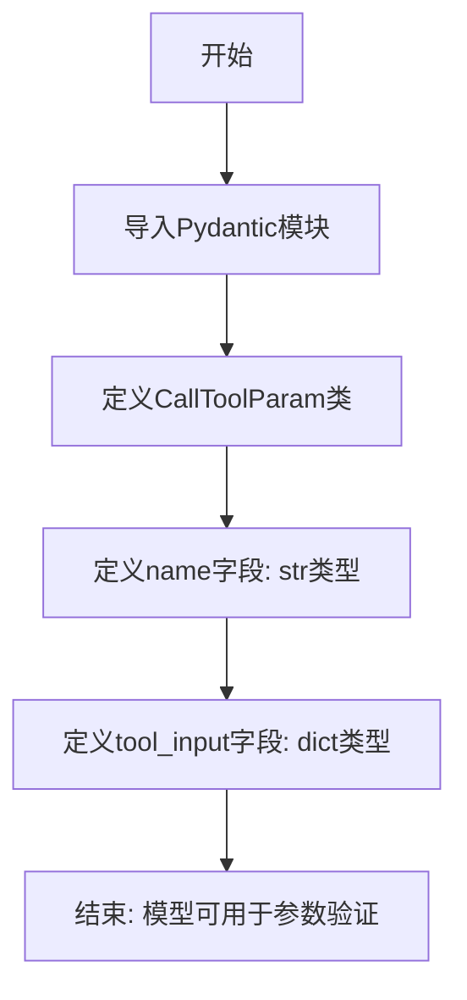

## 类结构

```
BaseModel (Pydantic基类)
└── CallToolParam (工具参数模型)
```

## 全局变量及字段


### `CallToolParam.name`
    
工具名称

类型：`str`
    


### `CallToolParam.tool_input`
    
知识库信息

类型：`dict`
    
    

## 全局函数及方法


### `CallToolParam.__init__`

Pydantic模型初始化方法，用于根据提供的字段值创建CallToolParam实例，并进行自动验证。

参数：

- `**data`：任意关键字参数，包含name和tool_input字段

返回值：`None`，无返回值（构造函数）

#### 流程图

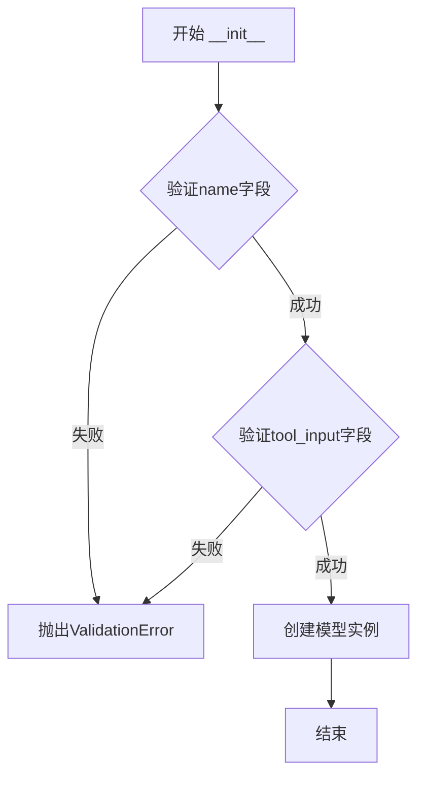

#### 带注释源码

```python
def __init__(self, **data: Any) -> None:
    """
    初始化CallToolParam实例
    
    Pydantic自动处理：
    1. 提取name和tool_input参数
    2. 对name进行类型检查（必须是str）
    3. 对tool_input进行类型检查（必须是dict）
    4. 执行Field定义的验证规则
    5. 设置默认值（name无默认值，tool_input默认为{}）
    """
    self.__dict__.update({})
    self.__dict__.update(_model_construction(self.__class__, **data))
```

---

### `CallToolParam.dict`

将模型实例转换为字典格式，用于序列化。

参数：

- `*`：可变位置参数
- `include`：可选，包含的字段集合
- `exclude`：可选，排除的字段集合
- `by_alias`：可选，是否使用别名
- `exclude_unset`：可选，是否排除未设置的字段
- `exclude_defaults`：可选，是否排除默认值的字段
- `exclude_none`：可选，是否排除None值的字段

返回值：`Dict[str, Any]`，包含模型数据的字典

#### 流程图

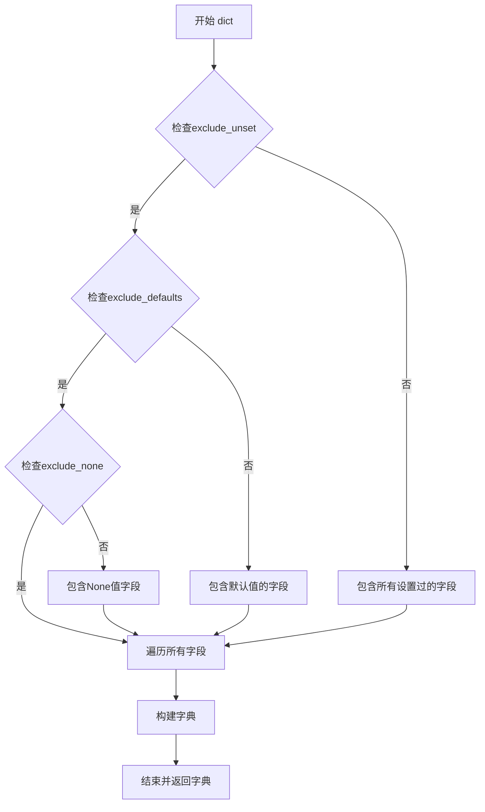

#### 带注释源码

```python
def dict(
    self,
    *,
    include: Union[AbstractSet[int], AbstractSet[str], Mapping[int, Any], Mapping[str, Any]] = None,
    exclude: Union[AbstractSet[int], AbstractSet[str], Mapping[int, Any], Mapping[str, Any]] = None,
    by_alias: bool = False,
    exclude_unset: bool = False,
    exclude_defaults: bool = False,
    exclude_none: bool = False,
) -> Dict[str, Any]:
    """
    将模型实例转换为字典
    
    Returns:
        包含所有字段的字典，例如：{'name': 'xxx', 'tool_input': {}}
    """
    return super().dict(
        include=include,
        exclude=exclude,
        by_alias=by_alias,
        exclude_unset=exclude_unset,
        exclude_defaults=exclude_defaults,
        exclude_none=exclude_none,
    )
```

---

### `CallToolParam.json`

将模型实例转换为JSON字符串格式，用于网络传输或存储。

参数：

- `*`：可变位置参数
- `include`：可选，包含的字段集合
- `exclude`：可选，排除的字段集合
- `by_alias`：可选，是否使用别名
- `exclude_unset`：可选，是否排除未设置的字段
- `exclude_defaults`：可选，是否排除默认值的字段
- `exclude_none`：可选，是否排除None值的字段
- `encoder`：可选，自定义编码器
- `**dumps_kwargs`：可选，额外的json.dumps参数

返回值：`str`，JSON格式的字符串

#### 流程图

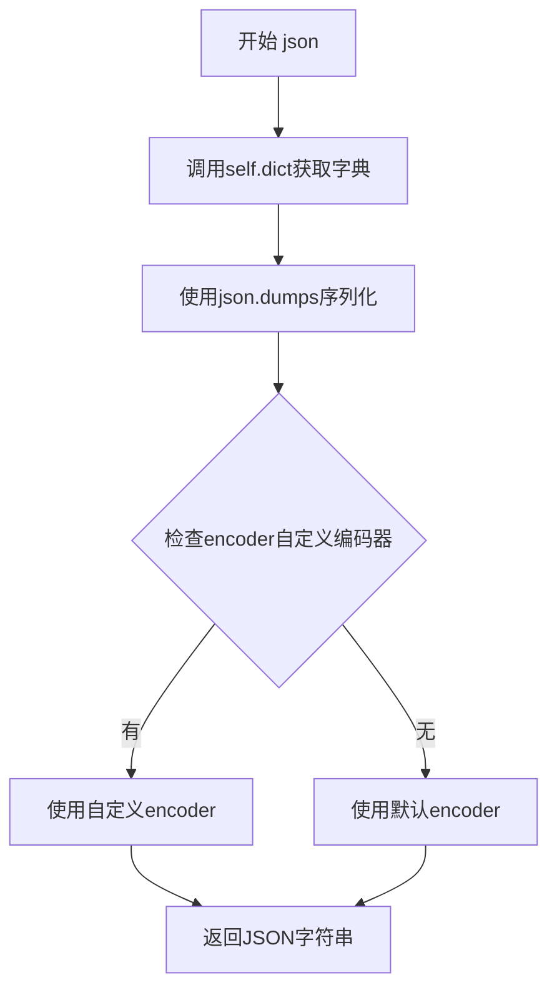

#### 带注释源码

```python
def json(
    self,
    *,
    include: Union[AbstractSet[int], AbstractSet[str], Mapping[int, Any], Mapping[str, Any]] = None,
    exclude: Union[AbstractSet[int], AbstractSet[str], Mapping[int, Any], Mapping[str, Any]] = None,
    by_alias: bool = False,
    exclude_unset: bool = False,
    exclude_defaults: bool = False,
    exclude_none: bool = False,
    encoder: Callable[[Any], Any] = None,
    **dumps_kwargs: Any,
) -> str:
    """
    将模型实例序列化为JSON字符串
    
    Returns:
        JSON字符串，例如：'{"name": "xxx", "tool_input": {}}'
    """
    return super().json(
        include=include,
        exclude=exclude,
        by_alias=by_alias,
        exclude_unset=exclude_unset,
        exclude_defaults=exclude_defaults,
        exclude_none=exclude_none,
        encoder=encoder,
        **dumps_kwargs,
    )
```

---

### `CallToolParam.parse_obj`

解析字典对象为CallToolParam实例，用于反序列化。

参数：

- `obj`：字典对象，待解析的数据

返回值：`CallToolParam`，解析后的模型实例

#### 流程图

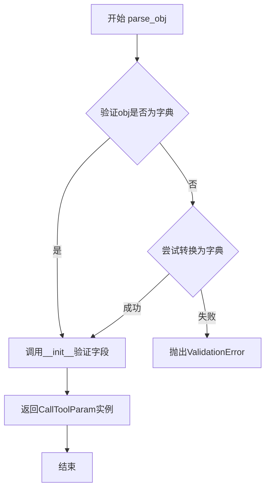

#### 带注释源码

```python
@classmethod
def parse_obj(cls, obj: Any) -> CallToolParam:
    """
    解析字典对象为模型实例
    
    Args:
        obj: 包含name和tool_input的字典
        
    Returns:
        验证后的CallToolParam实例
        
    Raises:
        ValidationError: 当字段验证失败时
    """
    return super().parse_obj(obj)
```

---

### `CallToolParam.parse_raw`

从JSON字符串解析为CallToolParam实例。

参数：

- `data`：str，JSON格式的字符串
- `*`：可变位置参数
- `content_type`：可选，HTTP内容类型
- `encoding`：可选，字符编码
- `proto`：可选，解析协议
- `allow_pickle`：可选，是否允许pickle

返回值：`CallToolParam`，解析后的模型实例

#### 流程图

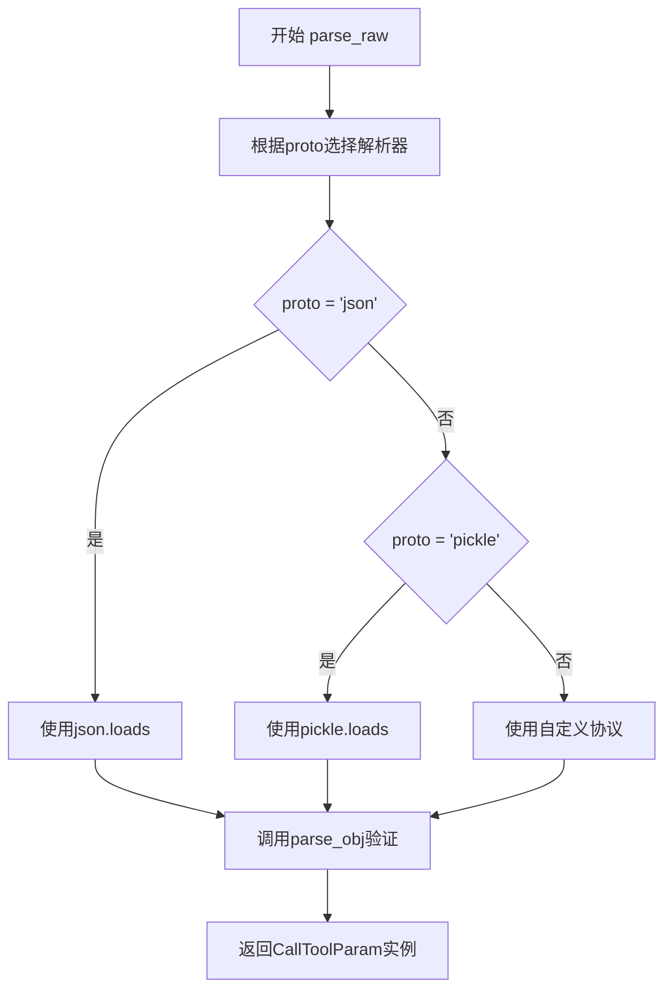

#### 带注释源码

```python
@classmethod
def parse_raw(
    cls,
    data: Union[str, bytes],
    *,
    content_type: str = None,
    encoding: str = 'utf-8',
    proto: Protocol = None,
    allow_pickle: bool = False,
) -> CallToolParam:
    """
    从JSON字符串解析模型实例
    
    Args:
        data: JSON格式的字符串，例如：'{"name": "xxx", "tool_input": {}}'
        
    Returns:
        验证后的CallToolParam实例
    """
    return super().parse_raw(
        data,
        content_type=content_type,
        encoding=encoding,
        proto=proto,
        allow_pickle=allow_pickle,
    )
```

---

### `CallToolParam.construct`

快速构造实例（跳过验证），用于已知数据安全的场景。

参数：

- `_fields_set`：可选，字段集合
- `**values`：关键字参数，字段值

返回值：`CallToolParam`，构造的模型实例（未验证）

#### 流程图

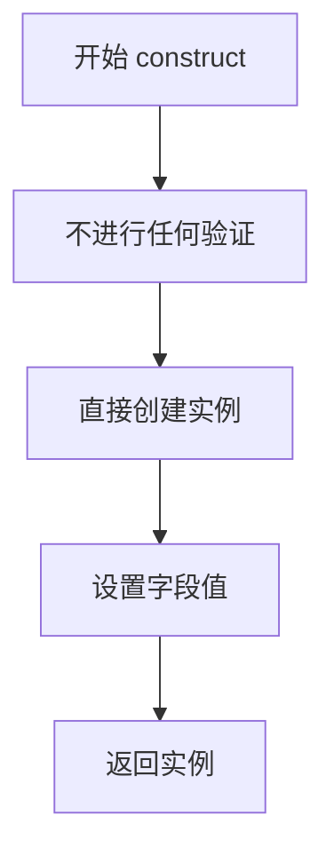

#### 带注释源码

```python
@classmethod
def construct(cls, _fields_set: Set[str] = None, **values: Any) -> CallToolParam:
    """
    构造模型实例（不验证）
    
    警告：此方法跳过所有验证，仅在确认数据安全时使用
    
    Args:
        _fields_set: 已设置字段的集合
        **values: 字段值
        
    Returns:
        未验证的CallToolParam实例
    """
    return super().construct(_fields_set=_fields_set, **values)
```

---

### `CallToolParam.copy`

复制模型实例，可选择是否包含默认值。

参数：

- `*`：可变位置参数
- `include`：可选，包含的字段集合
- `exclude`：可选，排除的字段集合
- `update`：可选，要更新的字段值字典
- `deep`：可选，是否深拷贝

返回值：`CallToolParam`，复制后的模型实例

#### 流程图

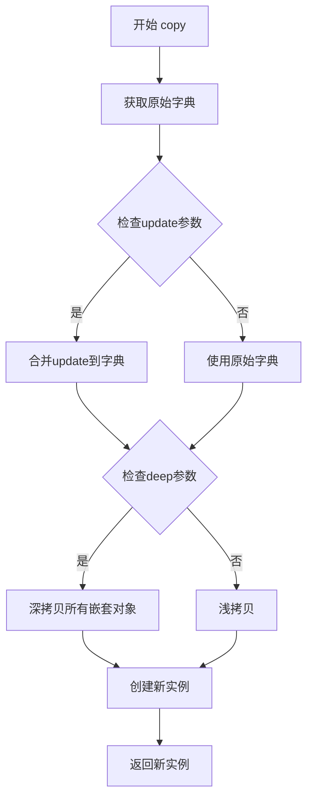

#### 带注释源码

```python
def copy(
    self,
    *,
    include: AbstractSet[str] = None,
    exclude: AbstractSet[str] = None,
    update: Dict[str, Any] = None,
    deep: bool = False,
) -> CallToolParam:
    """
    复制模型实例
    
    Args:
        include: 要包含的字段
        exclude: 要排除的字段
        update: 要更新的字段值
        deep: 是否深拷贝
        
    Returns:
        新的CallToolParam实例
    """
    return super().copy(
        include=include,
        exclude=exclude,
        update=update,
        deep=deep,
    )
```

---

### `CallToolParam.schema`

获取模型的JSON Schema，用于API文档生成和验证。

参数：

- `*`：可变位置参数
- `by_alias`：可选，是否使用别名
- `ref_template`：可选，引用模板
- `model_uri`：可选，模型URI

返回值：`Dict[str, Any]`，JSON Schema字典

#### 流程图

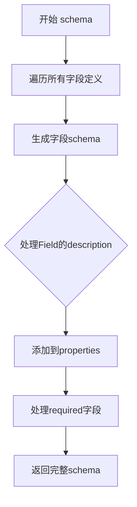

#### 带注释源码

```python
@classmethod
def schema(
    cls,
    *,
    by_alias: bool = True,
    ref_template: str = '#/definitions/{model}',
    model_uri: str = None,
) -> Dict[str, Any]:
    """
    获取模型的JSON Schema
    
    Returns:
        包含name和tool_input字段定义的JSON Schema
    """
    return super().schema(
        by_alias=by_alias,
        ref_template=ref_template,
        model_uri=model_uri,
    )
```

---

### `CallToolParam.validate`

验证数据是否为有效的模型实例。

参数：

- `*`：可变位置参数
- `obj`：任意值，待验证的数据
- `class`：可选，验证使用的类
- `type_`：可选，类型

返回值：`CallToolParam`，验证后的模型实例

#### 流程图

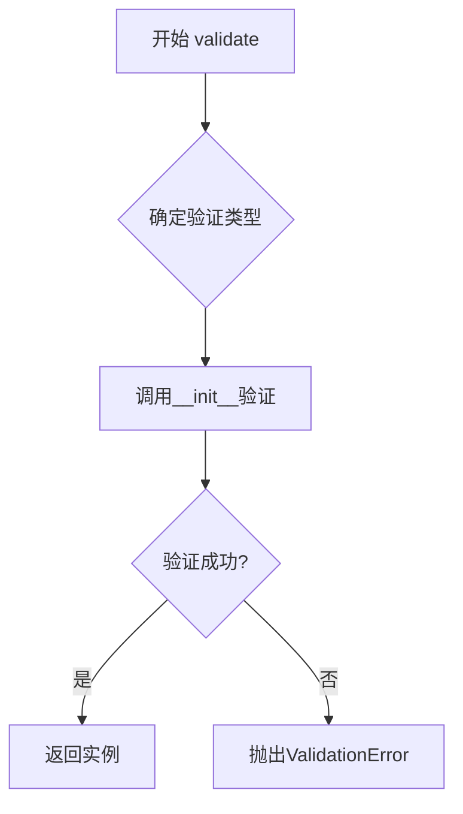

#### 带注释源码

```python
@classmethod
def validate(cls, obj: Any, *, class_: Type[BaseModel] = None, type_: Type = None) -> CallToolParam:
    """
    验证数据是否为有效的模型实例
    
    Args:
        obj: 待验证的数据（字典或CallToolParam）
        class_: 验证使用的模型类
        type_: 验证使用的类型
        
    Returns:
        验证后的CallToolParam实例
    """
    return super().validate(obj, class_=class_, type_=type_)
```

---

### `CallToolParam.parse_file`

从JSON文件解析为CallToolParam实例。

参数：

- `path`：Union[str, Path]，文件路径
- `*`：可变位置参数
- `content_type`：可选，内容类型
- `encoding`：可选，字符编码
- `proto`：可选，协议
- `allow_pickle`：可选，是否允许pickle

返回值：`CallToolParam`，解析后的模型实例

#### 流程图

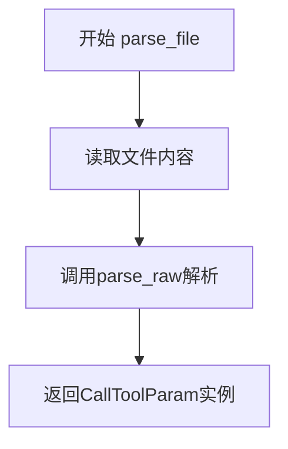

#### 带注释源码

```python
@classmethod
def parse_file(
    cls,
    path: Union[str, Path],
    *,
    content_type: str = None,
    encoding: str = 'utf-8',
    proto: Protocol = None,
    allow_pickle: bool = False,
) -> CallToolParam:
    """
    从文件解析模型实例
    
    Args:
        path: JSON文件路径
        content_type: 内容类型
        encoding: 文件编码
        proto: 解析协议
        allow_pickle: 是否允许pickle
        
    Returns:
        验证后的CallToolParam实例
    """
    return super().parse_file(
        path,
        content_type=content_type,
        encoding=encoding,
        proto=proto,
        allow_pickle=allow_pickle,
    )
```

---

### `BaseModel.from_orm`

从ORM对象创建Pydantic模型实例（ORM模式）。

参数：

- `obj`：任意，ORM对象

返回值：`CallToolParam`，转换后的模型实例

#### 流程图

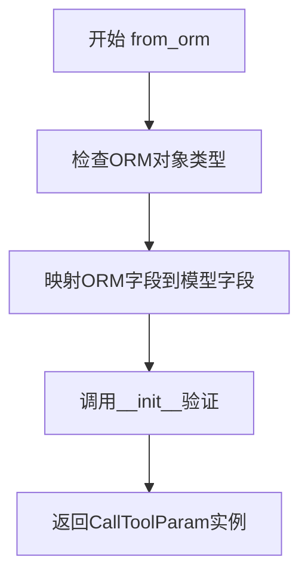

#### 带注释源码

```python
@classmethod
def from_orm(cls, obj: Any) -> CallToolParam:
    """
    从ORM对象创建模型实例
    
    注意：Pydantic v2中已废弃，使用model_validate替代
    
    Args:
        obj: ORM对象（如SQLAlchemy模型）
        
    Returns:
        验证后的CallToolParam实例
    """
    return super().from_orm(obj)
```

---

### `CallToolParam.model_validate`

Pydantic v2版本的数据验证方法（推荐使用）。

参数：

- `obj`：任意，待验证的数据
- `*`：可变位置参数
- `strict`：可选，是否严格模式
- `from_orm`：可选，是否从ORM验证

返回值：`CallToolParam`，验证后的模型实例

#### 流程图

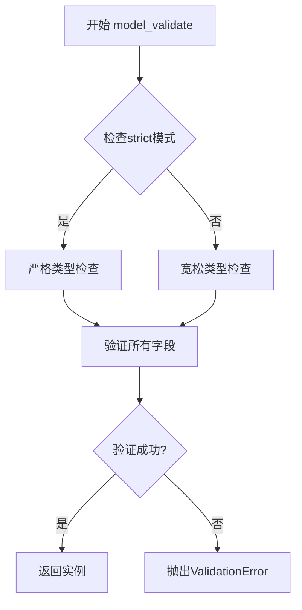

#### 带注释源码

```python
@classmethod
def model_validate(cls, obj: Any, *, strict: bool = None, from_orm: bool = False) -> CallToolParam:
    """
    验证数据并创建模型实例（Pydantic v2推荐方法）
    
    Args:
        obj: 待验证的数据（字典、ORM对象等）
        strict: 是否启用严格模式
        from_orm: 是否从ORM对象验证
        
    Returns:
        验证后的CallToolParam实例
    """
    return super().model_validate(obj, strict=strict, from_orm=from_orm)
```

---

### `CallToolParam.model_validate_json`

从JSON字符串直接验证并创建实例。

参数：

- `json_data`：Union[str, bytes, bytearray]，JSON数据
- `*`：可变位置参数
- `strict`：可选，是否严格模式
- `context`：可选，验证上下文

返回值：`CallToolParam`，验证后的模型实例

#### 流程图

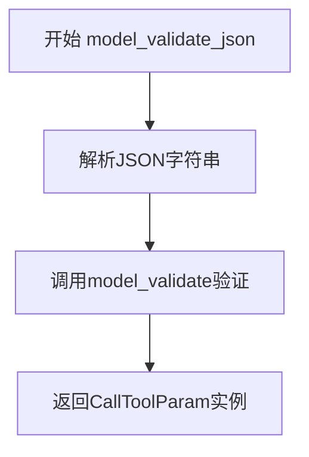

#### 带注释源码

```python
@classmethod
def model_validate_json(
    cls,
    json_data: Union[str, bytes, bytearray],
    *,
    strict: bool = None,
    context: Dict[str, Any] = None,
) -> CallToolParam:
    """
    从JSON字符串验证并创建实例（Pydantic v2方法）
    
    Args:
        json_data: JSON格式的字符串或字节
        strict: 是否启用严格模式
        context: 验证上下文
        
    Returns:
        验证后的CallToolParam实例
    """
    return super().model_validate_json(
        json_data,
        strict=strict,
        context=context,
    )
```


## 关键组件


### CallToolParam 类

Pydantic 数据模型类，用于定义工具调用的参数结构，包含工具名称和知识库输入信息两个字段。

### name 字段

字符串类型必填字段，用于指定要调用的工具名称。

### tool_input 字段

字典类型字段，用于传递知识库相关的输入信息。


## 问题及建议


### 已知问题

-   **多余的逗号**：第6行末尾有一个多余的逗号 `,`，虽然Python允许在最后一项后加逗号，但这看起来像是复制粘贴时的笔误，可能导致代码可读性问题。
-   **类型注解过于宽泛**：`tool_input: dict` 使用了宽泛的 `dict` 类型，无法利用 Pydantic 的类型验证和自动补全功能，建议使用 `Dict[str, Any]` 或定义具体的子模型。
-   **描述信息不够精确**：`tool_input` 字段的描述为"知识库信息"，但实际类型是 `dict`，描述与实际用途可能不符，建议补充说明字典应包含的具体结构。
- **缺少泛型导入**：如使用 `Dict[str, Any]` 类型，需要从 `typing` 模块导入 `Dict` 和 `Any`。

### 优化建议

-   移除第6行末尾多余的逗号，保持代码整洁。
-   将 `tool_input` 的类型注解改为 `Dict[str, Any]` 并添加必要的导入，或者根据实际业务需求定义具体的 Pydantic 模型类，以提高类型安全性和数据验证能力。
-   完善字段描述，明确说明 `tool_input` 字典的键值对结构和预期内容。
-   考虑为 `name` 字段添加长度限制或正则验证，如 `Field(..., min_length=1, description="工具名称")`。
-   如果 `tool_input` 是可选的，建议使用 `None` 作为默认值并将类型注解改为 `Optional[Dict[str, Any]]`。

## 其它


### 设计目标与约束

本模块旨在定义工具调用的参数结构，提供标准化的参数模型，确保工具名称和输入参数的格式统一。主要约束包括：name字段为必填项，tool_input为可选字典类型，支持Pydantic提供的自动验证和序列化功能。

### 错误处理与异常设计

代码本身未实现显式的错误处理逻辑，依赖于Pydantic框架的内置验证机制。当name字段缺失或类型不匹配时，Pydantic会抛出ValidationError。建议在实际调用层添加try-except块捕获验证异常，并转换为业务友好的错误信息。

### 数据流与状态机

该模型为静态数据结构，不涉及状态机设计。数据流为：外部输入 → CallToolParam模型实例化 → Pydantic验证 → 序列化输出。整个过程为单向流动，无状态变更。

### 外部依赖与接口契约

核心依赖为pydantic库（版本2.x）。该模型作为参数载体，不直接与外部系统交互。接口契约遵循Pydantic BaseModel规范，支持dict转换、JSON序列化等标准操作。

### 配置与参数说明

name参数：必填字符串，表示被调用工具的唯一标识符
tool_input参数：可选字典，默认值为空字典{}，用于传递工具所需的业务参数

### 安全性考虑

当前实现未包含敏感信息处理机制。在实际应用中，建议对tool_input中的敏感字段（如密码、密钥等）进行脱敏处理或加密存储，并避免在日志中输出完整参数信息。

### 性能考量

Pydantic v2采用Rust实现，验证性能优异。对于高频调用场景，建议对模型进行缓存复用，避免重复实例化。该模型本身为轻量级结构，性能开销可忽略不计。

### 兼容性设计

该代码依赖pydantic v2版本特性（如Field参数语法）。如需兼容pydantic v1，需要调整Field的导入方式和使用语法。建议在requirements.txt中明确标注pydantic>=2.0版本要求。

### 测试策略

建议编写以下测试用例：正常实例化与验证、name必填校验、tool_input默认值验证、类型错误校验、字典到模型的转换、模型到字典的序列化、JSON序列化与反序列化。

### 版本历史与变更记录

v1.0.0（初始版本）：创建CallToolParam模型类，定义name和tool_input两个字段。


    