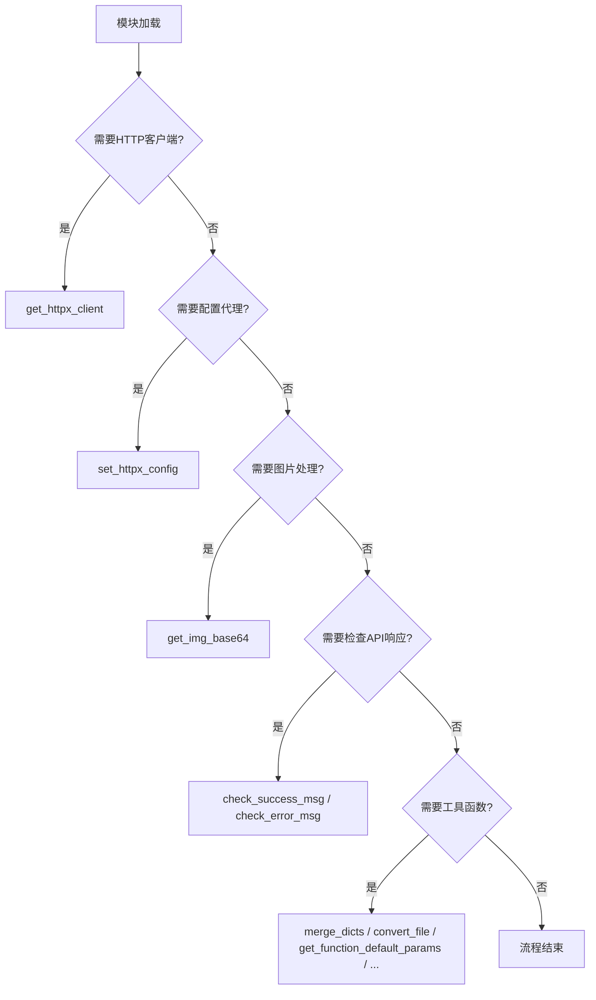
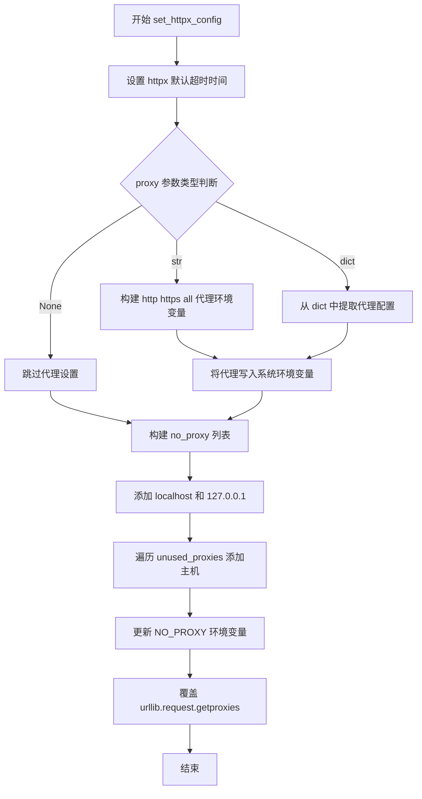
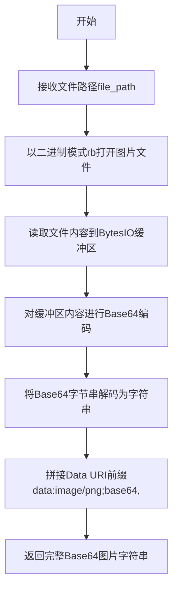
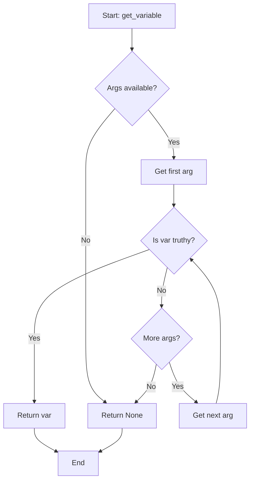
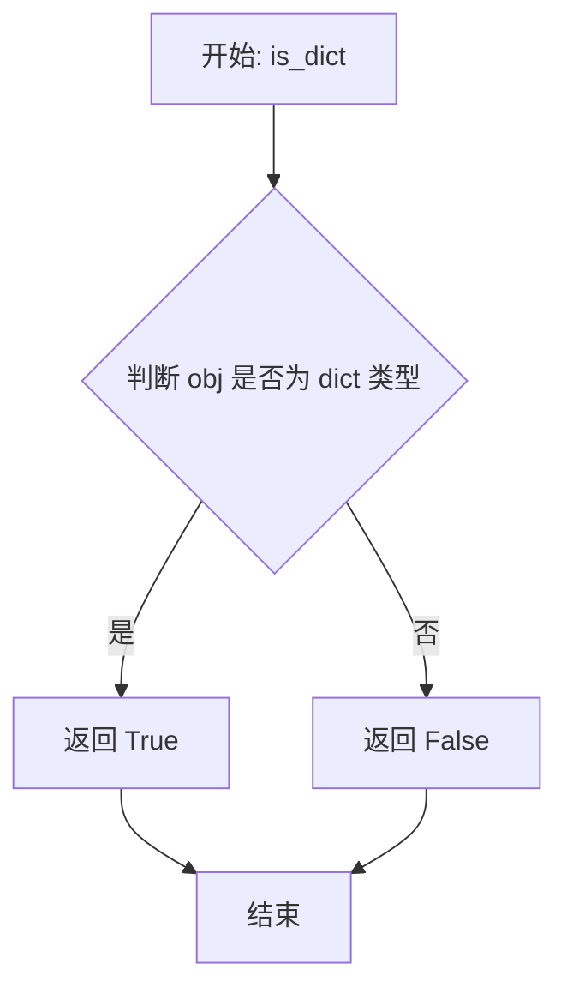
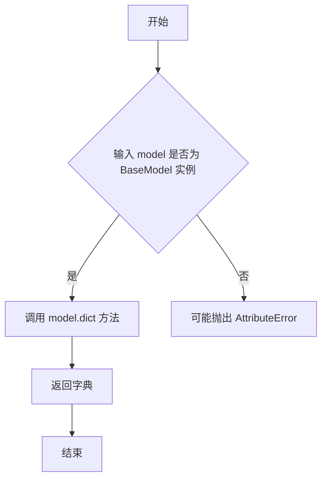
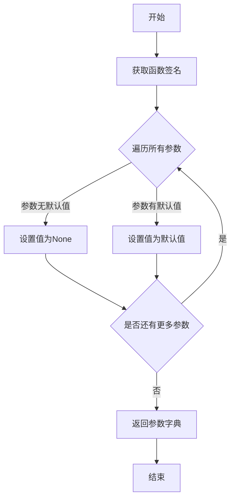
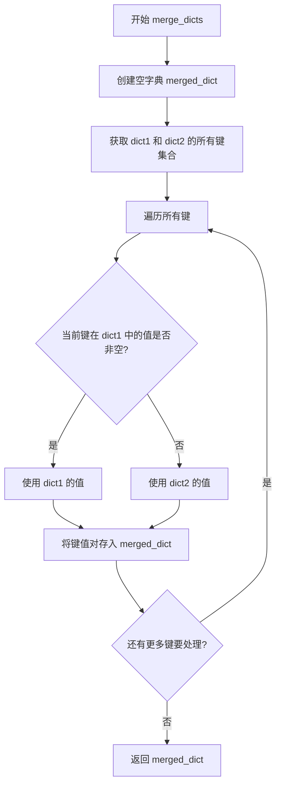
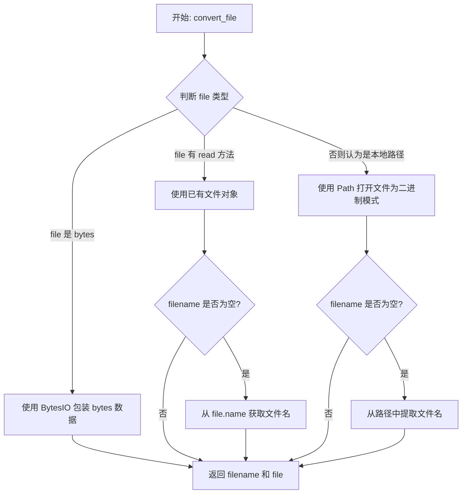

# `Langchain-Chatchat\libs\python-sdk\open_chatcaht\utils.py` 详细设计文档

这是一个通用的工具函数模块，主要提供HTTP客户端配置管理、代理设置、图片Base64编码、API响应检查、字典合并、函数参数获取以及文件转换为IO对象等功能，用于支撑整个项目的网络请求和数据处理流程。

## 整体流程



## 类结构

```
无类定义 (纯模块级函数集合)
所有函数均为模块级全局函数:
├── 网络相关: get_httpx_client, set_httpx_config
├── 图片处理: get_img_base64
├── API响应检查: check_success_msg, check_error_msg
└── 通用工具: get_variable, is_dict, model_to_dict, get_function_default_params, merge_dicts, convert_file
```

## 全局变量及字段


### `HTTPX_TIMEOUT`
    
全局常量，定义httpx客户端的默认超时时间（秒），用于控制HTTP请求的连接、读取、写入超时

类型：`float`
    


    

## 全局函数及方法


### `get_httpx_client`

该函数是一个辅助函数，用于创建配置了默认代理的 httpx 客户端，支持同步和异步模式，并自动绕过本地地址和用户指定的无需代理的服务地址。

参数：

- `use_async`：`bool`，是否返回异步客户端，默认为 `False`
- `proxies`：`Union[str, Dict]`，用户提供的代理配置，支持字符串或字典格式，默认为 `None`
- `timeout`：`float`，请求超时时间，默认为 `HTTPX_TIMEOUT`
- `unused_proxies`：`List[str]`，不需要使用代理的主机地址列表，默认为空列表
- `**kwargs`：其他传递给 httpx 客户端的关键字参数

返回值：`Union[httpx.Client, httpx.AsyncClient]`，返回配置好的 httpx 同步或异步客户端

#### 流程图

```mermaid
flowchart TD
    A[开始] --> B[初始化默认代理字典<br/>排除 127.0.0.1 和 localhost]
    B --> C[遍历 unused_proxies<br/>添加不需要代理的 host]
    C --> D{检查环境变量代理}
    D --> E[读取 http_proxy/https_proxy/all_proxy]
    E --> F[更新默认代理字典]
    F --> G[处理 no_proxy 环境变量<br/>添加 all:// 前缀]
    G --> H{proxies 参数类型}
    H -->|str| I[转换为 dict: {all://: proxies}]
    H -->|dict| J[直接更新默认代理]
    H -->|None| K[跳过]
    I --> J
    J --> L[合并用户代理到默认代理]
    L --> M[构造 kwargs<br/>包含 timeout 和 proxies]
    M --> N{use_async 是否为 True}
    N -->|是| O[返回 httpx.AsyncClient]
    N -->|否| P[返回 httpx.Client]
    O --> Q[结束]
    P --> Q
```

#### 带注释源码

```python
def get_httpx_client(
        use_async: bool = False,
        proxies: Union[str, Dict] = None,
        timeout: float = HTTPX_TIMEOUT,
        unused_proxies: List[str] = [],
        **kwargs,
) -> Union[httpx.Client, httpx.AsyncClient]:
    """
    helper to get httpx client with default proxies that bypass local addesses.
    """
    # 初始化默认代理字典，排除本地地址不使用代理
    default_proxies = {
        # do not use proxy for locahost
        "all://127.0.0.1": None,
        "all://localhost": None,
    }
    
    # 将用户指定的无需代理的服务器地址加入排除列表
    # do not use proxy for user deployed fastchat servers
    for x in unused_proxies:
        # 取主机名和端口的前两部分组成 host
        host = ":".join(x.split(":")[:2])
        default_proxies.update({host: None})

    # 从系统环境变量获取代理配置
    # proxy not str empty string, None, False, 0, [] or {}
    default_proxies.update(
        {
            "http://": (
                os.environ.get("http_proxy")
                if os.environ.get("http_proxy")
                   and len(os.environ.get("http_proxy").strip())
                else None
            ),
            "https://": (
                os.environ.get("https_proxy")
                if os.environ.get("https_proxy")
                   and len(os.environ.get("https_proxy").strip())
                else None
            ),
            "all://": (
                os.environ.get("all_proxy")
                if os.environ.get("all_proxy")
                   and len(os.environ.get("all_proxy").strip())
                else None
            ),
        }
    )
    
    # 处理 no_proxy 环境变量，设置不使用代理的域名
    for host in os.environ.get("no_proxy", "").split(","):
        if host := host.strip():
            # default_proxies.update({host: None}) # Origin code
            default_proxies.update(
                {"all://" + host: None}
            )  # PR 1838 fix, if not add 'all://', httpx will raise error

    # 合并用户提供的代理配置
    # merge default proxies with user provided proxies
    if isinstance(proxies, str):
        # 如果是字符串，转换为字典格式，应用到所有协议
        proxies = {"all://": proxies}

    if isinstance(proxies, dict):
        # 字典格式直接更新默认代理，用户配置优先
        default_proxies.update(proxies)

    # 构造客户端参数，包含超时和代理配置
    kwargs.update(timeout=timeout, proxies=default_proxies)

    # 根据 use_async 参数返回对应类型的客户端
    if use_async:
        return httpx.AsyncClient(**kwargs)
    else:
        return httpx.Client(**kwargs)
```


# set_httpx_config 详细设计文档

### `set_httpx_config`

该函数用于配置 httpx 库的默认超时时间、系统级代理以及无代理列表，确保在请求 LLM 服务时有足够的超时时间，同时将本地服务地址和用户部署的 fastchat 服务器加入代理黑名单，避免代理请求错误。

参数：

- `timeout`：`float`，超时时间（秒），默认值为 `HTTPX_TIMEOUT`，用于设置 httpx 的 connect、read、write 超时时间
- `proxy`：`Union[str, Dict]`，代理设置，支持字符串（统一代理）或字典（分别设置 http/https/all 代理），默认为 `None`
- `unused_proxies`：`List[str]`，无需代理的主机地址列表，格式为 `host:port`，默认值为空列表

返回值：`None`，该函数无返回值，仅执行配置操作

#### 流程图



#### 带注释源码

```python
def set_httpx_config(
        timeout: float = HTTPX_TIMEOUT,
        proxy: Union[str, Dict] = None,
        unused_proxies: List[str] = [],
):
    """
    设置httpx默认timeout。httpx默认timeout是5秒，在请求LLM回答时不够用。
    将本项目相关服务加入无代理列表，避免fastchat的服务器请求错误。(windows下无效)
    对于chatgpt等在线API，如要使用代理需要手动配置。搜索引擎的代理如何处置还需考虑。
    """

    # 导入 os 模块用于操作环境变量
    import os

    # 导入 httpx 模块用于配置超时
    import httpx

    # ==================== 1. 设置 httpx 默认超时时间 ====================
    # httpx 默认超时为 5 秒，调用方传入的 timeout 通常更大（如 120 秒）
    # 以满足 LLM 请求的长时间响应需求
    httpx._config.DEFAULT_TIMEOUT_CONFIG.connect = timeout   # 连接超时
    httpx._config.DEFAULT_TIMEOUT_CONFIG.read = timeout       # 读取超时
    httpx._config.DEFAULT_TIMEOUT_CONFIG.write = timeout      # 写入超时

    # ==================== 2. 在进程范围内设置系统级代理 ====================
    # 初始化空字典存储代理配置
    proxies = {}
    
    # 如果 proxy 是字符串，统一设置 http/https/all 代理
    if isinstance(proxy, str):
        for n in ["http", "https", "all"]:
            proxies[n + "_proxy"] = proxy
    # 如果 proxy 是字典，分别提取各协议代理配置
    # 支持两种 key 格式：'http'/'https'/'all' 或 'http_proxy'/'https_proxy'/'all_proxy'
    elif isinstance(proxy, dict):
        for n in ["http", "https", "all"]:
            if p := proxy.get(n):
                proxies[n + "_proxy"] = p
            elif p := proxy.get(n + "_proxy"):
                proxies[n + "_proxy"] = p

    # 将代理配置写入操作系统环境变量
    for k, v in proxies.items():
        os.environ[k] = v

    # ==================== 3. 设置无代理主机列表 ====================
    # 从现有环境变量读取 no_proxy 配置
    no_proxy = [
        x.strip() for x in os.environ.get("no_proxy", "").split(",") if x.strip()
    ]
    
    # 添加本机地址到无代理列表（httpx 内部会使用这些地址）
    no_proxy += [
        # 不对本地地址使用代理
        "http://127.0.0.1",
        "http://localhost",
    ]
    
    # 遍历用户传入的 unused_proxies，提取 host:port 格式的主机
    # 将其加入无代理列表，避免代理导致 fastchat 服务器请求错误
    for x in unused_proxies:
        host = ":".join(x.split(":")[:2])  # 取前两部分作为主机地址
        if host not in no_proxy:
            no_proxy.append(host)
    
    # 写入 NO_PROXY 环境变量（注意：HTTP 库通常使用大写格式）
    os.environ["NO_PROXY"] = ",".join(no_proxy)

    # ==================== 4. 覆盖 urllib 请求的代理获取函数 ====================
    # urllib.request.getproxies() 会被 HTTP 库用于获取系统代理
    # 这里用内部 proxies 变量覆盖它，确保使用本函数设置的代理配置
    def _get_proxies():
        """返回当前配置的代理字典"""
        return proxies

    import urllib.request
    
    # 覆盖 urllib 的代理获取函数，使其返回本函数设置的代理
    urllib.request.getproxies = _get_proxies
```


### `get_img_base64`

该函数用于将本地图片文件转换为 Base64 编码的 Data URI 格式字符串，以便在 Streamlit 等 Web 应用中直接嵌入显示图片，无需额外的图片托管服务。

参数：

- `file_path`：`str`，图片文件的本地路径

返回值：`str`，返回 Base64 编码的图片数据，格式为 `data:image/png;base64,{base64字符串}`

#### 流程图



#### 带注释源码

```python
def get_img_base64(file_path: str) -> str:
    """
    get_img_base64 used in streamlit.
    将本地图片转换为Base64编码的Data URI格式
    """
    # 将传入的文件路径赋值给局部变量image
    image = file_path
    
    # 读取图片：以二进制只读模式打开文件
    with open(image, "rb") as f:
        # 将文件内容读取到BytesIO缓冲区
        buffer = BytesIO(f.read())
        # 对缓冲区内容进行Base64编码，并解码为UTF-8字符串
        base_str = base64.b64encode(buffer.getvalue()).decode()
    
    # 返回拼接好的Data URI格式字符串，可直接在HTML或Streamlit中显示
    return f"data:image/png;base64,{base_str}"
```


### `check_success_msg`

用于检查 API 响应数据是否成功（code == 200），若成功则返回指定键的值，否则返回空字符串。

参数：

- `data`：`Union[str, dict, list]`，待检查的 API 响应数据
- `key`：`str`，成功响应中要获取的键名，默认为 "msg"

返回值：`str`，若数据为字典、包含指定键、且 code 等于 200，则返回对应键的值；否则返回空字符串

#### 流程图

```mermaid
flowchart TD
    A([Start]) --> B{data 是 dict?}
    B -->|是| C{key 在 data 中?}
    B -->|否| G[返回 ""]
    C -->|是| D{'code' 在 data 中?}
    C -->|否| G
    D -->|是| E{data['code'] == 200?}
    D -->|否| G
    E -->|是| F[返回 data[key]]
    E -->|否| G
    F --> H([End])
    G --> H
```

#### 带注释源码

```python
def check_success_msg(data: Union[str, dict, list], key: str = "msg") -> str:
    """
    return error message if error occured when requests API
    """
    # 检查数据是否为字典类型，且包含指定的键和 code 字段
    if (
            isinstance(data, dict)          # 确保 data 是字典类型
            and key in data                 # 确保传入的键名存在于 data 中
            and "code" in data              # 确保 data 包含 code 字段
            and data["code"] == 200        # 确保 code 值为 200 表示成功
    ):
        return data[key]                    # 返回成功消息
    return ""                               # 不满足条件时返回空字符串
```


### `check_error_msg`

该函数用于检查并返回 API 请求响应中的错误消息。如果响应数据是字典类型，首先检查是否存在指定的错误消息键（如 errorMsg），若不存在则检查响应状态码是否非 200，如果是则返回通用的错误消息字段（msg），否则返回空字符串。

参数：

- `data`：`Union[str, dict, list]`，API 响应数据，可以是字符串、字典或列表类型
- `key`：`str`，错误消息的键名，默认为 "errorMsg"，用于在字典中查找错误消息

返回值：`str`，返回找到的错误消息字符串，若未找到则返回空字符串

#### 流程图

```mermaid
flowchart TD
    A[开始 check_error_msg] --> B{data 是否为 dict?}
    B -- 否 --> F[返回空字符串 '']
    B -- 是 --> C{key 是否在 data 中?}
    C -- 是 --> D[返回 data[key]]
    C -- 否 --> E{code 是否在 data 中<br/>且 data['code'] != 200?}
    E -- 是 --> G[返回 data['msg']]
    E -- 否 --> F
```

#### 带注释源码

```python
def check_error_msg(data: Union[str, dict, list], key: str = "errorMsg") -> str:
    """
    return error message if error occured when requests API
    """
    # 检查输入数据是否为字典类型
    if isinstance(data, dict):
        # 优先检查是否存在指定的错误消息键（如 errorMsg）
        if key in data:
            return data[key]
        # 若指定的键不存在，则检查响应状态码是否为非 200 错误
        if "code" in data and data["code"] != 200:
            # 返回通用错误消息字段 msg
            return data["msg"]
    # 非字典类型或未找到错误信息时返回空字符串
    return ""
```


### `get_variable`

返回传入的第一个非空（truthy）参数，如果所有参数都为空则返回 None。这是一个简单的参数选择函数，常用于从多个可能的值中选取第一个有效值。

参数：

- `*args`：`Any`，可变数量的参数，用于检查并返回第一个非空值

返回值：`Any`，返回第一个非空（truthy）的参数值，如果所有参数都为空（falsy）则返回 None

#### 流程图



#### 带注释源码

```python
def get_variable(*args):
    """
    获取第一个非空的参数值。
    
    遍历所有传入的参数，返回第一个非空（truthy）的值。
    如果所有参数都为空（falsy），则返回 None。
    
    参数:
        *args: 可变数量的参数，用于检查并返回第一个非空值
        
    返回:
        Any: 返回第一个非空的参数值，如果所有参数都为空则返回 None
    """
    # 遍历所有传入的参数
    for var in args:
        # 检查当前参数是否为空（falsy）
        # falsy 值包括: None, False, 0, '', [], {}, 等
        if var:
            # 如果参数非空，立即返回该值
            return var
    # 所有参数都为空，返回 None
    return None
```


### `is_dict`

这是一个类型守卫（TypeGuard）函数，用于在运行时检查给定对象是否为字典类型，同时帮助类型检查器在后续代码中更准确地推断该对象的类型。

参数：

- `obj`：`object`，需要检查的对象，可以是任意类型的值

返回值：`TypeGuard[dict[object, object]]`，如果对象是字典类型返回 `True`，否则返回 `False`

#### 流程图



#### 带注释源码

```python
def is_dict(obj: object) -> TypeGuard[dict[object, object]]:
    """
    类型守卫函数，检查对象是否为字典类型。
    
    参数:
        obj (object): 需要检查的对象，可以是任意类型
    
    返回:
        TypeGuard[dict[object, object]]: 
            如果 obj 是字典类型返回 True，
            否则返回 False。
            该返回值类型会帮助类型检查器在条件分支中
            缩小 obj 的类型为 dict[object, object]
    """
    return isinstance(obj, dict)
```


### `model_to_dict`

这是一个简洁的辅助函数，用于将 Pydantic 的 `BaseModel` 实例转换为其字典表示形式。该函数封装了 Pydantic 模型内置的 `.dict()` 方法，提供了统一的模型序列化接口。

参数：

- `model`：`BaseModel`，待转换的 Pydantic BaseModel 实例

返回值：`dict[str, object]`，返回模型的字典表示形式

#### 流程图



#### 带注释源码

```python
def model_to_dict(model: BaseModel) -> dict[str, object]:
    """
    将 Pydantic BaseModel 模型实例转换为字典。
    
    参数:
        model (BaseModel): Pydantic BaseModel 的实例对象。
    
    返回:
        dict[str, object]: 包含模型所有字段及其值的字典。
    """
    return model.dict()
```

---

#### 潜在的技术债务或优化空间

1. **缺少类型验证**：函数未对输入参数进行类型检查，如果传入非 BaseModel 实例会抛出不够友好的 AttributeError。
2. **返回值类型泛化**：`dict[str, object]` 可进一步细化为更具体的类型定义，提升类型安全性和代码可读性。
3. **功能单一**：该函数仅调用了 Pydantic v1 的 `.dict()` 方法，未兼容 Pydantic v2 的 `.model_dump()` 方法（v2 中 `.dict()` 已标记为废弃）。
4. **缺乏错误处理**：没有提供降级方案或明确的异常抛出策略。

#### 其它项目

**设计目标与约束：**

- 目标：提供简洁的模型序列化接口
- 约束：依赖 Pydantic 库的实现

**错误处理与异常设计：**

- 当前未做显式错误处理，依赖 Pydantic 内部异常机制

**外部依赖与接口契约：**

- 依赖 `pydantic.BaseModel` 类
- 输入必须为 Pydantic 模型实例


### `get_function_default_params`

获取函数的参数及其默认值。

参数：

- `func`：`Callable`，要分析的函数

返回值：`Dict[str, Any]`，一个包含参数名称及其默认值的字典

#### 流程图



#### 带注释源码

```python
def get_function_default_params(func) -> dict:
    """
    获取函数的参数及其默认值。

    参数:
        func (function): 要分析的函数。

    返回:
        dict: 一个包含参数名称及其默认值的字典。
    """
    # 使用 inspect 模块获取函数的签名对象
    signature = inspect.signature(func)
    
    # 从签名对象中获取所有参数的信息
    params = signature.parameters
    
    # 初始化用于存储结果的字典
    params_dict = {}

    # 遍历每个参数
    for param_name, param in params.items():
        # 检查参数是否有默认值
        # inspect.Parameter.empty 表示没有默认值
        if param.default is inspect.Parameter.empty:
            # 没有默认值时，设置为 None
            params_dict[param_name] = None
        else:
            # 有默认值时，使用默认值
            params_dict[param_name] = param.default

    # 返回包含所有参数及其默认值的字典
    return params_dict
```


### `merge_dicts`

合并两个字典，优先使用第一个字典中的非空值。

参数：

- `dict1`：`dict`，第一个字典
- `dict2`：`dict`，第二个字典

返回值：`dict`，合并后的字典

#### 流程图



#### 带注释源码

```python
def merge_dicts(dict1, dict2) -> dict:
    """
    合并两个字典，优先使用第一个字典中的非空值。

    参数:
        dict1 (dict): 第一个字典。
        dict2 (dict): 第二个字典。

    返回:
        dict: 合并后的字典。
    """
    merged_dict = {}

    # 遍历两个字典的键集合
    all_keys = set(dict1.keys()).union(set(dict2.keys()))

    for key in all_keys:
        # 获取两个字典中当前键对应的值
        value1 = dict1.get(key)
        value2 = dict2.get(key)

        # 如果第一个字典中的值不为空，使用第一个字典的值
        if value1:
            merged_dict[key] = value1
        else:
            # 否则使用第二个字典中的值
            merged_dict[key] = value2

    return merged_dict
```


### `convert_file`

该函数用于将不同形式的输入（原始字节流、文件对象或本地文件路径）统一转换为标准的文件对象（BytesIO 或打开的二进制文件）和文件名，方便后续处理。

参数：

- `file`：`Union[bytes, IO, str]`，输入文件，可以是原始字节数据、具有 read 方法的文件对象、或本地文件路径
- `filename`：`Optional[str]`，可选参数，用于指定返回的文件名，如果未提供则从文件对象或路径中推断

返回值：`Tuple[str, Union[BytesIO, IO[bytes]]]`，返回文件名和转换后的文件对象组成的元组

#### 流程图



#### 带注释源码

```python
def convert_file(file, filename=None):
    """
    将不同形式的文件输入转换为统一的文件对象和文件名。
    
    参数:
        file: 可以是 bytes、文件对象或文件路径
        filename: 可选的文件名
    
    返回:
        (filename, file) 元组
    """
    # 如果输入是原始字节数据，使用 BytesIO 包装
    if isinstance(file, bytes):  # raw bytes
        file = BytesIO(file)
    # 如果输入是文件对象（有 read 方法），直接使用
    elif hasattr(file, "read"):  # a file io like object
        # 如果未提供文件名，从文件对象属性获取
        filename = filename or file.name
    # 否则认为是本地文件路径
    else:  # a local path
        # 使用 Path 转换为绝对路径并以二进制模式打开
        file = Path(file).absolute().open("rb")
        # 如果未提供文件名，从路径中提取文件名
        filename = filename or os.path.split(file.name)[-1]
    return filename, file
```

## 关键组件


### HTTPX客户端配置组件

负责创建和配置httpx客户端，处理代理、超时等网络请求参数。

### 代理配置管理组件

构建默认代理字典，绕过本地地址和用户部署的fastchat服务器，并从环境变量读取系统代理。

### 超时配置组件

设置httpx全局超时配置，默认超时为5秒，在请求LLM回答时可能不够用。

### 系统级代理环境变量设置组件

在进程范围内设置HTTP/HTTPS/ALL代理环境变量，并配置NO_PROXY列表。

### 图片Base64编码组件

将本地图片文件读取并转换为Data URL格式的Base64字符串，用于streamlit展示。

### API响应检查组件

检查API响应数据中的成功消息和错误消息，支持字典结构中的code字段判断。

### 通用变量获取组件

从多个参数中返回第一个非空值，用于参数优先级选择。

### 类型守卫组件

TypeGuard函数，用于类型检查时判断对象是否为字典类型。

### Pydantic模型转换组件

将Pydantic BaseModel对象转换为普通字典格式。

### 函数参数反射组件

通过inspect模块获取函数的参数名称及其默认值，返回参数字典。

### 字典合并组件

合并两个字典，优先使用第一个字典中的非空值，用于配置覆盖场景。

### 文件格式转换组件

将多种输入形式（字节流、文件对象、文件路径）统一转换为文件名和文件对象的格式，便于后续处理。


## 问题及建议


### 已知问题

-   **副作用问题**：`get_httpx_client`函数直接遍历修改`unused_proxies`参数，会导致调用者传入的列表被意外修改
-   **私有API访问**：`set_httpx_config`直接修改`httpx._config.DEFAULT_TIMEOUT_CONFIG`，这是httpx的内部实现，未来版本可能失效
-   **全局状态污染**：`set_httpx_config`修改`urllib.request.getproxies`会影响到整个进程，可能与其他库产生冲突
-   **重复代码**：`get_httpx_client`和`set_httpx_config`实现了相似的代理配置逻辑，存在代码重复
-   **过时API使用**：`model_to_dict`使用`model.dict()`方法，这是Pydantic v1的API，在v2中已废弃
-   **导入顺序不一致**：`set_httpx_config`内部重复导入`os`和`httpx`，而这些已在文件顶部导入
-   **类型提示不完整**：`get_function_default_params`、`merge_dicts`、`convert_file`等函数的参数和返回值缺少类型注解
-   **命名不一致**：`get_img_base64`参数名为`file_path`但实际使用变量名`image`，容易引起混淆
-   **功能局限性**：`get_img_base64`硬编码只支持`png`格式图片，缺乏灵活性
-   **错误处理缺失**：文件操作（`get_img_base64`、`convert_file`）没有异常处理，文件不存在时会直接崩溃
-   **逻辑判断不严谨**：`merge_dicts`使用`if value1`判断，对于值为`0`、`False`等falsy值会误认为空

### 优化建议

-   **修复副作用**：在`get_httpx_client`中遍历`unused_proxies`时使用副本，避免修改原列表
-   **移除私有API访问**：使用httpx提供的公共API设置超时，或在创建Client时传递timeout参数
-   **解耦全局状态**：将代理配置局部化，避免修改`urllib.request.getproxies`，或使用上下文管理器
-   **提取公共逻辑**：将代理配置的共同逻辑抽取为独立函数，减少重复代码
-   **升级API**：将`model.dict()`替换为`model.model_dump()`以兼容Pydantic v2
-   **统一导入**：移除`set_httpx_config`内部的重复导入，保持导入顺序一致
-   **完善类型注解**：为所有函数添加完整的类型提示，包括泛型
-   **统一命名规范**：确保参数名与实际使用变量名一致
-   **增强灵活性**：`get_img_base64`应根据图片实际扩展名设置MIME类型
-   **添加异常处理**：为文件操作添加try-except捕获FileNotFoundError等异常
-   **改进空值判断**：使用`if value1 is not None`替代`if value1`，正确处理falsy值
-   **代码风格统一**：注释语言保持一致，中文注释配中文docstring，英文注释配英文docstring


## 其它


### 设计目标与约束

本模块的设计目标是为open_chatchat项目提供统一的HTTP客户端配置管理能力，支持同步/异步客户端、代理配置、超时设置和图片处理等功能。核心约束包括：1) 仅支持httpx库作为HTTP客户端；2) 代理配置需兼容Windows和Linux环境；3) 超时配置需覆盖连接、读取、写入三种场景；4) 不对本地地址和fastchat服务器使用代理。

### 错误处理与异常设计

本模块主要涉及三类错误场景：1) 代理环境变量为空或格式错误时，get_httpx_client函数通过条件判断返回None而非抛出异常；2) 图片文件不存在时，get_img_base64会抛出FileNotFoundError；3) 参数类型不匹配时，set_httpx_config通过isinstance进行类型检查并做容错处理。所有HTTP请求层面的错误由调用方负责捕获和处理，本模块仅提供错误消息提取工具函数check_success_msg和check_error_msg。

### 数据流与状态机

本模块为工具函数集合，不涉及复杂的状态机。数据流向如下：环境变量(http_proxy/https_proxy/no_proxy) -> parse_proxies() -> default_proxies字典 -> httpx.Client/AsyncClient构造。set_httpx_config函数会修改进程级全局状态(httpx._config.DEFAULT_TIMEOUT_CONFIG和urllib.request.getproxies)，这些修改在进程生命周期内持续有效。

### 外部依赖与接口契约

本模块依赖以下外部包：httpx(>=0.24.0)用于HTTP客户端、pydantic(>=2.0)用于模型处理、typing_extensions用于TypeGuard类型守卫。主要接口契约包括：get_httpx_client返回Union[httpx.Client, httpx.AsyncClient]；set_httpx_config无返回值；get_img_base64返回base64编码的data URI字符串；convert_file返回(filename, file_object)元组。

### 配置说明

模块级配置通过HTTPX_TIMEOUT常量控制，默认超时时长从open_chatchat._constants模块导入。运行时配置通过函数参数传入，支持proxies(str或dict)、timeout(float)、unused_proxies(List[str])三种配置项。环境变量优先级：显式传入参数 > 环境变量 > 默认值。

### 使用示例

```python
# 同步客户端
client = get_httpx_client(use_async=False, timeout=30.0)

# 异步客户端
async_client = get_httpx_client(use_async=True, proxies="http://proxy:8080")

# 设置全局超时和代理
set_httpx_config(timeout=60.0, proxy="http://proxy:8080")

# 图片转base64
img_b64 = get_img_base64("/path/to/image.png")

# 检查响应
success_msg = check_success_msg(response_data)
error_msg = check_error_msg(response_data)
```

### 性能考虑

get_httpx_client每次调用都会创建新的Client实例，如需复用应自行管理实例生命周期。set_httpx_config修改全局配置为一次性操作，重复调用会覆盖之前设置。get_img_base64在读取大文件时可能阻塞，建议在独立线程中调用或使用异步IO。

### 安全性考虑

代理配置可能包含敏感凭证，应避免在日志中输出proxies内容。get_img_base64直接读取文件系统，需确保file_path参数来源可信，防止路径穿越攻击。环境变量读取时需验证proxy URL格式，防止注入恶意参数。

### 兼容性说明

本模块主要兼容Python 3.8+版本。set_httpx_config中的urllib.request.getproxies Monkey Patch在Windows平台可能无效(no_proxy功能)。httpx 0.24版本后改变了代理配置格式，需使用all://前缀才能正确处理所有协议的代理绕过。

### 常见问题排查

问题1：代理配置不生效。排查步骤：确认环境变量http_proxy/https_proxy已正确设置；检查unused_proxies是否包含目标主机；验证httpx版本>=0.24。

问题2：超时设置无效。排查步骤：确认调用set_httpx_config在请求前执行；检查timeout参数类型为float而非int；验证httpx._config.DEFAULT_TIMEOUT_CONFIG已被正确修改。

问题3：本地请求被代理拦截。排查步骤：确认no_proxy环境变量包含127.0.0.1和localhost；检查set_httpx_config中no_proxy列表是否包含目标地址。


    