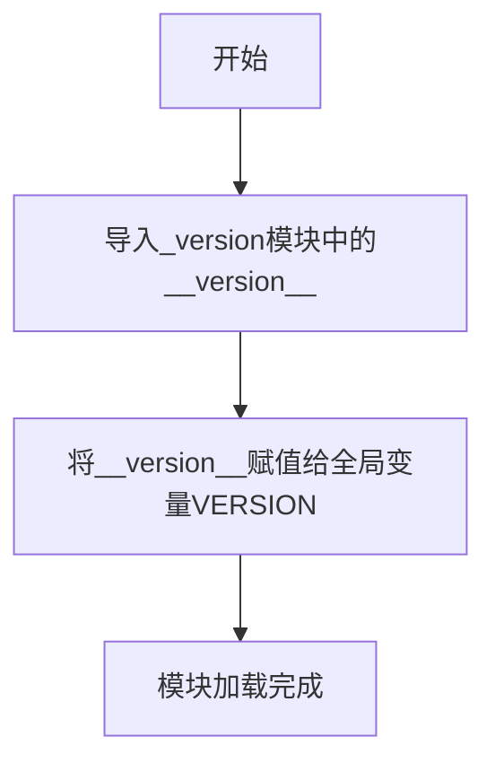

# `Langchain-Chatchat\libs\python-sdk\open_chatcaht\version.py` 详细设计文档

这是一个简单的版本管理模块，通过从内部_version模块导入__version__并赋值给全局变量VERSION来统一管理项目版本号。

## 整体流程



## 类结构

```
version.py (版本管理模块)
```

## 全局变量及字段


### `VERSION`
    
从_version模块导入的版本号字符串，表示当前包的版本信息

类型：`str`
    


    

## 全局函数及方法


## 关键组件


### VERSION 全局变量

该全局变量用于存储包的版本信息，通过从内部模块 `_version` 导入 `__version__` 并重新导出，供包外部使用。

### 潜在的技术债务或优化空间

1. **类型注解不够精确**：虽然标注了 `str` 类型，但如果 `_version` 模块的 `__version__` 不是字符串类型，会导致运行时错误
2. **缺乏版本解析**：可以直接使用 `packaging.version` 或类似库对版本进行解析和验证，而不仅仅是字符串存储
3. **缺少版本比较功能**：可添加版本比较、格式验证等辅助功能
4. **无错误处理**：如果 `_version` 模块不存在或导入失败，会直接抛出异常

### 其它项目

- **设计目标**：提供统一的版本访问入口，符合 Python 包的最佳实践
- **约束**：依赖 `_version` 模块的存在，该模块通常由版本管理工具（如 setuptools-scm）自动生成
- **错误处理**：当前无错误处理，导入失败会直接抛出 ImportError
- **数据流**：版本信息从 `_version` 模块流向包的使用者
- **外部依赖**：无额外外部依赖，仅需确保 `_version` 模块存在


## 问题及建议


### 已知问题

-   缺少对 `_version` 模块存在性的显式检查，直接导入可能导致隐式的 `ImportError`
-   缺少模块级文档字符串（docstring），无法了解该模块的设计意图和使用方式
-   没有定义 `__all__` 明确导出公共 API，削弱了包的内聚性和封装性
-   未使用 `typing.Final` 强化 `VERSION` 的不可变性声明
-   版本号未做格式验证，无法保证符合 PEP 440 版本规范
-   完全依赖 `_version` 模块，属于单点故障，缺乏降级处理或错误提示

### 优化建议

-   添加模块级文档字符串，说明该模块负责版本号的管理和导出
-   使用 `__all__ = ["VERSION", "__version__"]` 明确公开接口
-   引入 `typing.Final` 强化不可变声明：`VERSION: Final[str] = __version__`
-   添加异常处理，提供更友好的错误信息，例如 `try...except ImportError`
-   可选：添加版本格式验证函数，确保符合语义化版本或 PEP 440 规范
-   可选：在 `__init__.py` 中从上层统一管理版本号，降低模块间耦合


## 其它


### 设计目标与约束

本模块的核心目标是为整个项目提供统一的版本信息访问接口，确保版本号在项目内部保持一致性和可追溯性。设计约束包括：版本号必须从`_version`模块导入，不得硬编码；VERSION变量为只读常量；保持最小依赖原则，不引入额外的第三方依赖。

### 错误处理与异常设计

本模块不涉及复杂的业务逻辑，错误场景较少。主要可能的错误为`_version`模块不存在或未定义`__version__`变量。若发生导入错误，应向上传播`ImportError`或`AttributeError`，由调用方处理。模块级别不进行异常捕获，保证错误信息的透明性。

### 外部依赖与接口契约

本模块仅依赖内部模块`_version`。`_version`模块由项目构建工具（如setuptools、poetry）在构建时自动生成，包含项目版本字符串。接口契约要求：`_version.__version__`必须为字符串类型，且符合语义化版本规范（SemVer）。VERSION变量为模块级常量，类型为str，调用方应将其视为只读。

### 安全性考虑

本模块不涉及敏感数据处理，不存在安全漏洞风险。VERSION变量为公开信息，可被任意导入使用。不存在权限控制或加密需求。

### 性能要求

本模块在导入时执行一次`_version`模块的导入和变量赋值操作，性能开销可忽略不计。模块加载时间应小于1毫秒。不存在运行时性能瓶颈。

### 可测试性设计

本模块测试较为简单，主要验证：VERSION变量是否为字符串类型；VERSION值是否符合语义化版本格式（如"1.0.0"）；导入过程是否正常工作。可通过pytest的import测试或mock `_version`模块进行单元测试。

### 版本兼容性

本模块兼容Python 3.7及以上版本。类型注解使用str，符合类型标注规范。模块设计简洁，向后兼容性强，未来重构或扩展不易破坏现有接口。

### 部署与构建

本模块作为项目元数据模块，随项目一起部署。`_version`模块由构建工具在打包时生成，包含在分发包（wheel/sdist）中。无需单独部署或配置。

### 命名规范与代码风格

本模块遵循PEP 8命名规范：模块名使用小写字母和下划线；全局变量VERSION使用全大写，表示常量；类型注解使用Python 3.5+标准类型注解语法。代码保持简洁清晰，无冗余注释。

### 潜在的技术债务与优化空间

当前实现已非常精简，技术债务较低。可能的优化方向：如果项目规模扩大，可考虑将版本信息扩展为包含major、minor、patch的元组或命名元组，方便版本比较操作；可添加版本解析函数，将字符串版本转换为可比较的版本对象。当前实现满足最小化原则，保持简单即可。


    