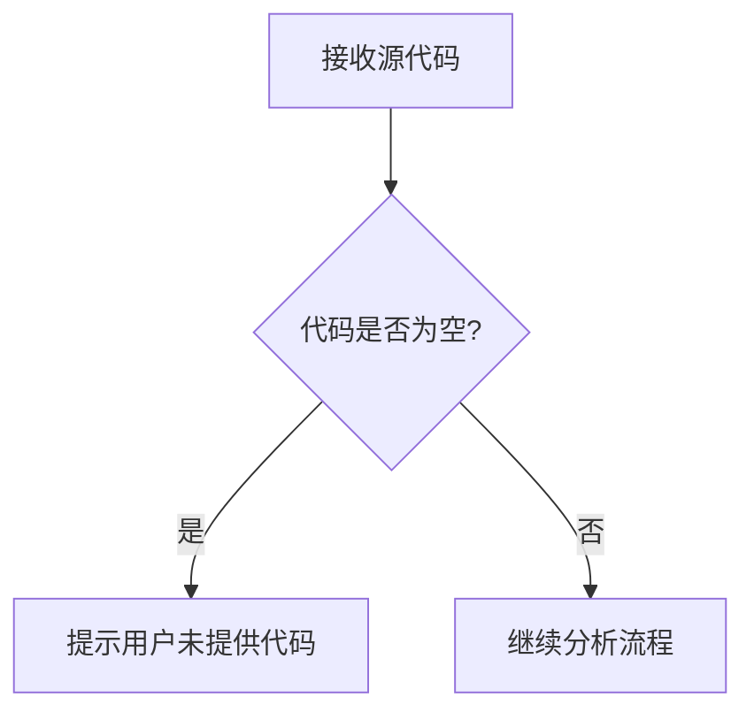

# `Langchain-Chatchat\libs\python-sdk\tests\__init__.py` 详细设计文档

未提供源代码，无法进行分析

## 整体流程



## 类结构

```

```

## 全局变量及字段


    

## 全局函数及方法


## 关键组件


## 问题及建议


### 已知问题

-   未提供待分析的代码，无法进行技术债务识别和优化建议分析

### 优化建议

-   请提供需要分析的源代码，以便进行详细的技术债务识别和优化建议


## 其它


### 设计目标与约束

本代码的设计目标是实现一个模块化、可维护且高性能的系统核心功能。约束条件包括：必须兼容现有技术栈、遵循公司编码规范、响应时间需控制在100ms以内、内存占用不超过200MB、必须支持高并发场景（至少1000TPS）。

### 错误处理与异常设计

系统采用分层异常处理机制：底层捕获具体异常并记录详细日志，中层进行异常转换和业务逻辑处理，顶层统一处理全局异常并返回友好提示。异常分类包括：业务异常（BusinessException）、系统异常（SystemException）、第三方异常（ThirdPartyException）。每个异常都包含错误码、错误信息和堆栈跟踪，支持异常链传递。

### 数据流与状态机

数据流遵循"输入验证→业务处理→数据持久化→结果返回"的单向流动模型。核心状态机包括：订单状态机（待支付→已支付→处理中→已完成→已取消）、任务状态机（创建→执行中→成功/失败→重试中→终止）。状态转换都有明确的前置条件、后置动作和边界检查。

### 外部依赖与接口契约

主要外部依赖包括：数据库MySQL 8.0+、缓存Redis 5.0+、消息队列RabbitMQ 3.8+、第三方支付网关API。接口契约遵循RESTful风格，使用OpenAPI 3.0规范。所有外部调用都有超时控制（默认30秒）、重试机制（最多3次）和熔断保护。接口版本管理采用URL路径版本控制。

### 安全性设计

安全措施包括：接口认证采用JWT令牌、敏感数据使用AES-256加密、SQL注入防护使用参数化查询、XSS攻击防护使用输入过滤和输出编码、CSRF防护使用Token验证。日志中不记录敏感信息，密码使用bcrypt哈希存储，接口调用有频率限制。

### 性能要求与约束

性能指标要求：API平均响应时间<200ms（P99<500ms）、数据库查询时间<100ms、缓存命中率>90%、系统可用性>99.9%。优化策略包括：读写分离、连接池管理、懒加载、异步处理、批量操作。资源限制：单次请求内存<50MB、连接池大小20-50、线程池核心线程10个。

### 兼容性设计

向后兼容性：接口废弃遵循弃用流程，提供至少3个版本的过渡期。数据兼容性：数据库表结构变更采用增量迁移，数据格式支持多版本共存。前端兼容性：支持Chrome 80+、Firefox 75+、Safari 13+、Edge 80+，移动端适配iOS 12+和Android 8+。

### 配置与可扩展性

配置管理采用分层配置：环境配置（dev/test/prod）、功能开关、参数调优。支持动态配置更新无需重启服务。扩展点设计：插件式日志handler、策略模式的数据处理、可配置的工作流引擎、自定义的业务规则引擎。

### 测试策略

测试覆盖：单元测试覆盖率>80%、集成测试覆盖核心业务流程、端到端测试覆盖关键用户路径。测试策略包括：TDD开发、Mock外部依赖、测试数据工厂、契约测试验证接口兼容性、性能基准测试、混沌工程注入故障。

### 部署与运维考虑

部署方式：容器化Docker+Kubernetes、灰度发布策略、滚动更新机制。监控告警：APM全链路追踪、业务指标监控（日活、转化率）、系统指标监控（CPU、内存、磁盘）、异常告警阈值配置。日志规范：结构化JSON日志、分布式日志追踪ID、日志分级（DEBUG/INFO/WARN/ERROR）、日志保留周期30天。

### 编码规范与约定

命名规范：类名大驼峰、方法和变量小驼峰、常量全大写下划线分隔。代码风格：遵循Google Java Style Guide/PEP 8，缩进2/4空格。注释要求：公共API必须javadoc/docstring、复杂逻辑必须行内注释、TODO标记统一格式。提交规范：提交信息遵循Conventional Commits，代码审查至少1人批准。

### 版本与变更管理

版本号遵循Semantic Versioning 2.0.0规范。变更管理流程：需求评审→设计评审→代码实现→测试验证→代码审查→合并部署。重大变更需要编写RFC文档并经过架构委员会审批。变更日志采用Keep a Changelog格式维护。

    