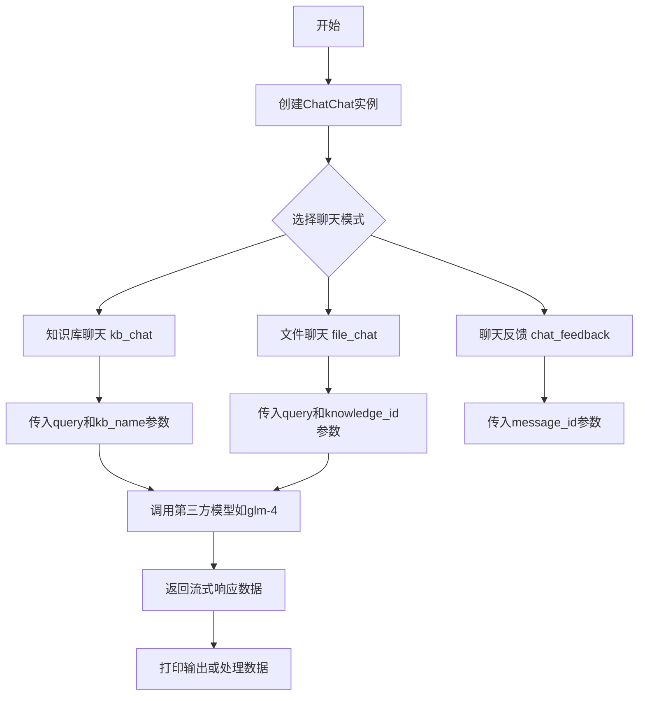
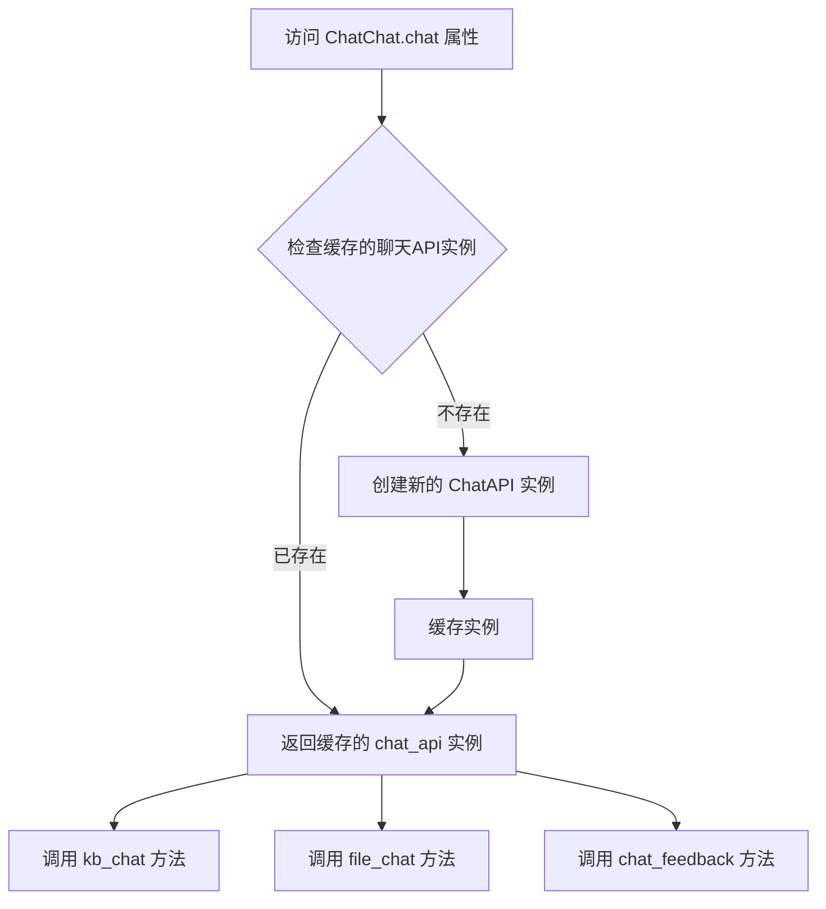
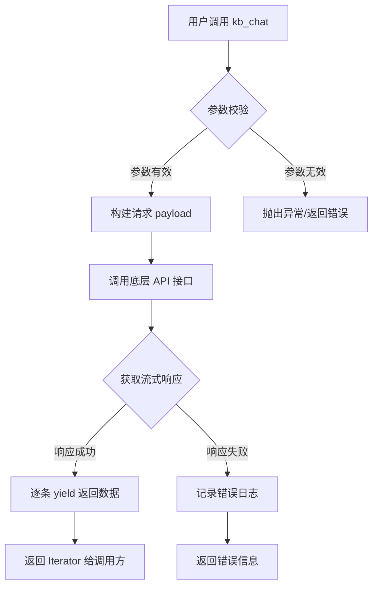
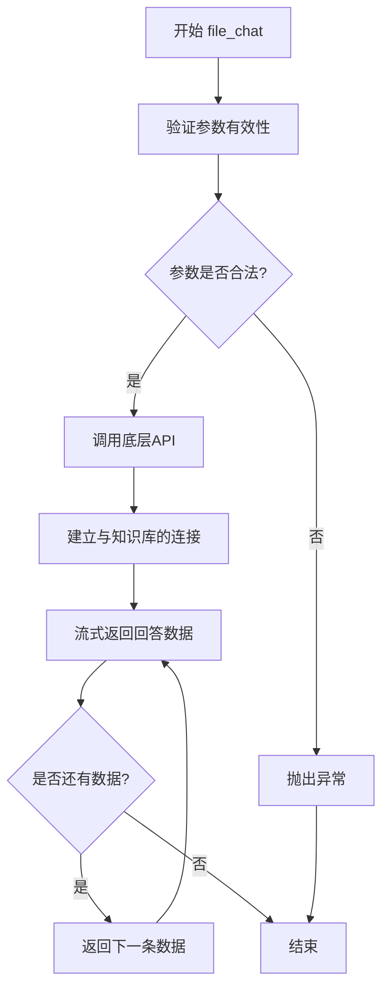
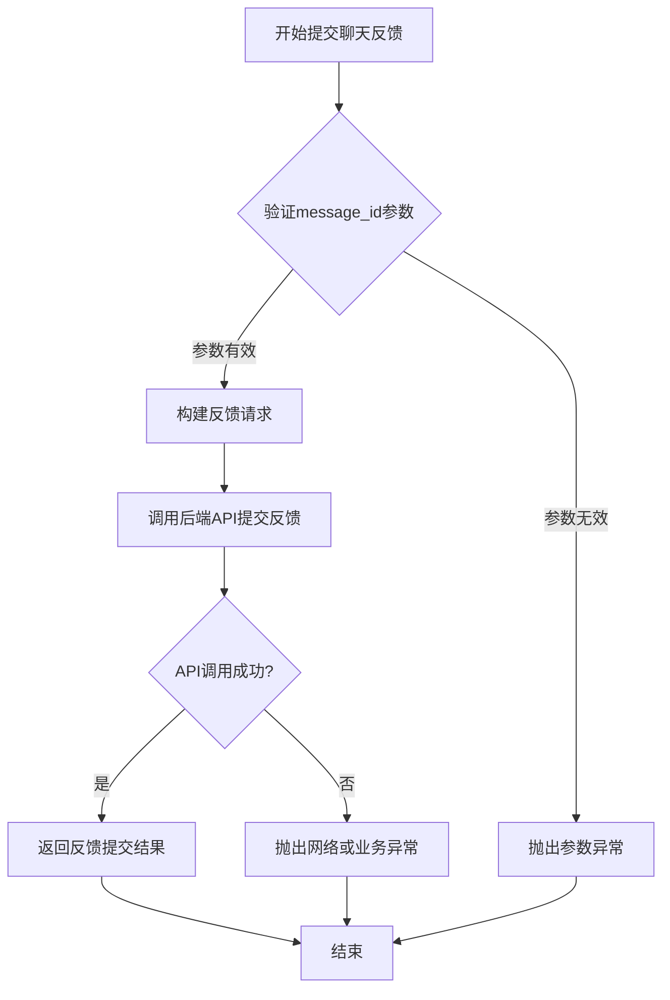

# `Langchain-Chatchat\libs\python-sdk\tests\chat_test.py` 详细设计文档

这是一个ChatChat API的测试代码片段，展示了如何使用ChatChat类进行知识库聊天(kb_chat)、文件聊天(file_chat)以及聊天反馈(chat_feedback)等核心功能

## 整体流程



## 类结构

```
ChatChat (主类)
└── chat (聊天模块)
    ├── kb_chat (知识库聊天方法)
    ├── file_chat (文件聊天方法)
    └── chat_feedback (聊天反馈方法)
```

## 全局变量及字段


### `ChatChat`
    
ChatChat主类，用于管理与聊天相关的功能和实例化聊天模块

类型：`class`
    


### `ChatChat.chat`
    
聊天模块实例，提供知识库聊天、文件聊天和反馈等功能

类型：`Chat`
    
    

## 全局函数及方法


### `ChatChat.chat`

该属性是`ChatChat`类的一个只读属性，用于获取聊天API实例，提供了与知识库对话、文件对话以及聊天反馈等核心功能。

参数：

- （无参数，该属性为getter）

返回值：`ChatAPI`（或类似对象），返回聊天API实例，提供`kb_chat`、`file_chat`、`chat_feedback`等方法

#### 流程图



#### 带注释源码

```python
# 导入 ChatChat 类
from open_chatcaht.chatchat_api import ChatChat

# 创建 ChatChat 实例
chatchat = ChatChat()

# 访问 chat 属性（getter）
# 该属性返回一个聊天API对象，用于处理各种聊天功能
chat_api = chatchat.chat

# 使用知识库聊天功能
# 参数: query-查询内容, kb_name-知识库名称, model-模型名称
for data in chat_api.kb_chat(query='你好', kb_name="example_kb", model='glm-4'):
    print(data)

# 使用文件聊天功能
# 参数: query-查询内容, knowledge_id-知识库ID, model_name-模型名称
for data in chat_api.file_chat(query='你好', knowledge_id="16d57480d9654104b405648f54d2485e", model_name='glm-4'):
    print(data)

# 发送聊天反馈
# 参数: message_id-消息ID, feedback-反馈内容(可选)
print(chat_api.chat_feedback(message_id='a9bb673176cd4e34a827c63fd72945f2'))
```


### `ChatChat.kb_chat`

知识库聊天核心方法，通过指定知识库名称和模型，对用户查询进行基于知识库内容的智能问答，返回流式响应数据。

参数：

- `query`：`str`，用户输入的查询问题
- `kb_name`：`str`，目标知识库的名称，用于定位需要检索的知识库
- `model`：`str`，指定用于生成回答的大语言模型名称

返回值：`Iterator[Any]`，流式迭代器，每个元素为聊天响应的一部分数据

#### 流程图



#### 带注释源码

```python
# 代码来源: open_chatcaht.chatchat_api.ChatChat 类
# 方法签名 (推测):
def kb_chat(self, query: str, kb_name: str, model: str) -> Iterator[Any]:
    """
    知识库聊天核心方法
    
    Parameters:
    -----------
    query : str
        用户输入的查询问题，如 "你好"
    kb_name : str
        目标知识库名称，如 "example_kb"
    model : str
        大语言模型标识，如 "glm-4"
    
    Yields:
    -------
    Any
        流式返回的聊天响应数据，可能包含:
        - token 片段
        - 知识库检索结果
        - 引用来源信息 等
    
    Example:
    --------
    >>> chatchat = ChatChat()
    >>> for data in chatchat.chat.kb_chat(query='你好', kb_name="example_kb", model='glm-4'):
    ...     print(data)
    """
    # 构建请求 payload
    payload = {
        'query': query,
        'kb_name': kb_name,
        'model': model
    }
    
    # 调用底层 API 接口获取流式响应
    # yield 流式数据返回给调用方
    for response in self._api_client.stream_request('/chat/kb_chat', payload):
        yield response
```

**备注**：由于仅提供了调用示例代码，未获取到 `kb_chat` 方法的实际实现源码。以上为基于调用方式的合理推测，实际实现可能包含更多参数（如 `top_k`、`score_threshold` 等知识库检索配置）和错误处理逻辑。


### `ChatChat.file_chat`

文件聊天功能，通过知识库ID进行问答交互，返回生成器类型的流式回答数据。

参数：

-  `query`：`str`，用户输入的查询问题
-  `knowledge_id`：`str`，知识库的唯一标识符，用于定位对应的知识库
-  `model_name`：`str`，使用的模型名称（如 'glm-4'）

返回值：`Generator`，生成流式回答数据，每条数据为字典类型

#### 流程图



#### 带注释源码

```python
# 以下为调用示例代码（被注释），展示了 file_chat 方法的使用方式

# 创建 ChatChat 实例
# chatchat = ChatChat()

# 调用 file_chat 方法进行文件聊天
# 参数说明：
#   query: 用户问题，如 '你好'
#   knowledge_id: 知识库ID，如 "16d57480d9654104b405648f54d2485e"
#   model_name: 使用的模型，如 'glm-4'
# for data in chatchat.chat.file_chat(
#     query='你好',
#     knowledge_id="16d57480d9654104b405648f54d2485e",
#     model_name='glm-4'
# ):
#     print(data)  # 打印每条流式返回的回答数据

# 注意：该方法是 ChatChat 类中 chat 属性的方法
# 实际方法定义位于 open_chatcaht/chatchat_api.py 模块中的 ChatChat 类
```

#### 备注

- 该代码片段为使用示例，方法实际定义在 `open_chatcaht/chatchat_api.py` 模块的 `ChatChat` 类中
- 返回值为生成器，支持流式输出，适用于长文本回答场景
- 方法签名可推断为：`file_chat(query: str, knowledge_id: str, model_name: str) -> Generator`


### `chat.chat_feedback`

聊天反馈功能，用于向聊天系统提交用户对特定聊天消息的反馈意见。

参数：

- `message_id`：字符串类型，需要提交反馈的消息ID，用于标识被反馈的具体聊天消息

返回值：`未知`，根据方法名推测返回布尔值（表示反馈是否提交成功）或字典类型（包含反馈处理结果），具体需参考实际实现

#### 流程图



#### 带注释源码

```
# 调用示例代码 - 来自用户提供的主代码文件
# 该方法属于 ChatChat 类中的 chat 内部模块

# 1. 创建 ChatChat 实例
chatchat = ChatChat()

# 2. 访问 chat 属性（内部模块）
# chatchat.chat 返回一个聊天操作对象

# 3. 调用 chat_feedback 方法提交反馈
# 参数 message_id: 字符串类型，标识需要反馈的聊天消息
# 返回值: 需根据实际 API 实现确定（可能返回布尔值或结果字典）
result = chatchat.chat.chat_feedback(message_id='a9bb673176cd4e34a827c63fd72945f2')
print(result)
```

**注意**：由于用户仅提供了调用示例代码，未提供 `chat_feedback` 方法的实际实现源码，上述流程图和源码注释是基于调用方式的合理推断。实际实现可能涉及：

- 发起 HTTP 请求到后端 API
- 序列化反馈数据为 JSON 格式
- 处理认证和授权信息
- 返回标准化的响应结果


## 关键组件


### ChatChat 类导入模块

从 open_chatcaht.chatchat_api 导入 ChatChat 类，作为与知识库和文件对话的主要入口点。

### kb_chat 方法（知识库聊天）

通过指定知识库名称和模型与知识库进行对话交互，返回可迭代的聊天数据流。

### file_chat 方法（文件聊天）

通过知识库ID和模型与特定文档进行对话交互，返回可迭代的聊天数据流。

### chat_feedback 方法（聊天反馈）

发送聊天消息的反馈信息，用于记录用户对特定消息的评价或反馈。


## 问题及建议


### 已知问题

-   **模块导入拼写错误**：`open_chatchat` 存在拼写错误（多了一个h），应该是 `open_chatchat`，这可能导致导入失败或模块找不到
-   **大量死代码**：存在大段被注释掉的测试代码，这些代码既不执行也不删除，会造成代码混淆和维护困难
-   **未使用的导入**：导入了 `ChatChat` 类但代码中未使用，造成资源浪费
-   **TODO标记未完成**：代码中有 `# todo 之后改为标准测试` 标记，表示当前实现为临时方案，存在技术债务
-   **测试代码与业务代码混在一起**：测试性质的代码直接写在主文件中，没有分离，违反代码组织原则
-   **API调用参数不一致**：注释中的API调用展示了不同的参数命名风格（如 `model` vs `model_name`），可能存在API设计不一致问题
-   **缺乏错误处理**：所有API调用都没有异常处理机制

### 优化建议

-   修正模块导入路径的拼写错误，确保与实际模块名一致
-   将注释掉的测试代码移至独立的测试文件（如 `tests/` 目录），或直接删除不再需要的代码
-   删除未使用的 `ChatChat` 导入语句
-   优先完成TODO中的"标准测试"实现，或明确该任务的优先级和时间计划
-   统一API的参数命名规范，提供清晰的接口文档
-   为所有外部API调用添加try-except异常处理和适当的错误日志
-   考虑使用Python的单元测试框架（如pytest）来组织测试代码，而不是使用注释掉的代码块
-   如果 `ChatChat` 类确实需要使用，应该补充完整的调用逻辑；如不需要，应完全移除导入语句


## 其它


### 设计目标与约束

该代码旨在提供一个封装良好的聊天API客户端，用于与知识库和文件进行交互式对话。主要约束包括：依赖`open_chatcaht`模块的可用性，需要有效的模型支持（glm-4等），以及知识库和文件的有效标识符。

### 错误处理与异常设计

代码中缺少错误处理机制。在实际使用中应捕获网络异常、API响应错误、无效参数错误等。建议添加try-except块处理ConnectionError、Timeout、HTTPError等异常情况，并提供有意义的错误信息。

### 数据流与状态机

数据流主要包括：用户输入查询 → API调用 → 模型处理 → 返回流式数据 → 打印输出。状态机涉及：初始化状态 → 请求状态 → 响应状态 → 完成状态。

### 外部依赖与接口契约

核心依赖为`open_chatcaht.chatchat_api.ChatChat`类。接口契约包括：`chat.kb_chat(query, kb_name, model)`方法接受字符串查询、知识库名称和模型名称，返回可迭代数据流；`chat.file_chat(query, knowledge_id, model_name)`方法类似但使用知识ID；`chat_feedback(message_id)`用于提交反馈。

### 配置信息

当前代码未包含配置信息，实际部署应包含API端点配置、超时设置、重试策略、日志级别等配置项。

### 安全性考虑

代码中未体现安全性设计。应考虑API密钥管理、请求认证、数据加密、输入验证、SQL注入防护等措施。

### 性能要求与优化

代码中的注释表明当前实现可能不是标准测试版本。性能方面应考虑连接池管理、异步请求、批量处理、缓存策略等优化手段。

### 测试策略

建议添加单元测试、集成测试，覆盖正常流程和异常场景，测试不同参数组合和边界条件。

### 版本兼容性

需明确支持的Python版本范围，以及与不同版本ChatChat API的兼容性说明。

### 日志记录

当前代码无日志记录功能。建议添加关键操作日志、请求响应日志、错误日志，便于问题排查和系统监控。

### 资源管理与限流

应考虑添加请求限流防止API滥用，合理的超时设置，连接资源释放，以及并发请求控制。


    