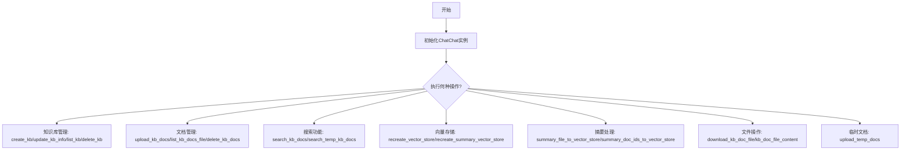
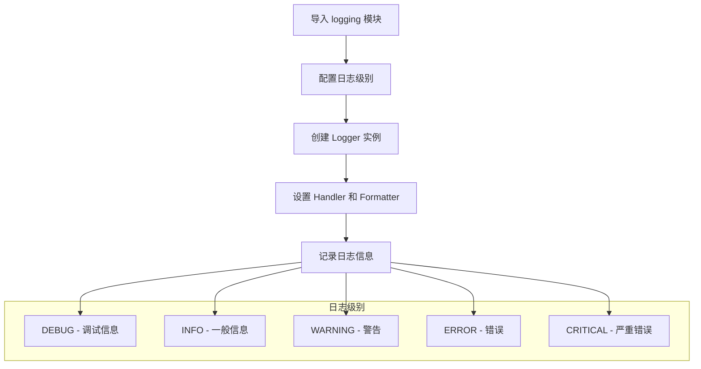

```mermaid
graph TD
    A[创建 ChatChat 实例] --> B[通过实例访问 knowledge 属性]
    
    B --> C1[create_kb: 创建知识库]
    B --> C2[update_kb_info: 更新知识库信息]
    B --> C3[list_kb: 列出知识库]
    B --> C4[list_kb_docs_file: 列出知识库文档]
    B --> C5[delete_kb: 删除知识库]
    B --> C6[search_kb_docs: 搜索知识库文档]
    B --> C7[upload_kb_docs: 上传知识库文档]
    B --> C8[recreate_vector_store: 重建向量存储]
    B --> C9[recreate_summary_vector_store: 重建摘要向量存储]
    B --> C10[summary_file_to_vector_store: 文件摘要转向量存储]
    B --> C11[summary_doc_ids_to_vector_store: 文档ID摘要转向量存储]
    B --> C12[delete_kb_docs: 删除知识库文档]
    B --> C13[download_kb_doc_file: 下载知识库文档]
    B --> C14[kb_doc_file_content: 获取文档内容]
    B --> C15[upload_temp_docs: 上传临时文档]
    B --> C16[search_temp_kb_docs: 搜索临时知识库文档]
```

```mermaid
graph TD
    A[ChatChat实例] --> B[访问knowledge属性]
    B --> C[获取KnowledgeBaseAPI对象]
    
    C --> D1[create_kb: 创建知识库]
    C --> D2[update_kb_info: 更新知识库信息]
    C --> D3[list_kb: 列出知识库]
    C --> D4[list_kb_docs_file: 列出知识库文档]
    C --> D5[delete_kb: 删除知识库]
    C --> D6[search_kb_docs: 搜索知识库文档]
    C --> D7[upload_kb_docs: 上传知识库文档]
    C --> D8[recreate_vector_store: 重建向量存储]
    C --> D9[recreate_summary_vector_store: 重建摘要向量存储]
    C --> D10[summary_file_to_vector_store: 文件摘要转向量存储]
    C --> D11[summary_doc_ids_to_vector_store: 文档摘要转向量存储]
    C --> D12[delete_kb_docs: 删除知识库文档]
    C --> D13[download_kb_doc_file: 下载知识库文档文件]
    C --> D14[kb_doc_file_content: 获取知识库文档内容]
    C --> D15[upload_temp_docs: 上传临时文档]
    C --> D16[search_temp_kb_docs: 搜索临时知识库文档]
    
    D1 --> E1[返回创建结果]
    D2 --> E2[返回更新结果]
    D3 --> E3[返回知识库列表]
    D4 --> E4[返回文档列表]
    D5 --> E5[返回删除结果]
    D6 --> E6[返回搜索结果]
    D7 --> E7[返回上传结果]
    D8 --> E8[返回重建结果]
    D9 --> E9[返回摘要重建结果]
    D10 --> E10[返回向量数据流]
    D11 --> E11[返回摘要向量结果]
    D12 --> E12[返回删除结果]
    D13 --> E13[返回文件内容/二进制]
    D14 --> E14[返回文档内容]
    D15 --> E15[返回上传结果]
    D16 --> E16[返回搜索结果]
```

# `Langchain-Chatchat\libs\python-sdk\tests\kb_test.py` 详细设计文档

该代码是一个调用OpenChatCAHT知识库管理API的示例脚本，展示了如何通过ChatChat类及其knowledge属性对知识库进行全生命周期管理，包括创建、删除、文档上传、向量存储重建、摘要生成、文件下载以及临时文档搜索等核心功能。

## 整体流程



## 类结构

```
ChatChat (主入口类)
└── knowledge (知识库操作属性/方法)
    ├── create_kb()
    ├── update_kb_info()
    ├── list_kb()
    ├── delete_kb()
    ├── search_kb_docs()
    ├── upload_kb_docs()
    ├── recreate_vector_store()
    ├── recreate_summary_vector_store()
    ├── summary_file_to_vector_store()
    ├── summary_doc_ids_to_vector_store()
    ├── delete_kb_docs()
    ├── download_kb_doc_file()
    ├── kb_doc_file_content()
    ├── upload_temp_docs()
    └── search_temp_kb_docs()
```

## 全局变量及字段


### `chatchat`
    
ChatChat客户端实例，用于调用知识库管理、文档上传、搜索等功能

类型：`ChatChat`
    


    

## 全局函数及方法


### `logging`

`logging` 是 Python 标准库中的日志记录模块，用于记录应用程序的运行状态、调试信息、警告和错误等。它提供了灵活的日志记录机制，支持多种日志级别、日志格式配置以及多种输出处理器（Handler）。

参数：
- 无直接参数（这是一个模块导入语句）

返回值：`module`，返回 logging 模块对象，供后续代码使用

#### 流程图



#### 带注释源码

```python
import logging  # 导入 Python 标准库中的 logging 模块，用于日志记录

# 以下是该模块的核心组件说明：

# logging 模块主要包含以下组件：
# - Logger: 日志记录器，用于记录日志
# - Handler: 处理器，用于将日志输出到不同目的地（文件、控制台等）
# - Formatter: 格式化器，用于定义日志输出格式
# - Level: 日志级别，定义日志的重要性

# 使用示例：
# logger = logging.getLogger(__name__)  # 获取命名空间记录器
# logger.setLevel(logging.INFO)          # 设置日志级别
# handler = logging.StreamHandler()      # 创建控制台处理器
# formatter = logging.Formatter('%(asctime)s - %(name)s - %(levelname)s - %(message)s')
# handler.setFormatter(formatter)        # 设置格式化器
# logger.addHandler(handler)             # 添加处理器
# logger.info('这是一条信息日志')         # 记录日志信息

# 在当前代码中，logging 模块被导入但未实际使用
# 可能用于后续的调试信息输出、错误追踪或运行状态监控
```

#### 关键信息

| 组件 | 说明 |
|------|------|
| 模块来源 | Python 标准库（无需额外安装） |
| 主要功能 | 应用程序日志记录与管理 |
| 日志级别 | DEBUG < INFO < WARNING < ERROR < CRITICAL |

#### 潜在优化建议

1. **实际使用建议**：如果需要在代码中添加日志记录，应配置合适的日志级别和输出格式
2. **最佳实践**：建议使用 `logging.getLogger(__name__)` 获取模块级 Logger，避免重复创建
3. **生产环境建议**：在生产环境中可考虑将日志输出到文件或日志收集系统，而非仅输出到控制台


### ChatChat

该类是 OpenChatCAHT 项目的核心 API 客户端类，提供对知识库（Knowledge Base）的创建、查询、更新、删除等全生命周期管理能力，以及临时文档上传和搜索功能。

#### 参数

- 无构造函数参数（根据注释 `# chatchat = ChatChat()` 推断）

#### 返回值：`ChatChat` 实例，返回该类的一个实例对象，用于调用知识库相关操作

#### 流程图



#### 带注释源码

```python
# 导入日志模块（用于记录程序运行日志）
import logging

# 从 open_chatcaht 包中导入 ChatChat 主类（API 客户端）
# 该类是整个知识库管理 API 的入口点
from open_chatcaht.chatchat_api import ChatChat

# 从 open_chatcaht 包的类型模块中导入上传临时文档参数类
# 用于构造上传临时文档时的请求参数
from open_chatcaht.types.knowledge_base.doc.upload_temp_docs_param import UploadTempDocsParam

# -----------------------------------------------------
# 下面的代码均为注释掉的测试示例代码
# 用于展示 ChatChat 类的典型使用方式
# -----------------------------------------------------

# 创建 ChatChat 实例（无参数构造函数）
# chatchat = ChatChat()

# -------------------------------------------------
# 知识库管理相关操作示例
# -------------------------------------------------

# 创建一个名为 "example_kb" 的知识库
# print('create_kb', chatchat.knowledge.create_kb(knowledge_base_name="example_kb"))

# 更新知识库信息
# print('update_kb_info', chatchat.knowledge.update_kb_info(knowledge_base_name="example_kb", kb_info='aaaaaaa'))

# 列出所有知识库
# print('list_kb', chatchat.knowledge.list_kb())

# 列出指定知识库中的文档文件
# print('list_kb_docs_file', chatchat.knowledge.list_kb_docs_file(knowledge_base_name="samples"))

# 删除指定知识库
# print('delete_kb', chatchat.knowledge.delete_kb(knowledge_base_name="example_kb"))

# 在知识库中搜索文档（基于语义搜索）
# print('search_kb_docs', chatchat.knowledge.search_kb_docs(knowledge_base_name="example_kb", query="hello"))

# 向知识库上传文档文件
# print('upload_kb_docs', chatchat.knowledge.upload_kb_docs(
#     files=["data/upload_file1.txt", "data/upload_file2.txt"],
#     knowledge_base_name="example_kb",
# ))

# 再次搜索知识库文档
# print('search_kb_docs', chatchat.knowledge.search_kb_docs(knowledge_base_name="example_kb", query="hello"))

# 重新创建知识库的向量存储（重建索引）
# print('recreate_vector_store', chatchat.knowledge.recreate_vector_store(
#     knowledge_base_name="samples",
# ))

# 使用指定的嵌入模型和LLM重新创建摘要向量存储
# print('recreate_summary_vector_store', chatchat.knowledge.recreate_summary_vector_store(
#     knowledge_base_name="example_kb",
#     embed_model="embedding-2",
#     model_name="glm-4",
# ))

# 将文件内容摘要并存储到向量库（流式返回处理进度）
# for data in chatchat.knowledge.summary_file_to_vector_store(
#         knowledge_base_name="samples",
#         file_name="data/upload_file1.txt",
#         embed_model="embedding-2",
#         max_tokens=10000):
#     print(data)

# 将指定文档的摘要向量化并存储
# print('summary_file_to_vector_store', chatchat.knowledge.summary_doc_ids_to_vector_store(
#     knowledge_base_name="samples",
#     file_name="data/upload_file1.txt",
# ))

# 删除知识库中的指定文档
# print('delete_kb_docs', chatchat.knowledge.delete_kb_docs(
#     knowledge_base_name="samples",
#     file_names=["upload_file1.txt"],
# ))

# -------------------------------------------------
# 文档内容获取相关操作示例
# -------------------------------------------------

# 下载知识库中的指定文档文件
# print(chatchat.knowledge.download_kb_doc_file(
#     knowledge_base_name='example_kb',
#     file_name='README.md'
# ))

# 获取知识库中指定文档的内容
# print(chatchat.knowledge.kb_doc_file_content(
#     knowledge_base_name='example_kb',
#     file_name='README.md'
# ))

# -------------------------------------------------
# 临时知识库相关操作示例
# -------------------------------------------------

# 上传临时文档（不需要创建正式知识库）
# print(chatchat.knowledge.upload_temp_docs(
#     files=["README.md", ],
#     knowledge_id="4",
# ))

# 在临时知识库中搜索文档
# print(chatchat.knowledge.search_temp_kb_docs(knowledge_id="cf414f74bca24fbdaece1ae8bb4d3970", query="hello"))
```


### `UploadTempDocsParam`

该类是用于封装向知识库上传临时文档时所需的参数的数据传输对象（DTO），通常包含要上传的文件列表以及关联的知识库ID等信息。

#### 带注释源码

```
# 从 open_chatcaht 库中导入 UploadTempDocsParam 类
# 该类定义在 open_chatcaht.types.knowledge_base.doc.upload_temp_docs_param 模块中
from open_chatcaht.types.knowledge_base.doc.upload_temp_docs_param import UploadTempDocsParam

# 注意：当前代码文件中仅导入了该类，但未进行实例化或使用
# 根据类名和同类模块的惯例，该类可能包含以下典型字段：
# - files: List[str] - 要上传的文件路径列表
# - knowledge_id: str - 目标知识库的唯一标识符
# - 其他可能的可选参数如文件类型、描述等
```

#### 说明

由于当前代码文件仅导入了 `UploadTempDocsParam` 类但未实际使用或定义该类，无法获取其完整的字段详情、方法签名、返回值信息及详细流程图。

**推断的典型参数结构**（基于同类模块惯例）：

- `files`：`List[str]` 或 `List[UploadFile]`，要上传的文档文件列表
- `knowledge_id`：`str`，目标知识库的唯一标识符

**推断的返回值**：`UploadTempDocsResponse` 或类似类型，包含上传结果信息

如需获取 `UploadTempDocsParam` 类的完整定义，建议查看源码文件：
`open_chatcaht/types/knowledge_base/doc/upload_temp_docs_param.py`


### `ChatChat.knowledge`

`knowledge` 是 `ChatChat` 类的一个属性，用于封装所有知识库（Knowledge Base）相关的操作。该属性提供了一个统一的接口，包含了知识库的创建、删除、查询、文档管理以及向量存储重建等功能，是整个知识库管理模块的核心入口点。通过该属性，用户可以方便地对知识库进行各种操作，包括创建知识库、更新知识库信息、列出知识库、上传文档、搜索文档、删除文档、下载文档、管理临时文档等。

参数：

- 该属性无参数

返回值：`KnowledgeBaseAPI`（或类似的 API 类），返回用于执行知识库相关操作的 API 对象

#### 流程图



#### 带注释源码

```python
# 从 open_chatcaht.chatchat_api 模块导入 ChatChat 主类
from open_chatcaht.chatchat_api import ChatChat
# 从 open_chatcaht.types.knowledge_base.doc.upload_temp_docs_param 模块导入上传临时文档参数类
from open_chatcaht.types.knowledge_base.doc.upload_temp_docs_param import UploadTempDocsParam

# 创建 ChatChat 实例（被注释，实际使用时取消注释）
# chatchat = ChatChat()

# ========== knowledge 属性调用的方法示例 ==========

# 1. 创建知识库 - 创建一个名为 "example_kb" 的新知识库
# print('create_kb', chatchat.knowledge.create_kb(knowledge_base_name="example_kb"))

# 2. 更新知识库信息 - 更新 "example_kb" 的描述信息
# print('update_kb_info', chatchat.knowledge.update_kb_info(knowledge_base_name="example_kb", kb_info='aaaaaaa'))

# 3. 列出所有知识库 - 获取当前所有的知识库列表
# print('list_kb', chatchat.knowledge.list_kb())

# 4. 列出知识库文档文件 - 获取 "samples" 知识库中的所有文档文件
# print('list_kb_docs_file', chatchat.knowledge.list_kb_docs_file(knowledge_base_name="samples"))

# 5. 删除知识库 - 删除名为 "example_kb" 的知识库
# print('delete_kb', chatchat.knowledge.delete_kb(knowledge_base_name="example_kb"))

# 6. 搜索知识库文档 - 在 "example_kb" 中搜索包含 "hello" 的文档
# print('search_kb_docs', chatchat.knowledge.search_kb_docs(knowledge_base_name="example_kb", query="hello"))

# 7. 上传知识库文档 - 上传文件到 "example_kb" 知识库
# print('upload_kb_docs', chatchat.knowledge.upload_kb_docs(
#     files=["data/upload_file1.txt", "data/upload_file2.txt"],
#     knowledge_base_name="example_kb",
# ))

# 8. 重建向量存储 - 重新创建 "samples" 知识库的向量存储
# print('recreate_vector_store', chatchat.knowledge.recreate_vector_store(
#     knowledge_base_name="samples",
# ))

# 9. 重建摘要向量存储 - 使用指定的嵌入模型和语言模型重建摘要向量存储
# print('recreate_summary_vector_store', chatchat.knowledge.recreate_summary_vector_store(
#     knowledge_base_name="example_kb",
#     embed_model="embedding-2",
#     model_name="glm-4",
# ))

# 10. 文件摘要转向量存储 - 将文件内容进行摘要并存储到向量数据库（流式返回）
# for data in chatchat.knowledge.summary_file_to_vector_store(
#         knowledge_base_name="samples",
#         file_name="data/upload_file1.txt",
#         embed_model="embedding-2",
#         max_tokens=10000):
#     print(data)

# 11. 文档摘要转向量存储 - 将文档ID对应的内容进行摘要并存储到向量数据库
# print('summary_file_to_vector_store', chatchat.knowledge.summary_doc_ids_to_vector_store(
#     knowledge_base_name="samples",
#     file_name="data/upload_file1.txt",
# ))

# 12. 删除知识库文档 - 从 "samples" 知识库中删除指定的文档
# print('delete_kb_docs', chatchat.knowledge.delete_kb_docs(
#     knowledge_base_name="samples",
#     file_names=["upload_file1.txt"],
# ))

# 13. 下载知识库文档文件 - 下载 "example_kb" 中的 "README.md" 文件
# print(chatchat.knowledge.download_kb_doc_file(
#     knowledge_base_name='example_kb',
#     file_name='README.md'
# ))

# 14. 获取知识库文档内容 - 获取 "example_kb" 中 "README.md" 的内容
# print(chatchat.knowledge.kb_doc_file_content(
#     knowledge_base_name='example_kb',
#     file_name='README.md'
# ))

# 15. 上传临时文档 - 上传临时文档到指定的知识库
# print(chatchat.knowledge.upload_temp_docs(
#     files=["README.md", ],
#     knowledge_id="4",
# ))

# 16. 搜索临时知识库文档 - 在临时知识库中搜索文档
# print(chatchat.knowledge.search_temp_kb_docs(knowledge_id="cf414f74bca24fbdaece1ae8bb4d3970", query="hello"))
```


## 关键组件


### ChatChat 主类

来自 `open_chatcaht.chatchat_api`，是整个API的入口类，封装了与知识库交互的所有方法。

### 知识库管理组件

包含 `create_kb`、`update_kb_info`、`list_kb`、`delete_kb` 等方法，用于知识库的创建、更新、列表查询和删除操作。

### 文档上传与检索组件

包含 `upload_kb_docs`、`search_kb_docs`、`list_kb_docs_file`、`download_kb_doc_file`、`kb_doc_file_content` 等方法，提供文档上传、搜索、列出、下载和内容读取功能。

### 向量存储管理组件

包含 `recreate_vector_store`、`recreate_summary_vector_store`、`summary_file_to_vector_store`、`summary_doc_ids_to_vector_store` 等方法，用于向量存储的重建和文档摘要转向量存储的操作。

### 临时文档处理组件

包含 `upload_temp_docs` 和 `search_temp_kb_docs` 方法，配合 `UploadTempDocsParam` 参数类，用于临时文档的上传和搜索功能。

### 日志模块

使用 Python 标准库 `logging`，用于记录程序运行时的日志信息，便于调试和监控。


## 问题及建议


### 已知问题

-   **大量注释代码**：约20行注释掉的示例代码占文件主体，影响代码可读性和可维护性
-   **导入未使用**：`UploadTempDocsParam` 被导入但未在代码中实际使用
-   **缺乏错误处理**：所有 API 调用均无 try-except 异常捕获，网络请求失败时程序会直接崩溃
-   **无日志记录**：导入了 `logging` 模块但未使用，运行时仅依赖注释中的 print 语句（也已注释）
-   **硬编码配置**：知识库名称、文件路径、模型参数等均硬编码，缺乏配置管理机制
-   **无文档注释**：整个文件无任何函数/类的文档字符串，无法理解各调用的用途和参数含义
-   **调试代码残留**：代码中大量 `print()` 语句被注释，表明这是临时调试代码而非生产代码
-   **无重试机制**：涉及向量存储、网络请求的 API 调用无重试逻辑，可能因临时网络波动失败
-   **类型注解缺失**：函数参数和返回值无类型提示，降低代码可读性和 IDE 支持

### 优化建议

-   **清理注释代码**：将示例调用移至独立的测试文件（如 `test_examples.py`）或文档中，保持主文件简洁
-   **移除未使用导入**：删除 `UploadTempDocsParam` 导入以减少混淆
-   **添加统一错误处理**：为所有 API 调用封装统一的异常处理逻辑，区分不同错误类型并提供有意义的错误信息
-   **启用日志记录**：使用 `logging` 模块替代 print 语句，设置合理的日志级别（DEBUG/INFO/WARNING/ERROR）
-   **配置外部化**：将知识库名称、文件路径、模型参数等提取至环境变量或 YAML/JSON 配置文件
-   **添加文档字符串**：为脚本添加模块级文档，说明用途、依赖和使用前提
-   **函数化封装**：将重复的 API 调用模式封装为可复用的函数，添加类型注解和文档
-   **添加重试机制**：对网络相关操作使用 `tenacity` 或 `retrying` 库添加重试逻辑，设置合理超时
-   **考虑类型安全**：为函数参数添加类型注解，提升代码质量和静态检查能力


## 其它


### 设计目标与约束

本代码旨在封装ChatChat知识库（Knowledge Base）的RESTful API调用，为上层应用提供对知识库文档的创建、读取、更新、删除（CRUD）操作以及向量存储、搜索等功能的支持。设计约束包括：依赖open_chatcaht库（版本需兼容types.knowledge_base模块），仅支持同步调用，未实现重试机制和连接池管理，且缺乏异常处理和日志记录框架。

### 错误处理与异常设计

当前代码未包含任何异常处理逻辑，所有API调用均为注释状态，无法捕获网络错误、认证失败、知识库不存在、文件操作失败等异常。设计建议：应为每个API调用添加try-except块，捕获requests库的HTTPError、ConnectionError、Timeout等异常，并定义自定义异常类（如KnowledgeBaseError、DocumentUploadError、VectorStoreError）以区分不同错误场景，同时通过logging模块记录错误日志。

### 数据流与状态机

代码的数据流主要包括：初始化ChatChat客户端 → 调用知识库管理API（如create_kb、list_kb）→ 调用文档操作API（如upload_kb_docs、delete_kb_docs）→ 调用向量存储API（如recreate_vector_store、search_kb_docs）。状态机方面：知识库存在"不存在"、"创建中"、"活跃"、"删除中"四种状态；文档存在"未上传"、"上传中"、"已存储"、"删除中"四种状态。当前代码未实现状态检查和状态转换验证。

### 外部依赖与接口契约

主要外部依赖包括：open_chatcaht.chatchat_api.ChatChat类（提供knowledge属性）、open_chatcaht.types.knowledge_base.doc.upload_temp_docs_param.UploadTempDocsParam参数类。接口契约：所有knowledge方法接受特定命名的参数（如knowledge_base_name、file_name、query等），返回类型为字典或生成器（summary_file_to_vector_store方法），需根据实际API响应确定具体数据结构。

### 性能考虑

当前代码未实现任何性能优化措施。建议：对于批量文档上传，应实现分片上传和并发控制；搜索操作可添加结果缓存；向量重建操作应为异步执行；应实现请求超时配置（建议30-60秒）；大文件上传应支持断点续传和分块传输。

### 安全性考虑

代码中硬编码了知识库名称（如"example_kb"、"samples"）和示例参数，存在信息泄露风险。建议：将敏感配置（API端点、认证token、知识库名称）移至配置文件或环境变量；实现API密钥的安全存储和轮换；添加请求签名或HTTPS传输支持。

### 配置管理

当前代码缺乏配置管理机制，所有参数均为代码中的硬编码值。建议：引入配置管理模块，支持从配置文件（config.yaml）或环境变量加载配置；配置项应包括API基础URL、超时时间、重试策略、日志级别、知识库默认参数等。

### 测试策略

代码未包含任何测试用例。建议：为每个API方法编写单元测试，验证参数序列化和响应解析；集成测试应使用mock服务器或测试环境；应测试边界条件（如空知识库名称、超长文件名称、特殊字符处理）；压力测试应验证并发调用和大规模文档操作的稳定性。

### 部署注意事项

本代码为客户端库，需部署在支持Python 3.8+的环境中。部署时需确保：open_chatcaht包已正确安装且版本兼容；网络可达ChatChat API服务器；配置文件的读写权限正确设置；日志目录存在且可写；如在容器化环境运行，需配置网络代理和健康检查。

### 版本兼容性

代码依赖的open_chatcaht库需与目标API版本匹配。当前导入的types.knowledge_base.doc.upload_temp_docs_param模块表明API支持临时文档上传功能。建议：在代码中明确标注兼容的API版本范围；添加版本检测逻辑；为不同API版本提供向后兼容的适配层。

### 监控与日志

当前代码仅导入了logging模块但未实际使用。建议：配置结构化日志输出（JSON格式），包含时间戳、请求ID、方法名、参数（脱敏）、响应状态、耗时等信息；添加分布式追踪支持（如OpenTelemetry）；关键操作（如知识库创建、文档删除）应记录审计日志；应实现metrics指标采集（请求成功率、响应时间分布等）。

### 资源管理

代码未实现资源管理机制。建议：为ChatChat客户端实现连接池管理；长时间运行的场景应实现连接保活和心跳检测；对于生成器类型返回（如summary_file_to_vector_store），应确保资源正确释放或提供上下文管理器支持。

### 扩展性设计

当前代码的扩展性受限。建议：采用策略模式支持不同的知识库提供者；添加插件机制支持自定义文档处理器；实现观察者模式支持操作事件回调；为复杂操作提供链式API调用builder模式。


    