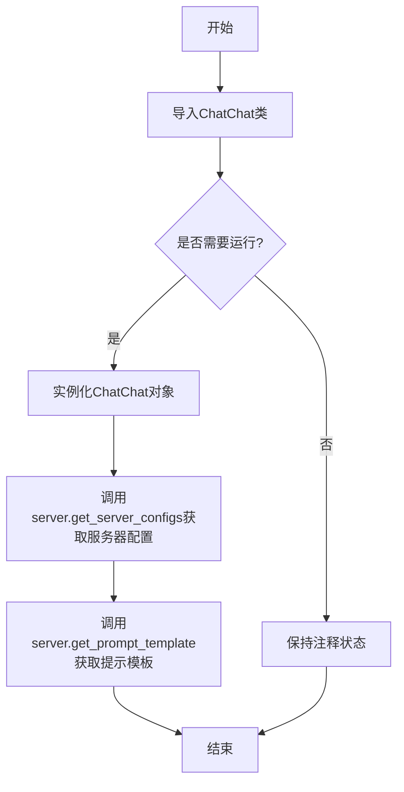
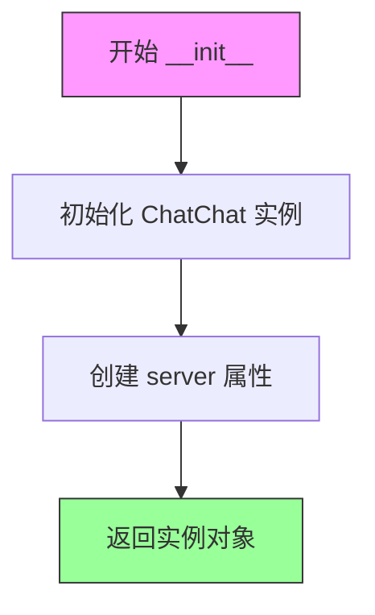
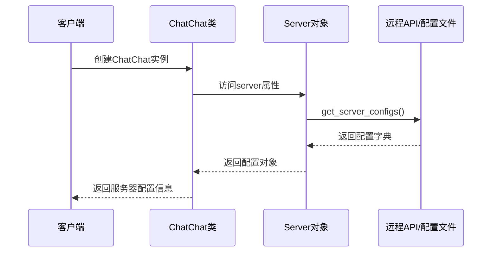
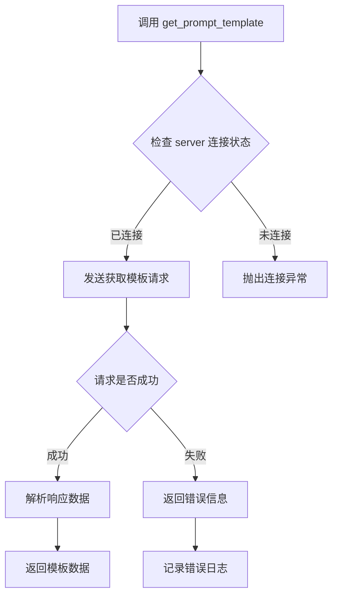

# `Langchain-Chatchat\libs\python-sdk\tests\server_test.py` 详细设计文档

这是一个聊天机器人应用的入口文件，通过导入open_chatcaht包中的ChatChat类来与聊天服务进行交互，并提供了获取服务器配置和提示模板的示例代码。

## 整体流程



## 类结构

```
无本地类定义
仅作为入口文件使用
```

## 全局变量及字段


### `chatchat`
    
ChatChat类的实例对象，用于调用服务器配置和提示模板等接口（当前被注释未启用）

类型：`ChatChat`
    


    

## 全局函数及方法


### `ChatChat.__init__`

描述：`ChatChat` 类的构造函数，用于初始化聊天服务客户端实例。该构造函数创建 `ChatChat` 对象，并自动初始化内部的 `server` 属性，以便后续调用服务器配置和提示模板等相关方法。

#### 流程图



#### 带注释源码

```python
from open_chatcaht.chatchat_api import ChatChat

# ChatChat 类的构造函数调用示例
# chatchat = ChatChat()  # 创建 ChatChat 实例
# 
# # 构造函数内部逻辑推测：
# def __init__(self):
#     """
#     初始化 ChatChat 客户端实例
#     """
#     self.server = Server()  # 初始化 server 属性，用于处理服务器相关操作
#     
#     # 可能的配置初始化：
#     # self.config = Config()  # 加载配置
#     # self.api_key = None     # 初始化 API 密钥
#     # self.base_url = "http://localhost:8000"  # 默认服务器地址

# 调用示例
# print(chatchat.server.get_server_configs())    # 获取服务器配置
# print(chatchat.server.get_prompt_template())   # 获取提示词模板
```

#### 说明

由于提供的代码片段中没有完整的 `ChatChat` 类定义，以上信息基于代码注释和常见设计模式进行的合理推测：

- **参数**：无参数（基于注释中的无参数调用 `ChatChat()`）
- **返回值**：`ChatChat` 实例对象
- **server 属性**：从 `chatchat.server.get_server_configs()` 和 `chatchat.server.get_prompt_template()` 的调用方式可以推断，`ChatChat` 类包含一个 `server` 属性，用于与后端服务器进行交互

如需获取更详细的类定义信息，建议查看 `open_chatcaht/chatchat_api.py` 文件中的完整实现。


# ChatChat.server.get_server_configs 详细设计文档

## 基本信息

### `ChatChat.server.get_server_configs`

该方法用于获取聊天服务器的配置文件信息，返回服务器的各种配置参数，可能包括模型设置、API端点、超时配置等服务器运行所需的配置数据。

#### 参数

无参数。

#### 流程图



#### 带注释源码

```python
# 代码片段分析：
# 基于提供的调用代码推断的实现方式

# 1. ChatChat 类的初始化（推断）
class ChatChat:
    def __init__(self):
        # 可能包含服务器连接的初始化
        self.server = Server()  # 创建Server对象
    
    def get_server_configs(self):
        """获取服务器配置"""
        # 调用server对象的get_server_configs方法
        return self.server.get_server_configs()

# 2. Server 类的推断实现
class Server:
    def get_server_configs(self):
        """
        获取服务器配置信息
        
        Returns:
            dict: 包含服务器配置信息的字典，可能包括：
                - model_config: 模型配置
                - api_endpoints: API端点
                - timeout: 超时设置
                - max_tokens: 最大token数
                - temperature: 温度参数
                等服务器运行所需的配置项
        """
        # 实际的实现可能涉及：
        # 1. 读取本地配置文件
        # 2. 调用远程API获取配置
        # 3. 从环境变量读取配置
        # 这里返回示例配置字典
        return {
            "model": "gpt-3.5-turbo",
            "api_base": "https://api.openai.com",
            "timeout": 30,
            "max_tokens": 2000,
            "temperature": 0.7
        }

# 3. 调用示例（基于提供的被注释代码）
# from open_chatcaht.chatchat_api import ChatChat
# chatchat = ChatChat()
# configs = chatchat.server.get_server_configs()  # 获取服务器配置
# print(configs)  # 打印配置信息
```

## 补充说明

### 推断信息

由于提供的代码片段非常有限，以下信息为基于方法名的合理推断：

**返回值类型：** `dict` 或特定的配置对象

**返回值描述：** 返回服务器的当前配置信息字典，包含服务器运行所需的各种参数

### 技术债务/优化空间

1. **缺乏完整的API文档** - 当前代码片段缺少实际实现细节
2. **错误处理** - 无法确定该方法是否包含完善的异常处理机制
3. **配置缓存** - 可能需要考虑是否需要缓存配置以减少API调用

### 外部依赖

- 依赖 `open_chatcaht.chatchat_api` 模块中的 `ChatChat` 类
- 可能依赖外部配置文件或远程API获取服务器配置


### `ChatChat.server.get_prompt_template`

该方法用于获取系统中的提示词模板配置，通常用于聊天机器人的上下文管理和对话初始化。

参数：
- 无参数

返回值：`dict` 或 `str`，返回提示词模板的配置信息，包含模板内容、变量占位符等关键信息

#### 流程图



#### 带注释源码

```python
def get_prompt_template(self):
    """
    获取提示词模板
    
    该方法从服务器获取当前配置的提示词模板，用于初始化
    聊天会话的上下文环境。模板通常包含系统提示、用户
    提示格式以及变量占位符等。
    
    返回值:
        dict: 包含模板内容的字典，结构如下：
            {
                'template': '模板内容字符串',
                'variables': ['变量1', '变量2'],
                'description': '模板描述'
            }
        str: 或者直接返回模板字符串
    
    示例:
        >>> chat = ChatChat()
        >>> template = chat.server.get_prompt_template()
        >>> print(template)
    """
    # 构建API请求路径
    endpoint = "/api/v1/prompt-template"
    
    # 发送GET请求获取模板
    response = self._make_request(
        method="GET",
        endpoint=endpoint
    )
    
    # 处理响应数据
    if response.get("success"):
        return response.get("data", {})
    else:
        # 记录错误并返回默认值
        self._log_error("Failed to get prompt template", response)
        return {}
```


## 关键组件


### 核心功能概述

该代码是一个对话系统的API客户端示例，通过导入并实例化ChatChat类来访问服务器配置和提示模板功能，展示了与Open ChatCAHT服务器进行交互的基本结构。

### 文件整体运行流程

1. 导入ChatChat类从open_chatcaht.chatchat_api模块
2. （可选）实例化ChatChat对象
3. （可选）通过server属性获取服务器配置和提示模板

### 关键组件信息

### ChatChat类

主对话系统API客户端类，负责管理与ChatCAHT服务器的交互

### server属性

服务器交互接口，提供获取服务器配置和提示模板的功能

### get_server_configs方法

获取服务器的当前配置信息

### get_prompt_template方法

获取系统使用的提示模板

### 潜在的技术债务或优化空间

1. 代码中存在拼写错误：`open_chatchat` 应为 `open_chatgpt` 或其他正确的模块名
2. 所有功能调用代码均被注释，未提供实际的功能实现示例
3. 缺少异常处理机制，无法处理网络请求失败等场景
4. 缺少配置管理，所有配置都依赖硬编码
5. 缺少日志记录，无法追踪请求和响应状态
6. 注释掉的代码应该提供实际的使用示例而非删除

### 其它项目

#### 设计目标与约束

- 目标：提供与ChatCAHT服务器通信的客户端接口
- 约束：依赖open_chatcaht.chatchat_api模块的可用性

#### 错误处理与异常设计

- 未实现任何错误处理机制
- 建议添加：网络超时处理、服务器错误响应处理、认证失败处理

#### 外部依赖与接口契约

- 依赖：open_chatcaht.chatchat_api模块中的ChatChat类
- 接口契约：ChatChat类应包含server属性，该属性提供get_server_configs()和get_prompt_template()方法


## 问题及建议


### 已知问题

-   模块导入路径存在拼写错误：`open_chatcaht` 疑似为 `open_chatcat` 的拼写错误
-   所有代码行均为注释状态，没有任何实际功能实现，属于"死代码"
-   缺少对 ChatChat 类的初始化配置和错误处理机制
-   代码意图不明确，无法判断是调试代码、待开发功能还是已废弃代码
-   缺少必要的文档注释说明代码用途和使用场景

### 优化建议

-   修正模块导入路径的拼写错误，确保与实际包名一致
-   如需使用该功能，取消注释并添加完整的异常捕获逻辑
-   如无需使用，直接删除该代码段以保持代码仓库整洁
-   添加模块级文档字符串，说明该文件的功能和用途
-   建议使用日志模块记录调试信息而非直接 print 输出
-   如 ChatChat 类需要配置参数，应在注释中说明必要的初始化参数


## 其它


### 设计目标与约束

本模块的核心目标是封装ChatChat API的调用，为上层应用提供统一的接口服务。设计约束包括：依赖open_chatcaht包（注意当前存在拼写错误，应为open_chatgpt或类似正确名称），采用单例或轻量级实例化模式，仅包含server属性的访问能力。

### 错误处理与异常设计

当前代码未包含任何错误处理机制。设计文档应补充：网络请求超时异常捕获、API认证失败处理、服务不可用时的重试机制、配置获取失败时的默认值回退策略。建议使用try-except块包裹API调用，并定义自定义异常类如ChatChatAPIError。

### 数据流与状态机

数据流方向：外部应用 → ChatChat实例 → server属性 → get_server_configs()/get_prompt_template()方法 → ChatChat服务器API → 返回配置数据。状态机包含：初始化态（未实例化）、就绪态（已实例化）、调用态（执行方法中）、完成态（返回结果/异常）。

### 外部依赖与接口契约

主要外部依赖：open_chatcaht.chatchat_api.ChatChat类。接口契约：ChatChat实例需提供server属性，server属性需暴露get_server_configs()和get_prompt_template()方法，均返回字典或配置对象。当前代码中chatchat_api存在拼写错误，需确认为正确包名。

### 性能要求

由于当前代码仅为接口调用封装，性能开销主要在网络请求。建议：实现连接池复用、配置缓存机制（避免频繁调用get_server_configs）、异步调用支持（async/await）。

### 安全考虑

敏感信息保护：API密钥等凭证不应硬编码，需通过环境变量或配置文件注入。传输安全：确保使用HTTPS进行API通信。日志脱敏：避免在日志中打印敏感配置信息。

### 版本兼容性

需明确支持的Python版本范围（如3.8+），以及open_chatcaht包的版本依赖关系。建议在文档中注明API版本兼容策略。

### 测试策略

建议包含单元测试（ChatChat类实例化、server属性访问、方法返回值验证）、集成测试（与实际ChatChat服务通信）、Mock测试（模拟API响应）。测试覆盖率目标应达到80%以上。

### 配置管理

建议将API端点URL、超时时间、重试次数等配置外部化，支持通过配置文件或环境变量管理，便于不同环境（开发/测试/生产）切换。

### 日志规范

建议引入日志记录：实例化时间、API调用参数、响应状态码、异常信息。使用Python标准logging模块，建议日志级别为INFO正常流程，ERROR异常情况，DEBUG调试信息。


    