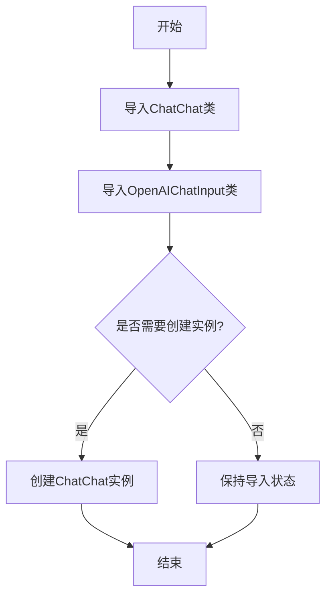

# `Langchain-Chatchat\libs\python-sdk\tests\standard_openai_test.py` 详细设计文档

该代码是一个聊天应用程序的初始化模块，导入了ChatChat聊天主类和OpenAIChatInput输入处理类，用于构建与OpenAI兼容的聊天接口，尽管创建ChatChat实例的代码被注释掉了。

## 整体流程



## 类结构

```
ChatChat (主聊天类)
└── OpenAIChatInput (输入处理类)
```

## 全局变量及字段


### `ChatChat`
    
从open_chatcaht.chatchat_api导入的主聊天类，用于与ChatChat服务交互

类型：`class`
    


### `OpenAIChatInput`
    
从open_chatcaht.types.standard_openai.chat_input导入的OpenAI聊天输入类型，用于构建符合OpenAI格式的聊天请求

类型：`class`
    


    

## 全局函数及方法


## 关键组件


### ChatChat
主API类，提供聊天交互的核心接口

### OpenAIChatInput
处理OpenAI标准格式的聊天输入数据结构

### open_chatcaht.chatchat_api
ChatChat类的定义模块，提供对话功能的API封装

### open_chatcaht.types.standard_openai.chat_input
OpenAI兼容的聊天输入类型定义模块

### 模块导入结构
基于标准OpenAI格式的类型系统，支持多后端对接


## 问题及建议


### 已知问题

-   **包名拼写错误**：`open_chatcaht` 可能应为 `open_chatcat`（"cat" 拼写为 "caht"），这将导致导入失败
-   **未使用的导入**：导入了 `ChatChat` 和 `OpenAIChatInput`，但代码中均未使用
-   **注释代码残留**：`chatchat = ChatChat()` 被注释但未删除，保留在代码库中造成混淆
-   **孤立注释行**：存在单独的 `#` 注释行，无实际意义
-   **代码片段不完整**：仅包含导入和注释，无实际功能逻辑，无法独立运行或完成任何任务
-   **缺少文档**：无模块级或代码级文档字符串（docstring）
-   **无类型注解**：代码中未使用类型提示，静态类型检查困难

### 优化建议

-   **修正包名拼写**：确认正确的包名并修正导入语句
-   **清理未使用的导入**：删除未使用的 `ChatChat` 和 `OpenAIChatInput` 导入，或在代码中实际使用它们
-   **删除注释代码**：移除被注释的 `chatchat = ChatChat()`，如需保留作为示例应添加说明注释
-   **补充功能实现**：添加实际的功能代码，如初始化 ChatChat 实例并调用其方法
-   **添加文档注释**：为模块添加 docstring，说明模块用途和使用方式
-   **考虑类型注解**：如代码扩展，考虑添加适当的类型注解提高可维护性


## 其它


### 设计目标与约束

该代码旨在提供一个用于与聊天服务交互的客户端库，支持OpenAI兼容的输入格式。约束包括Python 3.8+环境和特定的依赖包。

### 错误处理与异常设计

应定义自定义异常类，如ChatChatError，用于处理网络错误、认证失败和API返回错误。异常应包含错误码和详细消息，以便调试。

### 数据流与状态机

客户端的生命周期包括：初始化（加载配置）、就绪（等待请求）、请求中（发送输入）、响应中（接收输出）、完成或错误状态。状态转换由方法调用触发。

### 外部依赖与接口契约

依赖open_chatcaht包中的ChatChat类和OpenAIChatInput类型。接口契约：ChatChat类应提供send_message方法，接受OpenAIChatInput并返回聊天结果。

### 配置与初始化

ChatChat构造函数应支持API密钥、端点URL、超时时间等配置。可通过环境变量或配置文件传递敏感信息。

### 使用示例

由于代码中实例被注释，提供示例展示如何初始化和调用：
```python
chatchat = ChatChat(api_key="your_key")
input_data = OpenAIChatInput(messages=[{"role": "user", "content": "Hello"}])
response = chatchat.send_message(input_data)
```

### 安全性考虑

API密钥不应硬编码，应使用环境变量或密钥管理服务。通信需使用HTTPS加密。

### 性能考虑

建议支持异步请求以提高并发性能，使用连接池减少延迟。

### 测试策略

单元测试覆盖类方法和异常处理，集成测试验证与真实API的交互。

### 部署方面

作为Python包发布，可通过pip安装，版本管理遵循语义化版本。

    