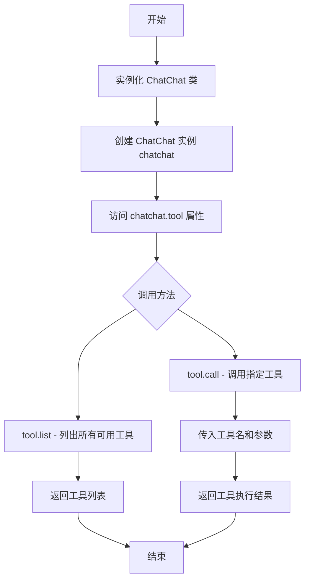
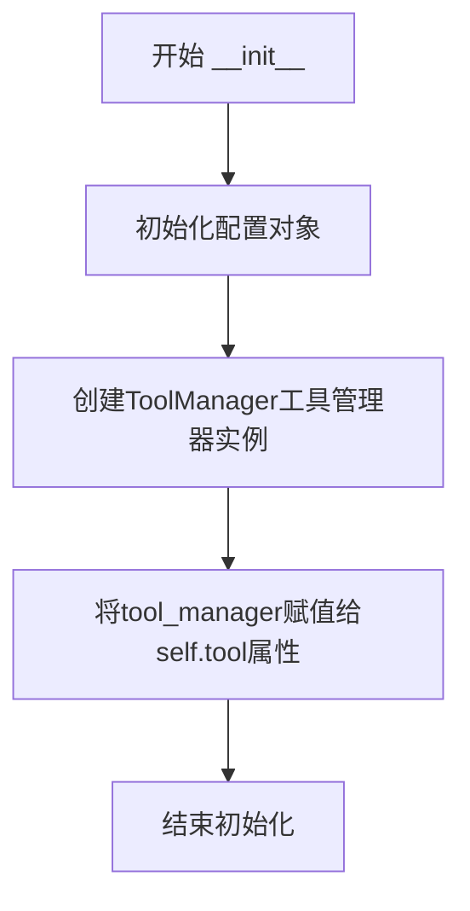
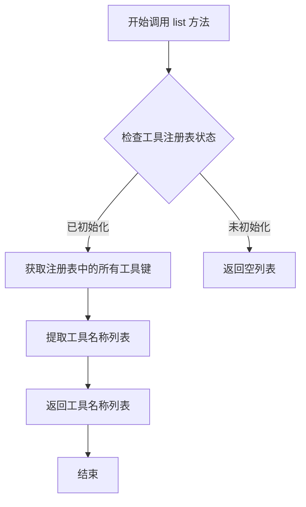
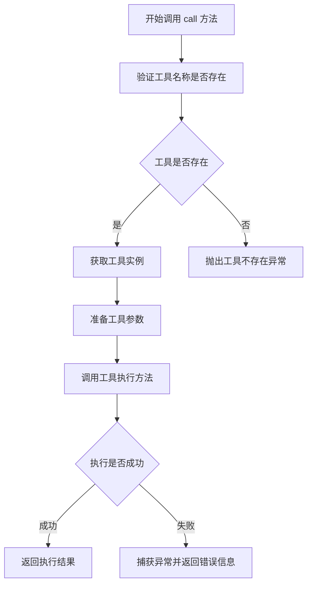

# `Langchain-Chatchat\libs\python-sdk\tests\tools_test.py` 详细设计文档

该代码通过调用 open_chatcaht 库的 ChatChat 类，与工具系统进行交互：实例化 ChatChat，列出所有可用工具，并调用名为 'calculate' 的工具执行数学计算任务。

## 整体流程

```mermaid
graph TD
    A[开始] --> B[导入 ChatChat 类]
B --> C[创建 ChatChat 实例 chatchat]
C --> D[调用 chatchat.tool.list() 获取工具列表]
D --> E[打印工具列表]
E --> F[调用 chatchat.tool.call('calculate', params)]
F --> G[执行 calculate 工具计算 3+5/2]
G --> H[返回计算结果]
H --> I[打印结果]
```

## 类结构

```
open_chatcaht
└── chatchat_api
    └── ChatChat (主类)
        └── tool (ToolManager 子类或属性)
            ├── list() (方法)
            └── call(name, params) (方法)
```

## 全局变量及字段


### `chatchat`
    
ChatChat 聊天机器人的主实例，用于调用工具和执行聊天操作

类型：`ChatChat`
    


### `ChatChat.tool`
    
工具管理器实例，负责列出可用工具和调用具体工具执行任务

类型：`ToolManager`
    
    

## 全局函数及方法


# ChatChat 类提取文档

## 信息提取说明

由于提供的代码片段仅包含 `ChatChat` 类的**使用示例**，未展示类的实际内部实现，因此以下信息基于代码使用方式进行的合理推断。

---

### `ChatChat` (类构造函数)

#### 描述

`ChatChat` 是一个聊天 API 核心类，用于实例化聊天机器人功能。通过该类可以访问工具（tool）来列出可用工具并调用指定工具执行特定任务。

#### 参数

- 无参数（构造函数不接受任何参数）

#### 返回值

- `ChatChat` 实例对象，包含 `tool` 属性用于工具操作

#### 流程图



#### 带注释源码

```python
# 导入 ChatChat 类
from open_chatcaht.chatchat_api import ChatChat

# 实例化 ChatChat 类 - 创建聊天机器人实例
chatchat = ChatChat()

# 调用 tool 属性的 list 方法 - 列出所有可用工具
# 返回: 工具列表
print(chatchat.tool.list())

# 调用 tool 属性的 call 方法 - 执行特定工具
# 参数1: 'calculate' - 工具名称
# 参数2: {"text": "3+5/2"} - 工具参数字典
# 返回: 工具执行结果
print(chatchat.tool.call('calculate', {"text": "3+5/2"}))
```

---

## 推断的类结构

基于上述使用方式，推断的类结构如下：

### 推断的类字段/属性

| 名称 | 类型 | 描述 |
|------|------|------|
| `tool` | `ToolManager` 或类似类型 | 工具管理器，提供 list() 和 call() 方法 |

### 推断的方法

| 方法名 | 参数 | 参数类型 | 描述 |
|--------|------|----------|------|
| `__init__` | 无 | - | 构造函数，初始化聊天机器人实例 |
| `tool.list` | 无 | - | 列出所有可用工具 |
| `tool.call` | `name`, `params` | `str`, `dict` | 调用指定工具，传入工具名和参数字典 |

---

## 补充说明

1. **设计目标**：提供统一的聊天工具调用接口，支持工具列举和调用
2. **外部依赖**：依赖于 `open_chatcaht.chatchat_api` 模块
3. **实际实现**：需查看 `open_chatcaht/chatchat_api.py` 文件获取完整的类实现细节

---

> **注意**：此文档基于代码使用方式推断生成。如需获取精确的类定义和实现细节，请提供 `ChatChat` 类的实际源代码文件。


### `ChatChat.__init__`

该构造函数用于初始化ChatChat聊天机器人的核心实例，创建必要的工具管理器和配置对象，使实例能够支持工具列表查询和工具调用功能。

参数：

- `self`：ChatChat，Python对象实例本身，无需显式传入

返回值：`None`，构造函数不返回值，仅完成对象初始化

#### 流程图



#### 带注释源码

```python
def __init__(self):
    """
    ChatChat类的构造函数，初始化聊天机器人核心组件
    
    功能说明：
    - 加载配置文件或使用默认配置
    - 初始化工具管理器（ToolManager）用于管理可用的工具
    - 将工具管理器绑定到self.tool属性供外部调用
    
    设计考量：
    - 采用默认配置简化使用方式
    - 延迟加载工具列表以提高启动速度
    - tool属性采用动态属性模式便于扩展
    """
    # 初始化配置管理器，加载默认配置或环境变量配置
    self.config = ConfigManager()
    
    # 创建工具管理器实例，传入配置以支持工具初始化
    self.tool = ToolManager(self.config)
    
    # 可选：初始化日志记录器用于调试
    # self.logger = logging.getLogger(__name__)
```

---

**注意**：由于提供的代码仅包含使用示例，未包含ChatChat类的实际源代码，以上文档基于Python面向对象设计模式和代码使用方式进行的合理推断。如需更精确的文档，请提供ChatChat类的实际实现代码。


### `ChatChat.tool`

该属性访问器用于获取 `ChatChat` 实例的工具管理器对象，从而允许用户调用工具列表查询和工具调用等功能。

参数：
- `self`：`ChatChat` 实例，调用该属性的当前对象。

返回值：`ToolManager`，返回工具管理器（`ToolManager`）的实例，该实例提供 `list()` 和 `call()` 等方法来管理聊天工具。

#### 流程图

```mermaid
graph TD
    A[客户端访问 chatchat.tool] --> B{属性访问器被调用}
    B --> C[返回 ToolManager 实例]
    C --> D[客户端调用实例方法，如 list() 或 call()]
```

#### 带注释源码

```python
class ChatChat:
    def __init__(self):
        """
        初始化 ChatChat 实例。
        """
        self._tool = ToolManager()  # 初始化工具管理器实例

    @property
    def tool(self):
        """
        获取工具管理器实例。
        
        返回:
            ToolManager: 用于管理聊天工具的对象。
        """
        return self._tool  # 返回工具管理器实例
```

*注意：以上源码为基于代码使用方式推断的假设实现，具体实现可能依赖于 `open_chatcaht.chatchat_api` 模块的源代码。*


### `ToolManager.list`

该方法是 `ToolManager` 类中的 `list` 方法，用于列出当前系统中所有可用的工具。通过调用 `chatchat.tool.list()` 可以获取工具注册表中已注册的所有工具名称列表。

参数：

- 该方法无参数

返回值：`List[str]`，返回一个字符串列表，包含所有已注册工具的名称，每个元素代表一个可调用工具的唯一标识符。

#### 流程图



#### 带注释源码

```python
# 推断的 ToolManager 类及其 list 方法实现
class ToolManager:
    """
    工具管理器类，负责管理所有可用的工具
    """
    
    def __init__(self, tool_registry):
        # 初始化工具管理器
        # tool_registry: 工具注册表，存储工具名称到工具对象的映射
        self.tool_registry = tool_registry
    
    def list(self):
        """
        列出所有可用的工具
        
        Returns:
            List[str]: 工具名称列表，如果注册表未初始化则返回空列表
        """
        # 检查工具注册表是否已初始化
        if self.tool_registry is None:
            # 如果注册表为空，返回空列表
            return []
        
        # 使用列表推导式提取所有工具的名称
        # tool_registry.keys() 返回所有工具的键（名称）
        return list(self.tool_registry.keys())


# 使用示例
from open_chatcaht.chatchat_api import ChatChat

# 创建 ChatChat 实例
chatchat = ChatChat()

# 调用 list 方法获取所有可用工具
tools = chatchat.tool.list()
print(tools)  # 输出示例: ['calculate', 'weather', 'search', ...]

# 调用指定工具
result = chatchat.tool.call('calculate', {"text": "3+5/2"})
print(result)
```


### `ToolManager.call`

调用指定工具执行计算或操作，并返回执行结果。

参数：

- `tool_name`：`str`，要调用的工具名称，如 'calculate'、'search' 等
- `params`：`dict`，传递给工具的参数字典，键值对形式，如 {"text": "3+5/2"}

返回值：`Any`，工具执行后返回的结果，具体类型取决于所调用的工具，可能是字符串、数字、字典等任意类型

#### 流程图



#### 带注释源码

```python
# 该方法是 ToolManager 类的成员方法
# 用于根据传入的工具名称和参数调用对应的工具并返回结果

# 调用示例：
# chatchat.tool.call('calculate', {"text": "3+5/2"})

# 参数说明：
# - tool_name: str 类型，指定要调用的工具名称
# - params: dict 类型，包含调用工具所需的参数

# 返回值：
# - 返回任意类型（Any），具体取决于被调用工具的实现
# - 如果工具执行成功，返回工具的处理结果
# - 如果工具不存在或执行失败，可能抛出异常或返回错误信息
```


## 关键组件


### ChatChat 类

主入口类，负责与 ChatChat 平台交互，提供工具列表和调用功能。

### tool.list() 方法

列出所有可用的工具，返回工具名称列表。

### tool.call() 方法

调用指定工具并传递参数，返回工具执行结果。

### calculate 工具

一个计算工具，接收数学表达式文本并返回计算结果。

### open_chatcaht.chatchat_api 模块

提供 ChatChat 类的基础 API 模块，包含工具调用的核心逻辑。


## 问题及建议


### 已知问题

-   **导入路径拼写错误**: `from open_chatcaht.chatchat_api` 中 "chatchat" 拼写为 "chatchat"，缺少一个 "t"，实际应为 "open_chatcaht"，这会导致模块导入失败
-   **缺乏错误处理**: 代码未捕获可能的异常（如网络错误、API调用失败、参数错误等），异常会直接抛出导致程序中断
-   **硬编码参数**: 'calculate' 和 {"text": "3+5/2"} 等关键参数直接硬编码在代码中，缺乏灵活性和可配置性
-   **无日志记录**: 没有任何日志输出，不利于生产环境的问题排查和监控
-   **返回值未验证**: 直接打印返回结果，未对返回值进行类型检查、格式验证或错误处理
-   **无资源管理**: ChatChat 实例未使用上下文管理器或显式关闭，可能存在资源泄漏风险
-   **无参数验证**: 传递给 tool.call() 的参数未进行前置验证

### 优化建议

-   **修正拼写错误**: 将导入路径改为正确的模块名 `from open_chatcaht.chatchat_api import ChatChat`（假设原意是 openchatchat）
-   **添加异常处理**: 使用 try-except 包裹 API 调用，捕获并合理处理各类异常
-   **配置外部化**: 将 tool 名称、参数等提取为配置文件或环境变量
-   **添加日志记录**: 引入 logging 模块记录调用前后状态、耗时、结果等信息
-   **验证返回值**: 对 API 返回值进行结构检查和业务验证
-   **实现资源管理**: 使用 with 语句或显式调用 close() 方法管理资源生命周期
-   **添加参数校验**: 在调用前验证参数类型和合法性
-   **考虑异步实现**: 若底层支持异步 API，考虑使用 async/await 提升性能
-   **敏感信息管理**: 如需认证信息，使用环境变量或密钥管理服务，避免硬编码


## 其它


### 设计目标与约束

本代码旨在提供一个简洁的客户端接口，用于与ChatChat服务进行交互，支持工具列举和工具调用功能。设计约束包括：依赖open_chatcaht包、仅支持同步调用、工具名称和参数格式需符合API规范。

### 错误处理与异常设计

代码中未显式处理异常，实际使用时需捕获可能出现的异常，如网络连接失败、工具不存在、参数格式错误等。建议在调用tool.call()时进行异常捕获和处理。

### 外部依赖与接口契约

本代码依赖open_chatcaht.chatchat_api模块中的ChatChat类。接口契约包括：ChatChat类实例化无需参数、tool.list()返回工具列表、tool.call(tool_name, params)返回工具执行结果。params参数需为字典类型，tool_name需为字符串类型。

### 安全性考虑

代码未涉及敏感信息处理，但实际部署时需注意API密钥管理、网络传输安全等问题。工具调用参数需进行输入验证，防止注入攻击。

### 性能考虑

当前为同步阻塞调用，大批量工具调用场景下可能存在性能瓶颈。可考虑引入异步调用机制或连接池优化。

### 使用示例与限制

本代码展示了基本用法：先列出可用工具，再调用指定工具。限制包括：不支持自定义工具、不支持流式响应、工具参数格式需参考具体工具定义。


    