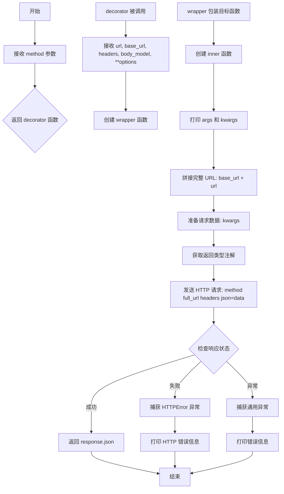
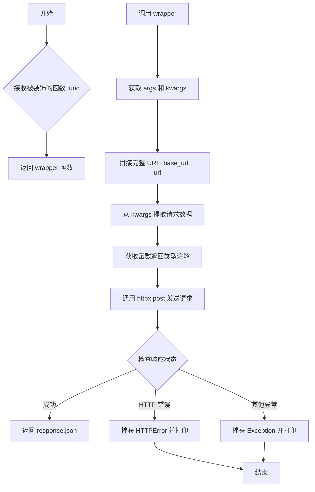
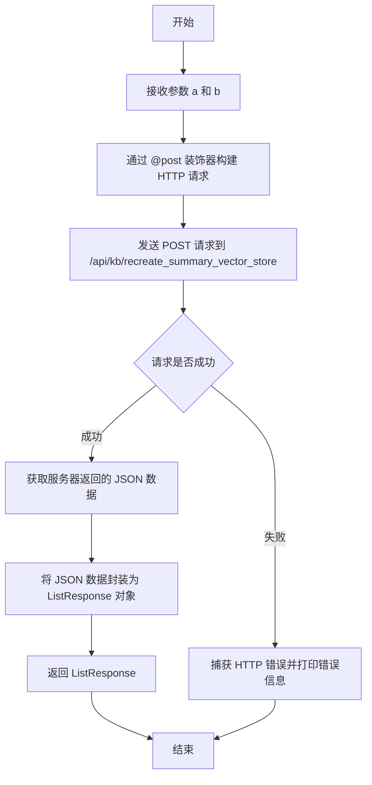
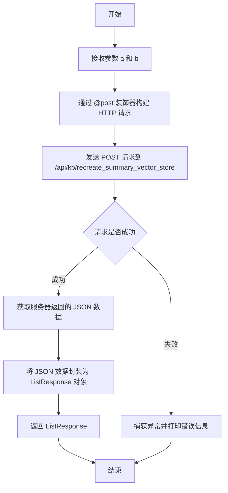
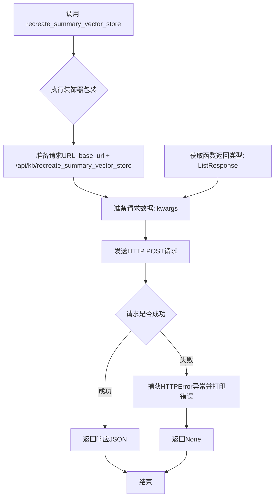

# `Langchain-Chatchat\libs\python-sdk\tests\装饰器声明请求_test.py` 详细设计文档

该代码实现了一个基于装饰器的HTTP请求封装框架，通过自定义装饰器简化API调用流程，支持链式调用和参数自动传递，并提供了错误处理机制。

## 整体流程

```mermaid
graph TD
    A[开始] --> B[定义http_request装饰器]
    B --> C[创建post装饰器实例]
    C --> D{装饰目标}
D --> E[装饰类方法: MyAPIClient.recreate_summary_vector_store]
D --> F[装饰独立函数: recreate_summary_vector_store]
E --> G[实例化MyAPIClient]
F --> H[直接调用函数]
G --> I[调用实例方法]
H --> J[执行装饰器wrapper]
I --> J
J --> K[构建完整URL]
K --> L[构建请求数据data]
L --> M[调用httpx.post发送请求]
M --> N{请求成功?}
N -- 是 --> O[返回response.json()]
N -- 否 --> P[捕获HTTPError异常]
P --> Q[打印错误信息]
Q --> R[继续执行不返回]
```

## 类结构

```
ApiClient (基类)
└── MyAPIClient (继承ApiClient)
    └── recreate_summary_vector_store (实例方法)
```

## 全局变量及字段


### `base_url`
    
API的基础URL地址，指向API服务端点

类型：`str`
    


### `headers`
    
HTTP请求头，包含Authorization认证信息

类型：`dict`
    


    

## 全局函数及方法


### `http_request`

`http_request` 是一个装饰器工厂函数，它接收一个 HTTP 方法（如 `httpx.post`），返回一个装饰器。该装饰器可以包装函数，使其自动将函数参数作为 JSON 请求体发送到指定的 URL，并返回响应 JSON 数据。

参数：

- `method`：`Type[httpx.post]`（或类似 HTTP 方法），用于执行实际的 HTTP 请求

返回值：`decorator`，返回装饰器函数

#### 流程图



#### 带注释源码

```python
def http_request(method):
    """
    装饰器工厂函数，用于创建 HTTP 请求装饰器。
    
    参数:
        method: HTTP 方法（如 httpx.post, httpx.get 等）
    
    返回:
        decorator: 返回装饰器函数
    """
    
    def decorator(url, base_url='', headers=None, body_model: Type[BaseModel] = None, **options):
        """
        装饰器内部函数，配置请求参数。
        
        参数:
            url: 请求路径
            base_url: 基础 URL，默认为空字符串
            headers: 请求头，默认为 None
            body_model: Pydantic BaseModel 类型，用于请求体验证，默认为 None
            **options: 其他可选参数
        
        返回:
            wrapper: 返回包装函数
        """
        # 如果 headers 为 None，设置为空字典
        headers = headers or {}

        def wrapper(func):
            """
            包装目标函数的内部装饰器。
            
            参数:
                func: 被装饰的目标函数
            
            返回:
                inner: 返回包装后的函数
            """
            
            @wraps(func)
            def inner(*args, **kwargs):
                """
                执行实际 HTTP 请求的内部函数。
                
                参数:
                    *args: 位置参数
                    **kwargs: 关键字参数（作为请求体）
                
                返回:
                    response.json(): 响应的 JSON 数据
                """
                try:
                    # 打印传入的参数（调试用）
                    print("args", args)
                    print("kwargs", kwargs)
                    
                    # 准备请求 URL
                    full_url = base_url + url

                    # 准备请求数据（使用 kwargs 作为请求体）
                    data = kwargs
                    
                    # 获取被装饰函数的返回类型注解
                    return_type = get_type_hints(func).get('return')
                    print(f"Return type: {return_type}")
                    print(body_model)
                    print(f"body_model: {body_model}")
                    
                    # 发送 HTTP 请求
                    response = method(full_url, headers=headers, json=data)
                    
                    # 检查 HTTP 响应状态码，如果失败则抛出异常
                    response.raise_for_status()

                    # 返回响应的 JSON 数据
                    return response.json()
                
                # 捕获 HTTP 错误（如 4xx, 5xx 状态码）
                except requests.exceptions.HTTPError as http_err:
                    print(f"HTTP error occurred: {http_err}")
                
                # 捕获其他所有异常
                except Exception as err:
                    print(f"An error occurred: {err}")

            return inner

        return wrapper

    return decorator
```


### `post`

`post` 是一个基于 `http_request` 装饰器工厂创建的 HTTP POST 请求装饰器，用于将函数或方法转换为发送 POST API 请求的端点，自动处理 URL 拼接、请求体序列化和响应处理。

参数：

- `url`：`str`，要请求的 API 端点路径
- `base_url`：`str`（可选，默认为空字符串），API 的基础 URL
- `headers`：`dict`（可选，默认为 None），HTTP 请求头
- `body_model`：`Type[BaseModel]`（可选，默认为 None），请求体的 Pydantic 模型类型
- `**options`：其他可选参数

返回值：无明确的返回值（返回被装饰的函数的包装器）

#### 流程图



#### 带注释源码

```python
# post 是 http_request 装饰器工厂的返回值
# http_request 接受一个 HTTP 方法（如 httpx.post）并返回一个装饰器
post = http_request(httpx.post)


# http_request 函数详解：
def http_request(method):
    """
    装饰器工厂函数，用于创建 HTTP 请求装饰器
    :param method: HTTP 方法（如 httpx.post, httpx.get 等）
    :return: decorator 函数
    """
    
    def decorator(url, base_url='', headers=None, body_model: Type[BaseModel] = None, **options):
        """
        装饰器内部函数，用于配置装饰器行为
        :param url: API 端点路径
        :param base_url: 基础 URL
        :param headers: HTTP 请求头
        :param body_model: Pydantic 模型类，用于请求体验证
        :param options: 其他可选参数
        :return: wrapper 函数
        """
        
        headers = headers or {}  # 确保 headers 不为 None
        
        def wrapper(func):
            """
            实际包装被装饰函数的包装器
            :param func: 被装饰的函数
            :return: inner 函数
            """
            
            @wraps(func)  # 保留原函数的元信息
            def inner(*args, **kwargs):
                """
                实际执行 HTTP 请求的内部函数
                :param args: 位置参数
                :param kwargs: 关键字参数
                :return: HTTP 响应 JSON 数据
                """
                
                try:
                    # 调试输出：打印传入的参数
                    print("args", args)
                    print("kwargs", kwargs)
                    
                    # 1. 准备完整请求 URL
                    full_url = base_url + url
                    
                    # 2. 准备请求数据（使用 kwargs）
                    data = kwargs
                    
                    # 3. 获取函数返回类型注解
                    return_type = get_type_hints(func).get('return')
                    print(f"Return type: {return_type}")
                    print(body_model)
                    print(f"body_model: {body_model}")
                    
                    # 4. 发送 HTTP POST 请求
                    # method 是传入的 httpx.post
                    response = method(full_url, headers=headers, json=data)
                    
                    # 5. 检查 HTTP 响应状态
                    response.raise_for_status()
                    
                    # 6. 返回响应 JSON 数据
                    return response.json()
                    
                except requests.exceptions.HTTPError as http_err:
                    # 捕获 HTTP 错误（如 404, 500 等）
                    print(f"HTTP error occurred: {http_err}")
                except Exception as err:
                    # 捕获其他所有异常
                    print(f"An error occurred: {err}")
            
            return inner
        
        return wrapper
    
    return decorator


# 使用示例：
# @post 装饰器应用于 MyAPIClient.recreate_summary_vector_store 方法
# 当调用 api_client.recreate_summary_vector_store(a=1, b=2) 时：
#   - 拼接 URL: https://api.example.com + /api/kb/recreate_summary_vector_store
#   - 提取 kwargs: {'a': 1, 'b': 2}
#   - 发送 POST 请求到完整 URL，请求体为 {'a': 1, 'b': 2}
#   - 返回响应的 JSON 数据
```


### MyAPIClient.recreate_summary_vector_store

该方法是 `MyAPIClient` 类中的一个 API 调用方法，通过装饰器向远程服务器发送 POST 请求，以重新创建知识库的摘要向量存储。它接受两个整数参数 `a` 和 `b`，并返回 `ListResponse` 类型的响应对象。

参数：

-  `self`：`MyAPIClient`，隐藏的类实例引用，用于访问类属性和方法
-  `a`：`int`，第一个整数参数，用于指定某种配置或标识符
-  `b`：`int`，第二个整数参数，用于指定某种配置或标识符

返回值：`ListResponse`，服务器返回的列表响应对象，包含重新创建摘要向量存储的结果

#### 流程图



#### 带注释源码

```python
class MyAPIClient(ApiClient):
    """
    API 客户端类，继承自 ApiClient，用于封装知识库相关的 API 调用
    """

    @post(url='/api/kb/recreate_summary_vector_store', base_url=base_url, headers=headers,
          body_model=DeleteKnowledgeBaseParam)
    def recreate_summary_vector_store(
            self,
            a: int,
            b: int
    ) -> ListResponse:
        """
        重新创建知识库的摘要向量存储
        
        该方法通过装饰器向指定 URL 发送 HTTP POST 请求，请求体由 a 和 b 参数组成
        服务器处理完成后返回 ListResponse 类型的响应
        
        参数:
            self: MyAPIClient 实例，隐式传递
            a (int): 第一个整数参数，用于指定知识库或配置
            b (int): 第二个整数参数，用于指定配置或选项
        
        返回:
            ListResponse: 包含服务器响应数据的列表对象
        """
        pass


# 示例调用
if __name__ == "__main__":
    api_client = MyAPIClient()
    # 调用该方法发送 API 请求
    response = api_client.recreate_summary_vector_store(a=1, b=2)
    print("response", response)
```

---

### recreate_summary_vector_store

这是一个全局函数，使用 `@post` 装饰器包装，用于直接调用重新创建知识库摘要向量存储的 API 端点。它接受两个整数参数 `a` 和 `b`，并返回 `ListResponse` 类型的响应。

参数：

-  `a`：`int`，第一个整数参数，用于指定某种配置或标识符
-  `b`：`int`，第二个整数参数，用于指定某种配置或标识符

返回值：`ListResponse`，服务器返回的列表响应对象，包含重新创建摘要向量存储的结果

#### 流程图



#### 带注释源码

```python
@post(url='/api/kb/recreate_summary_vector_store', base_url=base_url, headers=headers,
      body_model=DeleteKnowledgeBaseParam)
def recreate_summary_vector_store(
        a: int,
        b: int
) -> ListResponse:
    """
    重新创建知识库的摘要向量存储（全局函数版本）
    
    这是一个模块级别的函数，通过装饰器直接发送 HTTP POST 请求
    请求体包含 a 和 b 参数，服务器返回 ListResponse 类型的响应
    
    参数:
        a (int): 第一个整数参数，用于指定知识库或配置
        b (int): 第二个整数参数，用于指定配置或选项
    
    返回:
        ListResponse: 包含服务器响应数据的列表对象
    """
    pass


# 注意：该全局函数在代码中未被实际调用
# 如需调用，请取消下方注释
# if __name__ == "__main__":
#     response = recreate_summary_vector_store(a=1, b=1)
#     print(response)
```


### `MyAPIClient.recreate_summary_vector_store`

该方法是 `MyAPIClient` 类中的一个成员方法，通过 `@post` 装饰器封装了向远程API发送POST请求的逻辑，用于重建知识库的摘要向量存储。方法接收两个整数参数 `a` 和 `b`，并返回 `ListResponse` 类型的结果。

参数：

- `self`：`MyAPIClient` 实例本身，隐式参数
- `a`：`int`，第一个整数参数（实际业务中可能表示知识库ID或相关标识）
- `b`：`int`，第二个整数参数（实际业务中可能表示版本号或配置参数）

返回值：`ListResponse`，表示API响应的列表数据对象

#### 流程图



#### 带注释源码

```python
class MyAPIClient(ApiClient):
    """
    API客户端类，继承自ApiClient
    用于与远程知识库API进行交互
    """

    @post(url='/api/kb/recreate_summary_vector_store', base_url=base_url, headers=headers,
          body_model=DeleteKnowledgeBaseParam)
    def recreate_summary_vector_store(
            self,
            a: int,
            b: int
    ) -> ListResponse:
        """
        重建知识库的摘要向量存储
        
        参数:
            a: int - 第一个整数参数（业务语义需根据实际场景确定）
            b: int - 第二个整数参数（业务语义需根据实际场景确定）
        
        返回:
            ListResponse - API响应对象，包含列表数据
            
        装饰器说明:
            - url: API端点路径
            - base_url: 基础URL (https://api.example.com)
            - headers: 请求头，包含Authorization信息
            - body_model: 请求体模型类型 (DeleteKnowledgeBaseParam)
        """
        pass
```

#### 技术债务与优化空间

1. **参数命名不规范**：参数 `a` 和 `b` 缺乏业务语义，应使用有意义的命名（如 `knowledge_base_id`、`version` 等）
2. **装饰器参数传递问题**：装饰器内部通过 `kwargs` 传递参数，但实际请求体应该使用 `body_model` 验证的 Pydantic 模型对象
3. **异常处理不完整**：仅打印错误信息，未向上层抛出异常或返回结构化错误
4. **硬编码配置**：`base_url` 和 `headers` 在模块级别定义，不利于多环境配置管理
5. **返回值未充分利用**：虽然声明返回 `ListResponse`，但装饰器直接返回 `response.json()` 原始数据，应进行类型转换
6. **缺少请求超时设置**：HTTP请求未配置超时时间，可能导致请求无限期等待

## 关键组件


### http_request 装饰器工厂

一个高阶函数，用于创建HTTP请求装饰器，支持动态配置base_url、headers和body_model，并将函数参数转换为JSON请求体，同时处理HTTP错误和异常。

### post 装饰器

使用httpx.post方法的具体HTTP POST请求装饰器，通过http_request工厂创建，用于简化POST API调用。

### MyAPIClient 类

继承自ApiClient的API客户端类，通过装饰器模式注册API端点，将方法调用转换为HTTP请求。

### recreate_summary_vector_store 方法/函数

用于重新创建知识库摘要向量存储的API端点，接受整型参数a和b，返回ListResponse类型的响应数据。

### DeleteKnowledgeBaseParam 请求体模型

使用pydantic定义的请求参数模型，用于验证和序列化API请求体。

### base_url 全局变量

存储API基础URL的配置，值为"https://api.example.com"。

### headers 全局变量

存储HTTP请求头，包含Authorization认证信息。

### http_request 内部错误处理机制

try-except块捕获requests.exceptions.HTTPError和其他Exception，分别处理HTTP错误和通用错误，仅打印错误信息但未向上抛出异常。

### get_type_hints 动态类型获取

在装饰器内部动态获取函数返回类型注解，用于后续处理或验证响应数据类型。


## 问题及建议


### 已知问题

-   **硬编码的敏感信息**：全局变量 `base_url` 和 `headers` 中的 `Bearer token` 被直接硬编码，存在严重的安全风险
-   **装饰器参数使用混乱**：`http_request` 装饰器的参数设计不合理，`url`、`base_url`、`headers`、`body_model` 作为装饰器参数传入，但在装饰器内部并未正确使用这些参数，导致逻辑混乱
-   **未使用的参数**：`body_model` 参数声明但从未被使用，请求体数据直接从 `kwargs` 获取，未进行任何模型验证或转换
-   **类型提示失效**：`get_type_hints(func).get('return')` 在装饰后获取返回类型会失败，因为 `inner` 函数没有继承原函数的类型注解
-   **异常被吞没**：所有异常捕获后仅打印错误信息，没有重新抛出或返回有意义的错误结果，导致调用者无法判断请求是否成功
-   **HTTP 库混用**：代码同时导入了 `httpx` 和 `requests`，且装饰器内部实际使用的是 `httpx`，这种混用增加了维护成本
-   **调试代码遗留**：`print` 语句遍布代码各处，这些调试代码不应该出现在生产环境中
-   **继承关系不完整**：`MyAPIClient` 继承 `ApiClient` 但未提供任何实现细节，不清楚 `ApiClient` 的具体职责
-   **装饰器返回值问题**：装饰器返回 `inner` 函数而非正确的包装函数，且未正确传递函数元数据

### 优化建议

-   将敏感配置（API URL、Token 等）移至环境变量或配置文件，使用 `os.environ` 或专用配置管理模块
-   重构装饰器设计，使用 `functools.wraps` 时需确保正确传递被装饰函数，并考虑使用类装饰器或更清晰的参数传递方式
-   若需使用 `body_model` 进行请求体验证，应在装饰器中实例化模型并验证数据；否则移除该参数
-   使用 `typing.get_type_hints` 时添加异常处理，或在装饰器外部预先获取类型信息并作为元数据传递
-   异常处理应返回有意义的错误信息或重新抛出自定义异常，建议定义统一的异常类或错误响应结构
-   统一使用一个 HTTP 库（推荐 `httpx`），避免同时引入多个相似功能的库
-   移除所有调试用的 `print` 语句，改用标准日志模块 `logging` 进行日志记录
-   完善 `ApiClient` 类的设计，或在类注释中说明其职责和继承关系
-   添加完整的文档字符串，包括函数、类、模块级别的说明，提高代码可维护性

## 其它


### 设计目标与约束

本代码的设计目标是提供一个通用的HTTP请求装饰器，简化API调用流程，统一处理请求参数、认证头和响应数据。设计约束包括：1）仅支持POST请求方法；2）依赖httpx和requests库进行HTTP通信；3）使用Pydantic的BaseModel作为请求体验证；4）装饰器设计遵循函数式编程范式，支持函数和类方法装饰。

### 错误处理与异常设计

代码中包含基本的错误处理逻辑，捕获requests.exceptions.HTTPError和其他Exception类型。当前实现仅通过print输出错误信息，缺乏结构化的异常传播机制。建议改进：1）定义自定义异常类（如APIRequestError）封装错误详情；2）根据HTTP状态码区分不同错误类型（4xx客户端错误、5xx服务器错误）；3）提供重试机制处理临时性网络故障；4）记录详细日志而非仅打印到控制台。

### 外部依赖与接口契约

本代码依赖以下外部包：1）httpx提供HTTP客户端功能；2）requests用于异常捕获；3）pydantic的BaseModel用于请求体验证；4）typing提供类型注解支持；5）functools.wraps用于装饰器函数签名保留。接口契约方面：装饰器接收url、base_url、headers、body_model参数，返回被装饰函数的代理函数，要求被装饰函数包含类型注解的返回值声明。

### 性能考虑

当前实现每次请求都会创建新的HTTP连接，未实现连接池复用。建议使用httpx.Client()创建持久连接以提升性能。此外，get_type_hints()在每次函数调用时都会重新获取类型信息，可考虑缓存以减少开销。响应数据直接返回JSON未做缓存机制，如需频繁调用相同接口可引入缓存层。

### 安全性考虑

当前代码将Authorization头硬编码在全局变量中，存在敏感信息泄露风险。建议：1）使用环境变量或密钥管理服务存储token；2）避免在日志中打印敏感请求参数；3）实现请求体加密或签名验证；4）添加超时配置防止请求挂起；5）考虑实现OAuth2等认证流程的支持。

### 兼容性设计

代码基于Python 3.x开发，使用typing模块确保类型安全。httpx和requests库需确保版本兼容性。当前仅支持POST方法，如需扩展其他HTTP方法（GET、PUT、DELETE等）需创建对应的装饰器工厂。建议定义统一的接口规范，支持同步和异步请求模式。

### 配置管理

当前base_url和headers配置硬编码在模块级别，缺乏灵活的配置管理机制。建议改进：1）支持配置文件（YAML/JSON）加载；2）支持环境变量覆盖；3）实现配置类封装相关参数；4）区分开发、测试、生产环境配置；5）提供运行时配置更新能力。

### 扩展性设计

装饰器设计遵循开闭原则，便于扩展。建议扩展方向：1）支持多种HTTP方法（GET、PUT、DELETE等）；2）实现请求/响应拦截器；3）添加请求重试和退避策略；4）支持WebSocket或SSE等长连接协议；5）集成API版本管理；6）实现请求限流和配额控制。

### 测试策略

当前代码缺少测试覆盖。建议测试策略：1）单元测试验证装饰器逻辑和参数处理；2）集成测试使用mock服务器验证实际HTTP请求；3）测试不同HTTP状态码的异常处理；4）测试边界条件（空参数、类型错误、超时等）；5）性能测试评估连接池和缓存效果；6）使用pytest框架并实现测试数据参数化。

    