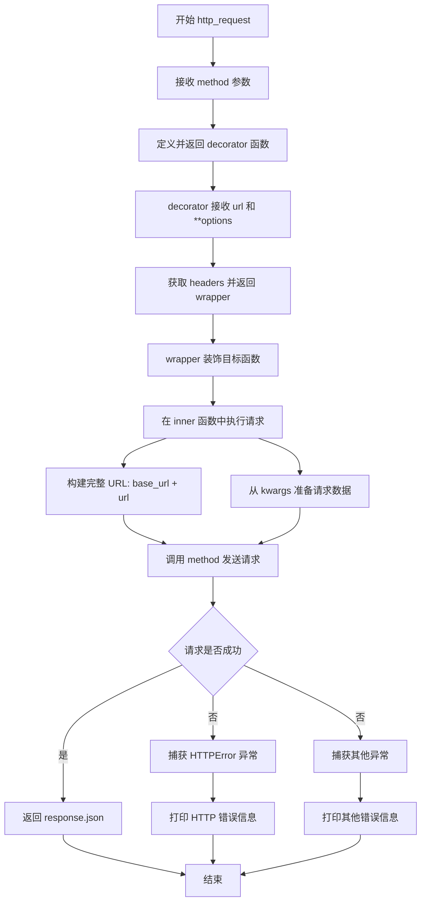
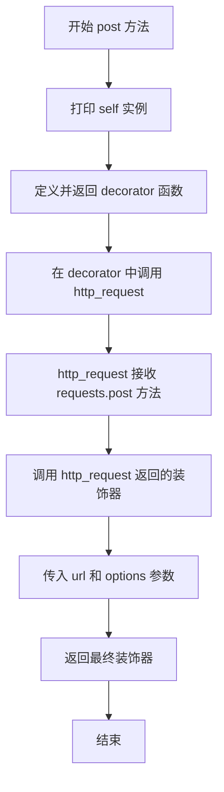
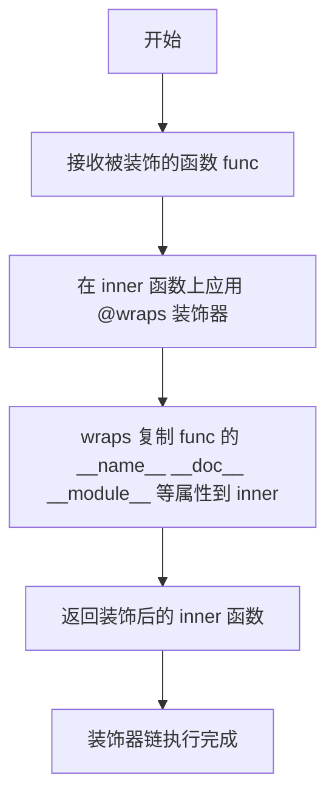
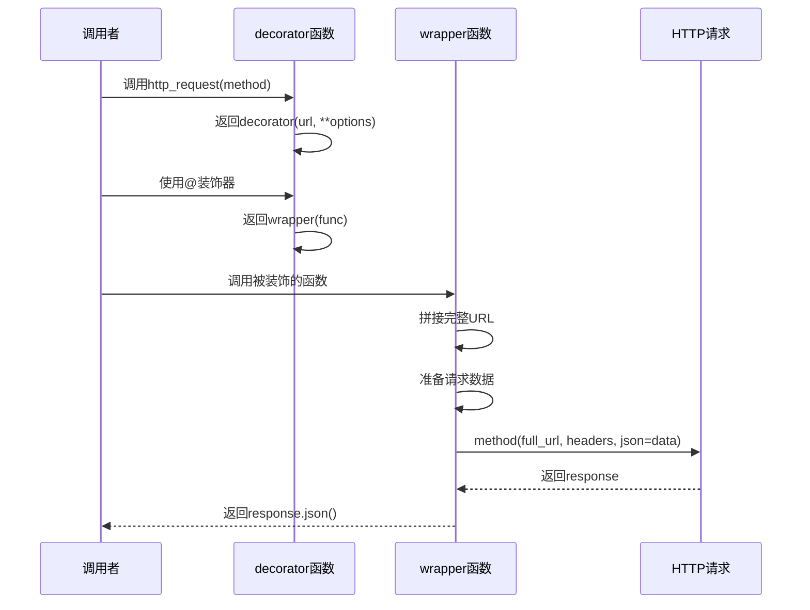
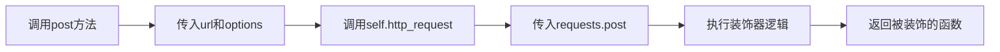
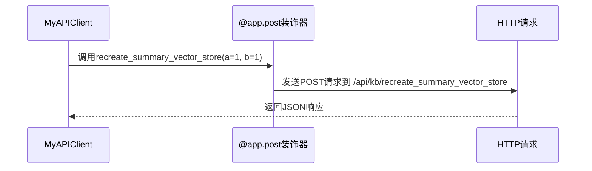
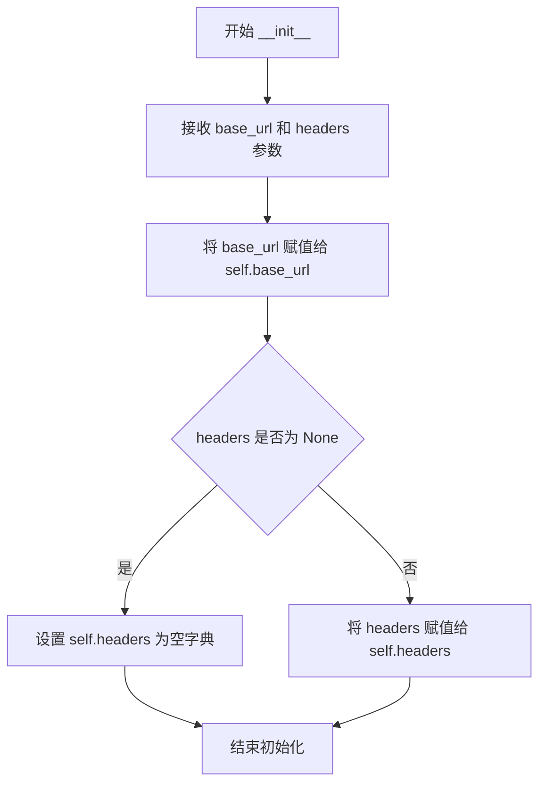
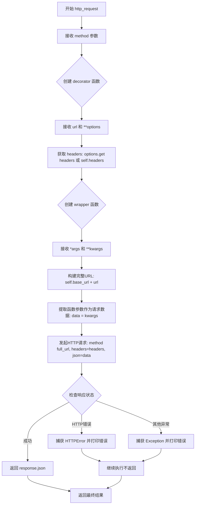
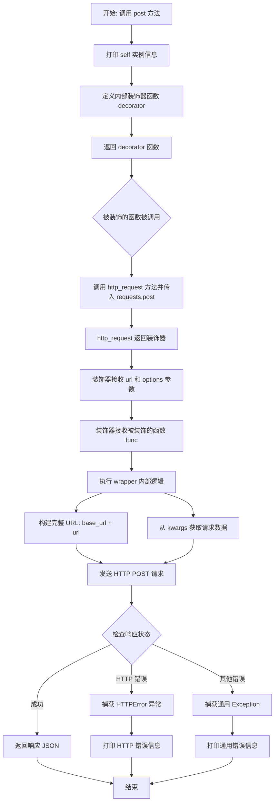

# `Langchain-Chatchat\libs\python-sdk\tests\装饰器声明请求_test1.py` 详细设计文档

该代码实现了一个基于装饰器模式的HTTP客户端框架，允许通过装饰器方式为类方法自动添加HTTP POST请求功能，并集成了请求参数序列化、响应处理和异常捕获机制。

## 整体流程

```mermaid
graph TD
A[开始] --> B[创建HTTPClient实例]
B --> C[MyAPIClient继承HTTPClient]
C --> D[定义recreate_summary_vector_store方法并应用@app.post装饰器]
D --> E{调用client.recreate_summary_vector_store}
E --> F[触发装饰器wrapper]
F --> G[构建完整URL: base_url + url]
G --> H[从kwargs获取请求数据]
H --> I[发送POST请求: requests.post]
I --> J{检查响应状态}
J -- 成功 --> K[返回response.json()]
J -- 失败 --> L[捕获HTTPError并打印错误]
L --> M[继续执行]
K --> N[输出响应结果]
```

## 类结构

```
HTTPClient (HTTP客户端基类)
└── MyAPIClient (继承HTTPClient的示例API客户端)
```

## 全局变量及字段


### `app`
    
模块级HTTPClient实例，用于作为装饰器

类型：`HTTPClient`
    


### `HTTPClient.base_url`
    
HTTP请求的基础URL地址

类型：`str`
    


### `HTTPClient.headers`
    
HTTP请求的默认请求头

类型：`dict`
    
    

## 全局函数及方法


### `HTTPClient.http_request`

该方法是 `HTTPClient` 类的核心方法，作为装饰器工厂用于创建 HTTP 请求装饰器，支持动态配置请求 URL、请求头，并处理 HTTP 请求的发送与响应解析。

参数：

- `method`：`callable`，HTTP 方法（如 `requests.post`、`requests.get` 等），用于执行实际的 HTTP 请求

返回值：`function`，返回一个装饰器函数，该装饰器接收 URL 和可选参数，并返回一个用于装饰目标函数的装饰器

#### 流程图



#### 带注释源码

```python
def http_request(self, method):
    """
    HTTP 请求装饰器工厂方法
    :param method: HTTP 方法（如 requests.post, requests.get 等）
    :return: 返回一个装饰器函数
    """
    def decorator(url, **options):
        """
        装饰器内部函数
        :param url: 请求的相对 URL 路径
        :param options: 额外的请求选项（如 headers）
        :return: 返回 wrapper 装饰器
        """
        # 获取请求头，若未指定则使用实例默认请求头
        headers = options.get('headers', self.headers)

        def wrapper(func):
            """
            实际装饰目标函数的包装器
            :param func: 被装饰的目标函数/方法
            :return: 返回 inner 函数
            """
            @wraps(func)
            def inner(*args, **kwargs):
                """
                核心请求处理函数
                :param args: 位置参数（通常包含 self）
                :param kwargs: 关键字参数（请求数据）
                :return: HTTP 响应 JSON 数据
                """
                try:
                    # 步骤1: 构建完整请求 URL
                    full_url = self.base_url + url
                    # 获取实例对象（假设 func 是类的方法）
                    instance = args[0]
                    print(f"Instance: {instance}")
                    
                    # 步骤2: 从函数参数准备请求数据
                    data = kwargs
                    print(kwargs)
                    
                    # 步骤3: 发送 HTTP 请求
                    # 使用传入的 method（如 requests.post）发送请求
                    # 请求体使用 json 格式发送 kwargs 数据
                    response = method(full_url, headers=headers, json=data)
                    # 检查 HTTP 响应状态，若出错则抛出异常
                    response.raise_for_status()

                    # 步骤4: 返回响应 JSON 数据
                    return response.json()
                except requests.exceptions.HTTPError as http_err:
                    # 捕获 HTTP 错误（如 4xx, 5xx 状态码）
                    print(f"HTTP error occurred: {http_err}")
                except Exception as err:
                    # 捕获所有其他异常（如网络错误、连接超时等）
                    print(f"An error occurred: {err}")

            # 返回装饰后的函数
            return inner

        # 返回 wrapper 装饰器
        return wrapper

    # 返回 decorator 装饰器工厂
    return decorator
```

---

### `HTTPClient.post`

该方法是对 `http_request` 方法的简化封装，专门用于创建 POST 请求的装饰器，接收 URL 和可选参数，返回一个可装饰目标函数的装饰器。

参数：

- `url`：`str`，请求的目标 URL 路径
- `**options`：`dict`，可选的请求选项（如自定义 headers）

返回值：`function`，返回一个装饰器函数，用于装饰目标方法

#### 流程图



#### 带注释源码

```python
def post(self, url, **options):
    """
    POST 请求装饰器便捷方法
    :param url: 请求的相对 URL 路径
    :param options: 额外的请求选项
    :return: 返回装饰器函数
    """
    # 打印当前实例，用于调试
    print(self)

    # 定义装饰器函数
    def decorator(func):
        """
        实际装饰目标函数的装饰器
        :param func: 被装饰的目标方法
        :return: 返回装饰后的函数
        """
        # 链式调用：
        # 1. self.http_request(requests.post) 返回 decorator(url, **options)
        # 2. 传入 url 和 options 参数，返回 wrapper
        # 3. 用 wrapper 装饰 func 并返回
        return self.http_request(requests.post)(url, **options)(func)

    # 返回装饰器
    return decorator
```

---

### `MyAPIClient.recreate_summary_vector_store`

该方法是一个使用 `@app.post` 装饰的示例 API 调用方法，演示了如何结合 `HTTPClient` 的装饰器机制发起 POST 请求至指定的 API 端点。

参数：

- `self`：`MyAPIClient` 实例，隐式参数，表示调用该方法的类实例
- `a`：`int`，请求参数 a
- `b`：`int`，请求参数 b

返回值：`any`，返回 HTTP 响应解析后的 JSON 数据（由装饰器返回）

#### 流程图

```mermaid
graph TD
    A[调用 recreate_summary_vector_store] --> B[执行被装饰器包装的 inner 函数]
    B --> C[构建完整 URL: base_url + /api/kb/recreate_summary_vector_store]
    C --> D[准备请求数据: {a: 1, b: 1}]
    D --> E[调用 requests.post 发送请求]
    E --> F{请求是否成功}
    F -->|是| G[返回 response.json]
    F -->|否| H[捕获并打印异常]
    G --> I[输出响应结果]
    H --> I
```

#### 带注释源码

```python
@app.post(url='/api/kb/recreate_summary_vector_store')
def recreate_summary_vector_store(self, a: int, b: int):
    """
    示例 API 方法，使用装饰器发起 POST 请求
    :param self: MyAPIClient 实例
    :param a: 整数参数 a
    :param b: 整数参数 b
    :return: HTTP 响应 JSON 数据
    """
    # 方法体为空（...），实际逻辑由装饰器处理
    # 装饰器会在方法被调用时自动执行 HTTP 请求
    # 请求数据为 {a: a的值, b: b的值}
    # 请求 URL 为: https://api.example.com/api/kb/recreate_summary_vector_store
    ...
```

---

### 潜在的技术债务或优化空间

1. **缺少 inspect 模块的实际使用**：代码导入了 `inspect` 模块但未使用，可考虑利用 `inspect` 模块获取函数签名信息，增强请求参数的自动处理能力

2. **硬编码请求数据处理**：当前直接从 `kwargs` 获取请求数据，缺少对参数校验和类型转换，建议增加参数验证逻辑

3. **异常处理不完整**：捕获异常后仅打印日志，未返回有意义的错误信息或抛出自定义异常给调用方

4. **装饰器设计复杂**：多层嵌套装饰器导致代码可读性较差，可考虑使用更清晰的设计模式

5. **缺少请求超时设置**：HTTP 请求未设置超时时间，可能导致请求无限等待

6. **全局变量 `app` 的使用**：`app` 作为全局实例存在，建议改为依赖注入方式

---

### 其他项目

#### 设计目标与约束

- **目标**：提供一种通过装饰器简化 HTTP API 调用的实现方式
- **约束**：假设被装饰的方法第一个参数为 `self`（类方法），依赖 `requests` 库

#### 错误处理与异常设计

- 使用 `try-except` 捕获 `requests.exceptions.HTTPError` 及通用 `Exception`
- 错误仅打印日志，未向上传递或返回错误码

#### 数据流与状态机

- 装饰器通过闭包捕获配置信息（`url`, `headers`, `method`）
- 调用时：参数 → kwargs → JSON 请求体 → HTTP 响应 → JSON 返回值

#### 外部依赖与接口契约

- 依赖 `requests` 库进行 HTTP 通信
- 依赖 `functools.wraps` 保持函数元信息
- 装饰器接收 `url` 字符串和可选 `headers` 字典


### `functools.wraps`

`functools.wraps` 是 Python 标准库 `functools` 模块中的一个装饰器，用于元编程。在给定的代码中，`wraps` 被用于装饰内部函数 `inner`，以便在装饰器模式下保留原函数 `func` 的元数据（如 `__name__`、`__doc__`、`__module__` 等）。

参数：

- `func`：`Callable`，需要保留元数据的原始函数对象

返回值：`Callable`，返回添加了元数据的包装函数

#### 流程图



#### 带注释源码

```python
# 内部定义的 wrapper 函数，用于包装原始函数
def wrapper(func):
    # 使用 functools.wraps 装饰器
    # 作用：复制被装饰函数 func 的元数据（__name__, __doc__, __module__ 等）
    # 到 inner 函数，避免被装饰后丢失原函数的名称和文档字符串
    @wraps(func)
    def inner(*args, **kwargs):
        try:
            # 准备请求的完整 URL
            full_url = self.base_url + url
            # 获取实例对象（假设 func 是类的方法）
            instance = args[0]
            print(f"Instance: {instance}")
            # 从函数参数准备请求数据
            data = kwargs
            print(kwargs)
            # 发送 HTTP 请求
            response = method(full_url, headers=headers, json=data)
            response.raise_for_status()
            # 返回响应的 JSON 数据
            return response.json()
        except requests.exceptions.HTTPError as http_err:
            print(f"HTTP error occurred: {http_err}")
        except Exception as err:
            print(f"An error occurred: {err}")
    # 返回装饰后的 inner 函数
    return inner
```

#### 技术说明

`functools.wraps` 的核心功能包括：

1. **元数据保留**：将原函数 `func` 的以下属性复制到包装函数：
   - `__name__`：函数名称
   - `__doc__`：函数文档字符串
   - `__module__`：函数所属模块
   - `__qualname__`：函数限定名称
   - `__annotations__`：函数注解
   - `__dict__`：函数属性字典

2. **调试友好**：在装饰器模式下，没有 `wraps`，被装饰的函数会丢失原始名称，调试时显示的是 `inner` 而不是原始函数名

3. **反射支持**：保留元数据使得 `inspect` 模块可以正确获取函数签名和属性


### HTTPClient

这是一个基于装饰器模式的HTTP客户端类，通过装饰器方式简化HTTP请求的发送过程，支持自定义请求头、基础URL配置，并内置异常处理机制。

参数：

- 无

返回值：无

#### 流程图

```mermaid
graph TD
    A[创建HTTPClient实例] --> B[配置base_url和headers]
    B --> C[使用装饰器@HTTPClient.post]
    C --> D[调用被装饰的方法]
    D --> E[执行http_request装饰器]
    E --> F[构建完整URL]
    F --> G[发送HTTP请求]
    G --> H{请求是否成功}
    H -->|是| I[返回JSON响应]
    H -->|否| J[捕获异常并打印错误]
```

#### 带注释源码

```
class HTTPClient:
    def __init__(self, base_url='', headers=None):
        """
        初始化HTTPClient实例
        :param base_url: 基础URL前缀
        :param headers: 默认请求头字典
        """
        self.base_url = base_url
        self.headers = headers or {}
```

---

### HTTPClient.http_request

这是一个高阶装饰器工厂方法，接收HTTP方法（如requests.post）作为参数，返回一个装饰器函数，用于拦截方法调用并发送相应的HTTP请求。

参数：

- `method`：方法类型，requests库的HTTP方法（如requests.post、requests.get等），用于指定要使用的HTTP请求方法

返回值：返回一个装饰器函数（decorator）

#### 流程图



#### 带注释源码

```
def http_request(self, method):
    """
    创建一个装饰器，用于发送HTTP请求
    :param method: HTTP方法（requests.post, requests.get等）
    :return: 装饰器函数
    """
    def decorator(url, **options):
        """
        装饰器外层，接收URL和选项
        :param url: 请求路径
        :param options: 额外选项（如headers）
        :return: 返回wrapper装饰器
        """
        headers = options.get('headers', self.headers)
        
        def wrapper(func):
            """
            实际的装饰器实现，包装函数
            :param func: 被装饰的函数
            :return: 包装后的函数
            """
            @wraps(func)
            def inner(*args, **kwargs):
                """
                执行HTTP请求的内部函数
                :param args: 位置参数
                :param kwargs: 关键字参数
                :return: JSON响应或None
                """
                try:
                    # 1. 准备请求URL，拼接base_url和url
                    full_url = self.base_url + url
                    instance = args[0]  # Assuming func is a method of the class
                    print(f"Instance: {instance}")
                    
                    # 2. 准备请求数据，从函数参数获取
                    data = kwargs
                    print(kwargs)
                    
                    # 3. 发送HTTP请求
                    response = method(full_url, headers=headers, json=data)
                    response.raise_for_status()
                    
                    # 4. 返回响应JSON
                    return response.json()
                except requests.exceptions.HTTPError as http_err:
                    # HTTP错误处理（4xx/5xx状态码）
                    print(f"HTTP error occurred: {http_err}")
                except Exception as err:
                    # 通用异常处理
                    print(f"An error occurred: {err}")
            
            return inner
        
        return wrapper
    
    return decorator
```

---

### HTTPClient.post

这是一个便捷的装饰器方法，专门用于POST请求，内部调用http_request方法并传入requests.post方法。

参数：

- `url`：字符串，请求的URL路径
- `**options`：可变关键字参数，可选参数如headers等

返回值：返回装饰器函数

#### 流程图



#### 带注释源码

```
def post(self, url, **options):
    """
    POST请求装饰器便捷方法
    :param url: 请求URL路径
    :param options: 额外选项（如自定义headers）
    :return: 装饰器
    """
    print(self)
    
    # 定义一个应用装饰器的函数
    def decorator(func):
        """
        实际应用装饰器的函数
        :param func: 被装饰的函数
        :return: 装饰后的函数
        """
        # 链式调用：http_request(requests.post)(url, **options)(func)
        return self.http_request(requests.post)(url, **options)(func)
    
    return decorator
```

---

### app (全局变量)

全局HTTPClient实例，用于作为装饰器的基础实例。

参数：

- 无

返回值：HTTPClient实例

#### 带注释源码

```
# 创建全局HTTPClient实例，供装饰器使用
app: HTTPClient = HTTPClient()
```

---

### MyAPIClient.recreate_summary_vector_store

继承自HTTPClient的示例类方法，使用装饰器发送POST请求。

参数：

- `self`：MyAPIClient实例，隐式参数
- `a`：int，整数类型参数a
- `b`：int，整数类型参数b

返回值：dict，来自服务器的JSON响应

#### 流程图



#### 带注释源码

```
class MyAPIClient(HTTPClient):
    def __init__(self):
        """
        初始化MyAPIClient，设置API基础URL和认证头
        """
        super().__init__(
            base_url="https://api.example.com", 
            headers={"Authorization": "Bearer token"}
        )
    
    @app.post(url='/api/kb/recreate_summary_vector_store')
    def recreate_summary_vector_store(self, a: int, b: int):
        """
        使用POST方法调用重建摘要向量存储的API
        :param a: 整数参数a
        :param b: 整数参数b
        :return: API响应JSON
        """
        ...
```

---

## 关键组件信息

| 名称 | 描述 |
|------|------|
| HTTPClient | 核心HTTP客户端类，提供装饰器模式的HTTP请求发送功能 |
| http_request | 装饰器工厂方法，支持任意HTTP方法 |
| post | POST请求的便捷装饰器方法 |
| requests | Python HTTP库依赖，用于发送实际HTTP请求 |
| functools.wraps | 用于保持被装饰函数的元信息 |

---

## 潜在技术债务和优化空间

1. **异常处理不完善**：只打印错误信息，未返回有意义的错误结果或抛出自定义异常
2. **硬编码错误输出**：使用print而非日志框架，不利于生产环境调试
3. **参数获取逻辑问题**：使用`args[0]`获取instance假设了被装饰的总是类方法，缺乏灵活性
4. **不支持同步/异步**：仅支持同步请求，未提供异步版本
5. **数据序列化局限**：仅支持JSON格式的请求体，不支持form-data或其他格式
6. **缺乏重试机制**：网络请求失败时无重试逻辑
7. **装饰器使用方式复杂**：`MyAPIClient`使用全局`app`实例，违反了OOP原则
8. **类型注解缺失**：部分方法缺少完整的类型注解
9. **无超时配置**：HTTP请求未设置timeout参数
10. **响应处理单一**：仅返回JSON，无法处理其他响应类型

---

## 其他项目

### 设计目标与约束

- **目标**：简化HTTP请求的调用方式，通过装饰器模式将网络请求与业务逻辑解耦
- **约束**：被装饰的方法必须是类方法，且使用`self`作为第一个参数

### 错误处理与异常设计

- 使用`try-except`捕获`requests.exceptions.HTTPError`处理HTTP错误
- 使用通用`Exception`捕获其他所有异常
- 当前仅打印错误，未向上传播或返回错误结构

### 数据流与状态机

1. 装饰器注册阶段 → 2. 方法调用阶段 → 3. 参数准备阶段 → 4. HTTP请求发送阶段 → 5. 响应处理阶段 → 6. 返回结果

### 外部依赖与接口契约

- **requests**：Python标准HTTP库，用于发送网络请求
- **functools.wraps**：保持函数元信息
- **inspect**：代码中导入但未使用，可能是预留功能


### HTTPClient.__init__

这是HTTPClient类的构造函数，用于初始化HTTP客户端实例的基础URL和默认HTTP请求头。

参数：

- `base_url`：`str`，基础URL地址，用于拼接完整的请求URL，默认为空字符串''
- `headers`：`dict`，HTTP请求头字典，用于设置默认的请求头信息，默认为None（如果为None则自动设置为空字典）

返回值：`None`，构造函数不返回任何值，它的作用是初始化实例属性

#### 流程图



#### 带注释源码

```python
def __init__(self, base_url='', headers=None):
    """
    初始化 HTTPClient 实例
    
    参数:
        base_url (str): 基础URL地址，用于拼接完整的请求URL，默认值为空字符串
        headers (dict): HTTP请求头字典，用于设置默认的请求头，默认值为None
    
    返回值:
        None: 构造函数不返回值，仅初始化实例属性
    """
    # 设置实例的基础URL属性
    self.base_url = base_url
    
    # 如果 headers 为 None，则使用空字典作为默认值
    # 否则使用传入的 headers 值
    # 这种写法避免了在后续使用中每次都检查 headers 是否为 None
    self.headers = headers or {}
```

---

### 补充信息

#### 关键组件信息

- **HTTPClient 类**：HTTP客户端封装类，提供基于装饰器的HTTP请求功能
- **http_request 方法**：返回装饰器的方法，用于创建HTTP请求装饰器
- **post 方法**：快捷的POST请求装饰器方法

#### 潜在的技术债务或优化空间

1. **异常处理过于简单**：当前只使用`print`输出错误信息，没有重新抛出异常或返回有意义的错误结构
2. **缺乏类型注解**：部分方法缺少完整的类型注解
3. **硬编码的依赖**：直接使用`requests`库，没有抽象出HTTP客户端接口
4. **参数验证缺失**：没有对`base_url`和`headers`进行格式验证
5. **线程安全问题**：实例属性在多线程环境下可能被共享修改

#### 其它项目

- **设计目标**：通过装饰器模式简化HTTP请求调用，将请求参数与业务逻辑解耦
- **约束**：依赖`requests`库，需要确保requests已安装
- **错误处理**：捕获`requests.exceptions.HTTPError`和其他异常，但仅打印日志不向上传递
- **数据流**：装饰器接收函数参数 → 转换为JSON数据 → 发送HTTP请求 → 返回响应JSON


### HTTPClient.http_request

该方法是一个装饰器工厂（Decorator Factory），接收HTTP方法（如`requests.post`）作为参数，返回一个装饰器（decorator），该装饰器用于包装目标函数，使函数调用时自动发起HTTP请求并将函数参数作为JSON请求体发送，同时处理响应和异常。

参数：

- `self`：`HTTPClient`，HTTPClient实例本身，包含base_url和headers配置
- `method`：`Callable`，HTTP方法对象（如`requests.post`、`requests.get`等），用于发起实际的HTTP请求

返回值：`Callable`，返回一个装饰器函数（decorator），该装饰器接收url和options参数，并返回最终包装目标函数的wrapper

#### 流程图



#### 带注释源码

```python
def http_request(self, method):
    """
    装饰器工厂方法，用于创建HTTP请求装饰器
    :param method: HTTP方法对象，如 requests.post, requests.get 等
    :return: 返回一个装饰器函数
    """
    # 第一层：decorator - 接收URL和选项参数
    def decorator(url, **options):
        """
        装饰器内部函数，接收被装饰函数的URL和配置选项
        :param url: 请求的相对路径
        :param options: 可选的配置参数，如自定义headers
        :return: 返回wrapper装饰器
        """
        # 从options获取headers，若无则使用实例的self.headers
        headers = options.get('headers', self.headers)

        # 第二层：wrapper - 包装目标函数
        def wrapper(func):
            """
            实际包装目标函数的装饰器
            :param func: 被装饰的函数对象
            :return: 返回inner函数
            """
            # 使用wraps保留原函数的元数据（名称、文档等）
            @wraps(func)
            def inner(*args, **kwargs):
                """
                真正执行时的内层函数，负责发送HTTP请求
                :param args: 位置参数（包含self）
                :param kwargs: 关键字参数（将作为请求体JSON发送）
                :return: 响应JSON数据或None
                """
                try:
                    # 1. 准备请求URL：拼接base_url和相对url
                    full_url = self.base_url + url
                    
                    # 2. 获取实例对象（假设func是类的方法，args[0]是self）
                    instance = args[0]
                    print(f"Instance: {instance}")
                    
                    # 3. 从函数参数准备请求数据
                    data = kwargs
                    print(kwargs)
                    
                    # 4. 发送HTTP请求，使用method函数（如requests.post）
                    # headers设置请求头，json参数将data转为JSON发送
                    response = method(full_url, headers=headers, json=data)
                    
                    # 5. 检查HTTP响应状态，若为4xx/5xx则抛出异常
                    response.raise_for_status()

                    # 6. 解析并返回响应JSON数据
                    return response.json()
                
                # 捕获HTTP错误（如404, 500等）
                except requests.exceptions.HTTPError as http_err:
                    print(f"HTTP error occurred: {http_err}")
                # 捕获其他所有异常
                except Exception as err:
                    print(f"An error occurred: {err}")

            # 返回包装后的函数
            return inner

        # 返回装饰器
        return wrapper

    # 返回最外层装饰器
    return decorator
```


### HTTPClient.post

该方法是一个装饰器工厂，用于创建 POST 请求装饰器。它接收 URL 和可选参数，返回一个装饰器函数，该装饰器会包装目标函数，使其在调用时自动发送 POST 请求并将函数参数作为 JSON 数据发送到指定 URL。

参数：

- `self`：HTTPClient 实例，HTTPClient 类的实例本身
- `url`：str，用于指定 POST 请求的目标端点 URL
- `**options`：dict，关键字参数，包含额外的 HTTP 请求选项（如自定义请求头等）

返回值：`function`，返回一个装饰器函数，该装饰器接收一个函数作为参数，返回一个包装后的函数

#### 流程图



#### 带注释源码

```python
def post(self, url, **options):
    """
    装饰器方法，用于创建 POST 请求装饰器
    
    参数:
        url: str, POST 请求的目标 URL
        **options: dict, 可选的请求配置参数（如 headers）
    
    返回:
        decorator: function, 装饰器函数
    """
    # 打印当前 HTTPClient 实例，用于调试
    print(self)

    # 定义一个内部装饰器函数
    def decorator(func):
        """
        内部装饰器，接收被装饰的函数
        
        参数:
            func: function, 被装饰的函数
        
        返回:
            包装后的函数
        """
        # 调用 http_request 方法，传入 requests.post 方法作为参数
        # http_request 返回一个装饰器，该装饰器再接收 url 和 options
        # 最后再接收被装饰的函数 func，形成完整的装饰器链
        return self.http_request(requests.post)(url, **options)(func)

    # 返回装饰器函数，供 @ 语法使用
    return decorator
```


### `MyAPIClient.__init__`

`MyAPIClient` 类的构造函数，通过调用父类 `HTTPClient` 的初始化方法，设置 API 客户端的基础 URL 为 "https://api.example.com" 并配置授权头信息。

参数：

- `self`：`MyAPIClient`，类的实例对象，代表当前创建的 API 客户端实例

返回值：`None`，构造函数不返回任何值

#### 流程图

```mermaid
flowchart TD
    A[开始 __init__] --> B[调用父类构造函数 super().__init__]
    B --> C[传入 base_url='https://api.example.com']
    C --> D[传入 headers={'Authorization': 'Bearer token'}]
    D --> E[HTTPClient.__init__ 初始化 base_url 和 headers 属性]
    E --> F[初始化完成]
    F --> G[返回 self（隐式）]
```

#### 带注释源码

```python
class MyAPIClient(HTTPClient):
    def __init__(self):
        """
        MyAPIClient 类的构造函数
        
        初始化 API 客户端，配置基础 URL 和认证信息
        """
        # 调用父类 HTTPClient 的构造函数
        # 传入基础 URL 和默认请求头（包含授权令牌）
        super().__init__(base_url="https://api.example.com", headers={"Authorization": "Bearer token"})
```


### `MyAPIClient.recreate_summary_vector_store`

该方法是一个被装饰的API客户端方法，通过HTTP POST请求调用远程API端点 `/api/kb/recreate_summary_vector_store`，用于重建摘要向量存储。它接收两个整数参数并返回远程服务响应的JSON数据。

参数：

- `self`：`MyAPIClient` 实例，隐式参数，表示调用该方法的类实例
- `a`：`int`，第一个整数参数，用于传递给API请求的数据
- `b`：`int`，第二个整数参数，用于传递给API请求的数据

返回值：`any`（JSON解析后的响应数据或`None`），成功时返回API响应的JSON数据，异常时返回`None`

#### 流程图

```mermaid
flowchart TD
    A[开始] --> B[创建MyAPIClient实例]
    B --> C[调用recreate_summary_vector_store方法]
    C --> D{方法执行}
    D --> E[装饰器拦截调用]
    E --> F[构建完整URL: base_url + /api/kb/recreate_summary_vector_store]
    F --> G[从kwargs准备请求数据: {a: 1, b: 1}]
    G --> H[发送HTTP POST请求]
    H --> I{请求是否成功}
    I -->|是| J[返回响应JSON]
    I -->|否| K[捕获HTTPError异常并打印错误]
    K --> L[返回None]
    J --> M[结束]
    L --> M
```

#### 带注释源码

```python
# 定义一个继承自HTTPClient的API客户端类
class MyAPIClient(HTTPClient):
    def __init__(self):
        # 调用父类构造函数，初始化base_url和headers
        # base_url: API的基础URL
        # headers: 包含认证令牌的请求头
        super().__init__(
            base_url="https://api.example.com",
            headers={"Authorization": "Bearer token"}
        )

    # 使用装饰器将方法绑定到HTTP POST请求
    # url: API端点路径
    # 该装饰器会将方法调用转换为HTTP POST请求
    @app.post(url='/api/kb/recreate_summary_vector_store')
    def recreate_summary_vector_store(self, a: int, b: int):
        """
        重建摘要向量存储的API方法
        
        参数:
            a: int - 第一个整数参数
            b: int - 第二个整数参数
        
        返回:
            API响应的JSON数据，异常时返回None
        """
        # 方法体由装饰器动态生成
        # 实际逻辑在HTTPClient的post装饰器中实现
        ...


# 示例调用
if __name__ == "__main__":
    # 1. 创建API客户端实例
    client = MyAPIClient()
    
    # 2. 调用重建摘要向量存储的方法
    # 参数a=1, b=1会被封装为JSON请求体
    # POST https://api.example.com/api/kb/recreate_summary_vector_store
    # Headers: {"Authorization": "Bearer token"}
    # Body: {"a": 1, "b": 1}
    response = client.recreate_summary_vector_store(a=1, b=1)
    
    # 3. 打印响应结果
    print(response)
```

---

#### 补充说明

**关键组件信息：**

| 组件名称 | 一句话描述 |
|---------|-----------|
| `HTTPClient` | 基于装饰器模式的HTTP客户端基类，支持动态构建HTTP请求 |
| `MyAPIClient` | 继承HTTPClient的具体API客户端实现类 |
| `http_request` | 高阶装饰器工厂，创建HTTP请求装饰器 |
| `post` | POST请求装饰器方法 |

**潜在的技术债务或优化空间：**

1. **异常处理过于简单**：仅打印错误信息而未进行适当的错误传播或日志记录
2. **硬编码凭据**：认证令牌硬编码在类定义中，应使用配置或环境变量
3. **缺少超时配置**：HTTP请求未设置超时，可能导致请求无限期等待
4. **返回类型不一致**：成功返回JSON，异常返回`None`，调用方难以判断处理
5. **方法体为空**：使用`...`而非实际的业务逻辑实现

**设计目标与约束：**

- 目标：使用装饰器模式简化HTTP API调用
- 约束：依赖`requests`库进行HTTP通信

## 关键组件


### HTTPClient 类

核心HTTP客户端类，负责管理基础URL和请求头，并通过装饰器模式实现HTTP请求的发起。

### http_request 方法

装饰器工厂方法，接受HTTP方法作为参数，返回一个装饰器，用于将类方法转换为HTTP请求。

### post 方法

POST请求的快捷装饰器方法，内部调用http_request并应用requests.post方法。

### requests 库依赖

外部HTTP库依赖，用于发起真实的网络请求。

### 装饰器模式实现

通过嵌套函数和wraps实现的装饰器机制，将类方法与HTTP请求绑定。

### 异常处理机制

捕获requests.exceptions.HTTPError和其他Exception，打印错误信息但不向上抛出。

### MyAPIClient 子类

继承HTTPClient的示例类，演示如何定义API端点并使用装饰器。

### 全局 app 实例

全局HTTPClient实例，作为装饰器应用的目标对象。

### 潜在技术债务

1. 异常捕获后仅打印日志，调用方无法感知请求失败
2. 装饰器假设args[0]是实例对象，缺乏类型安全检查
3. response.json()可能抛出JSON解析异常
4. 缺乏超时配置和重试机制
5. headers合并逻辑可能被误用


## 问题及建议


### 已知问题

- **异常被静默吞掉**：在 `inner` 函数中捕获异常后仅打印错误信息，未重新抛出或返回有意义的错误，调用者无法判断请求是否成功
- **调试用的print语句残留**：`print(f"Instance: {instance}")`、`print(kwargs)` 和 `print(self)` 等调试语句不应出现在生产代码中
- **硬编码假设 `args[0]` 为实例**：代码假设被装饰的函数始终是类方法，通过 `args[0]` 获取实例，这种假设脆弱且不可靠
- **数据序列化的安全隐患**：直接使用 `kwargs` 作为请求体 `json=data`，可能将敏感参数（如token、密码等）意外暴露在请求体中
- **类型注解严重缺失**：核心方法 `http_request`、`post`、内部函数 `wrapper`/`inner` 均无返回类型和参数类型注解
- **全局单例实例滥用**：`app: HTTPClient = HTTPClient()` 作为全局实例，在类定义上方被直接用于装饰器，这种模式难以测试和维护
- **响应类型处理单一**：仅处理JSON响应，未考虑非JSON响应或二进制数据的场景
- **装饰器使用模式反直觉**：`@app.post(url='/api/kb/recreate_summary_vector_store')` 的使用方式与Python装饰器常规语义相悖
- **方法与实例状态混淆**：装饰器内部试图访问 `args[0]` 但实际用途不明确，代码意图模糊

### 优化建议

- **完善异常处理机制**：捕获异常后应返回包含错误信息的结构化对象（如 `Result<T, Error>` 模式），或允许调用者自定义错误处理回调
- **移除所有调试print语句**：使用日志框架（logging）替代，或完全删除
- **强化类型注解**：为所有公开方法添加完整的类型注解，提升代码可读性和IDE支持
- **重新设计装饰器语义**：考虑使用更符合Python惯例的方式，如上下文管理器或显式调用
- **添加响应类型检查**：在调用 `response.json()` 前检查 `response.headers['content-type']`，或提供响应格式配置选项
- **消除全局状态**：避免使用全局 `app` 实例，考虑依赖注入或工厂模式
- **增加请求/响应拦截器**：参考主流HTTP客户端库（如requests、httpx）的设计模式，提供钩子扩展
- **添加超时和重试机制**：为HTTP请求配置超时，并提供可选的重试逻辑

## 其它


### 设计目标与约束

**设计目标**：通过装饰器模式简化HTTP客户端调用，使类方法能够直接绑定到特定的HTTP端点，實現声明式API调用设计。

**约束**：
- 装饰器只能用于类实例方法，且方法的第一个参数应为self
- 仅支持requests库支持的HTTP方法（GET、POST等）
- 请求数据通过kwargs传递，适用于JSON请求体
- 不支持文件上传、表单数据等复杂请求场景

### 错误处理与异常设计

**异常捕获**：
- 捕获`requests.exceptions.HTTPError`用于处理4xx/5xxHTTP错误
- 使用`response.raise_for_status()`主动抛出HTTP错误
- 捕获通用`Exception`用于处理网络超时、连接错误等

**当前问题**：
- 异常被捕获后仅打印错误信息，未向上抛出
- 调用方无法得知请求失败，无法进行错误恢复或重试
- 缺少对特定HTTP状态码的差异化处理

### 数据流与状态机

**数据流**：
1. 调用方通过装饰器指定URL和HTTP方法
2. 装饰器包装原方法，拦截调用
3. 将方法参数（kwargs）作为JSON请求体
4. 拼接base_url和相对URL形成完整请求地址
5. 发送HTTP请求，接收响应
6. 返回JSON响应数据给调用方

**状态转换**：无状态设计，每次请求相互独立

### 外部依赖与接口契约

**外部依赖**：
- `requests`：HTTP客户端库
- `functools.wraps`：装饰器工具函数
- `inspect`：反射模块（虽然代码中导入但未使用）

**接口契约**：
- 装饰器方法`post(url, **options)`返回装饰器函数
- 目标方法需为类实例方法，第一个参数为self
- 参数通过kwargs传递，序列化为JSON
- 返回值为JSON响应对象（dict/list）

### 安全性考虑

**潜在问题**：
- 硬编码的Authorization header在示例代码中暴露token
- 缺少请求超时配置，可能导致请求无限等待
- 缺少SSL证书验证控制
- 敏感信息可能通过print语句泄露到日志

**建议**：
- token应从环境变量或配置中心获取
- 添加timeout参数支持
- 支持自定义SSL验证行为

### 性能考虑

**当前实现**：
- 使用装饰器，每次方法调用都会创建新的装饰器链
- 缺少连接池复用
- 缺少请求缓存机制

**优化建议**：
- 使用requests.Session()实现连接复用
- 考虑添加请求重试机制
- 大数据量场景考虑流式处理

### 测试策略

**测试要点**：
- 装饰器行为验证：确保方法正确绑定到HTTP请求
- 参数传递验证：确认kwargs正确序列化为JSON
- 错误处理验证：测试各种异常场景
- 集成测试：模拟HTTP服务器进行端到端测试

**建议**：使用unittest.mock模拟requests库行为进行单元测试

### 并发和线程安全

**当前状态**：
- HTTPClient实例方法中使用了self但未修改实例状态
- requests库本身非线程安全，但单次请求无状态

**建议**：
- 如需线程安全，使用requests.Session()并确保线程隔离
- 多实例场景下避免共享HTTPClient实例

### 版本兼容性

**依赖版本**：
- Python 3.x（使用了类型注解`app: HTTPClient`）
- requests库（建议2.x以上版本）

**兼容性问题**：
- `**options`语法需Python 3.5+
- 类型注解为运行时无效信息

### 其它注意事项

**代码缺陷**：
- `instance = args[0]`假设错误，装饰器在类定义阶段应用，此时args为空
- `print(self)`和print语句用于调试，应在生产环境移除
- `inspect`模块导入但未使用
    