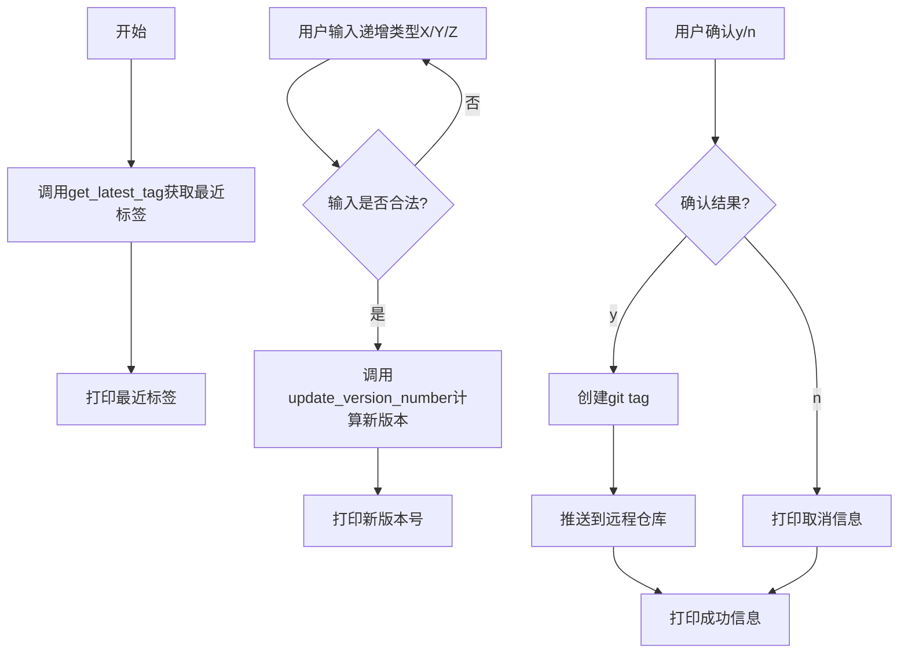
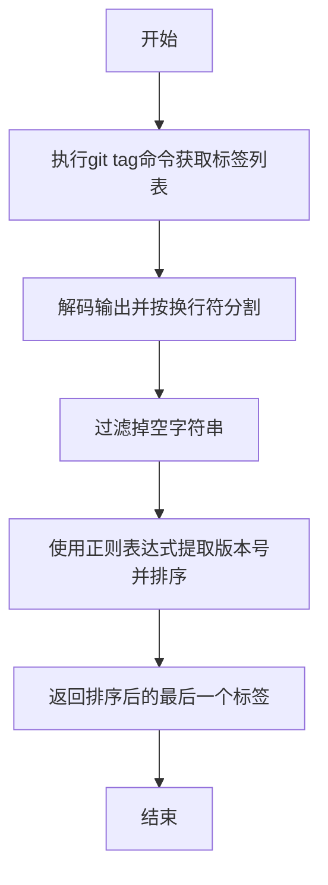
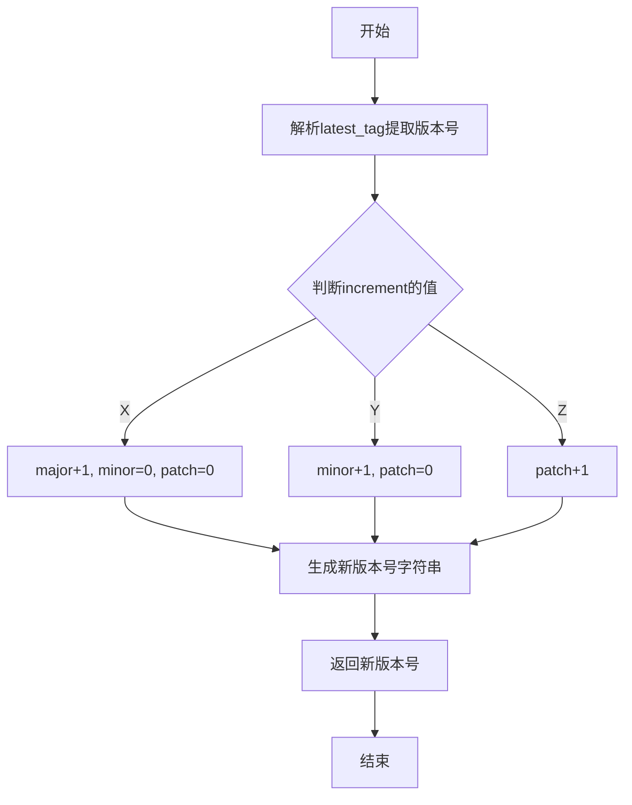
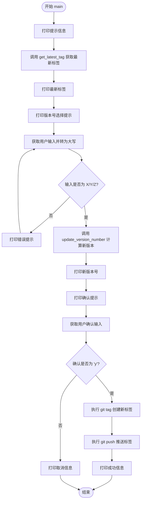

# `Langchain-Chatchat\release.py` 详细设计文档

该脚本用于管理Git仓库的语义化版本号，通过获取最近标签、递增版本号（主版本X、次版本Y、补丁Z）并推送到远程仓库，实现版本号的自动化管理。

## 整体流程



## 类结构

```
该脚本为面向过程编程，无类定义
函数: get_latest_tag
函数: update_version_number
函数: main
```

## 全局变量及字段


### `output`
    
git tag命令的原始字节输出

类型：`bytes`
    


### `tags`
    
解析后的Git标签列表

类型：`list[str]`
    


### `latest_tag`
    
最新排序后的Git标签

类型：`str`
    


### `major`
    
版本号主版本号

类型：`int`
    


### `minor`
    
版本号次版本号

类型：`int`
    


### `patch`
    
版本号补丁版本号

类型：`int`
    


### `new_version`
    
递增后的新版本号字符串

类型：`str`
    


### `increment`
    
用户选择的版本号递增类型（X/Y/Z）

类型：`str`
    


### `confirmation`
    
用户确认是否推送的输入

类型：`str`
    


    

## 全局函数及方法


### `get_latest_tag`

获取Git仓库中最近的标签，通过解析标签名称（格式为v数字.数字.数字）并按版本号排序，返回最新的标签。

参数：  
无

返回值：`str`，返回仓库中最近的标签名称。

#### 流程图



#### 带注释源码

```python
def get_latest_tag():
    """
    获取Git仓库中最近的标签。
    通过执行git tag命令获取所有标签，解析版本号并排序，返回最新的标签。
    """
    # 执行git tag命令，获取所有标签的输出
    output = subprocess.check_output(['git', 'tag'])
    
    # 将字节输出解码为UTF-8字符串，并按换行符分割成列表（去掉最后的空元素）
    tags = output.decode('utf-8').split('\n')[:-1]
    
    # 使用正则表达式解析标签，提取版本号数字，并按版本号排序
    # key函数：对于每个标签t，正则匹配v数字.数字.数字格式，提取三个数字并转换为整数元组
    # sorted函数根据版本号进行排序，[-1]取最后一个即最新版本
    latest_tag = sorted(tags, key=lambda t: tuple(map(int, re.match(r'v(\d+)\.(\d+)\.(\d+)', t).groups())))[-1]
    
    # 返回最新的标签
    return latest_tag
```


### `update_version_number`

该函数用于根据指定的递增类型（主版本号、次版本号或补丁版本号）来计算并返回新的版本号字符串。它接收当前最新的Git标签和递增标识，然后对版本号的相应部分进行递增操作，同时重置更细粒度的版本号。

参数：

- `latest_tag`：`str`，当前的Git标签字符串，格式为"v主版本号.次版本号.补丁版本号"（如"v1.2.3"）
- `increment`：`str`，要递增的版本号部分标识，X表示主版本号（major），Y表示次版本号（minor），Z表示补丁版本号（patch）

返回值：`str`，递增后的新版本号字符串，格式为"v主版本号.次版本号.补丁版本号"

#### 流程图



#### 带注释源码

```python
def update_version_number(latest_tag, increment):
    """
    根据指定的递增类型更新版本号
    
    参数:
        latest_tag: 当前的Git标签，格式如 v1.2.3
        increment: 递增类型，X=主版本号, Y=次版本号, Z=补丁版本号
    
    返回:
        新的版本号字符串
    """
    # 使用正则表达式解析版本号，提取major、minor、patch三个数字
    major, minor, patch = map(int, re.match(r'v(\d+)\.(\d+)\.(\d+)', latest_tag).groups())
    
    # 根据increment参数决定如何递增版本号
    if increment == 'X':
        # 主版本号递增，次版本号和补丁版本号置零（重大变更）
        major += 1
        minor, patch = 0, 0
    elif increment == 'Y':
        # 次版本号递增，补丁版本号置零（新增功能，向后兼容）
        minor += 1
        patch = 0
    elif increment == 'Z':
        # 补丁版本号递增（bug修复）
        patch += 1
    
    # 拼接新的版本号字符串并返回
    new_version = f"v{major}.{minor}.{patch}"
    return new_version
```


### `main`

该函数是脚本的主入口点，负责协调整个版本号更新流程：获取当前Git仓库的最新标签，让用户选择要递增的版本号部分（主版本号、次版本号或补丁版本号），计算新版本号，并在用户确认后将新标签推送到远程仓库。

参数：
- 无参数

返回值：`None`，无返回值（该函数执行副作用操作，不返回具体数值）

#### 流程图



#### 带注释源码

```python
def main():
    """
    主函数，协调版本号更新和推送的完整流程
    """
    # 步骤1：提示用户并获取当前最新的Git标签
    print("当前最近的Git标签：")
    latest_tag = get_latest_tag()
    print(latest_tag)

    # 步骤2：提示用户选择要递增的版本号部分
    print("请选择要递增的版本号部分（X, Y, Z）：")
    increment = input().upper()

    # 步骤3：循环验证用户输入，确保输入合法
    # X - 递增主版本号（major），Y - 递增次版本号（minor），Z - 递增补丁版本号（patch）
    while increment not in ['X', 'Y', 'Z']:
        print("输入错误，请输入X, Y或Z：")
        increment = input().upper()

    # 步骤4：根据用户选择计算新的版本号
    new_version = update_version_number(latest_tag, increment)
    print(f"新的版本号为：{new_version}")

    # 步骤5：请求用户确认是否执行推送操作
    print("确认更新版本号并推送到远程仓库？（y/n）")
    confirmation = input().lower()

    # 步骤6：根据用户确认执行相应操作
    if confirmation == 'y':
        # 创建新的Git标签
        subprocess.run(['git', 'tag', new_version])
        # 将新标签推送到远程仓库
        subprocess.run(['git', 'push', 'origin', new_version])
        print("新版本号已创建并推送到远程仓库。")
    else:
        print("操作已取消。")
```


## 关键组件


### get_latest_tag
获取Git仓库中最近的标签，通过解析标签名称并按版本号排序返回最新的语义化版本标签。

### update_version_number
根据传入的递增类型（X/Y/Z）更新版本号的各个部分，支持major、minor、patch的递增，并返回新的版本号字符串。

### main
主函数流程控制：获取最新标签、接收用户输入的递增类型、生成新版本号、确认并执行Git标签创建和推送操作。

### 版本号解析与排序
使用正则表达式提取语义化版本号（vX.Y.Z格式），并通过tuple映射实现版本号的数字排序比较。

### 用户交互验证
循环验证用户输入的递增类型，确保只有X、Y、Z三个合法选项，并对用户确认操作进行大小写不敏感的匹配。

### Git操作封装
使用subprocess模块封装Git命令，包括标签列表获取、标签创建和远程推送等操作。


## 问题及建议


### 已知问题

-   **错误处理缺失**：代码未处理 Git 仓库无标签时的异常情况，`get_latest_tag()` 会直接抛出 `subprocess.CalledProcessError`；`re.match()` 返回 `None` 时会导致 `AttributeError`
-   **正则表达式重复**：`r'v(\d+)\.(\d+)\.(\d+)'` 在 `get_latest_tag()` 和 `update_version_number()` 中重复定义，应提取为常量
-   **版本号格式假设过强**：仅支持 `vX.Y.Z` 格式的标签，无法处理非标准版本号或无前缀版本号
-   **Git 操作缺乏验证**：未检查工作区是否有未提交的更改就直接 push，存在丢失本地修改的风险
-   **缺少类型注解**：函数参数和返回值均无类型提示，降低代码可读性和可维护性
-   **交互体验待优化**：空输入未处理，用户确认步骤使用 `y/n` 但接受任何小写输入
-   **subprocess 调用不完善**：未捕获 stderr 输出，无法获取 Git 命令的错误详情；未设置超时限制
-   **日志记录缺失**：代码运行过程没有任何日志，难以排查问题

### 优化建议

-   添加 `try-except` 捕获 `subprocess.CalledProcessError` 和 `AttributeError`，为无标签场景提供友好的提示信息
-   定义模块级常量 `VERSION_PATTERN = r'v(\d+)\.(\d+)\.(\d+)'`，避免重复定义
-   增加版本号格式验证函数，对不匹配的标签抛出明确异常或使用默认值
-   在执行 `git push` 前增加 `git status` 检查，确保工作区干净
-   为关键函数添加类型注解（`typing` 模块），提升代码质量
-   补充空输入处理逻辑，并在用户确认时提供更明确的提示
-   使用 `subprocess.run()` 时加入 `capture_output=True` 并解析 stderr，同时设置合理超时
-   引入 `logging` 模块记录关键操作步骤，便于调试和审计

## 其它


### 设计目标与约束

本代码的设计目标是实现一个交互式的Git版本标签管理工具，能够自动获取最新标签、解析版本号、根据用户选择递增版本号（主版本X、次版本Y、补丁版本Z），并支持一键推送到远程仓库。约束条件包括：需要Git环境支持、仅适用于遵循语义化版本规范（vX.Y.Z格式）的标签、依赖Python标准库subprocess模块与Git命令交互。

### 错误处理与异常设计

代码主要通过try-except捕获subprocess异常，当Git仓库无标签或标签格式不符合vX.Y.Z规范时会抛出AttributeError。get_latest_tag函数若仓库为空则返回空列表导致索引越界；update_version_number中正则匹配失败会返回None；input()调用可能在非交互环境中阻塞。建议增加明确的异常捕获分支，返回友好的错误提示而非让程序崩溃。

### 数据流与状态机

数据流为：Git标签列表 → 正则解析提取版本号 → 用户交互选择递增类型 → 版本号计算 → 新标签生成 → Git命令执行 → 推送至远程。状态机包含三个主要状态：初始状态（获取标签）、交互状态（等待用户输入X/Y/Z）、确认状态（等待用户确认推送），其中交互状态包含输入验证循环。

### 外部依赖与接口契约

外部依赖包括：Python 3.x标准库（os、subprocess、re）、Git命令行工具（git tag、git push）。接口契约方面，get_latest_tag无参数输入，返回符合vX.Y.Z格式的最新标签字符串；update_version_number接受latest_tag字符串和increment字符参数，返回新版本号字符串；main函数无参数，通过标准输入输出与用户交互。

### 安全性考虑

代码存在以下安全隐患：subprocess调用未做输入过滤，用户输入的increment参数虽经upper()和验证，但Git标签名未做严格校验可能包含特殊字符；git push直接推送无分支限制可能误推；无权限检查可能在无Git仓库或无推送权限时失败。建议增加标签名安全校验、添加--dry-run选项供确认、使用git push --tags --no-verify等保护机制。

### 性能考量

当前实现性能可接受，单次执行仅涉及少量Git命令调用。潜在性能问题：当仓库标签数量极多时，subprocess.check_output(['git', 'tag'])可能返回大量数据，sorted排序操作时间复杂度为O(nlogn)。可考虑使用git describe --tags获取最新标签替代全量遍历。

### 测试策略

建议添加单元测试覆盖：get_latest_tag函数测试空标签库、单标签、多标签场景；update_version_number测试X/Y/Z三种递增模式及边界值（999版本号溢出未处理）；集成测试模拟Git仓库环境验证完整流程。可使用unittest.mock模拟subprocess调用避免真实Git依赖。

### 部署和使用说明

使用前提：安装Python 3.x及Git命令行工具，确保当前工作目录为Git仓库且有网络连接远程仓库。使用方法：直接在终端运行python script_name.py，按提示选择版本号递增类型（X-主版本、Y-次版本、Z-补丁），输入y确认推送。无需额外配置，读取当前仓库标签自动处理。

### 配置管理

当前代码无配置文件，所有参数通过交互式输入获取。配置化改进方向：支持命令行参数（argparse）传入increment值和确认标志实现非交互模式；支持配置文件（.gitversionrc或pyproject.toml）指定默认递增类型、远程仓库名、是否自动推送等选项。

### 错误码和消息定义

建议定义统一的错误码体系：0-成功，1-Git命令执行失败，2-标签格式不匹配，3-用户取消操作，4-无远程仓库配置，5-权限不足。当前print输出错误信息混杂在业务逻辑中，建议重构为独立的日志或消息输出函数，便于国际化扩展和统一管理。

    