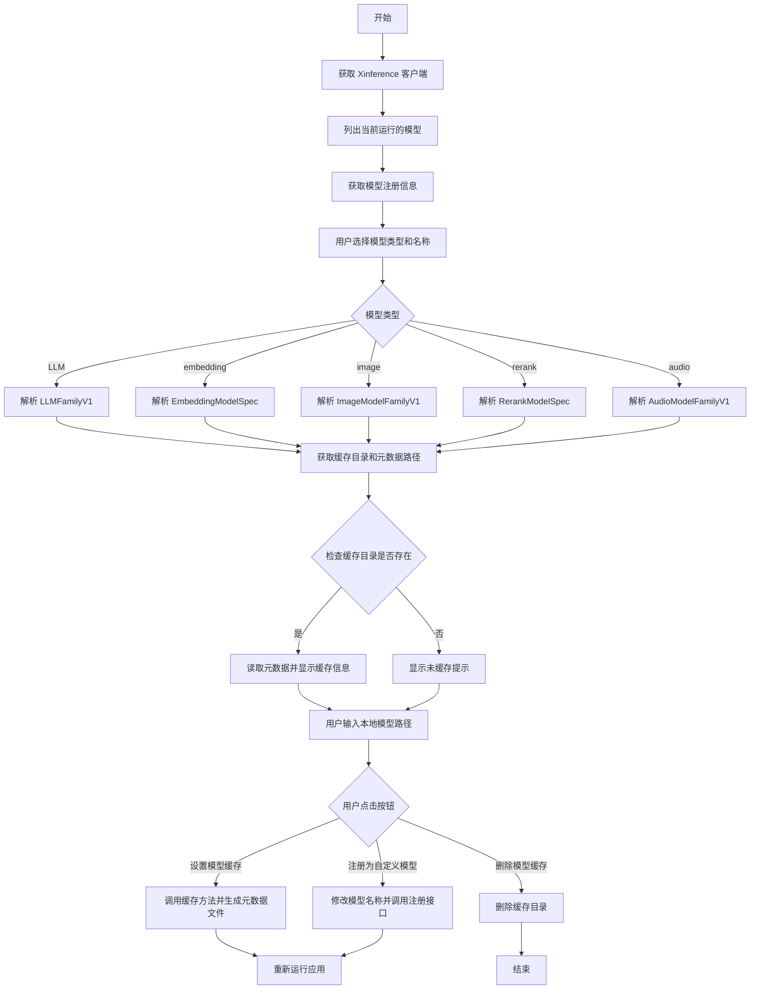
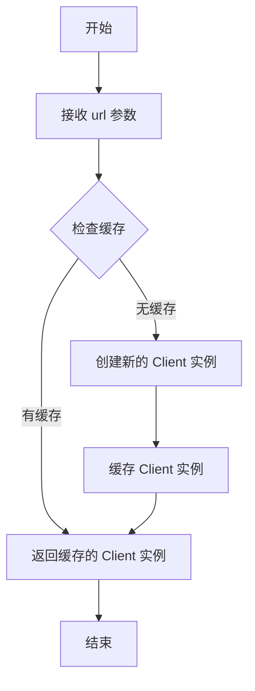
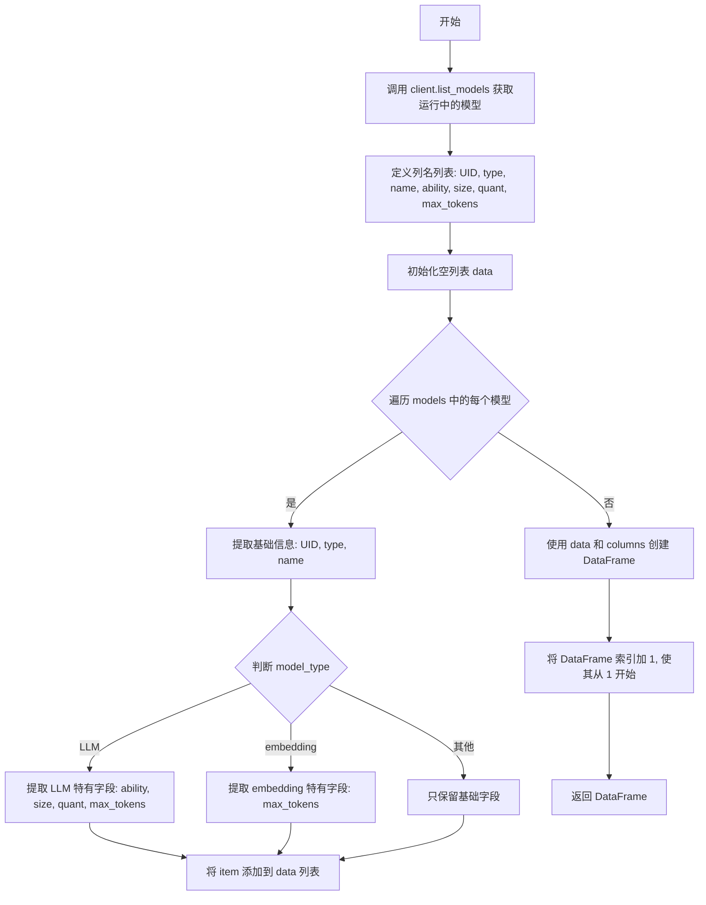

# `Langchain-Chatchat\tools\model_loaders\xinference_manager.py` 详细设计文档

这是一个基于 Streamlit 的 Web 应用程序，用于管理 Xinference 模型服务框架的模型缓存和自定义模型注册。用户可以通过界面配置本地模型路径，设置模型缓存或将其注册为自定义模型，支持 LLM、embedding、image、rerank 和 audio 等多种模型类型。

## 整体流程



## 类结构

```
Streamlit 应用主流程
├── 客户端连接模块
│   ├── get_client (获取客户端)
│   └── client (全局客户端实例)
├── 数据处理模块
│   ├── get_cache_dir (获取缓存目录)
│   ├── get_meta_path (获取元数据路径)
│   ├── list_running_models (列出运行模型)
│   └── get_model_registrations (获取模型注册信息)
└── UI 交互模块
    ├── 侧边栏配置
    ├── 模型选择表单
    └── 操作按钮处理
```

## 全局变量及字段


### `model_types`
    
支持的模型类型列表，包含 LLM、embedding、image、rerank 和 audio

类型：`List[str]`
    


### `model_name_suffix`
    
自定义模型名称后缀，用于注册为自定义模型时追加到模型名

类型：`str`
    


### `cache_methods`
    
缓存方法字典，映射模型类型到对应的缓存函数

类型：`Dict[str, Callable]`
    


### `xf_url`
    
Xinference 服务的 endpoint 地址，用户在侧边栏输入

类型：`str`
    


### `client`
    
Xinference 客户端实例，用于与 XF 服务通信

类型：`Client`
    


### `regs`
    
所有模型注册信息，键为模型类型，值为模型名及注册详情

类型：`Dict`
    


### `model_type`
    
当前选择的模型类型，如 LLM、embedding 等

类型：`str`
    


### `model_name`
    
当前选择的模型名称

类型：`str`
    


### `cur_reg`
    
当前选中模型的完整注册信息

类型：`Dict`
    


### `model_format`
    
当前选中模型的格式，如 pytorch、ggml 等

类型：`str | None`
    


### `model_quant`
    
当前选中模型的量化方式，如 none、4bit 等

类型：`str | None`
    


### `cur_family`
    
当前选中 LLM 模型的家族对象，包含模型规格信息

类型：`LLMFamilyV1 | None`
    


### `cur_spec`
    
当前选中模型的规范对象，用于配置缓存和注册

类型：`ModelSpec`
    


### `model_formats`
    
当前模型可用的格式列表

类型：`List[str]`
    


### `model_sizes`
    
当前模型可用的尺寸列表，以十亿参数为单位

类型：`List[int]`
    


### `model_quants`
    
当前模型可用的量化选项列表

类型：`List[str]`
    


### `cache_dir`
    
模型缓存目录的完整路径

类型：`str`
    


### `meta_file`
    
模型元数据文件的完整路径

类型：`str`
    


### `revision`
    
当前模型的版本号或修订版本

类型：`str`
    


### `text`
    
显示在页面上的模型缓存状态信息文本

类型：`str`
    


### `local_path`
    
用户输入的本地模型绝对路径

类型：`str`
    


    

## 全局函数及方法


### `get_client`

该函数用于创建并返回一个连接到 Xinference 服务的客户端实例，通过 Streamlit 的 `@cache_resource` 装饰器缓存客户端对象以避免重复创建。

#### 参数

- `url`：`str`，Xinference 服务的端点 URL，格式如 `http://127.0.0.1:9997`

#### 返回值

- `Client`，返回 Xinference 客户端对象，用于后续与 Xinference 服务进行交互

#### 流程图



#### 带注释源码

```python
@st.cache_resource
def get_client(url: str):
    """
    创建并返回一个连接到 Xinference 服务的客户端实例。
    
    使用 Streamlit 的 cache_resource 装饰器确保在整个应用生命周期内
    只会创建一次客户端实例，避免重复连接带来的开销。
    
    参数:
        url: str - Xinference 服务的端点 URL
        
    返回:
        Client - Xinference 客户端对象，用于调用服务接口
    """
    return Client(url)
```

#### 设计说明

| 项目 | 说明 |
|------|------|
| **设计目标** | 提供统一的客户端访问入口，封装与 Xinference 服务的连接逻辑 |
| **缓存策略** | 使用 `@st.cache_resource` 装饰器，确保 Streamlit 应用在重新运行时不重复创建客户端 |
| **依赖外部** | 依赖 `xinference.client.Client` 类，需要确保 Xinference 服务已启动 |
| **异常处理** | 当前未实现显式异常处理，若服务不可达将在调用时抛出连接异常 |


### `get_cache_dir`

该函数用于根据模型类型、名称、格式和大小构建并返回xinference的模型缓存目录路径。对于LLM类型，会在目录名中包含格式和大小信息；对于其他类型（如embedding、image等），则仅使用模型名称。

参数：

- `model_type`：`str`，模型类型，枚举值包括 "LLM"、"embedding"、"image"、"rerank"、"audio" 等，用于区分不同的模型种类
- `model_name`：`str`，模型的名称，用于构建缓存目录的核心标识
- `model_format`：`str`，模型的格式（可选，默认为空字符串），如 "pytorch"、"ggml" 等，仅对 LLM 类型有效
- `model_size`：`str`，模型的参数量大小（可选，默认为空字符串），如 "7"、"70" 等，表示模型的大小（单位为b），仅对 LLM 类型有效

返回值：`str`，返回完整的缓存目录绝对路径，格式为 `{XINFERENCE_CACHE_DIR}/{dir_name}`

#### 流程图

```mermaid
flowchart TD
    A[开始 get_cache_dir] --> B{model_type == 'LLM'?}
    B -->|是| C[dir_name = f"{model_name}-{model_format}-{model_size}b"]
    B -->|否| D[dir_name = model_name]
    C --> E[return os.path.join{XINFERENCE_CACHE_DIR, dir_name}]
    D --> E
    E --> F[结束]
```

#### 带注释源码

```python
def get_cache_dir(
    model_type: str,
    model_name: str,
    model_format: str = "",
    model_size: str = "",
):
    """
    根据模型类型、名称、格式和大小构建缓存目录路径
    
    参数:
        model_type: 模型类型，'LLM' 或其他类型
        model_name: 模型名称
        model_format: 模型格式（仅LLM类型使用）
        model_size: 模型大小（仅LLM类型使用）
    
    返回:
        缓存目录的完整路径
    """
    # 判断是否为LLM模型类型
    if model_type == "LLM":
        # LLM模型需要包含格式和大小信息，格式如: modelname-pytorch-7b
        dir_name = f"{model_name}-{model_format}-{model_size}b"
    else:
        # 其他类型（embedding/image/rerank/audio）仅使用模型名作为目录名
        dir_name = f"{model_name}"
    
    # 将缓存根目录与子目录名拼接，返回完整路径
    return os.path.join(XINFERENCE_CACHE_DIR, dir_name)
```


### `get_meta_path`

获取指定模型的元数据文件路径，用于定位模型缓存目录下的元数据文件（如 `__valid_download` 或 LLM 模型的 meta 文件）。

参数：

- `model_type`：`str`，模型类型，可选值为 "LLM", "embedding", "image", "rerank", "audio"
- `cache_dir`：`str`，模型缓存目录的绝对路径
- `model_format`：`str`，模型格式（如 "pytorch", "ggml" 等）
- `model_hub`：`str`，模型来源 hub，默认为 "huggingface"
- `model_quant`：`str`，模型量化方式，默认为 "none"

返回值：`str`，返回模型元数据文件的路径

#### 流程图

```mermaid
graph TD
    A[开始 get_meta_path] --> B{model_type == 'LLM'?}
    B -->|是| C[调用 xf_llm.llm_family._get_meta_path]
    C --> D[返回 LLM 模型的 meta 文件路径]
    B -->|否| E[返回 os.path.join(cache_dir, '__valid_download')]
    E --> D
    D --> F[结束]
```

#### 带注释源码

```python
def get_meta_path(
    model_type: str,      # 模型类型：LLM/embedding/image/rerank/audio
    cache_dir: str,       # 缓存目录路径
    model_format: str,    # 模型格式（如 pytorch, ggml 等）
    model_hub: str = "huggingface",   # 模型来源，默认 huggingface
    model_quant: str = "none",        # 模型量化配置，默认 none
):
    """
    根据模型类型获取对应的元数据文件路径
    
    对于 LLM 模型，调用 xinference 内部方法获取标准化的 meta 文件路径；
    对于其他类型（embedding/image/rerank/audio），返回缓存目录下的
    __valid_download 标记文件路径，用于标识该模型已成功缓存
    """
    if model_type == "LLM":
        # LLM 模型使用 xinference 内置的 _get_meta_path 方法
        # 该方法会根据 model_format, model_hub, quantization 等参数
        # 生成符合 xinference 规范的元数据文件路径
        return xf_llm.llm_family._get_meta_path(
            cache_dir=cache_dir,
            model_format=model_format,
            model_hub=model_hub,
            quantization=model_quant,
        )
    else:
        # 非 LLM 模型（embedding/image/rerank/audio）
        # 使用固定的 __valid_download 文件作为缓存有效性标记
        # 该文件存在表示模型已成功下载并缓存
        return os.path.join(cache_dir, "__valid_download")
```


### `list_running_models`

该函数用于获取当前正在运行的模型列表，并通过 pandas DataFrame 展示模型的详细信息，包括 UID、类型、名称、能力、大小、量化参数和最大 token 数等。

参数： 无

返回值：`pandas.DataFrame`，返回一个包含当前运行模型详细信息的 DataFrame，索引从 1 开始。

#### 流程图



#### 带注释源码

```python
def list_running_models():
    """
    获取当前运行的模型列表，并以 DataFrame 形式返回详细信息。
    
    该函数通过 client.list_models() 获取所有正在运行的模型，
    然后根据模型类型（LLM、embedding 等）提取相应的属性，
    最终返回一个包含模型详细信息的 pandas DataFrame。
    """
    # 调用客户端方法获取当前运行的模型字典
    # 返回格式: {model_uid: {model_type, model_name, model_ability, ...}}
    models = client.list_models()
    
    # 定义 DataFrame 的列名顺序
    columns = [
        "UID",        # 模型唯一标识符
        "type",       # 模型类型 (LLM/embedding/image/rerank/audio)
        "name",       # 模型名称
        "ability",    # 模型能力 (仅 LLM)
        "size",       # 模型大小 (仅 LLM)
        "quant",      # 量化配置 (仅 LLM)
        "max_tokens", # 最大 token 数
    ]
    
    # 用于存储所有模型数据的列表
    data = []
    
    # 遍历所有运行中的模型
    # k: 模型 UID, v: 模型详细信息字典
    for k, v in models.items():
        # 初始化基础信息字典
        item = dict(
            UID=k,           # 模型 UID
            type=v["model_type"],   # 模型类型
            name=v["model_name"],   # 模型名称
        )
        
        # 根据模型类型添加特定字段
        if v["model_type"] == "LLM":
            # LLM 模型包含完整的属性信息
            item.update(
                ability=v["model_ability"],                     # 模型能力 (如 chat、generate)
                size=str(v["model_size_in_billions"]) + "B",   # 模型大小 (转换为字符串并加 B 后缀)
                quant=v["quantization"],                       # 量化配置
                max_tokens=v["context_length"],                # 上下文长度
            )
        elif v["model_type"] == "embedding":
            # embedding 模型仅包含 max_tokens 字段
            item.update(
                max_tokens=v["max_tokens"],                    # 最大输入 token 数
            )
        # 注意: image, rerank, audio 模型类型在此处未做特殊处理
        
        # 将处理后的模型信息添加到数据列表
        data.append(item)
    
    # 使用 pandas 创建 DataFrame
    # 参数: data-数据列表, columns-列名列表
    df = pd.DataFrame(data, columns=columns)
    
    # 将索引从 0 开始改为从 1 开始，提升展示效果
    df.index += 1
    
    # 返回包含模型信息的 DataFrame
    return df
```


### `get_model_registrations`

该函数是模型注册信息获取的核心逻辑。它通过全局的 `client` 对象，遍历所有预定义的模型类型（LLM, embedding, image, rerank, audio），查询并聚合每个模型的具体注册详情。最终返回一个结构化的嵌套字典，用于在 Streamlit 前端动态生成模型选择下拉框及配置项。

参数：
- 该函数无显式参数。**隐式依赖**：全局变量 `client` (xinference Client 实例) 和 `model_types` (模型类型列表)。

返回值：`dict`，返回一个嵌套字典结构。
- 外层键：模型类型 (如 `"LLM"`, `"embedding"`)。
- 内层键：模型名称 (如 `"qwen-chat"`)。
- 值：包含 `is_builtin` (bool，表示是否内置模型) 和 `reg` (dict，包含模型的完整注册架构定义，如 model_specs 等) 的字典。

#### 流程图

```mermaid
flowchart TD
    A([Start get_model_registrations]) --> B[初始化空字典 data]
    B --> C[遍历 model_types 列表]
    C --> D{当前 model_type 是否有效}
    D -->|Yes| E[调用 client.list_model_registrations 获取该类型下所有模型名]
    D -->|No| F[跳至下一个 model_type]
    E --> G[遍历获取到的模型列表]
    G --> H[提取当前模型的 model_name 和 is_builtin]
    H --> I[向 data 中写入基础信息: data[model_type][model_name] = {is_builtin: ...}]
    I --> J[调用 client.get_model_registration 获取该模型的完整注册详情 reg]
    J --> K[更新 data[model_type][model_name]['reg'] = reg]
    K --> L{当前模型列表是否遍历完毕}
    L -->|No| G
    L -->|Yes| M{所有模型类型是否遍历完毕}
    M -->|No| C
    M -->|Yes| N([返回 data 字典])
    
    style A fill:#f9f,stroke:#333,stroke-width:2px
    style N fill:#9f9,stroke:#333,stroke-width:2px
```

#### 带注释源码

```python
def get_model_registrations():
    """
    获取所有已注册模型的详细信息。
    遍历 model_types (LLM, embedding, image, rerank, audio)，
    调用 client 接口获取每个模型的注册详情。
    """
    data = {}
    # 1. 遍历所有定义的模型类型
    for model_type in model_types:
        data[model_type] = {}
        # 2. 获取该类型下所有已注册模型的简要信息（包含名称和是否内置）
        # client.list_model_registrations(model_type) 返回列表，元素为 dict
        for m in client.list_model_registrations(model_type):
            # 3. 构建嵌套字典，先存入 is_builtin 标志
            # m 结构示例: {'model_name': 'xxx', 'is_builtin': True}
            data[model_type][m["model_name"]] = {"is_builtin": m["is_builtin"]}
            
            # 4. 获取完整的模型注册信息 (reg)，包含模型规格、镜像地址等
            # client.get_model_registration(model_type, model_name) 返回详细的 JSON 结构
            reg = client.get_model_registration(model_type, m["model_name"])
            
            # 5. 将完整注册信息挂载到字典的 'reg' 键下
            data[model_type][m["model_name"]]["reg"] = reg
            
    return data
```

## 关键组件


### Xinference 客户端连接管理

通过 `st.cache_resource` 装饰器实现的客户端连接缓存，采用惰性加载机制避免重复建立连接，支持不同 endpoint 的动态配置。

### 模型类型路由系统

统一的模型类型枚举（LLM、embedding、image、rerank、audio），通过字典映射将不同模型类型路由到对应的缓存方法，实现反量化支持和量化策略应用。

### 缓存目录解析器

根据模型类型、名称、格式和大小动态生成缓存路径，支持 LLM 模型的量化版本目录命名规范（如 `model-name-gguf-7b`）以及非 LLM 模型的简化命名。

### 元数据路径工厂

针对不同模型类型返回元数据文件路径，LLM 模型调用内部方法生成规范路径，其他模型类型使用固定的 `__valid_download` 标记文件。

### 模型注册信息聚合器

批量获取所有模型类型的注册信息，构建嵌套字典结构存储内置标志和完整注册配置，支持后续自定义模型注册和缓存管理操作。

### 运行时模型列表展示

通过 DataFrame 格式化展示当前运行的模型信息，动态适配不同模型类型的能力字段（LLM 显示量化、参数量、上下文长度，embedding 显示最大 token 数）。

### 缓存状态检测与版本比对

检查本地缓存目录是否存在，读取元数据文件获取实际版本号，与模型规格中声明的版本进行比对，生成符合性报告。

### 模型缓存设置器

实现符号链接创建和元文件生成，支持 LLM 模型的量化配置写入，以及多模型源（huggingface、modelscope）的元数据同步更新。

### 缓存清理器

移除指定的模型缓存目录，支持误配置后的快速重置操作。

### 自定义模型注册器

修改模型规格的 URI 和版本信息，生成自定义模型名称后缀，通过客户端注册为持久化自定义模型，支持对内置模型的二次定制。


## 问题及建议


### 已知问题

- **全局client初始化缺乏错误处理**：在模块顶层执行 `client = get_client(xf_url)`，若xinference服务不可达，程序会在启动时直接崩溃，导致Streamlit应用无法正常加载
- **文件操作可能失败**：`os.rmdir(cache_dir)` 只能删除空目录，若目录中存在文件会抛出异常；应使用 `shutil.rmtree` 或先清理目录内容
- **元数据读取异常捕获过于宽泛**：使用空的 `try-except` 块捕获所有异常而不区分具体错误类型（如文件不存在、JSON解析失败、编码问题），隐藏了真实错误信息
- **符号链接读取缺乏保护**：`os.readlink(cache_dir)[4:]` 使用硬编码切片，假设路径以 `../` 开头，若符号链接格式不同会导致路径截取错误
- **直接修改对象私有属性**：使用 `cur_spec.__dict__["model_uri"] = local_path` 直接操作对象内部字典，破坏了对象的封装性，且embedding spec可能根本没有model_uri属性
- **模型量化处理逻辑脆弱**：对 `model_quant == "none"` 的字符串比较和赋值为 `None` 的转换逻辑分散在多处，容易产生逻辑不一致
- **按钮操作后缺少成功提示**：用户点击"设置模型缓存"、"删除模型缓存"或"注册为自定义模型"按钮后，只有 `st.rerun()` 重新加载页面，缺少明确的操作结果反馈

### 优化建议

- **添加服务连接错误处理**：在初始化client时捕获连接异常，向用户展示友好提示而非崩溃；可以使用 `st.connection` 或添加重试机制
- **改进文件操作安全性**：使用 `shutil.rmtree(cache_dir, ignore_errors=True)` 确保目录删除成功；添加目录存在性检查后再执行操作
- **细化异常处理**：针对不同异常类型（FileNotFoundError、JSONDecodeError、UnicodeDecodeError）分别处理，给出具体的错误信息
- **验证符号链接格式**：在使用 `os.readlink` 前检查路径是否为符号链接，并使用 `os.path.realpath` 或更健壮的方式解析实际路径
- **使用公开API修改对象属性**：检查对象是否有公开的setter方法或使用 Pydantic 的 `update` 方法，而非直接操作 `__dict__`
- **统一模型量化处理逻辑**：抽取为独立函数或使用枚举常量，减少散落在各处的字符串比较和转换逻辑
- **添加操作反馈机制**：在按钮操作后使用 `st.success()` 或 `st.error()` 显示明确的操作结果消息

## 其它


### 设计目标与约束

本应用旨在为Xinference模型管理提供图形化界面，帮助用户配置本地模型路径、管理模型缓存以及注册自定义模型。约束条件包括：必须运行Xinference服务、模型路径必须为绝对路径、仅支持特定的模型类型（LLM、embedding、image、rerank、audio）。

### 错误处理与异常设计

应用采用Streamlit的错误提示机制（st.error）处理用户输入错误，如路径不存在或非绝对路径。文件读取操作使用try-except捕获JSON解析异常。删除缓存目录前未检查目录是否为空或是否存在符号链接，可能导致误删。

### 数据流与状态机

应用状态主要依赖Streamlit的会话状态管理。核心流程为：用户选择模型类型和名称 → 系统查询模型注册信息 → 用户输入本地路径 → 根据按钮操作执行缓存设置/删除/自定义注册。页面通过st.rerun()刷新展示最新状态。

### 外部依赖与接口契约

依赖外部系统Xinference服务端点（默认http://127.0.0.1:9997），通过xinference.client.Client接口通信。依赖的内部模块包括xinference.model.llm、xinference.model.embedding、xinference.model.image、xinference.model.rerank、xinference.model.audio以及xinference.constants.XINFERENCE_CACHE_DIR。

### 安全性考虑

应用未实现用户认证与权限控制，服务地址可由用户任意配置。模型路径直接用于系统目录操作，存在路径遍历风险。模型定义（model_definition）直接序列化后注册，未做内容校验。

### 兼容性设计

模型格式、量化方式、模型大小等选项动态从服务端获取，保证与当前Xinference版本兼容。但未处理版本升级时的注册表格式变化，升级xinference后可能导致兼容性问题。

### 性能考虑

使用@st.cache_resource缓存Client实例避免重复连接。模型注册信息通过get_model_registrations一次性获取并缓存。list_running_models每次页面加载都执行完整查询，大规模部署时可能存在性能瓶颈。

### 用户交互设计

采用分步式表单设计，通过下拉框选择减少输入错误。实时显示当前运行模型状态。提供清晰的场景化使用说明，降低学习成本。

### 部署与运维

依赖Python 3.x环境，需安装streamlit、pandas、xinference客户端库。部署时需确保Xinference服务可访问。缓存目录默认为XINFERENCE_CACHE_DIR，需保证磁盘空间充足。

### 测试策略

当前代码缺少单元测试和集成测试。建议针对get_cache_dir、get_meta_path等纯函数编写单元测试，针对API交互部分编写mock测试。

### 版本演进

建议增加模型下载进度显示、批量操作支持、配置导入导出功能、审计日志记录等。


    