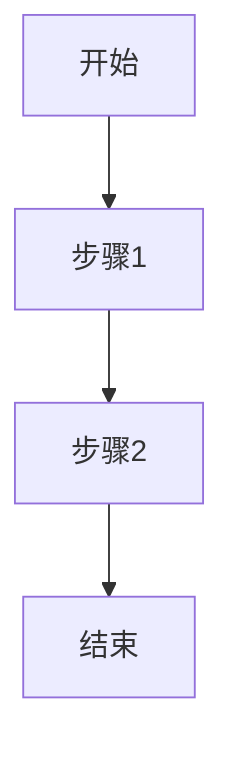
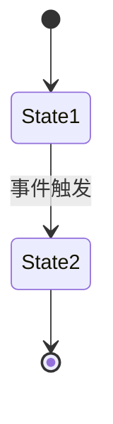

# `marker\benchmarks\overall\__init__.py` 详细设计文档

未提供源代码。请在代码块中粘贴需要分析的源代码。

## 整体流程

```mermaid

```

## 类结构

```

```

## 全局变量及字段


    

## 全局函数及方法


## 关键组件


## 问题及建议


### 已知问题

-   未提供待分析的代码，代码段为空，无法进行技术债务或优化空间的分析。

### 优化建议

-   请提供需要分析的源代码，以便进行详细的技术债务识别和优化建议。


## 其它


### 1. 概述

{本模块的核心功能概述}

### 2. 整体运行流程

{文件之间的调用关系和执行顺序}

### 3. 类结构

#### 3.1 类A

##### 3.1.1 类字段

| 名称 | 类型 | 描述 |
|------|------|------|
| fieldName | Type | 字段描述 |

##### 3.1.2 类方法

| 方法名 | 参数 | 返回值 | 描述 |
|--------|------|--------|------|
| methodName | paramName: Type (参数描述) | ReturnType (返回值描述) | 方法描述 |

###### 方法流程图（mermaid）



###### 带注释源码

```language
// 注释说明
public void methodName(Type paramName) {
    // 实现逻辑
}
```

### 4. 全局变量

| 名称 | 类型 | 描述 |
|------|------|------|
| globalVar | Type | 全局变量描述 |

### 5. 全局函数

| 函数名 | 参数 | 返回值 | 描述 |
|--------|------|--------|------|
| globalFunc | paramName: Type (参数描述) | ReturnType (返回值描述) | 函数描述 |

### 6. 关键组件信息

| 组件名称 | 描述 |
|----------|------|
| ComponentName | 组件功能描述 |

### 7. 问题及改进建议

{潜在的技术债务或优化空间}

### 8. 设计目标与约束

{设计目标、性能要求、约束条件}

### 9. 错误处理与异常设计

{异常类型、错误码定义、异常处理策略}

### 10. 数据流与状态机

{数据流向图、状态转换图（mermaid）、状态说明}



### 11. 外部依赖与接口契约

| 依赖项 | 版本 | 接口说明 | 使用场景 |
|--------|------|----------|----------|
| DependencyName | x.x.x | 接口描述 | 使用场景描述 |

### 12. 安全考虑

{认证、授权、加密、输入验证等安全机制}

### 13. 性能考量

{性能瓶颈、优化策略、资源管理}

### 14. 测试策略

{单元测试、集成测试、Mock对象使用}

### 15. 部署与配置

{配置项、环境要求、部署流程}

### 16. 版本演进

{版本变更历史、兼容性考虑}


    