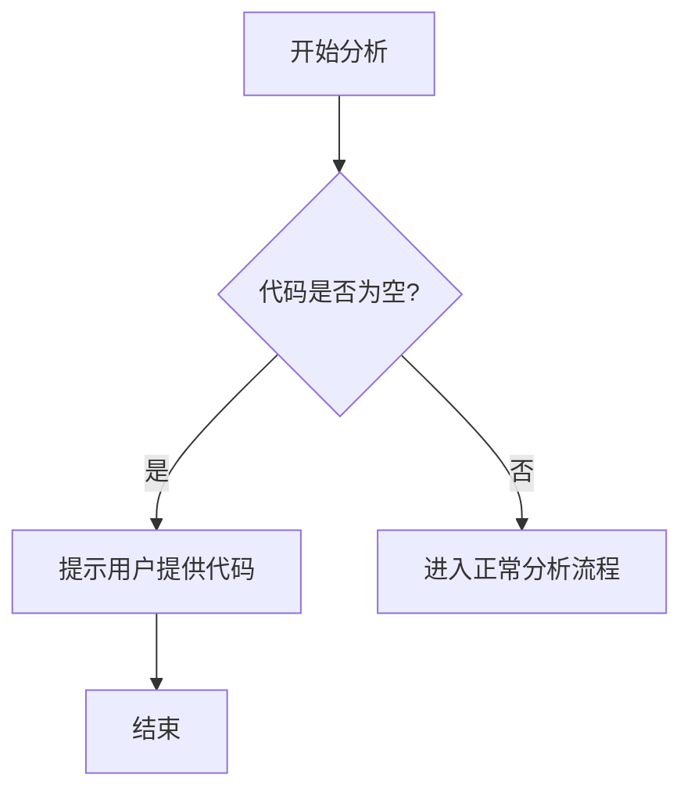

# `marker\benchmarks\overall\display\__init__.py` 详细设计文档

无法提供描述 - 用户未提供待分析的源代码。当前代码块为空，请提供实际的Python代码以便进行分析。

## 整体流程



## 类结构

```
无法分析 - 代码为空
```

## 全局变量及字段


    

## 全局函数及方法


## 关键组件


## 问题及建议


### 已知问题

-   未提供待分析的代码，无法进行技术债务和优化空间的识别与分析

### 优化建议

-   请提供需要分析的源代码，以便进行详细的技术债务识别和优化建议输出


## 其它


### 设计目标与约束

由于未提供代码，无法填写具体设计目标与约束。详细设计文档应包含：设计目标（功能目标、性能目标、业务目标）、技术约束（语言版本、框架版本、依赖限制）、业务约束（业务规则、合规要求）以及非功能需求（安全性、可用性、可维护性等）。

### 错误处理与异常设计

由于未提供代码，无法填写具体错误处理与异常设计。详细设计文档应包含：异常分类（业务异常、系统异常、第三方异常）、异常传播机制、错误码设计、异常捕获策略、降级方案以及日志记录规范。

### 数据流与状态机

由于未提供代码，无法填写具体数据流与状态机。详细设计文档应包含：数据输入来源、数据处理流程、数据输出目标、状态定义、状态转换条件、状态机图示以及状态变更触发条件。

### 外部依赖与接口契约

由于未提供代码，无法填写具体外部依赖与接口契约。详细设计文档应包含：外部系统依赖（数据库、缓存、消息队列、第三方服务）、接口定义（接口名称、请求参数、响应格式、错误码）、依赖版本要求、接口调用方式（同步/异步）以及超时与重试策略。

### 性能考虑与优化空间

由于未提供代码，无法填写具体性能考虑与优化空间。详细设计文档应包含：性能指标要求（响应时间、吞吐量、并发数）、性能瓶颈分析、缓存策略、异步处理方案、连接池配置以及资源限制。

### 安全性设计

由于未提供代码，无法填写具体安全性设计。详细设计文档应包含：身份认证机制、授权策略、数据加密方案、输入验证机制、SQL注入防护、XSS防护以及安全审计日志。

### 可扩展性设计

由于未提供代码，无法填写具体可扩展性设计。详细设计文档应包含：水平扩展方案、垂直扩展方案、模块化设计、分层架构、插件机制以及未来功能扩展预留。

### 测试策略

由于未提供代码，无法填写具体测试策略。详细设计文档应包含：单元测试覆盖要求、集成测试场景、系统测试用例、性能测试计划、压力测试方案以及测试数据准备策略。

### 部署与运维考量

由于未提供代码，无法填写具体部署与运维考量。详细设计文档应包含：部署架构（单节点、集群、容器化）、环境配置要求、健康检查机制、滚动更新策略、灰度发布方案以及灾备方案。

### 监控与日志设计

由于未提供代码，无法填写具体监控与日志设计。详细设计文档应包含：监控指标（系统指标、业务指标）、告警阈值、日志级别规范、日志格式、链路追踪方案、日志存储策略以及可视化看板设计。


    