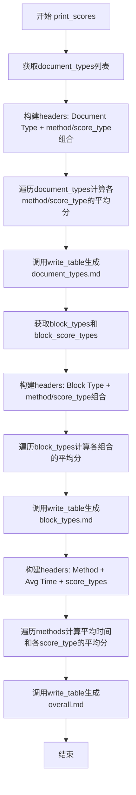
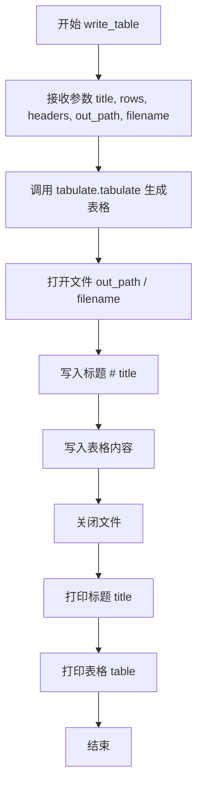
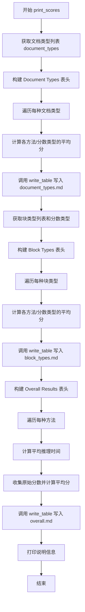

# `marker\benchmarks\overall\display\table.py` 详细设计文档

该模块用于将基准测试结果（FullResult）生成为格式化的Markdown表格报告，包含文档类型得分、块类型得分和总体推理结果三个维度的统计分析，并通过write_table函数输出到指定路径的Markdown文件中。

## 整体流程



## 类结构

```
模块级别
└── result_printer (无类定义，仅函数集合)
```

## 全局变量及字段


### `FullResult`
    
基准测试结果的数据结构，包含按方法、分数类型、文档类型和块类型分组的平均分数、原始分数和平均时间。

类型：`TypeAlias (from benchmarks.overall.schema)`
    


    

## 全局函数及方法


### `write_table`

将表格数据使用 tabulate 库格式化为 GitHub 风格的 Markdown 表格，并写入到指定的输出文件中，同时在控制台打印标题和表格内容。

参数：

- `title`：`str`，表格的标题，用于生成 Markdown 的标题行 (`# title`)
- `rows`：`list`，表格的行数据，每行是一个列表
- `headers`：`list`，表格的列标题列表
- `out_path`：`Path`，输出文件的目录路径
- `filename`：`str`，输出文件的名称

返回值：`None`，该函数没有返回值，仅执行文件写入和控制台打印操作

#### 流程图



#### 带注释源码

```python
def write_table(title: str, rows: list, headers: list, out_path: Path, filename: str):
    # 使用 tabulate 库将行数据和表头格式化为 GitHub 风格的 Markdown 表格
    table = tabulate.tabulate(rows, headers=headers, tablefmt="github")
    
    # 拼接输出路径和文件名，打开文件用于写入
    with open(out_path / filename, "w", encoding="utf-8") as f:
        # 写入 Markdown 标题行
        f.write(f"# {title}\n")
        # 写入格式化后的表格内容
        f.write(table)
    
    # 在控制台打印表格标题
    print(title)
    # 在控制台打印表格内容
    print(table)
```


### `print_scores`

该函数接收基准测试结果数据、输出路径、方法和分数类型列表，计算并输出三种类型的得分表格：文档类型（Document Types）、块类型（Block types）和总体结果（Overall Results），用于展示不同方法和分数类型的性能对比。

参数：

- `result`：`FullResult`，包含基准测试的完整结果数据，内含 averages_by_type、averages_by_block_type、scores 和 average_times 等嵌套字典结构
- `out_path`：`Path`，输出 Markdown 表格文件的目录路径
- `methods`：`List[str]`，要对比的方法名称列表（如 ["marker", "markit"]）
- `score_types`：`List[str]`，要对比的分数类型列表（如 ["heuristic", "llm"]）
- `default_score_type`：`str`，默认使用的分数类型，默认为 "heuristic"
- `default_method`：`str`，默认使用的方法，默认为 "marker"

返回值：`None`，该函数直接写入文件并打印表格，无返回值

#### 流程图



#### 带注释源码

```python
def print_scores(result: FullResult, out_path: Path, methods: List[str], score_types: List[str], default_score_type="heuristic", default_method="marker"):
    """
    计算并输出三种类型的得分表格
    
    参数:
        result: 包含所有基准测试结果的数据结构
        out_path: 输出文件的目标目录
        methods: 要比较的方法列表
        score_types: 要比较的分数类型列表
        default_score_type: 默认分数类型，用于获取键名
        default_method: 默认方法，用于获取键名
    """
    
    # ==================== 第一部分：Document Types 表格 ====================
    # 从默认方法和分数类型中获取所有文档类型
    document_types = list(result["averages_by_type"][default_method][default_score_type].keys())
    
    # 构建表头：第一列是 "Document Type"，后续列是 "方法 分数类型" 的组合
    headers = ["Document Type"]
    for method in methods:
        for score_type in score_types:
            headers.append(f"{method} {score_type}")

    # 初始化每行：每行的第一列是文档类型名称
    document_rows = [[k] for k in document_types]
    
    # 遍历每个文档类型，计算各方法/分数类型的平均分
    for i, doc_type in enumerate(document_types):
        for method in methods:
            for score_type in score_types:
                # 获取该文档类型下所有文件的分数列表
                scores_list = result["averages_by_type"][method][score_type][doc_type]
                # 计算平均值，使用 max(1, len(...)) 避免除零错误
                avg_score = sum(scores_list) / max(1, len(scores_list))
                # 将平均分添加到对应行的末尾
                document_rows[i].append(avg_score)

    # 写入 Document Types 表格到文件
    write_table("Document Types", document_rows, headers, out_path, "document_types.md")

    # ==================== 第二部分：Block Types 表格 ====================
    # 构建表头：第一列是 "Block Type"
    headers = ["Block Type"]
    # 从默认方法和分数类型中获取所有块类型
    block_types = list(result["averages_by_block_type"][default_method][default_score_type].keys())
    # 获取所有块分数类型（可能与 score_types 不同）
    block_score_types = list(result["averages_by_block_type"][default_method].keys())
    
    # 为每个方法/块分数类型组合添加表头
    for method in methods:
        for score_type in block_score_types:
            headers.append(f"{method} {score_type}")

    # 初始化每行
    block_rows = [[k] for k in block_types]
    
    # 遍历每个块类型，计算各方法/分数类型的平均分
    for i, block_type in enumerate(block_types):
        for method in methods:
            for score_type in block_score_types:
                scores_list = result["averages_by_block_type"][method][score_type][block_type]
                avg_score = sum(scores_list) / max(1, len(scores_list))
                block_rows[i].append(avg_score)

    # 写入 Block Types 表格到文件
    write_table("Block types", block_rows, headers, out_path, "block_types.md")

    # ==================== 第三部分：Overall Results 表格 ====================
    # 构建表头：方法、平均时间、各分数类型
    headers = ["Method", "Avg Time"] + score_types
    
    # 初始化每行：第一列是方法名
    inference_rows = [[k] for k in methods]
    
    # 收集所有原始分数（用于处理缺失的 LLM 分数）
    all_raw_scores = [result["scores"][i] for i in result["scores"]]
    
    # 遍历每个方法，计算平均推理时间和各分数类型的平均分
    for i, method in enumerate(methods):
        # 计算平均推理时间
        avg_time = sum(result["average_times"][method]) / max(1, len(result["average_times"][method]))
        inference_rows[i].append(avg_time)
        
        # 计算每个分数类型的平均分
        for score_type in score_types:
            scores_lst = []
            for ar in all_raw_scores:
                try:
                    # 有时某些 LLM 分数可能缺失，使用 try-except 处理
                    scores_lst.append(ar[method][score_type]["score"])
                except KeyError:
                    # 跳过缺失的分数
                    continue
            avg_score = sum(scores_lst) / max(1, len(scores_lst))
            inference_rows[i].append(avg_score)

    # 写入 Overall Results 表格到文件
    write_table("Overall Results", inference_rows, headers, out_path, "overall.md")

    # 打印说明信息
    print("Scores computed by aligning ground truth markdown blocks with predicted markdown for each method.  The scores are 0-100 based on edit distance.")
```

## 关键组件


### write_table

用于将数据写入Markdown格式的表格文件，内部调用tabulate库生成表格，并添加标题后写入指定路径的markdown文件中。

### print_scores

核心函数，负责从FullResult中提取数据并生成三类基准测试结果报告：文档类型分数、分块类型分数和总体推理结果分数，同时处理缺失数据并计算平均值。

### 数据结构组件

FullResult数据模型，包含按方法和分数类型组织的averages_by_type、averages_by_block_type、scores和average_times等字段，用于存储基准测试的完整结果数据。

### 表格生成组件

tabulate库集成，负责将Python数据结构转换为GitHub风格的Markdown表格格式，支持headers和rows的格式化输出。

### 分数计算逻辑

计算平均分数的算法，使用sum()/max(1, len())模式避免除零错误，同时通过try-except处理LLM评分中可能存在的缺失值情况。

### 文件输出组件

Path和文件I/O操作，负责将生成的表格内容写入指定目录下的不同markdown文件中（document_types.md、block_types.md、overall.md）。


## 问题及建议


### 已知问题

-   **硬编码的默认值缺乏验证**：`default_score_type="heuristic"` 和 `default_method="marker"` 被直接使用，但未验证这些键是否存在于 `result` 数据中，可能导致 `KeyError`
-   **错误处理不完整**：仅在访问原始分数时使用了 `try-except KeyError`，但对 `result["averages_by_type"]`、`result["averages_by_block_type"]`、`result["average_times"]` 等的访问没有任何防御性检查
-   **重复代码模式**：计算平均分数的逻辑 `sum(...) / max(1, len(...))` 在代码中重复出现多次，应提取为独立函数
-   **魔法字符串和硬编码值**：`tablefmt="github"`、文件名 `"document_types.md"` 等硬编码在函数中，降低了可配置性
-   **变量命名与实际含义不符**：`all_raw_scores` 变量名暗示包含原始分数，但实际存储的是提取后的分数列表
-   **函数职责过载**：`print_scores` 函数过长，嵌套循环层数过深（4层），同时处理三种不同类型的表格生成
-   **类型注解过于宽泛**：`rows: list` 应使用更具体的类型如 `List[List[Any]]`
-   **潜在的逻辑错误**：`block_score_types` 使用 `result["averages_by_block_type"][default_method].keys()` 获取，但在内层循环中使用的 `score_types` 参数可能与之不一致

### 优化建议

-   提取通用的平均计算函数 `compute_average(values: List[float]) -> float`，统一处理除零保护逻辑
-   在访问 `result` 字典前添加键存在性检查，或使用 `.get()` 方法提供默认值
-   将 `write_table` 的文件名和格式参数化为函数参数
-   考虑将 `print_scores` 拆分为多个小函数，每个函数负责生成一种类型的表格
-   修复 `block_score_types` 变量使用不一致的问题，确保内外层循环使用相同的 score_types
-   为 `result` 参数定义完整的 Pydantic 或 dataclass 模型，确保类型安全并提供 IDE 智能提示

## 其它


### 设计目标与约束

本模块的设计目标是接收FullResult数据结构，生成可读性强的Markdown格式基准测试结果报告，支持三种维度的得分展示（按文档类型、按块类型、总体结果）。约束包括：依赖tabulate库进行表格渲染，输出文件为UTF-8编码的Markdown文件，score_types和methods参数需与result中的数据结构保持一致。

### 错误处理与异常设计

代码中包含一处try-except块用于处理可能的KeyError异常（当LLM得分缺失时）。此外，调用max(1, len(...))避免除零错误。未来可考虑增加FileNotFoundError处理（out_path不存在）、ValueError处理（headers与rows列数不匹配）、KeyError处理（result中缺少指定的method或score_type）。

### 外部依赖与接口契约

主要外部依赖包括：tabulate库用于表格格式化，pathlib.Path用于路径操作，benchmarks.overall.schema.FullResult作为输入数据结构。FullResult需包含"averages_by_type"、"averages_by_block_type"、"scores"、"average_times"等键，且嵌套结构需符合method->score_type->type的层级。

### 性能考虑

代码中存在重复计算风险：all_raw_scores列表推导式在每次遍历score_types时重新构建。可通过预先提取优化。嵌套循环计算平均得分的时间复杂度为O(methods * score_types * types)，空间复杂度主要取决于result数据规模。

### 配置与参数说明

write_table函数：title为表格标题，rows为行数据列表，headers为表头列表，out_path为输出目录Path对象，filename为输出文件名。print_scores函数：result为FullResult类型，methods为方法名列表，score_types为得分类型列表，default_score_type和default_method用于提取键列表。

### 使用示例

```python
from pathlib import Path
from benchmarks.overall.schema import FullResult

result: FullResult = {...}  # 假设已加载数据
out_path = Path("./output")
methods = ["marker", "greedy"]
score_types = ["heuristic", "exact"]

print_scores(result, out_path, methods, score_types)
```

### 测试策略建议

建议添加单元测试验证：空result数据的边界情况、headers与rows列数匹配验证、文件写入权限验证、表格内容与result数据一致性验证。

    