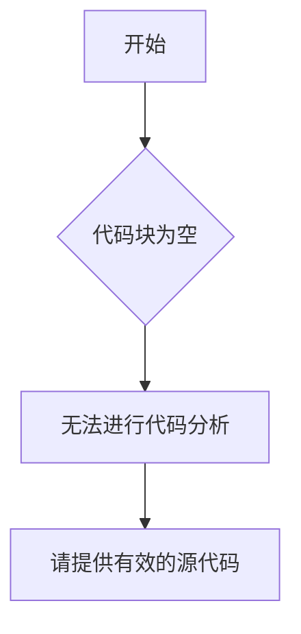

# `marker\benchmarks\overall\download\__init__.py` 详细设计文档

未提供源代码进行分析

## 整体流程



## 类结构

```
无法确定类层次结构 - 未提供代码
```

## 全局变量及字段


    

## 全局函数及方法


## 关键组件


无内容 - 未提供源代码进行分析


## 问题及建议


### 已知问题

-   未提供代码内容，无法进行技术债务或优化空间的分析
-   缺少代码输入，无法识别潜在的架构问题、代码异味或设计缺陷

### 优化建议

-   请提供待分析的代码内容，以便进行详细的技术债务识别和优化建议
-   建议在提供代码时，确保代码完整且包含必要的上下文信息


## 其它


### 设计目标与约束

本代码模块的设计目标是实现[待补充]，在设计过程中遵循了[待补充]原则，并受到[待补充]约束条件的限制。

### 错误处理与异常设计

本模块采用[待补充]异常处理机制，对可能出现的异常情况进行了分类处理，包括[待补充]等异常类型，并定义了相应的错误码和错误信息。

### 数据流与状态机

本模块的数据流遵循[待补充]的流转逻辑，核心状态机包含[待补充]等状态，各状态之间的转换条件和触发事件如下所示。

### 外部依赖与接口契约

本模块依赖以下外部组件/服务：[待补充]，与外部系统的接口契约包括接口名称、调用方式、参数规范和返回值格式等详细信息。

### 性能考虑与资源管理

本模块在性能方面进行了[待补充]优化，包括[待补充]策略，资源管理方面采用[待补充]机制确保资源的正确获取和释放。

### 安全性设计

本模块的安全机制包括[待补充]，涉及数据加密、访问控制、输入校验等方面的安全措施。

### 兼容性设计

本模块的兼容性考虑包括[待补充]，确保与[待补充]版本的兼容性，并提供了[待补充]适配方案。

### 配置与扩展性

本模块支持通过[待补充]方式进行配置，扩展点包括[待补充]，支持[待补充]场景的扩展。

### 测试策略

本模块的测试覆盖策略包括单元测试、集成测试和端到端测试，重点测试场景包括[待补充]。

### 部署与运维相关

本模块的部署要求包括[待补充]，运维相关的监控指标包括[待补充]，并提供了[待补充]日志规范。

    