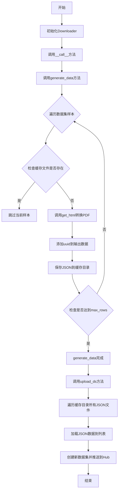
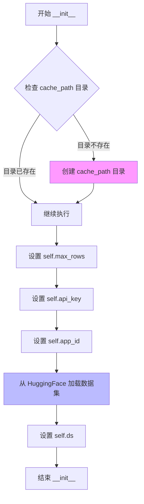
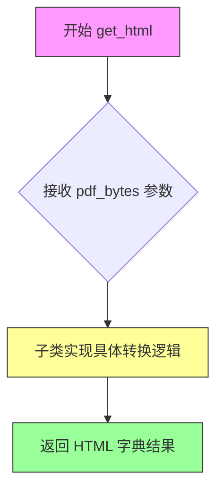
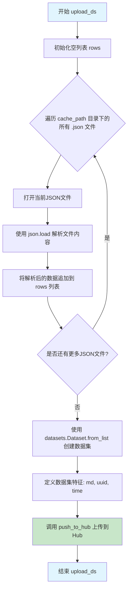
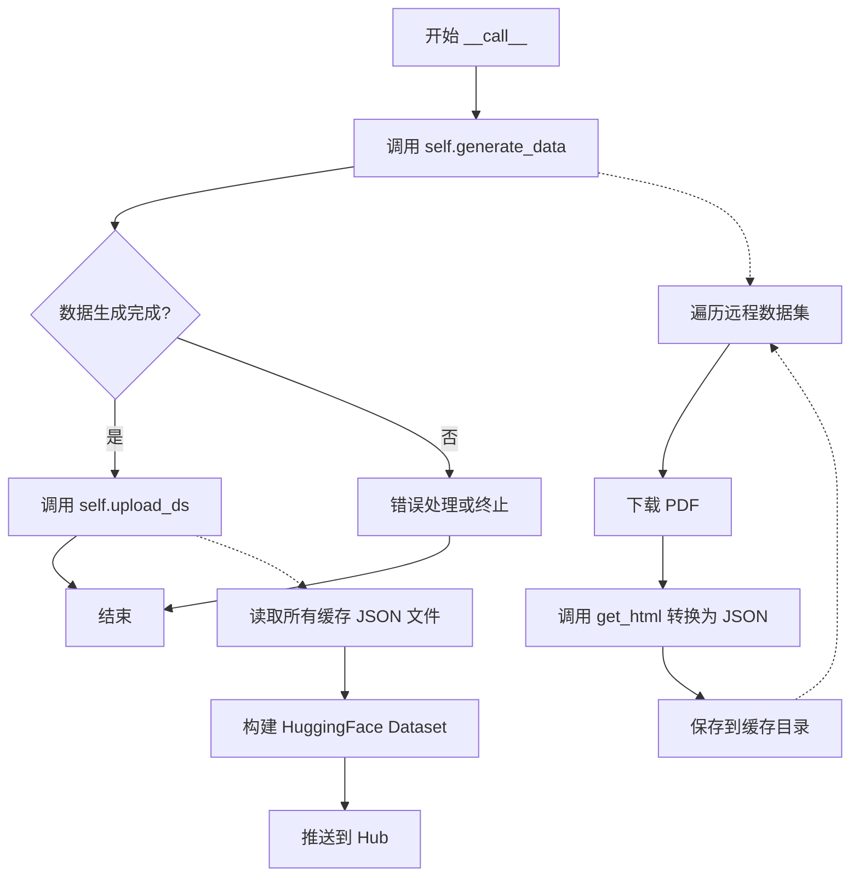

# `marker\benchmarks\overall\download\base.py` 详细设计文档

该代码实现了一个PDF数据集下载和转换工具类Downloader，用于从Hugging Face加载PDF数据集，调用外部服务将PDF转换为HTML/Markdown格式，保存到本地缓存，最后将结果整合并上传到新的Hugging Face数据集仓库。

## 整体流程



## 类结构

```
Downloader (具体类)
└── get_html (抽象方法，需子类实现)
```

## 全局变量及字段


### `Downloader.cache_path`
    
缓存目录路径

类型：`Path`
    


### `Downloader.service`
    
服务名称标识

类型：`str`
    


### `Downloader.max_rows`
    
最大处理行数限制

类型：`int`
    


### `Downloader.api_key`
    
API认证密钥

类型：`str`
    


### `Downloader.app_id`
    
应用ID标识

类型：`str`
    


### `Downloader.ds`
    
Hugging Face数据集对象

类型：`Dataset`
    
    

## 全局函数及方法


### `Downloader.__init__`

初始化方法，设置缓存目录、加载配置参数并从HuggingFace加载基准数据集。

参数：

-  `api_key`：未标注类型（推断为`str`），API认证密钥，用于访问外部服务
-  `app_id`：未标注类型（推断为`str`），应用标识符，用于标识当前下载任务
-  `max_rows`：`int`，最大处理行数，默认为2200，控制在一次运行中处理的数据量

返回值：`None`，`__init__`方法不返回任何值，仅初始化实例属性

#### 流程图



#### 带注释源码

```python
def __init__(self, api_key, app_id, max_rows: int = 2200):
    """
    初始化 Downloader 实例
    
    参数:
        api_key: API 认证密钥
        app_id: 应用标识符
        max_rows: 最大处理行数，默认 2200
    """
    # 创建缓存目录（如果不存在）
    # exist_ok=True 避免目录已存在时抛出异常
    self.cache_path.mkdir(exist_ok=True)
    
    # 设置最大处理行数限制
    self.max_rows = max_rows
    
    # 保存 API 密钥用于后续 API 调用
    self.api_key = api_key
    
    # 保存应用标识符，用于后续上传数据集时命名
    self.app_id = app_id
    
    # 从 HuggingFace Datasets 加载 marker_benchmark 训练集
    # 这是一个公开的 PDF 转 Markdown 基准数据集
    self.ds = datasets.load_dataset("datalab-to/marker_benchmark", split="train")
```


### `Downloader.get_html`

抽象方法，将PDF字节转换为HTML（需子类实现）。该方法是 Downloader 类的抽象接口，定义了将 PDF 字节数据转换为 HTML 格式的契约，具体转换逻辑由子类实现。

参数：

- `pdf_bytes`：`bytes`，PDF 文件的原始字节数据，来自数据集样本中的 PDF 内容

返回值：`dict`，包含转换后的 HTML 数据的字典，通常包含 `md` 键（HTML 字符串）和其他元数据，后续会被序列化为 JSON 文件

#### 流程图



#### 带注释源码

```python
def get_html(self, pdf_bytes):
    """
    抽象方法：将PDF字节转换为HTML
    
    该方法定义了PDF到HTML转换的接口规范，具体实现由子类完成。
    子类需要实现具体的PDF解析和HTML生成逻辑。
    
    参数:
        pdf_bytes (bytes): PDF文件的原始字节数据
        
    返回:
        dict: 包含转换结果的字典，通常包含 'md' 键存储HTML内容
              示例: {'md': '<html>...</html>', ...}
              
    异常:
        NotImplementedError: 如果子类未实现该方法则抛出此异常
    """
    raise NotImplementedError
```


### `Downloader.upload_ds`

该方法将本地缓存目录中的所有JSON文件整合为一个数据集，并上传到Hugging Face Hub。方法首先遍历缓存路径读取所有JSON文件，然后使用datasets库将数据转换为Dataset对象，最后将数据集推送到指定的Hub仓库。

参数：无（仅包含隐式参数`self`）

返回值：`None`，该方法无返回值，执行完成后直接结束

#### 流程图



#### 带注释源码

```python
def upload_ds(self):
    """
    将本地缓存的JSON文件整合并上传到Hub
    
    该方法执行以下操作：
    1. 遍历 cache_path 目录下的所有 .json 文件
    2. 读取每个JSON文件的内容并存储到列表中
    3. 将列表数据转换为 Hugging Face Dataset 对象
    4. 将数据集推送到 Hugging Face Hub
    """
    
    # 步骤1：初始化用于存储所有记录的空列表
    rows = []
    
    # 步骤2：遍历缓存目录中的所有JSON文件
    # glob("*.json") 匹配所有以 .json 结尾的文件
    for file in self.cache_path.glob("*.json"):
        # 打开文件并读取JSON数据
        with open(file, "r") as f:
            # 使用 json.load 解析JSON文件内容为Python字典
            data = json.load(f)
        
        # 将解析后的数据添加到行列表中
        rows.append(data)

    # 步骤3：创建Hugging Face Dataset数据集对象
    # 使用 from_list 方法将Python字典列表转换为Dataset
    # features 参数定义了数据集中每列的数据类型
    out_ds = datasets.Dataset.from_list(rows, features=datasets.Features({
        # "md" 列：存储Markdown字符串内容
        "md": datasets.Value("string"),
        # "uuid" 列：存储唯一标识符字符串
        "uuid": datasets.Value("string"),
        # "time" 列：存储浮点数类型的时间戳
        "time": datasets.Value("float"),
    }))
    
    # 步骤4：将数据集推送到Hugging Face Hub
    # 仓库名称格式：datalab-to/marker_benchmark_{service名称}
    # private=True 表示数据集为私有仓库
    out_ds.push_to_hub(f"datalab-to/marker_benchmark_{self.service}", private=True)
```


### `Downloader.generate_data`

该方法遍历预加载的数据集，对每个样本调用转换服务（`get_html`）将PDF转换为HTML/JSON格式，并缓存到本地文件系统，直到达到最大行数限制或遍历完成。

参数：

- 无（仅使用实例属性 `self.max_rows`、`self.cache_path`、`self.ds`、`self.service`）

返回值：`None`，无返回值（方法通过副作用将转换后的数据写入缓存文件）

#### 流程图

```mermaid
flowchart TD
    A[开始 generate_data] --> B[设置 max_rows = self.max_rows]
    B --> C[使用 tqdm 遍历 self.ds 数据集]
    C --> D{当前索引 idx 是否存在缓存文件?}
    D -->|是| E[跳过当前样本, 继续下一轮]
    D -->|否| F[从样本中获取 pdf_bytes]
    F --> G[调用 self.get_html(pdf_bytes) 转换PDF]
    G --> H{转换是否抛出 JSONDecodeError?}
    H -->|是| I[打印错误信息, 跳过当前样本]
    H -->|否| J{转换是否抛出其他异常?}
    J -->|是| K[打印错误信息, 跳过当前样本]
    J -->|否| L[将 sample[uuid] 添加到 out_data]
    L --> M[将 out_data 写入缓存 JSON 文件]
    M --> N{idx >= max_rows?}
    N -->|是| O[退出循环]
    N -->|否| C
    E --> C
    I --> C
    K --> C
    O --> P[结束]
```

#### 带注释源码

```python
def generate_data(self):
    """
    遍历数据集并调用转换服务生成数据
    将转换结果缓存到本地JSON文件中
    """
    # 从实例属性获取最大行数限制
    max_rows = self.max_rows
    
    # 使用 tqdm 显示进度条遍历数据集
    # desc 参数显示当前服务名称
    for idx, sample in tqdm(enumerate(self.ds), desc=f"Saving {self.service} results"):
        # 构建缓存文件路径: cache_path/{idx}.json
        cache_file = self.cache_path / f"{idx}.json"
        
        # 如果缓存文件已存在,跳过该样本的处理
        if cache_file.exists():
            continue

        # 从数据集中获取PDF字节数据
        # sample["pdf"] 是单页PDF格式
        pdf_bytes = sample["pdf"]
        
        try:
            # 调用子类实现的get_html方法将PDF转换为HTML/JSON数据
            out_data = self.get_html(pdf_bytes)
        except JSONDecodeError as e:
            # 处理JSON解析错误,打印错误信息并跳过该样本
            print(f"Error with sample {idx}: {e}")
            continue
        except Exception as e:
            # 处理其他所有异常,打印错误信息并跳过该样本
            print(f"Error with sample {idx}: {e}")
            continue
        
        # 将样本的UUID添加到输出数据中
        out_data["uuid"] = sample["uuid"]

        # 以写入模式打开缓存文件,将转换后的数据序列化为JSON格式保存
        with cache_file.open("w") as f:
            json.dump(out_data, f)

        # 如果达到最大行数限制,则退出循环
        if idx >= max_rows:
            break
```


### `Downloader.__call__`

使 `Downloader` 类实例可调用，触发完整的数据生成和上传流程。首先调用 `generate_data()` 方法从远程数据集下载 PDF 并转换为 HTML/JSON 格式存储到本地缓存，然后调用 `upload_ds()` 方法将缓存的数据上传到 Hugging Face Hub。

参数：

- 无（仅包含隐式 `self` 参数）

返回值：`None`，无返回值，仅执行副作用操作（数据生成和上传）

#### 流程图



#### 带注释源码

```python
def __call__(self):
    """
    使类实例可调用的魔术方法。
    触发完整的数据下载、转换和上传流程。
    
    执行流程：
    1. generate_data(): 从 marker_benchmark 数据集下载 PDF，调用 get_html 转换为 JSON，保存到本地缓存
    2. upload_ds(): 读取所有缓存的 JSON 文件，构建新的 Dataset 并推送到 HuggingFace Hub
    
    注意：
    - 该方法无参数（除 self）
    - 该方法无返回值
    - 依赖于子类实现 get_html 方法
    - 上传的数据集为私有仓库 (private=True)
    """
    # 第一步：生成数据
    # 从远程数据集加载 PDF，转换为 JSON 格式并缓存到本地
    self.generate_data()
    
    # 第二步：上传数据集
    # 将本地缓存的所有 JSON 文件打包为 HuggingFace Dataset 并推送到 Hub
    self.upload_ds()
```

## 关键组件


### Downloader类

主数据处理类，负责从Hugging Face下载PDF样本，将其转换为HTML格式，并上传到新的数据集仓库。

### 张量索引与惰性加载

使用`sample["pdf"]`从Hugging Face数据集样本中按索引访问PDF字节数据，支持惰性加载避免内存溢出。

### 缓存机制

使用本地文件系统（cache_path目录）存储中间JSON结果，避免重复处理已存在的样本。

### 错误处理与异常设计

使用try-except捕获JSONDecodeError和其他Exception，打印错误信息后继续处理下一个样本，保证批量处理的容错性。

### 数据流管道

从远程数据集下载 -> PDF到HTML转换 -> 本地缓存 -> 批量上传到Hub的完整数据处理流水线。

### 配置管理

通过构造函数接收api_key、app_id和max_rows参数，支持灵活配置下载样本数量和服务标识。

### 全局变量和路径

cache_path指定缓存目录路径，service类变量标识服务类型，两者共同构成数据持久化的基础配置。


## 问题及建议


### 已知问题

- **抽象方法未正确实现**: `get_html` 方法抛出 `NotImplementedError`，但类本身未使用 ABC 或 @abstractmethod 装饰器，无法在编译期强制子类实现
- **类字段初始化不一致**: `service` 声明为类字段但在 `__init__` 中未赋值，可能导致实例间共享状态或 AttributeError
- **数据加载时机不当**: 在 `__init__` 中加载整个数据集到内存 (`self.ds = datasets.load_dataset(...)`)，即使后续可能不需要处理这么多数据
- **内存爆炸风险**: `upload_ds` 方法将所有 JSON 文件一次性加载到内存 (`rows.append(data)`)，处理大量数据时可能导致 OOM
- **异常处理过于宽泛**: 使用 `except Exception as e` 捕获所有异常后仅打印错误信息继续执行，可能掩盖关键问题导致数据不一致
- **文件操作无原子性**: 直接写入 JSON 文件 (`json.dump(out_data, f)`)，若进程中断会留下损坏的缓存文件，且无文件锁机制防止并发冲突
- **类型注解缺失**: 多个关键变量缺少类型注解 (`service`, `ds`, `api_key`, `app_id`, `out_data`, `sample` 等)，降低代码可维护性和 IDE 支持
- **魔法数字**: 默认值 `2200` 作为 `max_rows` 的硬编码值，缺乏配置灵活性
- **上传路径硬编码**: Hub 仓库名称模板 `f"datalab-to/marker_benchmark_{self.service}"` 写死在代码中
- **缺少输入验证**: `api_key`、`app_id`、`max_rows` 等参数未进行有效性校验
- **重复错误处理逻辑**: `generate_data` 方法中 `JSONDecodeError` 和通用 `Exception` 的 except 块代码完全相同，应合并

### 优化建议

- 使用 `abc.ABC` 和 `@abstractmethod` 装饰器将 `get_html` 定义为真正的抽象方法
- 将 `service` 改为实例字段并在 `__init__` 中初始化，或使用 dataclass 模式
- 使用 Hugging Face `IterableDataset` 或分片加载方式替代全量加载
- 实现流式处理：在 `upload_ds` 中使用 `Dataset.from_generator` 或分批处理，避免全量加载
- 添加结构化日志记录而非简单 print，使用日志级别区分错误严重程度
- 使用临时文件 + 原子重命名实现安全写入，或添加文件锁机制
- 补充完整的类型注解，使用 mypy 进行静态检查
- 将 `2200` 等配置值提取为类常量或配置文件
- 添加入口参数验证，可使用 Pydantic 进行数据校验和类型转换
- 合并重复的异常处理块，使用 `continue` 统一处理跳过逻辑
- 考虑将下载、处理、上传分离为独立模块或策略模式，提高代码可测试性
- 添加单元测试框架和 mock 能力，特别是对外部 API 和文件系统的模拟

## 其它


### 设计目标与约束

本代码的设计目标是从Hugging Face下载PDF数据集，调用外部服务将PDF转换为Markdown/HTML格式，并将转换结果上传到新的Hugging Face数据集仓库。约束条件包括：单次处理最大行数限制为2200行，缓存目录默认为"cache"，输出数据集为私有仓库。

### 错误处理与异常设计

代码中包含两层异常处理机制：1) JSONDecodeError捕获，用于处理JSON解析失败的情况；2) 通用Exception捕获，用于处理其他未知错误。两种异常均仅打印错误信息后继续执行，不会中断整个数据处理流程。get_html方法设计为抽象方法，由子类实现具体转换逻辑。

### 数据流与状态机

数据流如下：1) 初始化阶段：创建缓存目录、加载源数据集；2) 处理阶段：遍历源数据集中PDF样本→调用get_html转换→写入缓存JSON文件；3) 上传阶段：读取所有缓存JSON文件→构建新数据集→推送至Hugging Face。状态机包含"处理中"和"上传中"两个主要状态。

### 外部依赖与接口契约

外部依赖包括：1) datasets库用于Hugging Face数据集操作；2) tqdm库用于进度显示；3) Path和json库用于文件操作。接口契约方面：get_html(pdf_bytes)方法接收PDF字节数据，返回包含"md"、"uuid"、"time"字段的字典；upload_ds方法无输入参数，推送数据集到"datalab-to/marker_benchmark_{service}"仓库。

### 性能考虑与优化空间

当前实现中，每次处理都会检查缓存文件是否存在，存在则跳过，但遍历数据集时仍会逐个迭代。可优化方向：1) 使用批处理减少I/O次数；2) 添加并发处理能力加速转换；3) 增量上传而非全量上传；4) cache_path.mkdir可提前验证而非每次初始化时执行。

### 安全与隐私考虑

代码中api_key和app_id作为敏感参数传入但未在代码中硬编码，符合安全规范。建议将此类敏感信息通过环境变量或配置管理注入，避免在日志中输出敏感信息。当前代码print语句可能泄露样本索引信息。

### 使用示例与扩展建议

该类为基类，需通过继承并实现get_html方法来完成具体服务转换。典型使用方式：实例化子类对象后直接调用()或调用generate_data和upload_ds方法。可扩展方向：添加重试机制、支持不同数据源、支持多种输出格式等。

    