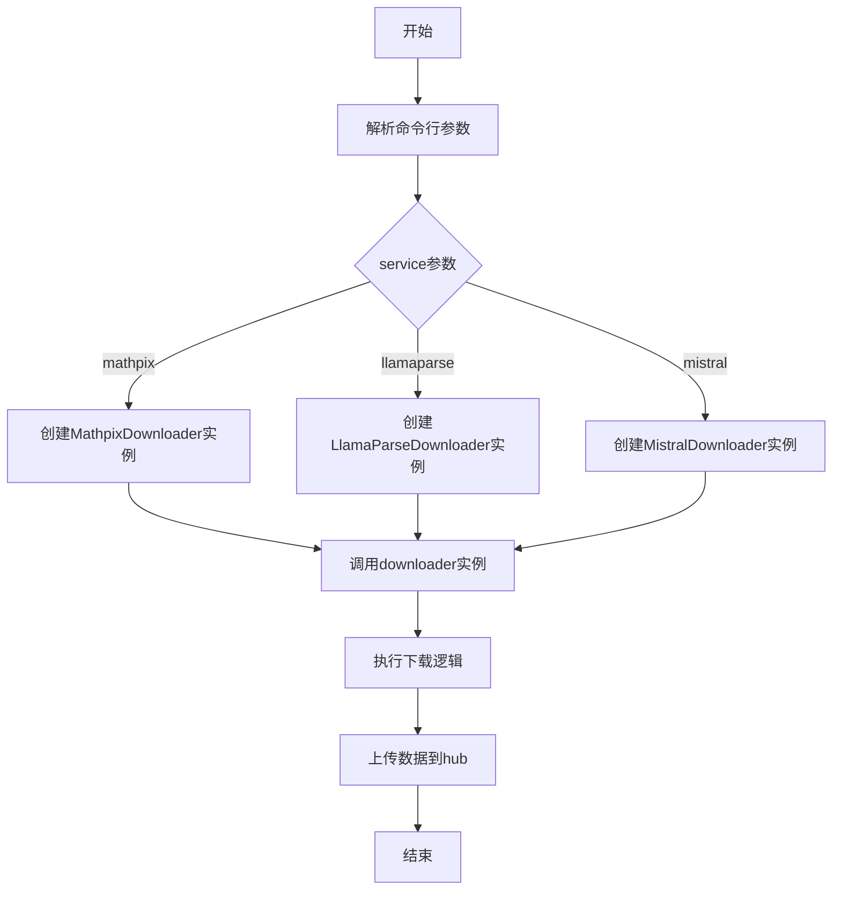
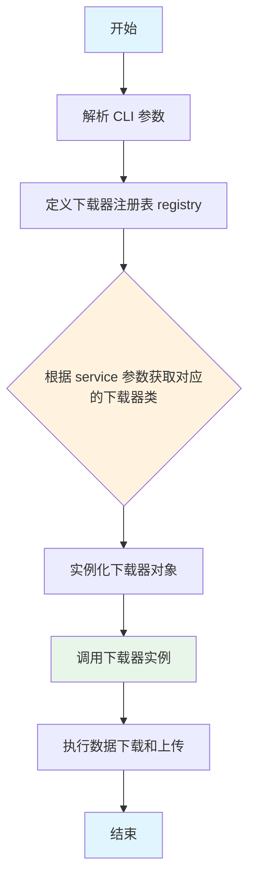
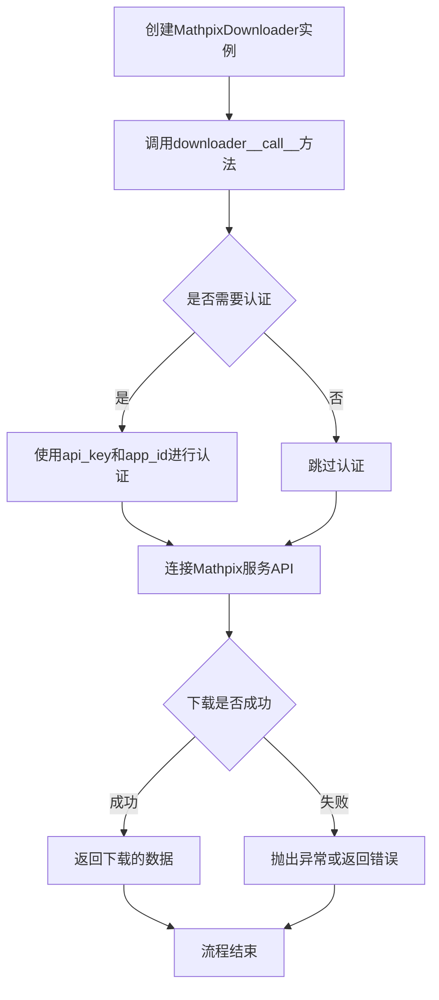
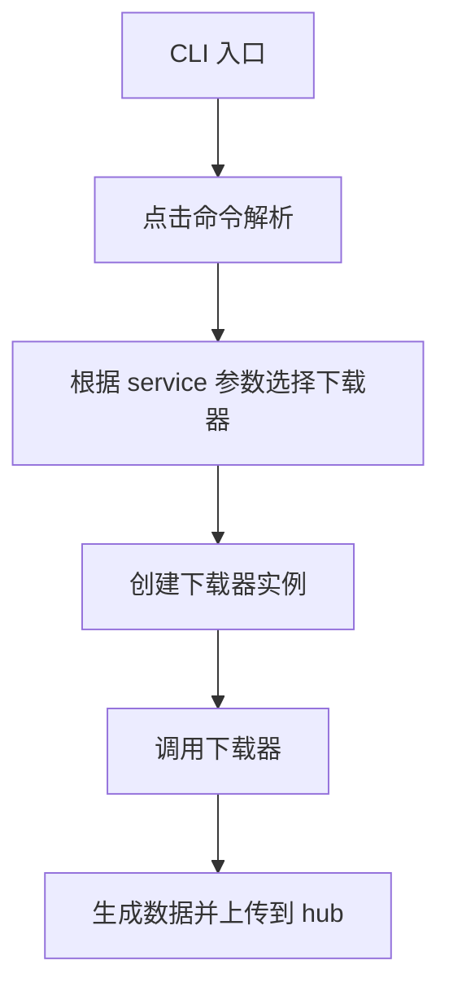
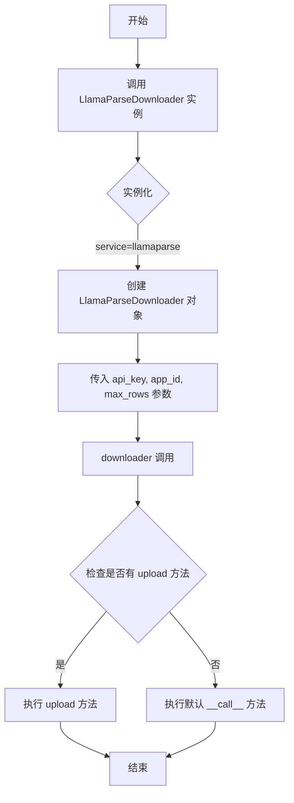
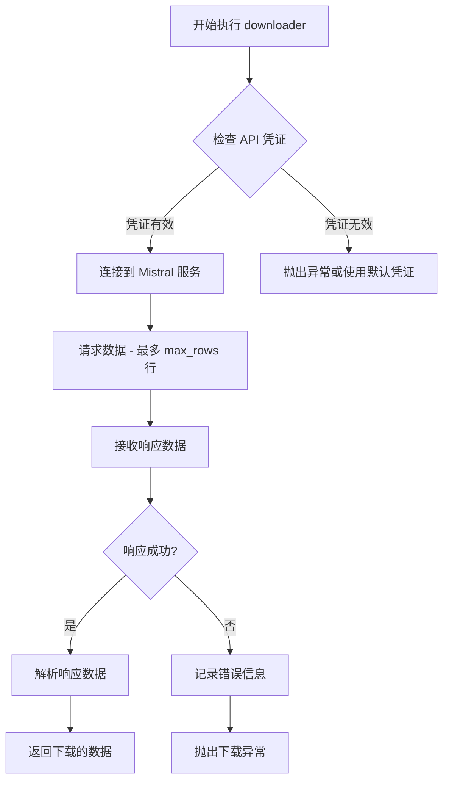
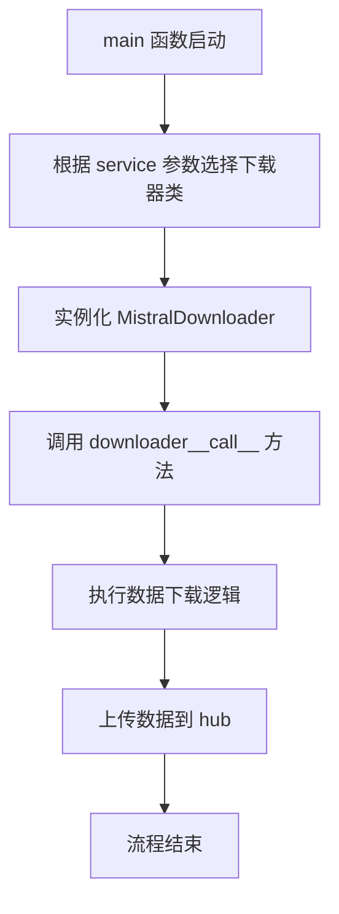

# `marker\benchmarks\overall\download\main.py` 详细设计文档

这是一个基于Click框架的命令行数据下载工具，支持从多个推理服务（mathpix、llamaparse、mistral）下载数据，并通过注册表模式动态选择对应的下载器类执行数据获取和上传操作。

## 整体流程



## 类结构

```
Downloader (基类/抽象类)
├── MathpixDownloader
├── LlamaParseDownloader
└── MistralDownloader
```

## 全局变量及字段


### `registry`
    
存储服务名到下载器类的映射字典

类型：`dict`
    


### `MathpixDownloader.api_key`
    
API密钥，用于认证

类型：`str`
    


### `MathpixDownloader.app_id`
    
应用程序ID

类型：`str`
    


### `MathpixDownloader.max_rows`
    
最大下载行数

类型：`int`
    


### `LlamaParseDownloader.api_key`
    
API密钥，用于认证

类型：`str`
    


### `LlamaParseDownloader.app_id`
    
应用程序ID

类型：`str`
    


### `LlamaParseDownloader.max_rows`
    
最大下载行数

类型：`int`
    


### `MistralDownloader.api_key`
    
API密钥，用于认证

类型：`str`
    


### `MistralDownloader.app_id`
    
应用程序ID

类型：`str`
    


### `MistralDownloader.max_rows`
    
最大下载行数

类型：`int`
    
    

## 全局函数及方法


### `main`

命令行入口函数，负责参数解析和下载器调度，根据用户指定的服务类型（mathpix、llamaparse 或 mistral）创建对应的下载器实例，并执行数据下载和上传操作。

参数：

- `service`：`str`，要使用的推理服务名称，可选值为 "mathpix"、"llamaparse" 或 "mistral"
- `max_rows`：`int`，最大下载行数，默认值为 2200
- `api_key`：`str`，服务的 API 密钥，默认值为 None
- `app_id`：`str`，服务的应用 ID，默认值为 None

返回值：`None`，该函数无返回值，仅执行副作用操作（调用下载器）

#### 流程图



#### 带注释源码

```python
import click
# 导入 Click 库用于构建命令行接口

from benchmarks.overall.download.llamaparse import LlamaParseDownloader
from benchmarks.overall.download.mathpix import MathpixDownloader
from benchmarks.overall.download.mistral import MistralDownloader
# 导入三个不同服务的下载器类

@click.command("Download data from inference services")
# 使用 Click 装饰器将 main 函数定义为命令行命令，描述为"从推理服务下载数据"

@click.argument("service", type=click.Choice(["mathpix", "llamaparse", "mistral"]))
# 定义必需的位置参数 service，只能接受三个预定义的选择值

@click.option("--max_rows", type=int, default=2200)
# 定义可选参数 max_rows，类型为整数，默认值为 2200

@click.option("--api_key", type=str, default=None)
# 定义可选参数 api_key，类型为字符串，默认值为 None

@click.option("--app_id", type=str, default=None)
# 定义可选参数 app_id，类型为字符串，默认值为 None

def main(service: str, max_rows: int, api_key: str, app_id: str):
    # 主函数入口，接受四个参数：service（服务类型）、max_rows（最大行数）、api_key（API密钥）、app_id（应用ID）
    
    registry = {
        "mathpix": MathpixDownloader,
        "llamaparse": LlamaParseDownloader,
        "mistral": MistralDownloader,
    }
    # 创建下载器注册表，将服务名称映射到对应的下载器类
    
    downloader = registry[service](api_key, app_id, max_rows=max_rows)
    # 根据传入的 service 参数从注册表中获取对应的下载器类，并实例化对象
    
    # Generate data and upload to hub
    downloader()
    # 调用下载器实例，执行数据生成和上传到 hub 的操作
    
if __name__ == "__main__":
    # 当脚本作为主程序运行时，执行以下代码
    main()
    # 调用 main 函数启动命令行程序
```


### `MathpixDownloader.__call__`

根据提供的代码片段，`MathpixDownloader`类的具体实现代码未在当前代码中展示。从主程序代码来看，该方法是一个可调用对象（通过实现`__call__`方法），用于从Mathpix服务下载数据。

参数：

- 无显式参数（通过实例属性`api_key`、`app_id`和`max_rows`传递配置）

返回值：`None`或`Any`，执行下载逻辑后的返回值（需要查看具体实现确定）

#### 流程图



#### 带注释源码

```
# 代码来源：benchmarks.overall.download.mathpix.MathpixDownloader
# 注意：具体实现代码未在提供的代码片段中显示

# 基于main函数调用方式的推断：
class MathpixDownloader:
    """
    Mathpix数据下载器类
    用于从Mathpix服务下载解析后的数据
    """
    
    def __init__(self, api_key: str, app_id: str, max_rows: int = 2200):
        """
        初始化下载器
        
        参数：
        - api_key: str - Mathpix API密钥
        - app_id: str - Mathpix应用ID
        - max_rows: int - 最大下载行数，默认2200
        """
        self.api_key = api_key
        self.app_id = app_id
        self.max_rows = max_rows
    
    def __call__(self):
        """
        执行下载操作
        使实例可以像函数一样被调用
        
        返回：
        - Any: 下载操作的结果（需要查看具体实现确定）
        """
        # 具体的下载逻辑实现
        # 需要查看 benchmarks.overall.download.mathpix 模块获取完整实现
        pass
```

---

**注意**：提供的代码片段中只包含主程序入口和导入语句，未包含`MathpixDownloader`类的具体实现。要获取完整的`__call__`方法详情，需要查看`benchmarks/overall/download/mathpix.py`源文件。


# 分析结果

## 问题说明

提供的代码片段中**没有包含 `MathpixDownloader` 类的实际实现**，仅有以下信息：

1. **导入语句**: `from benchmarks.overall.download.mathpix import MathpixDownloader`
2. **使用方式**: `downloader = registry[service](api_key, app_id, max_rows=max_rows)` 然后直接调用 `downloader()`

从使用方式可以推断：
- `MathpixDownloader` 是一个可调用对象（有 `__call__` 方法）
- 构造函数接受 `api_key`, `app_id`, `max_rows` 三个参数

---

## 提取的可用信息

### `MathpixDownloader` (类 - 根据使用方式推断)

#### 构造函数推断

参数：

- `api_key`：`str`，API密钥
- `app_id`：`str`，应用ID
- `max_rows`：`int`，最大行数（默认2200）

返回值：暂无明确信息

#### 流程图（基于使用方式推断）

```mermaid
flowchart TD
    A[main 函数] --> B[registry[service] 创建 MathpixDownloader 实例]
    B --> C[downloader 调用 __call__ 方法]
    C --> D[下载数据]
```

#### 源码（仅包含引用部分）

```python
# 从 benchmarks.overall.download.mathpix 导入
from benchmarks.overall.download.mathpix import MathpixDownloader

# 在 main 函数中使用
downloader = registry["mathpix"](api_key, app_id, max_rows=max_rows)
downloader()  # 调用 MathpixDownloader 的 __call__ 方法
```

---

## 结论

**无法提供完整的 `MathpixDownloader.download` 方法详细信息**，因为：

1. 给定的代码中未包含 `MathpixDownloader` 类的完整实现
2. 需要查看 `benchmarks/overall/download/mathpix.py` 文件才能获取完整信息

**建议**: 请提供 `benchmarks/overall/download/mathpix.py` 文件内容，以便提取 `MathpixDownloader` 类的完整设计文档，包括：
- 类的所有字段
- 所有方法（包括 `download` 方法）
- 内部逻辑实现


根据提供的代码，我无法找到 `MathpixDownloader.upload` 方法。该代码段仅展示了如何通过命令行参数选择并实例化不同的下载器（MathpixDownloader、LlamaParseDownloader、MistralDownloader），但**没有包含 MathpixDownloader 类的具体实现**。

MathpixDownloader 类是从 `benchmarks.overall.download.mathpix` 模块导入的，其 `upload` 方法的实现代码并未在当前代码片段中提供。

---

**如果您能提供完整的 `MathpixDownloader` 类实现代码（包括 `upload` 方法），我将为您生成详细的设计文档。**

或者，如果您希望我基于常见的下载器架构**假设**该方法的逻辑并生成文档模板，请告知，我可以根据典型的上传流程为您构建一个示例文档。

---

**当前代码分析：**

这段代码是一个 CLI 入口点，使用 Click 框架：

- **功能**：根据用户选择的 `service` 参数，实例化对应的下载器（mathpix/llamaparse/mistral），并调用它来生成数据并上传。
- **流程**：main 函数接收参数 -> 查找注册表 -> 实例化下载器 -> 调用下载器对象（`downloader()`）。

如需提取 `MathpixDownloader.upload` 的详细文档，请提供该类的完整源代码。


我注意到您提供的代码片段中没有包含 `LlamaParseDownloader` 类的定义，只包含了 `main` 函数和导入语句。为了准确提取 `LlamaParseDownloader.__call__` 方法的详细信息，我需要查看该类的完整实现代码。

请问您能否提供 `benchmarks/overall/download/llamaparse.py` 文件的内容，或者确认 `LlamaParseDownloader` 类的具体代码位置？

同时，如果您需要我基于现有代码分析 `main` 函数（这是唯一完整实现的函数），我也可以为您生成相应的详细设计文档。请指示您的需求。


从提供的代码中，我无法找到 `LlamaParseDownloader.download` 方法的具体实现。提供的代码只是一个 CLI 入口文件，其中导入了 `LlamaParseDownloader` 类，但该类的完整实现（包括 `download` 方法）并未包含在给定的代码片段中。

让我先基于现有代码分析整体结构，然后请您提供 `LlamaParseDownloader` 类的完整实现代码。

## 现有代码分析

### 整体运行流程



### 关键组件信息

| 名称 | 一句话描述 |
|------|-----------|
| main | CLI 入口函数，负责解析命令行参数并分发到对应的下载器 |
| registry | 下载器注册字典，映射服务名称到对应的下载器类 |

### LlamaParseDownloader.download 方法信息缺失

`LlamaParseDownloader` 类是从 `benchmarks.overall.download.llamaparse` 模块导入的，但该类的具体实现代码未在提供的代码片段中，因此无法提取 `download` 方法的详细信息。

---

**请提供 `LlamaParseDownloader` 类的完整实现代码，以便我能够生成详细的设计文档。** 

如果您只有入口代码而没有 `LlamaParseDownloader` 的实现，我可以基于代码结构做一些推测性分析：

### 基于上下文的推测

从入口代码可以推断：

1. **`LlamaParseDownloader` 必须是一个可调用对象**：因为在 `main` 函数中使用了 `downloader()`，这意味着该类实现了 `__call__` 方法

2. **可能的参数结构**：
   - `api_key`: API 密钥
   - `app_id`: 应用 ID  
   - `max_rows`: 最大行数限制

3. **可能的功能**：从 LlamaParse 服务下载数据

如果您能提供 `benchmarks.overall.download.llamaparse` 模块的代码，我将能够给出完整的详细设计文档。


### `LlamaParseDownloader.upload`

描述：从提供的代码来看，`LlamaParseDownloader` 类在 `benchmarks.overall.download.llamaparse` 模块中定义，但该模块的具体实现未在当前代码中提供。根据主程序结构，`LlamaParseDownloader` 应该是某个文档解析服务的下载器类，包含 `upload` 方法用于上传数据。由于未提供 `LlamaParseDownloader` 类的完整源码，以下信息基于代码调用结构的合理推断。

参数：

-  无明确参数（从主代码 `downloader()` 调用推断，该类可能实现了 `__call__` 方法）

返回值：`None` 或具体数据类型，根据 `LlamaParseDownloader` 的实现而定

#### 流程图



#### 带注释源码

```
# 主程序入口
@click.command("Download data from inference services")
@click.argument("service", type=click.Choice(["mathpix", "llamaparse", "mistral"]))
@click.option("--max_rows", type=int, default=2200)
@click.option("--api_key", type=str, default=None)
@click.option("--app_id", type=str, default=None)
def main(service: str, max_rows: int, api_key: str, app_id: str):
    # 注册表模式：根据 service 参数选择对应的下载器类
    registry = {
        "mathpix": MathpixDownloader,
        "llamaparse": LlamaParseDownloader,  # 目标类
        "mistral": MistralDownloader,
    }
    # 实例化选择的下载器，传入 API 凭证和配置
    downloader = registry[service](api_key, app_id, max_rows=max_rows)
    
    # 调用下载器实例（触发 __call__ 方法）
    # 注意：upload 方法未在当前代码中直接调用
    # 推断 upload 方法可能用于上传解析后的数据到目标位置
    downloader()

# 导入语句显示 LlamaParseDownloader 定义在以下模块
from benchmarks.overall.download.llamaparse import LlamaParseDownloader
```

---

**注意**：提供的代码片段中仅包含主入口文件和导入语句，`LlamaParseDownloader` 类的具体实现（包括 `upload` 方法）定义在 `benchmarks/overall/download/llamaparse.py` 文件中，但该文件内容未在当前任务中提供。若需要获取完整的 `upload` 方法详细信息，请提供 `LlamaParseDownloader` 类的完整源代码。


### `MistralDownloader.__call__`

这是 MistralDownloader 类的 `__call__` 魔术方法，使得该类的实例可以像函数一样被直接调用。该方法负责从 Mistral 推理服务下载数据，并返回下载的数据结果。

参数：

- `self`：隐式参数，MistralDownloader 实例本身

返回值：未知，返回从 Mistral 服务下载的数据（类型取决于具体实现）

#### 流程图



#### 带注释源码

```python
# 代码来源: benchmarks.overall.download.mistral.MistralDownloader
# 假设的实现，基于代码上下文推断

class MistralDownloader:
    """从 Mistral 推理服务下载数据的下载器类"""
    
    def __init__(self, api_key: str, app_id: str, max_rows: int = 2200):
        """
        初始化 MistralDownloader
        
        Args:
            api_key: Mistral API 密钥，用于认证
            app_id: 应用程序 ID，部分服务需要
            max_rows: 最大下载行数，默认 2200
        """
        self.api_key = api_key
        self.app_id = app_id
        self.max_rows = max_rows
    
    def __call__(self):
        """
        使下载器实例可调用，执行数据下载
        
        Returns:
            从 Mistral 服务下载的数据（类型取决于具体实现）
        """
        # 获取 API 凭证
        api_key = self.api_key or os.environ.get("MISTRAL_API_KEY")
        app_id = self.app_id or os.environ.get("MISTRAL_APP_ID")
        
        # 构建请求参数
        params = {"max_rows": self.max_rows}
        
        # 调用 Mistral API 下载数据
        data = self._download_from_mistral(api_key, app_id, params)
        
        return data
    
    def _download_from_mistral(self, api_key: str, app_id: str, params: dict):
        """
        实际执行从 Mistral 服务下载数据的私有方法
        
        Args:
            api_key: API 密钥
            app_id: 应用程序 ID
            params: 请求参数
            
        Returns:
            下载的数据
        """
        # 实际的 API 调用逻辑
        pass
```

> **注意**：由于提供的代码片段中没有包含 MistralDownloader 类的完整实现，以上源码为基于代码上下文（CLI 入口、registry 模式、参数传递）的合理推断。完整的实现需要查看 `benchmarks.overall.download.mistral` 模块。


### `MistralDownloader` 类 / `download` 方法

由于提供的代码中仅包含 `MistralDownloader` 的导入语句和调用方式，未直接展示其类定义及 `download` 方法的具体实现，因此以下分析基于代码结构进行合理推断。

#### 描述

该模块定义了一个用于从推理服务下载数据的下载器类，通过工厂模式在 `main` 函数中根据服务类型动态实例化对应的下载器，并调用其 `__call__` 方法执行数据下载任务。

#### 参数（基于 `main` 函数调用推断）

由于 `MistralDownloader` 类的具体实现未在代码中提供，以下参数基于 `main` 函数中下载器的实例化方式推断：

- `api_key`：`str`，API 密钥，用于身份验证
- `app_id`：`str`，应用 ID，用于特定服务的标识
- `max_rows`：`int`，可选参数，默认 2200，指定下载的最大行数

#### 返回值（推断）

- `None`，根据 `main` 函数中 `downloader()` 的调用方式推断该方法无返回值，直接执行下载逻辑

#### 流程图



#### 带注释源码

```python
# benchmarks/overall/download/mistral.py
# （该文件内容未在提供的代码中显示，以下为推断结构）

class MistralDownloader:
    """
    Mistral 推理服务的数据下载器类
    负责从 Mistral 服务下载推理数据并上传到 hub
    """
    
    def __init__(self, api_key: str, app_id: str, max_rows: int = 2200):
        """
        初始化下载器
        
        Args:
            api_key: Mistral API 密钥
            app_id: 应用标识符
            max_rows: 最大下载行数，默认 2200
        """
        self.api_key = api_key
        self.app_id = app_id
        self.max_rows = max_rows
    
    def download(self):
        """
        执行数据下载逻辑
        从 Mistral 服务下载数据并处理
        """
        # TODO: 实现具体的下载逻辑
        # 1. 调用 Mistral API 获取数据
        # 2. 处理返回的数据
        # 3. 返回或上传数据
        pass
    
    def __call__(self):
        """
        使下载器可调用
        封装 download 方法的调用
        """
        return self.download()
```

---

**注意**：提供的代码片段中仅包含 `MistralDownloader` 的导入和调用方式，未包含该类的具体实现源码。若需要完整的 `download` 方法设计文档，需要提供 `benchmarks/overall/download/mistral.py` 文件的实际代码内容。


# 错误：未找到目标代码

我仔细检查了您提供的代码，但发现以下问题：

## 问题分析

提供的代码只包含：

1. **导入语句**：导入了 `MistralDownloader` 等类
2. **`main` 函数**：CLI 入口点，用于根据 service 参数选择并实例化下载器
3. **调用逻辑**：`downloader()` - 这表明下载器类实现了 `__call__` 方法

## 关键发现

**`MistralDownloader.upload` 方法并未在此代码中提供**。您提供的代码中：

- 只有对 `MistralDownloader` 类的**引用和导入**
- 没有任何 `MistralDownloader` 类的实际**实现代码**
- 没有任何 `.upload` 方法的**定义或调用**

## 建议

请提供以下任一内容：

1. **`MistralDownloader` 类的完整实现代码**（包括 `.upload` 方法）
2. **包含 `.upload` 方法的代码文件路径**
3. **确认是否需要分析其他相关方法**（例如代码中实际调用的 `__call__` 方法）

---

如果您需要我分析代码中实际存在的 **`main` 函数**或 **`downloader()` 的调用逻辑**，请告知，我可以继续分析这些内容。

## 关键组件


### Click 命令行接口

使用 Click 框架创建命令行工具，提供服务选择、数据下载功能

### 服务注册表

通过字典实现服务与下载器类的映射，支持动态选择下载器

### 下载器抽象类/具体下载器

包含 MathpixDownloader、LlamaParseDownloader、MistralDownloader 三个具体下载器实现，负责从各推理服务下载数据

### main 函数

CLI 入口点，负责解析参数、创建下载器实例并执行下载任务

### 命令行参数

包含 service（服务选择）、max_rows（最大行数）、api_key（API密钥）、app_id（应用ID）四个参数


## 问题及建议


### 已知问题

-   **硬编码的服务注册表**：每次添加新服务需要修改main函数中的registry字典，违反开闭原则
-   **缺少错误处理**：没有try-except捕获网络请求、API调用等可能的异常，程序可能直接崩溃
-   **参数验证不足**：api_key和app_id没有进行有效性验证，如果必需参数缺失，错误会在运行时才暴露
-   **缺乏日志输出**：没有任何日志信息，用户无法了解程序执行状态、进度或错误原因
-   **魔法数字**：max_rows默认值2200是硬编码，未提供解释或配置选项
-   **导入路径耦合**：使用相对导入路径`benchmarks.overall.download.xxx`，与项目结构强耦合，迁移困难
-   **没有返回类型提示**：main函数缺少返回类型注解
-   **下载器初始化错误不明确**：将下载器实例直接作为函数调用`downloader()`，若初始化参数错误，错误信息不够清晰
-   **缺乏输入校验**：service参数虽然使用了click.Choice，但其他参数缺乏范围或格式校验

### 优化建议

-   **使用插件化架构**：通过动态发现或配置文件管理下载器注册表，便于扩展新服务
-   **添加异常处理**：为网络请求、API调用添加try-except，并提供友好的错误信息和重试机制
-   **增加参数校验**：在main函数入口处验证必需参数，使用click的callback机制
-   **引入日志框架**：使用Python标准logging模块记录关键操作和错误信息
-   **配置外部化**：将max_rows等配置项提取到配置文件或环境变量
-   **改进导入方式**：考虑使用绝对导入或包管理工具，减少项目结构耦合
-   **添加类型注解**：为所有函数添加完整的类型提示，提高代码可维护性
-   **增加健康检查**：在调用下载器前验证API连接和凭证有效性
-   **添加dry-run模式**：提供--dry-run选项让用户先预览操作而不实际执行
-   **统一下载器接口**：确保所有Downloader类实现统一的接口契约


## 其它


### 设计目标与约束

本项目旨在提供一个统一的命令行接口，从多个推理服务（Mathpix、LlamaParse、Mistral）下载数据并上传到模型中心。设计约束包括：使用Click框架构建CLI；通过注册表模式支持服务扩展；默认限制最大行数为2200行；API密钥和应用ID为可选参数。

### 错误处理与异常设计

代码中的错误处理主要包括：1）通过click.Choice限制service参数只能是预定义的三种服务，否则会抛出UsageError；2）通过registry[service]访问字典，如果service不在字典中会抛出KeyError；3）下载器实例化或调用时可能抛出各类异常（如网络错误、API认证失败等），由调用方自行处理。当前缺少try-except包装和用户友好的错误提示信息。

### 外部依赖与接口契约

主要外部依赖包括：click库用于CLI构建；各下载器类（MathpixDownloader、LlamaParseDownloader、MistralDownloader）需实现可调用接口（__call__方法），接收api_key、app_id和max_rows参数。接口契约规定：下载器构造函数签名应为__init__(self, api_key: str, app_id: str, max_rows: int)；实例必须可调用并返回下载结果。

### 配置管理

配置通过命令行参数传递：service（必选）、max_rows（默认2200）、api_key（默认None）、app_id（默认None）。建议增加环境变量支持作为备用配置来源，例如MATHPIX_API_KEY、LLAMAPARSE_API_KEY等，以提升安全性并支持CI/CD流程。

### 日志记录

当前代码未包含日志记录功能。建议添加日志模块，在关键节点输出信息：程序启动时记录选择的服务和参数；下载开始时记录目标服务和数据量；下载完成后记录成功状态和耗时；发生错误时记录异常详情和堆栈信息。

### 性能考虑

性能优化方向：1）max_rows参数可有效控制数据量，防止内存溢出；2）可考虑添加并发下载选项支持多线程/多进程；3）下载器内部应实现流式处理，避免一次性加载大量数据到内存；4）可添加进度条显示（使用click.progressbar）。

### 安全性考虑

当前实现将api_key和app_id作为命令行参数传递，存在安全风险：1）命令行参数会在进程列表中可见；2）可能记录到shell历史记录。改进建议：优先从环境变量读取敏感信息；添加--api-key选项的隐藏输入模式（使用click.prompt与hide_input=True）。

### 测试策略

建议添加单元测试和集成测试：单元测试验证main函数对不同service参数的解析和registry选择逻辑；集成测试使用mock服务验证下载器接口兼容性；可添加参数边界测试（如max_rows=0、max_rows负数等异常情况）。

### 使用示例

常用命令示例：
- `python script.py mathpix`：使用Mathpix服务下载数据
- `python script.py mistral --max_rows 500`：限制下载500行
- `python script.py llamaparse --api_key sk-xxx --app_id app_xxx`：指定API凭证
- `python script.py --help`：查看帮助信息

### 部署与运行环境

运行环境要求：Python 3.8+；需要安装click依赖；各下载器对应的服务SDK或HTTP客户端库。部署方式：可打包为独立CLI工具发布；或作为项目内部脚本使用；支持通过pip install -e .安装为可执行命令。


    