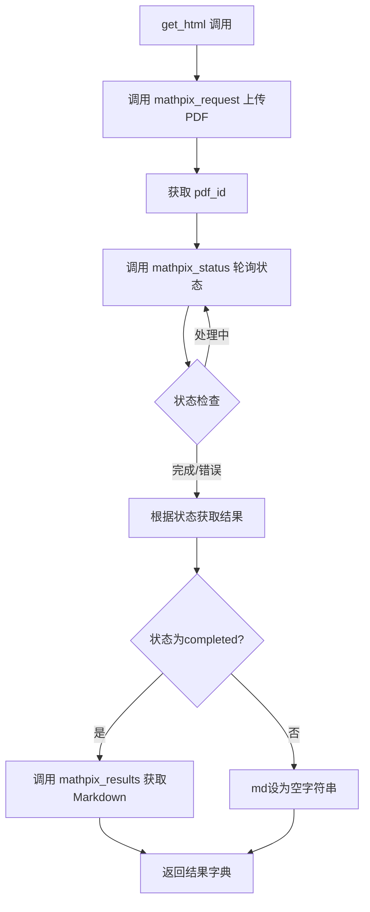
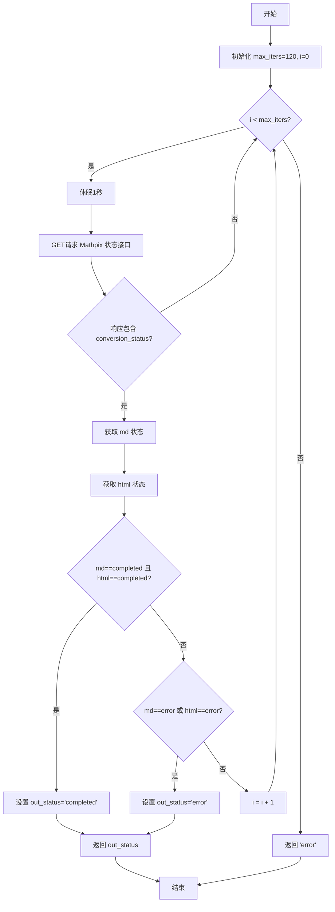
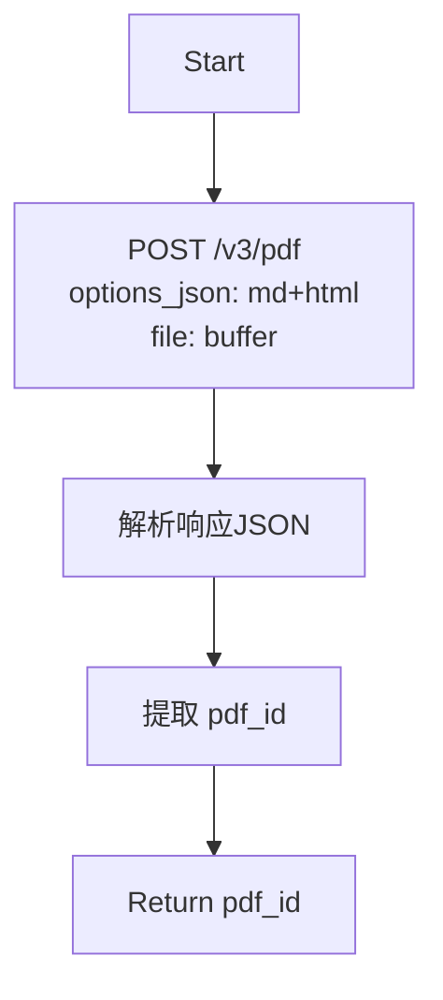

# `marker\benchmarks\overall\download\mathpix.py` 详细设计文档

该代码实现了一个PDF转Markdown的下载器MathpixDownloader，通过调用Mathpix API将PDF文件转换为Markdown格式，支持轮询等待转换完成并返回转换结果及耗时。

## 整体流程



## 类结构

```
Downloader (抽象基类)
└── MathpixDownloader
```

## 全局变量及字段


### `mathpix_request`
    
向Mathpix API发送PDF文件以进行转换，返回转换任务的PDF_ID

类型：`function`
    


### `mathpix_status`
    
轮询检查Mathpix转换任务的状态，等待PDF和HTML转换完成或出错

类型：`function`
    


### `mathpix_results`
    
从Mathpix API获取转换后的结果，支持获取Markdown或HTML格式的内容

类型：`function`
    


### `MathpixDownloader.service`
    
类属性，标识服务名称为mathpix

类型：`str`
    


### `MathpixDownloader.app_id`
    
实例属性（继承自父类），Mathpix API的应用ID

类型：`str`
    


### `MathpixDownloader.api_key`
    
实例属性（继承自父类），Mathpix API的应用程序密钥

类型：`str`
    
    

## 全局函数及方法


### `mathpix_request`

该函数负责将PDF文件发送到Mathpix API进行转换处理，获取异步处理任务的ID。

参数：

- `buffer`：`bytes`，PDF文件的字节内容，作为待转换的文件上传到Mathpix服务
- `headers`：`dict`，HTTP请求头，包含认证信息（app_id和app_key）

返回值：`str`，返回Mathpix API分配的PDF处理任务ID（pdf_id），用于后续查询转换状态和获取结果

#### 流程图

```mermaid
flowchart TD
    A[开始 mathpix_request] --> B[构建POST请求到 https://api.mathpix.com/v3/pdf]
    B --> C[设置请求头 headers]
    C --> D[构建请求数据: options_json转换格式为md和html]
    D --> E[将PDF文件buffer放入files参数]
    E --> F[发送POST请求]
    F --> G[接收响应 response]
    G --> H[解析JSON响应 data = response.json]
    H --> I[提取pdf_id = data['pdf_id']]
    I --> J[返回 pdf_id]
```

#### 带注释源码

```python
def mathpix_request(buffer, headers):
    """
    向Mathpix API发送PDF文件以进行格式转换
    
    Args:
        buffer: PDF文件的字节内容
        headers: 包含认证信息的HTTP请求头
    
    Returns:
        str: Mathpix服务分配的PDF处理任务ID
    """
    # 发送POST请求到Mathpix PDF转换接口
    response = requests.post(
        "https://api.mathpix.com/v3/pdf",  # Mathpix API v3版本的PDF端点
        headers=headers,                   # 传递认证头（app_id和app_key）
        data={
            # 转换选项：指定输出格式为Markdown和HTML
            "options_json": json.dumps(
                {
                    "conversion_formats": {
                        "md": True,   # 启用Markdown格式输出
                        "html": True  # 启用HTML格式输出
                    }
                }
            )
        },
        files={
            # PDF文件内容，键名为"file"
            "file": buffer
        }
    )
    
    # 解析响应JSON数据
    data = response.json()
    
    # 从响应中提取PDF处理任务ID
    # 该ID用于后续查询转换状态和获取结果
    pdf_id = data["pdf_id"]
    
    # 返回任务ID供后续函数使用
    return pdf_id
```


### `mathpix_status`

该函数用于轮询 Mathpix API 以获取 PDF 文档的转换状态，通过定期请求转换状态接口来检查 PDF 到 Markdown 和 HTML 的转换是否完成或出现错误。

参数：

- `pdf_id`：`str`，PDF 文档在 Mathpix 服务端生成的唯一标识符，用于查询转换状态
- `headers`：`dict`，包含认证信息的 HTTP 请求头，需包含 `app_id` 和 `app_key` 用于 API 身份验证

返回值：`str`，返回转换任务的最终状态，`"completed"` 表示转换成功完成，`"error"` 表示转换失败或超时

#### 流程图



#### 带注释源码

```python
def mathpix_status(pdf_id, headers):
    """
    轮询 Mathpix API 获取 PDF 转换状态
    
    参数:
        pdf_id: str, Mathpix API 返回的 PDF 唯一标识符
        headers: dict, 包含 app_id 和 app_key 的请求头
    
    返回:
        str: 转换状态，"completed" 或 "error"
    """
    # 最大轮询次数，避免无限循环
    max_iters = 120
    # 当前迭代计数器
    i = 0
    # 初始状态
    status = "processing"
    status2 = "processing"
    
    # 轮询循环，每秒检查一次转换状态
    while i < max_iters:
        # 休眠1秒，避免过于频繁的请求
        time.sleep(1)
        
        # 向 Mathpix 状态查询接口发送 GET 请求
        response = requests.get(f"https://api.mathpix.com/v3/converter/{pdf_id}",
            headers=headers
        )
        
        # 解析响应 JSON
        status_resp = response.json()
        
        # 如果响应中不包含 conversion_status 字段，继续等待
        if "conversion_status" not in status_resp:
            continue
        
        # 获取 Markdown 转换状态
        status = status_resp["conversion_status"]["md"]["status"]
        # 获取 HTML 转换状态
        status2 = status_resp["conversion_status"]["html"]["status"]
        
        # 检查两个转换是否都已完成
        if status == "completed" and status2 == "completed":
            break
        # 检查是否任一转换出现错误
        elif status == "error" or status2 == "error":
            break
        
        # 递增迭代计数器
        i += 1
    
    # 根据最终状态确定返回值
    out_status = "completed" if status == "completed" and status2 == "completed" else "error"
    return out_status
```


### `mathpix_results`

该函数用于从Mathpix API获取PDF转换后的结果（Markdown或HTML格式），通过GET请求根据pdf_id和文件扩展名获取对应的转换内容，并返回原始字节流。

参数：

- `pdf_id`：`str`，Mathpix API返回的PDF转换任务唯一标识ID，用于指定要获取结果的转换任务
- `headers`：`dict`，HTTP请求头，包含Mathpix API的认证信息（app_id和app_key）
- `ext`：`str`，可选参数，默认为"md"，指定要获取的文件扩展名（"md"表示Markdown，"html"表示HTML）

返回值：`bytes`，返回Mathpix API转换后的文档原始内容（字节流），调用方需要根据ext参数自行解码（如转换为UTF-8字符串）

#### 流程图

```mermaid
flowchart TD
    A[开始] --> B[接收pdf_id, headers, ext参数]
    B --> C[构建API URL: https://api.mathpix.com/v3/converter/{pdf_id}.{ext}]
    C --> D{发送GET请求}
    D --> E[接收response响应]
    E --> F[返回response.content字节流]
    F --> G[结束]
```

#### 带注释源码

```python
def mathpix_results(pdf_id, headers, ext="md"):
    """
    从Mathpix API获取PDF转换结果（Markdown或HTML格式）
    
    Args:
        pdf_id: Mathpix API返回的PDF转换任务ID
        headers: 包含认证信息的HTTP请求头
        ext: 文件扩展名，默认"md"（支持"md"或"html"）
    
    Returns:
        bytes: 转换后的文档原始字节流内容
    """
    # 发送GET请求到Mathpix API，根据pdf_id和ext获取对应格式的转换结果
    response = requests.get(
        f"https://api.mathpix.com/v3/converter/{pdf_id}.{ext}",  # 构建完整的API端点URL
        headers=headers  # 传递认证头信息
    )
    # 返回响应内容的原始字节流（未经解码的二进制数据）
    return response.content
```


### `MathpixDownloader.get_html`

该方法接收PDF文件的字节数据，通过Mathpix API服务将其转换为Markdown格式，并返回转换结果及耗时统计。

#### 参数

- `self`：`MathpixDownloader` 实例，类本身实例，包含了 `app_id` 和 `api_key` 属性用于API认证
- `pdf_bytes`：`bytes`，PDF文件的原始字节数据

#### 返回值

- `dict`，包含转换后的Markdown文本（`md`键）和请求耗时（`time`键，秒为单位）

#### 流程图

```mermaid
flowchart TD
    A[Start get_html] --> B[构建请求头<br/>app_id + api_key]
    B --> C[调用 mathpix_request<br/>上传PDF获取pdf_id]
    C --> D[提取 pdf_id]
    D --> E[调用 mathpix_status<br/>轮询转换状态]
    E --> F{status in<br/>['processing', 'error']?}
    F -->|是| G[md = 空字符串]
    F -->|否| H[调用 mathpix_results<br/>获取转换结果]
    G --> I[记录结束时间]
    H --> I
    I --> J{md 是 bytes?}
    J -->|是| K[md.decode utf-8]
    J -->|否| L[构建返回字典]
    K --> L
    L --> M[Return {md, time}]
```

#### 带注释源码

```python
def get_html(self, pdf_bytes):
    """
    将PDF字节转换为Markdown格式
    
    Args:
        pdf_bytes: PDF文件的字节数据
        
    Returns:
        dict: 包含转换后的Markdown文本和耗时
              {'md': str, 'time': float}
    """
    # 步骤1: 准备API认证头信息，从实例属性获取app_id和app_key
    headers = {
        "app_id": self.app_id,
        "app_key": self.api_key,
    }
    
    # 步骤2: 记录开始时间，用于计算API调用耗时
    start = time.time()
    
    # 步骤3: 调用mathpix_request函数上传PDF并获取pdf_id
    # 该函数会向 https://api.mathpix.com/v3/pdf 发送POST请求
    pdf_id = mathpix_request(pdf_bytes, headers)
    
    # 步骤4: 轮询检查转换状态
    # 会循环最多120次，每次间隔1秒
    status = mathpix_status(pdf_id, headers)
    
    # 步骤5: 根据状态决定获取结果还是返回空字符串
    if status in ["processing", "error"]:
        md = ""  # 转换失败或超时，返回空字符串
    else:
        # 转换成功，获取Markdown格式的转换结果
        md = mathpix_results(pdf_id, headers)
    
    # 步骤6: 记录结束时间并计算总耗时
    end = time.time()
    
    # 步骤7: 处理返回结果，若为bytes则解码为utf-8字符串
    if isinstance(md, bytes):
        md = md.decode("utf-8")

    # 步骤8: 返回包含Markdown内容和耗时的字典
    return {
        "md": md,
        "time": end - start
    }
```

### 关联函数

#### `mathpix_request`

上传PDF文件到Mathpix API并获取转换任务ID

**参数：**
- `buffer`：`bytes`，PDF文件的字节数据
- `headers`：`dict`，包含app_id和app_key的请求头

**返回值：** `str`，PDF转换任务的唯一标识符pdf_id

**流程图：**


**源码：**
```python
def mathpix_request(buffer, headers):
    """
    向Mathpix API提交PDF转换请求
    
    Args:
        buffer: PDF文件字节数据
        headers: API认证请求头
        
    Returns:
        str: 转换任务的pdf_id
    """
    # 发送POST请求到Mathpix PDF端点
    response = requests.post(
        "https://api.mathpix.com/v3/pdf",
        headers=headers,
        data={
            # 配置转换输出格式为Markdown和HTML
            "options_json": json.dumps({
                "conversion_formats": {
                    "md": True,
                    "html": True
                }
            })
        },
        files={
            "file": buffer  # PDF文件内容
        }
    )
    # 解析响应JSON并提取pdf_id
    data = response.json()
    pdf_id = data["pdf_id"]
    return pdf_id
```

#### `mathpix_status`

轮询检查PDF转换状态，直到完成或超时

**参数：**
- `pdf_id`：`str`，转换任务ID
- `headers`：`dict`，API认证请求头

**返回值：** `str`，转换状态（"completed" 或 "error"）

**源码：**
```python
def mathpix_status(pdf_id, headers):
    """
    轮询检查PDF转换状态
    
    Args:
        pdf_id: Mathpix返回的任务ID
        headers: API认证请求头
        
    Returns:
        str: 'completed' 或 'error'
    """
    max_iters = 120  # 最大轮询次数
    i = 0
    status = "processing"
    status2 = "processing"
    
    # 循环轮询直到完成或达到最大次数
    while i < max_iters:
        time.sleep(1)  # 每秒轮询一次
        response = requests.get(
            f"https://api.mathpix.com/v3/converter/{pdf_id}",
            headers=headers
        )
        status_resp = response.json()
        
        # 跳过无效响应
        if "conversion_status" not in status_resp:
            continue
            
        # 获取Markdown和HTML两种格式的转换状态
        status = status_resp["conversion_status"]["md"]["status"]
        status2 = status_resp["conversion_status"]["html"]["status"]
        
        # 两种格式都完成则退出循环
        if status == "completed" and status2 == "completed":
            break
        # 任一格式出错则退出循环
        elif status == "error" or status2 == "error":
            break
            
    # 返回最终状态
    out_status = "completed" if status == "completed" and status2 == "completed" else "error"
    return out_status
```

#### `mathpix_results`

获取转换后的结果内容

**参数：**
- `pdf_id`：`str`，转换任务ID
- `headers`：`dict`，API认证请求头
- `ext`：`str`，默认为"md"，指定返回格式

**返回值：** `bytes`，转换后的原始内容

**源码：**
```python
def mathpix_results(pdf_id, headers, ext="md"):
    """
    获取Mathpix转换结果
    
    Args:
        pdf_id: 转换任务ID
        headers: API认证请求头
        ext: 返回格式，默认md，可选html
        
    Returns:
        bytes: 转换后的原始内容
    """
    response = requests.get(
        f"https://api.mathpix.com/v3/converter/{pdf_id}.{ext}",
        headers=headers
    )
    return response.content
```

### 关键组件信息

| 组件名称 | 描述 |
|---------|------|
| `MathpixDownloader` | PDF转Markdown的下载器类，继承自`Downloader`基类 |
| `mathpix_request` | 负责PDF上传和任务创建 |
| `mathpix_status` | 负责轮询转换状态，支持Markdown和HTML两种格式 |
| `mathpix_results` | 负责获取转换后的内容 |
| API端点 `/v3/pdf` | Mathpix PDF转换入口 |
| API端点 `/v3/converter/{pdf_id}` | 状态查询和结果获取 |

### 潜在技术债务与优化空间

1. **同步阻塞轮询**：`mathpix_status`使用同步sleep轮询（最多120秒），期间阻塞线程，建议改为异步或回调机制
2. **缺乏重试机制**：网络请求失败时无重试逻辑，稳定性不足
3. **硬编码超时时间**：120次×1秒=120秒超时为硬编码，应作为可配置参数
4. **错误处理不足**：API返回非200状态码时未做处理，可能抛出异常
5. **状态判断逻辑冗余**：`status in ["processing", "error"]`的判断在`mathpix_status`已返回最终状态后显得冗余
6. **资源未释放**：未显式关闭requests会话，长时间运行可能产生连接泄漏

### 错误处理与异常设计

- **当前设计**：状态为"error"时返回空字符串md，调用方需自行判断处理
- **缺失**：未区分不同类型的错误（网络错误、API错误、转换失败等）
- **建议**：定义自定义异常类，如`MathpixAPIError`、`ConversionTimeoutError`等

### 设计约束

- 依赖外部Mathpix API服务，网络可用性要求高
- API密钥（app_id/app_key）由调用方通过实例属性注入
- 转换格式固定为Markdown和HTML两种


## 关键组件


### MathpixDownloader 类

负责将 PDF 文件提交到 Mathpix 服务进行转换的核心类，封装了与 Mathpix API 的交互流程。

### mathpix_request 函数

将 PDF 文件上传到 Mathpix API 并获取转换任务的 pdf_id，用于后续状态查询和结果获取。

### mathpix_status 函数

通过轮询机制检查 PDF 转换状态，支持 md 和 html 两种格式的转换状态，直到转换完成或达到最大迭代次数。

### mathpix_results 函数

根据 pdf_id 和文件扩展名从 Mathpix API 获取转换结果，支持获取 markdown 或 html 格式的内容。

### 状态轮询机制

使用最多 120 次、每次间隔 1 秒的轮询来等待 Mathpix 服务完成 PDF 到 Markdown/HTML 的转换。

### 响应处理与解码

将 API 返回的字节内容转换为 UTF-8 字符串，确保不同编码的转换结果能正确处理。


## 问题及建议


### 已知问题

-   **缺少异常处理**：代码未对网络请求进行 try-except 包装，API 请求失败时会直接抛出异常导致程序崩溃
-   **未验证 API 响应**：未检查 response.status_code，假设 API 总是返回成功响应，可能导致解析错误响应体时出现问题
-   **硬编码配置**：URL、max_iters=120、sleep 时间等配置硬编码在代码中，不利于配置管理
-   **轮询机制效率低**：使用固定 1 秒间隔轮询，未使用指数退避策略会增加 API 调用次数
-   **状态检查不完整**：status 和 status2 的检查逻辑存在缺陷，当一个完成另一个仍在处理时会继续等待
-   **缺少超时控制**：requests 请求未设置 timeout 参数，可能导致请求无限期等待
-   **错误处理不完善**：status_resp 中缺少 "conversion_status" 时使用 continue，但最终可能返回不准确的状态
-   **资源未正确释放**：未显式关闭 response 对象
-   **函数职责不清晰**：mathpix_request、mathpix_status、mathpix_results 作为全局函数与类耦合度低
-   **参数验证缺失**：未对 pdf_bytes、headers 等输入参数进行有效性校验

### 优化建议

-   添加完整的异常处理和重试机制，使用指数退避策略
-   验证 API 响应状态码，非 200 时抛出明确异常
-   将配置项提取到配置文件或类属性中
-   使用指数退避（exponential backoff）替代固定间隔轮询
-   增加超时参数：requests.get/post(..., timeout=30)
-   改进状态检查逻辑，当任意一个为 error 时立即返回
-   添加输入参数校验
-   考虑使用上下文管理器或显式关闭连接
-   将辅助函数封装为类方法或独立模块，提高内聚性
-   添加日志记录便于问题排查

## 其它


### 设计目标与约束

本模块旨在实现PDF到Markdown的转换功能，通过调用Mathpix API服务完成文档格式转换。设计约束包括：需遵守Mathpix API的速率限制和请求频率要求；PDF文件大小需符合API限制；转换过程为同步阻塞操作，需设置超时机制防止无限等待。

### 错误处理与异常设计

1. 网络异常：requests库可能抛出连接超时、SSL错误等异常
2. API响应异常：JSON解析失败、缺少必要字段（如pdf_id）
3. 转换失败：API返回error状态时的处理
4. 超时处理：mathpix_status函数中max_iters=120的限制
5. 当前实现缺少完善的异常捕获机制，建议增加try-except包裹关键API调用

### 数据流与状态机

PDF字节流转换流程：
1. 客户端调用get_html(pdf_bytes)入口
2. 调用mathpix_request上传PDF，获取pdf_id
3. 轮询mathpix_status检查转换状态（processing->completed/error）
4. 调用mathpix_results获取转换结果
5. 返回包含md内容和耗时的字典

状态机：initial -> processing -> completed/error

### 外部依赖与接口契约

1. Mathpix API v3版本
2. 依赖库：requests、json、time
3. 内部基类：benchmarks.overall.download.base.Downloader
4. API端点：
   - POST https://api.mathpix.com/v3/pdf (上传)
   - GET https://api.mathpix.com/v3/converter/{pdf_id} (状态)
   - GET https://api.mathpix.com/v3/converter/{pdf_id}.{ext} (结果)

### 性能考虑

1. 轮询间隔固定1秒，高并发场景可能造成资源浪费
2. 同步阻塞模式，建议支持异步或批量处理
3. 最大等待时间120秒，超时返回error状态

### 安全性考虑

1. app_id和api_key通过self.app_id和self.api_key传入，需确保安全存储
2. 建议使用环境变量或密钥管理系统
3. 当前代码中headers明文传输凭证，需确保HTTPS通信

### 配置管理

1. API端点硬编码，建议配置化
2. 超时参数max_iters、轮询间隔sleep时间建议可配置
3. 支持的转换格式（md、html）在options_json中定义

### 监控与日志

1. 当前仅返回time字段记录耗时
2. 建议增加请求日志、错误日志记录
3. 可添加转换成功率、API响应时间等Metrics

### 测试策略

1. 单元测试：mock requests库测试各函数逻辑
2. 集成测试：需mock Mathpix API或使用测试账号
3. 边界测试：大文件、空文件、损坏PDF、API超时等场景

### 部署注意事项

1. 需配置Mathpix账号的app_id和api_key
2. 注意API调用频率限制，避免被封禁
3. 建议部署在网络条件稳定的环境

### 版本兼容性

1. 依赖Python标准库和requests库
2. 需确认requests库版本兼容性
3. Mathpix API版本稳定性需关注

### 异常情况处理

1. PDF文件为空或格式错误
2. 网络中断后的重试机制
3. API返回格式变化时的容错处理
4. 并发调用时的pdf_id冲突风险

    