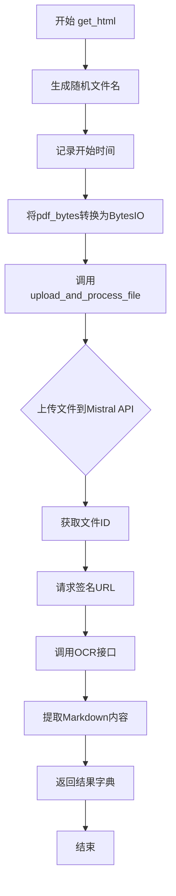

# `marker\benchmarks\overall\download\mistral.py` 详细设计文档

一个基于Mistral AI OCR API的PDF文档下载与内容提取工具类，通过将PDF文件上传至Mistral云端获取签名URL，再调用Mistral的OCR服务将PDF内容提取为Markdown格式，并返回提取结果与处理耗时。

## 整体流程



## 类结构

```
Downloader (抽象基类)
└── MistralDownloader
```

## 全局变量及字段


### `rand_name`
    
随机生成的PDF文件名

类型：`str`
    


### `start`
    
开始时间戳

类型：`float`
    


### `end`
    
结束时间戳

类型：`float`
    


### `buff`
    
PDF字节缓冲区

类型：`io.BytesIO`
    


### `md`
    
OCR识别的Markdown内容

类型：`str/bytes`
    


### `MistralDownloader.service`
    
Mistral服务标识

类型：`str`
    
    

## 全局函数及方法


### `upload_and_process_file`

该函数实现将PDF文件上传至Mistral云端服务，通过文件上传接口获取文件ID，随后申请签名URL用于OCR识别，最后调用Mistral OCR接口提取PDF内容并返回Markdown格式文本。

参数：

- `api_key`：`str`，Mistral API的认证令牌，用于所有API请求的Authorization头
- `fname`：`str`，上传文件的随机名称，通常为带时间戳的PDF文件名（如`{timestamp}.pdf`）
- `buff`：文件对象（`BytesIO`），包含PDF文件的二进制数据

返回值：`str`，返回OCR识别后的Markdown文本内容

#### 流程图

```mermaid
flowchart TD
    A[开始 upload_and_process_file] --> B[构建认证请求头]
    B --> C[构建上传文件请求: file+purpose]
    C --> D[POST上传文件到 Mistral /v1/files]
    D --> E{上传是否成功}
    E -->|失败| F[raise_for_status 抛出异常]
    E -->|成功| G[提取 file_id]
    G --> H[构建获取签名URL请求]
    H --> I[GET /v1/files/{file_id}/url?expiry=24]
    I --> J{获取URL是否成功}
    J -->|失败| F
    J -->|成功| K[提取 signed_url]
    K --> L[构建OCR请求体]
    L --> M[POST /v1/ocr 调用OCR服务]
    M --> N{OCR请求是否成功}
    N -->|失败| F
    N -->|成功| O[提取 result.pages[0].markdown]
    O --> P[返回 Markdown 字符串]
    P --> Z[结束]
```

#### 带注释源码

```python
def upload_and_process_file(api_key: str, fname: str, buff):
    """
    上传PDF文件到Mistral API并获取OCR识别后的Markdown文本
    
    Args:
        api_key: Mistral API认证密钥
        fname: 上传文件的名称
        buff: 包含PDF二进制数据的BytesIO对象
    
    Returns:
        str: OCR识别后的Markdown格式文本
    """
    
    # 第一步：构建基础认证头，使用Bearer Token方式
    headers = {
        "Authorization": f"Bearer {api_key}"
    }

    # 第二步：准备上传文件请求
    # 复制基础认证头作为上传请求头
    upload_headers = headers.copy()
    # 构建files字典：file字段包含文件名、文件内容、Content-Type
    # purpose字段固定为'ocr'，表示此次上传用于OCR任务
    files = {
        'file': (fname, buff, 'application/pdf'),
        'purpose': (None, 'ocr')
    }

    # 第三步：上传PDF文件到Mistral文件服务
    # POST https://api.mistral.ai/v1/files
    upload_response = requests.post(
        'https://api.mistral.ai/v1/files',
        headers=upload_headers,
        files=files
    )
    # 检查HTTP响应状态，若失败则抛出异常
    upload_response.raise_for_status()
    # 从响应JSON中提取上传后生成的文件ID
    file_id = upload_response.json()['id']

    # 第四步：获取文件签名URL（用于OCR服务访问文件）
    # 复制认证头并添加Accept头
    url_headers = headers.copy()
    url_headers["Accept"] = "application/json"

    # GET https://api.mistral.ai/v1/files/{file_id}/url?expiry=24
    # expiry=24表示签名URL有效期24小时
    url_response = requests.get(
        f'https://api.mistral.ai/v1/files/{file_id}/url?expiry=24',
        headers=url_headers
    )
    url_response.raise_for_status()
    # 提取签名的临时访问URL
    signed_url = url_response.json()['url']

    # 第五步：调用OCR服务识别PDF内容
    # 准备OCR请求头，添加Content-Type
    ocr_headers = headers.copy()
    ocr_headers["Content-Type"] = "application/json"

    # 构建OCR请求数据
    # model: 指定使用最新的Mistral OCR模型
    # document: 引用前面获取的签名URL
    # include_image_base64: True表示返回图片的Base64编码
    ocr_data = {
        "model": "mistral-ocr-latest",
        "document": {
            "type": "document_url",
            "document_url": signed_url
        },
        "include_image_base64": True
    }
    
    # POST https://api.mistral.ai/v1/ocr
    ocr_response = requests.post(
        'https://api.mistral.ai/v1/ocr',
        headers=ocr_headers,
        json=ocr_data
    )
    ocr_response.raise_for_status()
    
    # 第六步：从OCR响应中提取Markdown内容
    # OCR结果包含多页，此处取第一页的markdown
    result = ocr_response.json()
    return result["pages"][0]["markdown"]
```


### `MistralDownloader.get_html`

该方法接收PDF字节数据，通过Mistral API上传文件并调用OCR服务将PDF内容提取为Markdown格式，同时返回处理耗时信息。

参数：

- `self`：`MistralDownloader`，类的实例本身
- `pdf_bytes`：`bytes`，PDF文件的字节数据

返回值：`dict`，包含提取的Markdown文本和处理耗时，结构为 `{"md": str, "time": float}`

#### 流程图

```mermaid
flowchart TD
    A[开始 get_html] --> B[生成随机文件名: time.time() + '.pdf']
    B --> C[记录开始时间 start]
    C --> D[创建 BytesIO 缓冲区: io.BytesIO(pdf_bytes)]
    D --> E[调用 upload_and_process_file 上传并OCR]
    E --> F[记录结束时间 end]
    F --> G{检查 md 是否为 bytes?}
    G -->|是| H[解码为 UTF-8 字符串]
    G -->|否| I[直接使用]
    H --> J[构建返回字典]
    I --> J
    J --> K[返回结果 {'md': md, 'time': end-start}]
    K --> L[结束]
```

#### 带注释源码

```python
def get_html(self, pdf_bytes):
    """
    将PDF字节数据通过Mistral API转换为Markdown格式
    
    参数:
        pdf_bytes: PDF文件的字节数据
    
    返回:
        包含Markdown内容和处理耗时的字典
    """
    # 生成随机文件名，使用时间戳确保唯一性
    rand_name = str(time.time()) + ".pdf"
    # 记录处理开始时间
    start = time.time()
    # 将PDF字节转换为BytesIO缓冲区对象
    buff = io.BytesIO(pdf_bytes)
    # 调用上传和处理函数，将PDF上传至Mistral并执行OCR
    md = upload_and_process_file(self.api_key, rand_name, buff)
    # 记录处理结束时间
    end = time.time()
    # 如果返回的markdown是bytes类型，则解码为utf-8字符串
    if isinstance(md, bytes):
        md = md.decode("utf-8")

    # 返回包含Markdown内容和处理耗时的字典
    return {
        "md": md,
        "time": end - start,
    }
```

## 关键组件


### MistralDownloader 类

核心的PDF处理类，继承自Downloader，负责协调PDF字节到Markdown的转换流程。通过调用upload_and_process_file函数实现文件上传、签名URL获取和OCR处理的完整链路。

### upload_and_process_file 函数

核心业务逻辑函数，封装了与Mistral AI API的完整交互流程。包含三个主要阶段：文件上传获取file_id、获取签名URL、执行OCR提取Markdown。支持异常捕获和错误传播。

### API交互模块

实现与Mistral AI的RESTful API通信，包含三个关键HTTP请求：POST /files用于文件上传、GET /files/{id}/url用于获取签名URL、POST /ocr用于执行OCR识别。所有请求都携带Bearer Token认证。

### 错误处理机制

通过requests库的raise_for_status()方法自动捕获HTTP错误，并在请求失败时抛出异常。调用方需要处理可能的网络异常和API错误。

### 数据流处理

使用io.BytesIO封装PDF字节为文件类对象，支持流式上传。OCR结果通过JSON解析提取pages[0].markdown字段，返回最终的Markdown文本内容。


## 问题及建议


### 已知问题

-   **硬编码API端点**：URL `https://api.mistral.ai/v1/files` 和 `https://api.mistral.ai/v1/ocr` 硬编码在代码中，缺乏灵活性，无法适应不同环境
-   **缺少请求超时**：所有 `requests.post` 和 `requests.get` 调用均未设置 `timeout` 参数，可能导致请求无限期等待
-   **无重试机制**：网络请求失败时没有重试逻辑，降低了系统的容错能力
-   **魔法数字**：expiry=24 使用魔法数字且无注释说明含义
-   **响应解析无防御**：直接使用 `upload_response.json()['id']`、`url_response.json()['url']`、`result["pages"][0]["markdown"]` 访问字典键，若API返回格式不符预期会导致 KeyError
-   **未使用连接复用**：每次请求都创建新的HTTP连接，未使用 `requests.Session()` 复用连接池，影响性能
-   **日志缺失**：没有任何日志记录，难以追踪请求状态和排查问题
-   **异常处理不足**：虽然调用了 `raise_for_status()`，但未进行 try-except 包装，异常信息不够友好
-   **时间精度不足**：使用 `time.time()` 计时，可能受系统时间调整影响

### 优化建议

-   将API端点提取为配置项或环境变量，支持多环境切换
-   为所有requests调用添加合理超时（如 `timeout=30`）
-   引入重试机制（如使用 `tenacity` 库或手动重试）处理临时性网络故障
-   将 "24" 定义为具名常量并添加注释说明单位（小时）
-   使用 `.get()` 方法或预先验证API响应结构，避免 KeyError
-   使用 `requests.Session()` 复用TCP连接，提升性能
-   引入日志框架（如 `logging`）记录关键节点信息
-   捕获并自定义异常类型，提供更有意义的错误信息
-   考虑使用 `time.perf_counter()` 或 `time.monotonic()` 进行更精确的时间测量

## 其它


### 设计目标与约束

本模块旨在实现一个PDF文档OCR识别功能，通过调用Mistral AI的OCR API将PDF文件转换为Markdown格式文本。设计约束包括：1) 依赖Mistral AI官方API，需有效的API Key；2) API请求存在网络延迟，需合理处理超时；3) PDF文件大小受Mistral API限制；4) 仅支持单页PDF的OCR处理（返回pages[0]）。

### 错误处理与异常设计

代码中使用了`raise_for_status()`来捕获HTTP错误，但错误处理不够完善。需补充的错误处理场景包括：1) 网络连接超时处理；2) API返回错误码时的具体异常信息；3) PDF字节为空或无效时的校验；4) JSON解析失败的处理；5) API Key无效或过期的认证错误处理。建议封装自定义异常类如`MistralOCRException`，并区分可重试错误（如网络超时）和不可重试错误（如认证失败）。

### 数据流与状态机

数据流如下：PDF字节输入 → 生成随机文件名 → 调用upload_and_process_file → 上传文件到Mistral获取file_id → 获取签名URL → 调用OCR接口 → 解析返回结果提取Markdown。整个流程为同步阻塞模式，无复杂状态机，仅包含"上传中"→"获取URL中"→"OCR处理中"→"完成/失败"的基本状态转换。

### 外部依赖与接口契约

核心外部依赖为Mistral AI API v1，包含三个接口：1) POST /v1/files - 文件上传接口，接受file和purpose参数，返回file_id；2) GET /v1/files/{file_id}/url - 获取签名URL，expiry参数控制过期时间；3) POST /v1/ocr - OCR识别接口，model固定为"mistral-ocr-latest"，返回pages数组。内部依赖包括requests库用于HTTP请求，io.BytesIO用于内存文件处理。接口契约要求调用方传入有效的api_key、pdf_bytes和fname参数。

### 安全性考虑

代码中存在安全改进空间：1) API Key通过Authorization Header传输，需确保传输层使用HTTPS；2) 签名URL有效期为24小时，可考虑缩短以提高安全性；3) 错误响应可能泄露敏感信息，需统一处理；4) 建议添加请求重试机制时设置最大重试次数防止无限循环；5) buff参数直接接收字节流，需验证是否为有效的PDF格式。

### 性能考虑

当前实现为同步阻塞模式，性能优化方向：1) 可考虑使用异步HTTP客户端（如aiohttp）提升并发处理能力；2) OCR处理时间作为返回值暴露，可用于性能监控和优化；3) 签名URL获取后可缓存复用（如果处理同一文件）；4) 大文件上传可考虑分片上传；5) 可添加请求超时参数避免无限等待。

### 配置与可扩展性

可配置项包括：1) API端点URL（当前硬编码）；2) OCR模型版本（当前固定为mistral-ocr-latest）；3) 签名URL过期时间（当前24小时）；4) 请求超时时间（当前无超时设置）；5) include_image_base64参数控制是否返回图片Base64。扩展方向：1) 支持多页PDF处理并返回所有页Markdown；2) 支持直接传入文件URL而非字节；3) 支持自定义OCR选项；4) 可抽象基类以支持其他OCR服务商。

### 测试策略

建议测试覆盖：1) 单元测试：模拟upload_and_process_file各阶段响应；2) 集成测试：使用Mock API Key测试完整流程；3) 异常测试：模拟网络超时、API错误、无效输入等场景；4) 性能测试：测量OCR响应时间；5) 边界测试：空PDF、超大PDF、无效API Key等。

### 部署注意事项

部署时需注意：1) 需配置有效的Mistral API Key，建议使用环境变量管理；2) 网络要求能访问api.mistral.ai域名；3) 建议设置请求超时防止挂起；4) 需监控API调用配额和费用；5) 日志记录需包含请求ID便于追踪；6) 考虑API限流情况，必要时添加重试退避策略。

### 监控与日志

建议添加监控指标：1) OCR处理成功率；2) 各阶段耗时（上传、URL获取、OCR）；3) API调用次数和配额使用；4) 错误类型分布。日志记录建议包含：请求ID、文件名称、处理结果、耗时信息，并注意不要记录敏感的API Key信息。
    