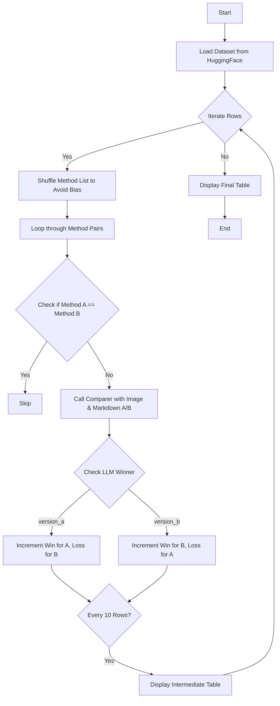
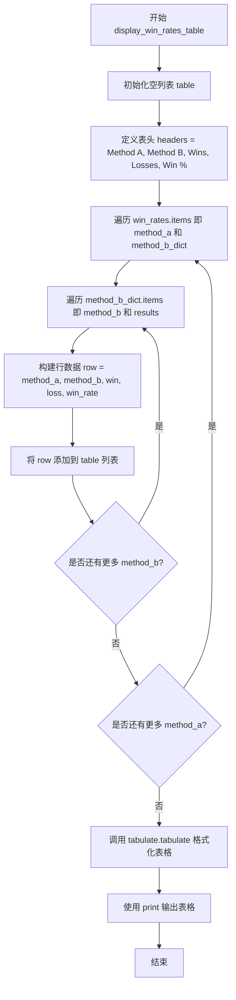
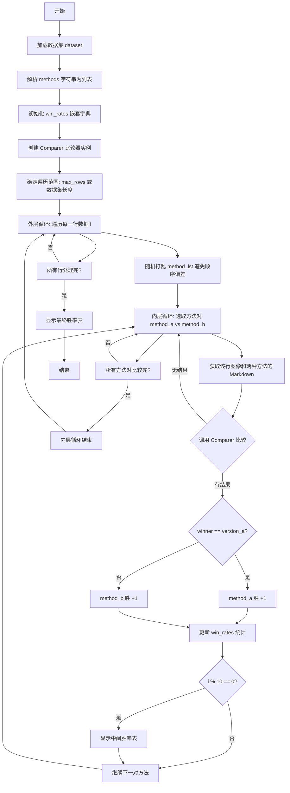
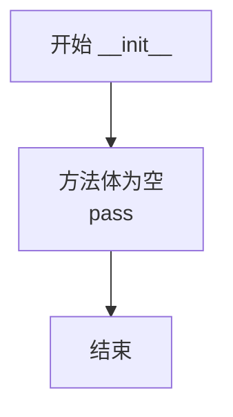
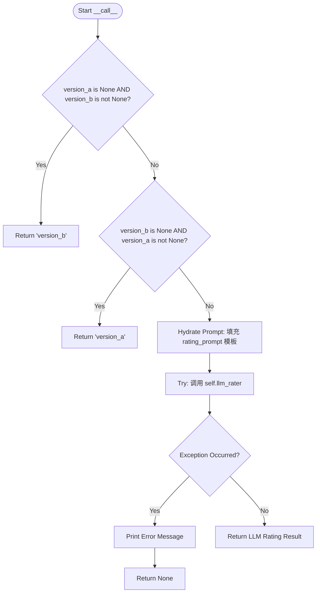
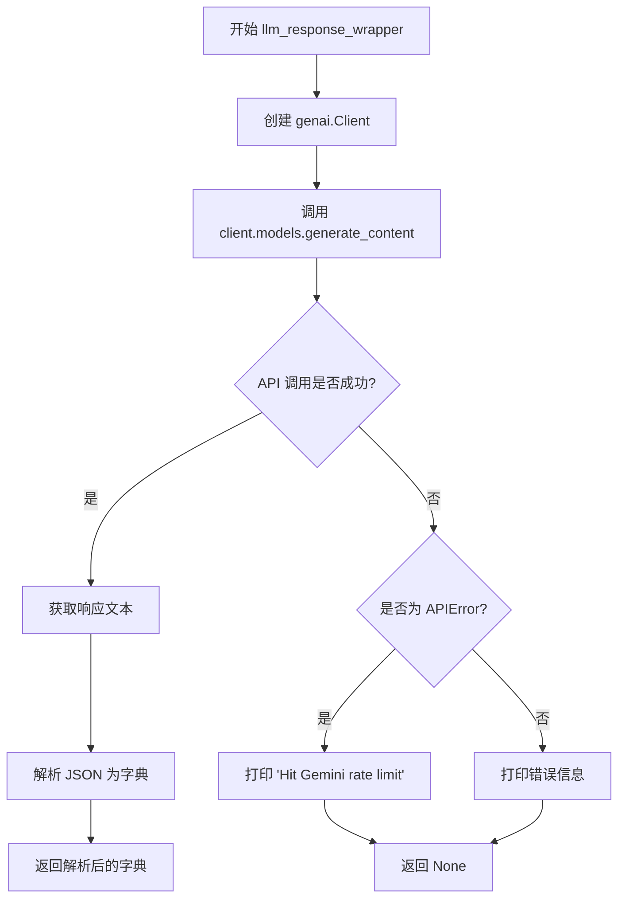

# `marker\benchmarks\overall\elo.py` 详细设计文档

A command-line tool that evaluates and compares the quality of markdown outputs generated by different document conversion methods (e.g., Marker, Mathpix) against their corresponding source images using Google's Gemini LLM, calculating pairwise win rates to determine the most effective conversion strategy.

## 整体流程



## 类结构

```
Global Scope
├── rating_prompt (Global Template String)
├── ComparerSchema (Pydantic Model)
├── Comparer (Comparison Logic Class)
│   ├── llm_response_wrapper (API Interaction)
│   ├── llm_rater (Prompting Logic)
│   └── __call__ (Entry Point)
├── display_win_rates_table (Utility)
└── main (CLI Entry Point)
```

## 全局变量及字段


### `rating_prompt`
    
用于指导LLM比较两个markdown版本的系统提示词模板，包含评估标准、示例输入输出格式

类型：`str`
    


### `ComparerSchema.ComparerSchema.image_description`
    
LLM对输入图片内容的文字描述

类型：`str`
    


### `ComparerSchema.ComparerSchema.version_a_description`
    
LLM对版本A生成的markdown内容的描述

类型：`str`
    


### `ComparerSchema.ComparerSchema.version_b_description`
    
LLM对版本B生成的markdown内容的描述

类型：`str`
    


### `ComparerSchema.ComparerSchema.comparison`
    
LLM对版本A和版本B的对比分析结果

类型：`str`
    


### `ComparerSchema.ComparerSchema.winner`
    
比较结果获胜方标识，值为version_a或version_b

类型：`Literal['version_a', 'version_b']`
    
    

## 全局函数及方法


### `display_win_rates_table`

该函数用于将胜率统计字典格式化为美观的表格并打印输出，它遍历输入的胜率数据，计算每个方法组合的胜率百分比，并使用 tabulate 库以可读表格形式展示所有方法两两对比的结果。

参数：

- `win_rates`：`dict`，一个嵌套字典结构，外层键为方法 A 的名称，值为方法 B 到胜负统计的映射（如 `{method_a: {method_b: {"win": int, "loss": int}}}`）

返回值：`None`，该函数直接打印表格到标准输出，不返回任何值

#### 流程图



#### 带注释源码

```python
def display_win_rates_table(win_rates: dict):
    """
    将胜率统计字典格式化为表格并打印
    
    参数:
        win_rates: 嵌套字典，结构为 {method_a: {method_b: {"win": int, "loss": int}}}
                   存储方法两两对比的胜负次数
    
    返回:
        None (直接打印到标准输出)
    """
    # 初始化表格数据存储列表
    table = []
    
    # 定义表格列标题
    headers = ["Method A", "Method B", "Wins", "Losses", "Win %"]
    
    # 外层循环：遍历所有方法A（作为比较的基准方法）
    for method_a, method_b_dict in win_rates.items():
        # 内层循环：遍历方法A对应的所有方法B（作为对比方法）
        for method_b, results in method_b_dict.items():
            # 构建表格行数据：[方法A, 方法B, 胜场数, 负场数, 胜率百分比]
            row = [
                method_a,                                    # 方法A名称
                method_b,                                    # 方法B名称
                results["win"],                              # 方法A对方法B的胜场数
                results["loss"],                             # 方法A对方法B的负场数
                (results["win"] / (results["win"] + results["loss"])) * 100  # 胜率百分比计算
            ]
            # 将当前行添加到表格数据中
            table.append(row)
    
    # 使用tabulate库格式化并打印表格，tablefmt="pretty"使用美观格式
    print(tabulate.tabulate(table, headers=headers, tablefmt="pretty"))
```


### `main`

该函数是命令行工具的入口点，用于计算文档转换方法之间的胜率。它加载指定的数据集，对数据集中的每一行图像，比较不同方法（如marker、mathpix等）生成的Markdown版本，通过LLM评判优劣，累积统计各方法之间的胜负关系，最终输出胜率表格。

参数：

- `dataset`：`str`，要加载的数据集名称
- `methods`：`str`，要比较的方法列表，逗号分隔（如"marker,mathpix"）
- `row_samples`：`int`，每行样本数（默认值2）
- `max_rows`：`int`，要处理的最大行数（默认None，表示处理整个数据集）

返回值：`None`，该函数为Click命令行命令，不返回值

#### 流程图



#### 带注释源码

```python
@click.command("Calculate win rates for document conversion methods")
@click.argument("dataset", type=str)
@click.option("--methods", type=str, help="List of methods to compare: comma separated like marker,mathpix")
@click.option("--row_samples", type=int, default=2, help="Number of samples per row")
@click.option("--max_rows", type=int, default=None, help="Maximum number of rows to process")
def main(
    dataset: str,
    methods: str,
    row_samples: int,
    max_rows: int
):
    """命令行主函数：计算文档转换方法的胜率"""
    
    # 1. 加载HuggingFace数据集
    ds = datasets.load_dataset(dataset, split="train")
    
    # 2. 将逗号分隔的方法字符串转换为列表
    # 例如: "marker,mathpix" -> ["marker", "mathpix"]
    method_lst = methods.split(",")
    
    # 3. 初始化嵌套字典存储胜率统计
    # 结构: {method_a: {method_b: {"win": x, "loss": y}}}
    win_rates = {m: defaultdict(lambda: defaultdict(int)) for m in method_lst}
    
    # 4. 创建Comparer实例用于LLM评判
    comparer = Comparer()
    
    # 5. 确定要处理的行数：若max_rows为None，则处理整个数据集
    max_rows = max_rows or len(ds)

    # 6. 主循环：遍历数据集中的每一行
    for i in tqdm(range(max_rows), desc="Calculating win rates..."):
        row = ds[i]
        
        # 7. 随机打乱方法列表，避免因固定顺序导致的评判偏差
        random.shuffle(method_lst)

        # 8. 嵌套循环：遍历所有方法对组合
        for j, method_a in enumerate(method_lst[:-1]):
            for z, method_b in enumerate(method_lst[j:]):
                # 跳过相同方法的比较
                if method_a == method_b:
                    continue

                # 9. 获取该行图像和两种方法的Markdown结果
                # 数据集字段格式: {method_name}_md
                method_a_md = row[f"{method_a}_md"]
                method_b_md = row[f"{method_b}_md"]
                
                # 10. 调用Comparer获取LLM评判的胜者
                # 返回 "version_a", "version_b" 或 None
                winner = comparer(row["img"], method_a_md, method_b_md)
                if not winner:
                    continue

                # 11. 根据胜者更新统计结果
                # 注意: winner是version_a时，意味着method_a获胜
                if winner == "version_a":
                    win_rates[method_a][method_b]["win"] += 1
                    win_rates[method_b][method_a]["loss"] += 1
                else:
                    win_rates[method_b][method_a]["win"] += 1
                    win_rates[method_a][method_b]["loss"] += 1
        
        # 12. 每10行显示一次中间结果，方便监控进度
        if i % 10 == 0:
            display_win_rates_table(win_rates)

    # 13. 循环结束后显示最终胜率表
    display_win_rates_table(win_rates)
```


### `Comparer.__init__`

初始化 Comparer 类的新实例。该方法目前没有任何实现逻辑（pass），作为类的构造函数占位符存在。

参数： 无显式参数（仅包含隐式参数 `self`）

返回值：`None`，Python 中 `__init__` 方法隐式返回 `None`

#### 流程图



#### 带注释源码

```python
def __init__(self):
    """
    初始化 Comparer 类的新实例。
    
    此方法目前没有执行任何操作，仅作为类的构造函数占位符。
    在后续实现中，可以在此处初始化类所需的属性，如：
    - API 客户端配置
    - 评分模型设置
    - 缓存机制等
    
    Args:
        self: 指向类实例本身的引用
        
    Returns:
        None: __init__ 方法不应有返回值，Python 会自动处理实例的创建
    """
    pass
```


### `Comparer.__call__`

实现类的可调用接口（`__call__`魔术方法），允许将 `Comparer` 实例作为函数调用。该方法接收一张图像和两个 Markdown 版本，首先处理边界情况（当某一版本为空时直接返回另一版本），然后将版本内容填充至评分提示模板中，调用 LLM 进行对比评估，并返回获胜的版本标识符。

参数：

- `self`：隐藏参数，代表 `Comparer` 类的实例本身。
- `img`：`Image.Image`，待比较的原始文档图像对象。
- `version_a`：`str`，第一个待比较的 Markdown 版本内容。
- `version_b`：`str`，第二个待比较的 Markdown 版本内容。

返回值：`str | None`，返回 `"version_a"` 或 `"version_b"` 表示比较的获胜方；如果发生异常或处理失败则返回 `None`。

#### 流程图



#### 带注释源码

```python
def __call__(
    self,
    img: Image.Image,
    version_a: str,
    version_b: str
) -> str | None:
    # 边界处理：如果版本 A 为空且版本 B 存在，则 B 获胜
    if version_a is None and version_b is not None:
        return "version_b"
    # 边界处理：如果版本 B 为空且版本 A 存在，则 A 获胜
    elif version_b is None and version_a is not None:
        return "version_a"

    # 准备提示词：将两个版本的 Markdown 填入全局的 rating_prompt 模板
    hydrated_prompt = rating_prompt.replace("{{version_a}}", version_a).replace("{{version_b}}", version_b)
    
    try:
        # 调用内部 LLM 评分器获取结果
        rating = self.llm_rater(img, hydrated_prompt)
    except Exception as e:
        # 捕获所有异常，打印错误并返回 None
        print(f"Error: {e}")
        return
    
    # 返回评分结果（'version_a' 或 'version_b'）
    return rating
```


### `Comparer.llm_rater`

该方法接收文档图片和提示词，调用 `llm_response_wrapper` 与 LLM 进行交互，验证返回的 JSON 结构中包含 `winner` 字段，并最终返回比较的胜出者标识（"version_a" 或 "version_b"）。

参数：
- `img`：`Image.Image`，待评估的文档页面图片，作为判断 Markdown 质量的视觉标准。
- `prompt`：`str`，经过变量替换（填充了 version_a 和 version_b 内容）的完整提示词。

返回值：`str`，返回值为 "version_a" 或 "version_b" 之一，代表 LLM 判断为更好的文档转换版本。

#### 流程图

```mermaid
graph TD
    A[Start llm_rater] --> B[调用 llm_response_wrapper]
    B --> C{获取响应 response}
    C -->|响应为 None| D[TypeError: 'NoneType' object is not subscriptable]
    C -->|响应有效| E{断言 'winner' in response}
    E -->|失败| F[AssertionError]
    E -->|成功| G[返回 response['winner']]
```

#### 带注释源码

```python
def llm_rater(self, img: Image.Image, prompt: str):
    """
    使用 LLM 对两个 Markdown 版本进行评分，并返回获胜者。

    Args:
        img: PIL Image 对象，待分析的文档图片。
        prompt: str，包含待比较内容的提示词。

    Returns:
        str: "version_a" 或 "version_b"，表示胜出的版本。
    """
    # 调用 llm_response_wrapper 方法，传入图片和提示词，并指定响应格式为 ComparerSchema
    # 该方法会向 Google Gemini API 发送请求，并期望返回一个符合 ComparerSchema 定义的字典
    response = self.llm_response_wrapper(
        [img, prompt],
        ComparerSchema
    )
    
    # 断言响应结果中包含 'winner' 键
    # 注意：如果 llm_response_wrapper 内部发生异常返回了 None，这里会抛出 TypeError
    assert "winner" in response, f"Response missing 'winner' key: {response}"
    
    # 从响应字典中提取 'winner' 字段并返回
    return response["winner"]
```


### `Comparer.llm_response_wrapper`

该方法是一个 LLM 响应包装器，用于调用 Google Gemini API 生成内容，并将响应解析为指定的 JSON 格式。它接收提示和响应模式作为输入，通过 genai 客户端与 Gemini 模型交互，处理 API 错误和异常，最终返回解析后的 JSON 对象或 None。

参数：

- `prompt`：`Any`，提示内容，可以是单个字符串或包含图像和文本的列表
- `response_schema`：`Type[BaseModel]`，Pydantic 响应模式类，用于指定期望的输出结构

返回值：`Dict | None`，成功时返回解析后的 JSON 字典，失败时返回 None

#### 流程图



#### 带注释源码

```python
def llm_response_wrapper(
    self,
    prompt,
    response_schema,
):
    """
    包装 LLM API 调用的方法
    
    参数:
        prompt: 提示内容，可以是包含图像和文本的列表
        response_schema: Pydantic 模型类，定义响应结构
    
    返回:
        解析后的 JSON 字典，或失败时返回 None
    """
    # 初始化 Google Gemini 客户端
    # 使用 Vertex AI 配置，从环境变量读取项目 ID 和位置
    # 设置超时为 60000 毫秒（60秒）
    client = genai.Client(
        http_options={"timeout": 60000},
        vertexai=True,
        project=os.getenv("VERTEX_PROJECT_ID"),
        location=os.getenv("VERTEX_LOCATION"),
    )
    
    try:
        # 调用 Gemini 模型生成内容
        # 使用 gemini-2.0-flash-001 模型
        # temperature 设为 0 以获得确定性输出
        # response_schema 指定输出格式
        # response_mime_type 设为 application/json
        responses = client.models.generate_content(
            model="gemini-2.0-flash-001",
            contents=prompt,
            config={
                "temperature": 0,
                "response_schema": response_schema,
                "response_mime_type": "application/json",
            },
        )
        
        # 从响应中提取文本内容
        output = responses.candidates[0].content.parts[0].text
        
        # 解析 JSON 字符串为 Python 字典
        return json.loads(output)
    
    # 处理 Gemini API 速率限制错误
    except APIError as e:
        print(f"Hit Gemini rate limit")
        return
    
    # 处理其他所有异常
    except Exception as e:
        print(f"Error: {e}")
        return
```

## 关键组件


### Comparer 类

核心比较逻辑类，负责使用 LLM 比较两个版本的 markdown 转换质量。该类封装了图像与 markdown 比对的完整流程，包括提示词填充、LLM 调用和结果解析。

### ComparerSchema 数据模型

Pydantic 数据模型，定义了 LLM 输出结果的验证结构。包含 image_description、version_a_description、version_b_description、comparison 和 winner 字段，确保返回结果符合预期格式。

### rating_prompt 提示词模板

预定义的系统提示词，包含详细的评估标准和示例。指导 LLM 从整体质量、文本质量、格式质量、表格、表单、公式、列表和图像等维度比较两个 markdown 版本。

### llm_response_wrapper 方法

LLM API 调用的包装方法，负责与 Google Gemini API 交互。配置了超时时间、温度为 0、JSON 响应格式等参数，并处理 API 错误和异常情况。

### llm_rater 方法

评分执行方法，调用 LLM 获取比较结果并验证输出格式。确保返回结果包含 winner 键，否则抛出断言错误。

### display_win_rates_table 函数

胜率统计表格显示函数，将各方法的胜负统计格式化为美观的表格输出。使用 tabulate 库生成易于阅读的表格格式。

### main CLI 函数

命令行入口点，负责加载数据集、初始化比较器、遍历样本并计算各方法间的胜率。实现了随机顺序比较以避免偏差，并定期显示中间结果。

### win_rates 数据结构

嵌套字典数据结构，用于存储各方法之间的胜负统计。使用 defaultdict 实现自动初始化，结构为 {method_a: {method_b: {win: int, loss: int}}}。

## 问题及建议


### 已知问题

- **API 客户端重复初始化**：`Comparer.llm_response_wrapper` 方法在每次调用时都创建新的 `genai.Client` 实例，导致不必要的性能开销和资源浪费
- **空构造函数**：`Comparer.__init__` 方法为空，未用于初始化客户端或其他资源
- **静默失败与异常处理**：API 错误被捕获后仅打印消息并返回 `None`，调用方无法区分是成功返回空还是发生错误，可能导致数据丢失或统计不准确
- **硬编码配置**：模型名称 `"gemini-2.0-flash-001"` 和超时时间 `60000` 毫秒被硬编码，缺乏配置灵活性
- **除零风险**：`display_win_rates_table` 中计算胜率时未检查 `win + loss` 是否为零，可能导致运行时崩溃
- **输入假设缺乏校验**：代码直接访问数据集行中的 `method_a_md`、`method_b_md` 等字段，未验证必要字段是否存在
- **日志不规范**：使用 `print` 语句而非标准日志框架，不利于生产环境下的调试和监控
- **缺乏重试机制**：API 调用失败（如 rate limit）时直接跳过，未实现指数退避等重试策略
- **随机性不可控**：`random.shuffle(method_lst)` 在每次循环中调用，影响结果可复现性
- **无请求超时全局配置**：虽然设置了 60 秒超时，但未通过参数暴露给用户自定义

### 优化建议

- **单例客户端模式**：将 `genai.Client` 的初始化移至 `Comparer.__init__` 或使用模块级单例，避免重复创建
- **完善错误处理**：使用自定义异常类或返回包含状态的 Result 对象（如 `Optional[Dict]` 改为 `Tuple[bool, str]`），区分不同失败原因
- **配置外部化**：将模型名称、超时时间等参数提取至命令行参数或配置文件（如从 `marker.settings` 读取）
- **防御性编程**：在 `display_win_rates_table` 中添加 `if (win + loss) > 0` 检查，在访问数据集字段前进行存在性校验
- **引入日志框架**：使用 `logging` 模块替代 `print`，支持不同日志级别和格式配置
- **添加重试逻辑**：使用 `tenacity` 库为 API 调用添加自动重试，设置指数退避策略应对临时性故障
- **随机种子固定**：将随机种子作为命令行选项或配置项传入，确保实验可复现
- **结果缓存**：对于相同输入的对比，可考虑添加结果缓存机制减少 API 调用次数

## 其它


### 设计目标与约束

本工具旨在通过自动化方式评估不同文档到markdown转换方法的质量，通过人类反馈的方式比较两种方法生成的markdown结果，帮助开发者选择最优的文档转换方案。设计约束包括：依赖Google Gemini 2.0 Flash API进行评估、需要预转换好的markdown结果数据集、评估过程需要消耗API配额、结果受API响应质量和随机性影响。

### 错误处理与异常设计

代码中包含多层次错误处理机制。在`Comparer.llm_response_wrapper`方法中，使用try-except捕获`APIError`处理Gemini速率限制情况，捕获通用`Exception`处理其他未知错误，两者均返回`None`表示评估失败。在`Comparer.__call__`方法中，当API调用异常时打印错误信息并返回`None`。在主循环中，通过`if not winner: continue`跳过失败的比较。整个设计采用优雅降级策略，允许部分比较失败而不中断整体流程。

### 数据流与状态机

数据流从HuggingFace数据集加载开始，经过方法配对生成（避免重复比较和顺序偏见）、调用Gemini API进行二元比较、累积胜负统计、最终输出胜率表格。状态转换包括：初始化状态（加载数据）→配对迭代状态→API调用状态→结果处理状态→统计更新状态。核心循环采用嵌套循环遍历所有方法对，并使用`random.shuffle`打乱顺序以消除位置偏差。

### 外部依赖与接口契约

核心外部依赖包括：`google.genai`库用于Gemini API调用、`datasets`库用于加载HuggingFace数据集、`PIL`库用于图像处理、`tabulate`库用于表格展示、`click`库用于CLI构建、`pydantic`用于数据验证。接口契约方面，`Comparer`类接受PIL Image对象和两个markdown字符串作为输入，返回`Literal["version_a", "version_b"]`或`None`。数据集格式要求包含`{method}_md`格式的字段和`img`字段。

### 性能考虑与优化空间

当前实现存在以下性能瓶颈和优化空间：每次比较都创建新的`genai.Client`实例造成资源浪费，应改为单例或复用client；API超时设置为60秒可能过长；缺少批量处理能力，逐条调用API效率低下；胜率统计使用嵌套defaultdict可能导致内存占用较高。建议优化方向包括：连接池复用、批量API调用、缓存机制、并行处理等。

### 安全性考虑

代码涉及的环境变量包括`VERTEX_PROJECT_ID`和`VERTEX_LOCATION`，用于Google Cloud项目认证。敏感信息未硬编码而是依赖环境变量，符合安全最佳实践。但需要注意：API密钥不应写入日志、错误信息可能泄露敏感上下文、数据集内容可能包含隐私信息。建议增加环境变量存在性检查和敏感信息过滤机制。

### 配置管理

当前配置通过`click`命令行参数传递，包括数据集名称、方法列表、每行样本数、最大行数。API配置通过环境变量管理（`VERTEX_PROJECT_ID`、`VERTEX_LOCATION`），模型选择硬编码为`gemini-2.0-flash-001`，超时设置为60000毫秒。设计目标建议将可配置参数提取到独立配置文件或环境变量，支持不同部署场景的灵活配置。

### 日志与监控

当前仅使用`print`进行基本输出，缺少结构化日志。建议增加日志级别控制（DEBUG、INFO、WARNING、ERROR）、日志格式标准化、关键指标埋点（API调用次数、成功率、响应时间）、异常告警机制。可集成`logging`模块或`structlog`进行企业级日志管理，便于生产环境问题排查和性能监控。

### 测试策略建议

当前代码缺少测试覆盖。建议补充单元测试：测试`ComparerSchema`数据验证、测试`Comparer.__call__`各种边界条件（双空、单空、正常）、测试`display_win_rates_table`输出格式。集成测试：模拟Gemini API响应测试完整流程、使用mock数据集测试CLI参数解析。性能测试：大规模数据集下的吞吐量和资源消耗测试。

### 部署与运维建议

部署形态为命令行工具，适合在有GPU环境的服务器上运行。建议提供Docker容器化部署方案、编写启动脚本和参数说明文档、配置定时任务实现自动化评估流程、输出结果持久化存储（JSON/CSV）便于历史对比分析、监控API配额消耗和使用成本。
    