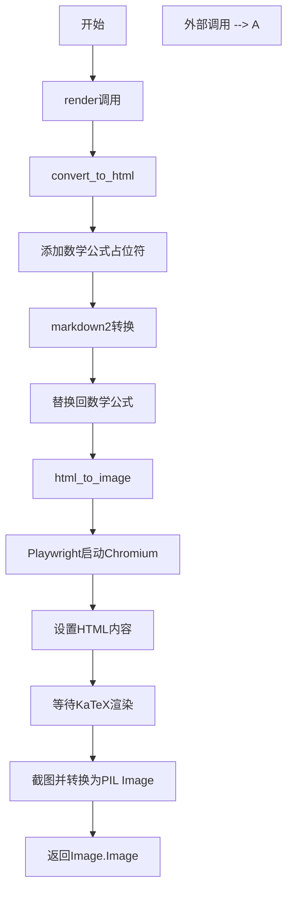
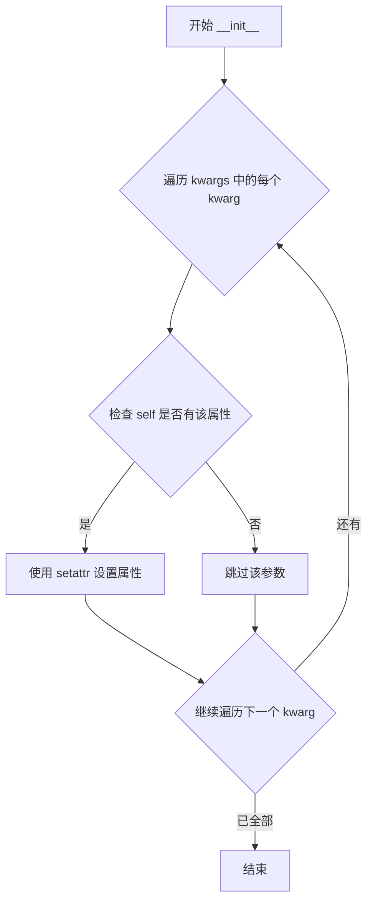
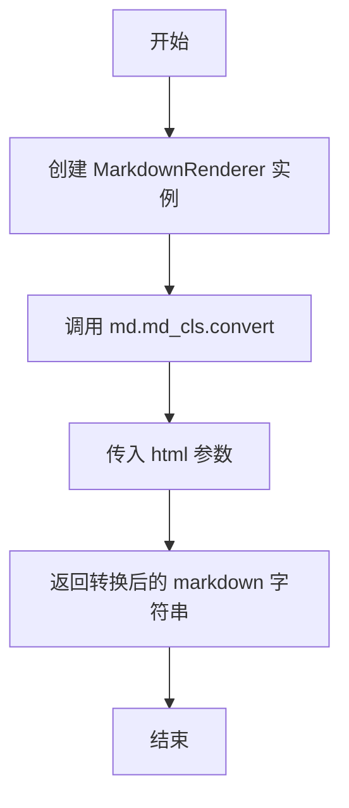
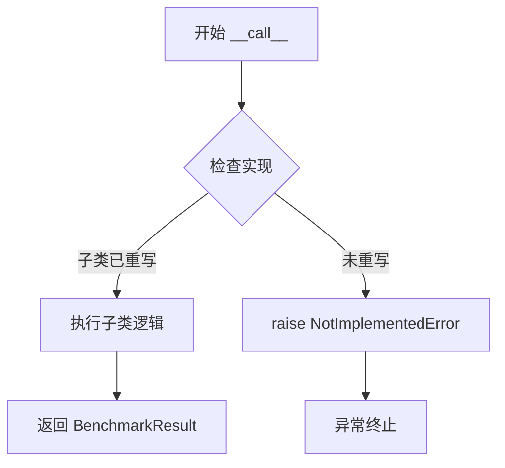
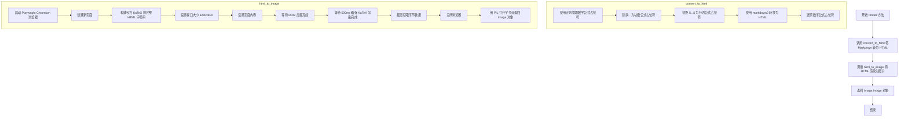
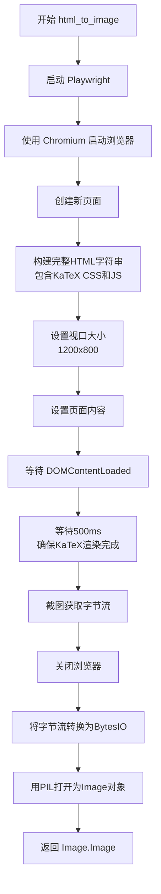

# `marker\benchmarks\overall\methods\__init__.py` 详细设计文档

该代码定义了一个BaseMethod基类，提供了将Markdown文本转换为HTML并渲染为图像的完整流程，特别处理了LaTeX数学公式的占位符替换和KaTeX渲染，适用于文档/论文的自动化图像生成场景。

## 整体流程



## 类结构

```
BaseMethod (基类)
├── __init__ (初始化)
├── convert_to_md (HTML转Markdown-静态方法)
├── __call__ (抽象方法)
├── render (渲染流程入口)
├── convert_to_html (Markdown转HTML-静态方法)
└── html_to_image (HTML转图像)
```

## 全局变量及字段


    

## 全局函数及方法


### `BaseMethod.convert_to_html.block_sub`

该函数是 `BaseMethod` 类中 `convert_to_html` 方法的内部函数，作为正则表达式替换的回调函数使用。其核心功能是将 Markdown 中的块级数学公式（用 `$$...$$` 包裹）替换为临时占位符，以便后续在 HTML 渲染时正确处理数学公式。

参数：

- `match`：`re.Match`，正则表达式匹配对象，包含被 `r'\${2}(.*?)\${2}'` 匹配到的文本信息，其中 `match.group(1)` 获取第一个捕获组（即 `$$` 内部的数学公式内容）

返回值：`str`，返回一个格式为 `1BLOCKMATH{数字}1` 的占位符字符串，用于在 HTML 转换期间临时替换块级数学公式

#### 流程图

```mermaid
flowchart TD
    A[开始 block_sub 函数] --> B[从 match 对象提取 group 1 内容]
    B --> C[生成占位符: 1BLOCKMATH{当前列表长度}1]
    C --> D[将占位符和原始数学公式添加到 block_placeholders 列表]
    D --> E[返回占位符字符串]
    E --> F[结束函数]
    
    style A fill:#f9f,color:#333
    style F fill:#9f9,color:#333
```

#### 带注释源码

```python
def block_sub(match):
    """
    正则表达式替换回调函数，用于处理 Markdown 中的块级数学公式（$$...$$）
    
    该函数作为 re.sub() 的替换函数使用，将匹配到的块级数学公式
    替换为临时占位符，以避免在 markdown2 转换过程中被错误处理
    """
    # 从正则匹配对象中提取第一个捕获组的内容（即 $$ 之间的数学公式内容）
    content = match.group(1)
    
    # 生成唯一的占位符字符串，格式为 "1BLOCKMATH{索引}1"
    # 使用数字索引确保每个块级数学公式都有唯一的占位符
    placeholder = f"1BLOCKMATH{len(block_placeholders)}1"
    
    # 将占位符与原始的块级数学公式（带 $$ 符号）保存到列表中
    # 稍后在 HTML 转换完成后，这些占位符将被替换回原始的数学公式
    block_placeholders.append((placeholder, f"$${content}$$"))
    
    # 返回占位符，re.sub() 会用这个占位符替换原始匹配的文本
    return placeholder
```


### `BaseMethod.convert_to_html.inline_sub`

该函数是 `BaseMethod` 类中 `convert_to_html` 静态方法的内部嵌套函数，用于匹配 Markdown 文本中的内联数学公式（单美元符号 `$...$` 包裹的内容），并将其替换为占位符，以防止 markdown2 库处理数学公式时出现错误，最后在 HTML 生成后再将占位符替换回数学公式。

参数：

- `match`：`re.Match`，正则表达式匹配对象，包含被匹配的内联数学公式内容

返回值：`str`，返回生成的占位符字符串

#### 流程图

```mermaid
flowchart TD
    A[接收 match 对象] --> B[提取匹配内容: match.group(1)]
    B --> C[生成占位符: 1INLINEMATH{len(inline_placeholders)}1]
    C --> D[将占位符和数学公式存入 inline_placeholders 列表]
    D --> E[返回占位符字符串]
```

#### 带注释源码

```python
def inline_sub(match):
    # 提取正则匹配到的内联数学公式内容（位于单美元符号之间）
    content = match.group(1)
    
    # 生成唯一的占位符字符串，格式为 "1INLINEMATH{数字}1"
    placeholder = f"1INLINEMATH{len(inline_placeholders)}1"
    
    # 将占位符与原始数学公式（添加美元符号）存入列表
    # 稍后在 HTML 中替换回原始数学公式
    inline_placeholders.append((placeholder, f"${content}$"))
    
    # 返回占位符，用于替换原始的数学公式文本
    return placeholder
```


### `BaseMethod.__init__`

这是 `BaseMethod` 类的构造函数，通过遍历传入的关键字参数（kwargs），检查类是否已具有同名的属性，若存在则将参数值设置为实例属性，从而实现灵活的实例初始化配置。

参数：

- `**kwargs`：`Any`，关键字参数，用于设置已存在于类定义中的实例属性

返回值：`None`，构造函数不返回值

#### 流程图



#### 带注释源码

```python
def __init__(self, **kwargs):
    """
    初始化 BaseMethod 实例。
    
    遍历传入的关键字参数，仅当实例（self）已具有同名的类属性时，
    才会将该参数值设置为实例属性。这种设计允许子类定义默认属性，
    同时支持通过构造函数覆盖这些默认值。
    
    参数:
        **kwargs: 关键字参数，用于设置已存在于类定义中的实例属性
    """
    # 遍历所有传入的关键字参数
    for kwarg in kwargs:
        # 检查当前实例是否已经具有该属性（通常在类定义中声明）
        if hasattr(self, kwarg):
            # 使用 setattr 将 kwargs 中的值设置为实例属性
            setattr(self, kwarg, kwargs[kwarg])
```


### `BaseMethod.convert_to_md`

该方法是一个静态方法，用于将 HTML 字符串转换为 Markdown 格式。它创建 MarkdownRenderer 实例，并调用其内部的转换方法完成格式转换。

参数：

-  `html`：`str`，需要转换的 HTML 字符串

返回值：`str`，转换后的 Markdown 字符串

#### 流程图



#### 带注释源码

```python
@staticmethod
def convert_to_md(html: str):
    """
    将 HTML 字符串转换为 Markdown 格式
    
    参数:
        html: str - 输入的 HTML 字符串
    
    返回:
        str - 转换后的 Markdown 字符串
    """
    # 创建 MarkdownRenderer 实例用于转换
    md = MarkdownRenderer()
    
    # 调用 Markdown 类的 convert 方法将 HTML 转换为 Markdown
    markdown = md.md_cls.convert(html)
    
    # 返回转换后的 Markdown 字符串
    return markdown
```


### `BaseMethod.__call__`

这是 `BaseMethod` 类的抽象方法，作为执行基准测试的主入口。该方法旨在由子类重写以实现对输入样本的具体处理逻辑。当前实现仅抛出 `NotImplementedError`，表明需要由具体实现类提供实际功能。

参数：

- `self`：隐式参数，类的实例本身
- `sample`：需要处理的输入样本，具体类型取决于子类的实现要求

返回值：`BenchmarkResult`，处理样本后返回的基准测试结果，包含性能指标和评估数据

#### 流程图



#### 带注释源码

```python
def __call__(self, sample) -> BenchmarkResult:
    """
    抽象调用方法，由子类实现具体逻辑
    
    参数:
        sample: 输入的样本数据，具体类型由子类定义
        
    返回:
        BenchmarkResult: 包含基准测试结果的对象
        
    异常:
        NotImplementedError: 当子类未重写此方法时抛出
    """
    raise NotImplementedError()
```


### `BaseMethod.render`

该方法接收 Markdown 字符串作为输入，依次调用 `convert_to_html` 将其转换为 HTML，再调用 `html_to_image` 使用 Playwright 浏览器引擎渲染 HTML 为图片，最终返回 PIL Image 对象。

参数：

- `markdown`：`str`，需要渲染的 Markdown 文本内容

返回值：`Image.Image`，渲染后的图片对象（PIL Image）

#### 流程图



#### 带注释源码

```python
def render(self, markdown: str):
    """
    将 Markdown 渲染为图片
    
    参数:
        markdown: str, 输入的 Markdown 文本
        
    返回:
        Image.Image, 渲染后的图片对象
    """
    # 步骤1: 将 Markdown 转换为 HTML
    # 调用静态方法 convert_to_html 处理数学公式和 Markdown 语法
    html = self.convert_to_html(markdown)
    
    # 步骤2: 将 HTML 渲染为图片
    # 使用 Playwright 启动无头浏览器，注入 KaTeX 渲染数学公式
    # 返回 PIL Image 对象
    return self.html_to_image(html)
```


### `BaseMethod.convert_to_html`

该方法是一个静态方法，用于将Markdown文本转换为HTML，同时处理LaTeX数学公式的渲染。它通过临时占位符机制避免markdown2转换过程中对数学公式符号的误处理，最后将占位符还原为原始的LaTeX格式。

参数：

- `md`：`str`，待转换的Markdown文本，可能包含使用`$...$`（行内）和`$$...$$`（块级）标记的LaTeX数学公式

返回值：`str`，转换后的HTML字符串，数学公式以LaTeX格式保留（供后续KaTeX渲染）

#### 流程图

```mermaid
flowchart TD
    A[开始: 接收Markdown字符串] --> B[初始化占位符列表<br/>block_placeholders和inline_placeholders]
    B --> C[定义block_sub函数<br/>匹配$$...$$块级公式]
    C --> D[定义inline_sub函数<br/>匹配$...$行内公式]
    D --> E[使用正则替换块级公式为占位符<br/>re.sub with re.DOTALL]
    E --> F[使用正则替换行内公式为占位符]
    F --> G[调用markdown2.markdown转换<br/>extras=['tables']]
    G --> H[遍历block_placeholders<br/>将块级占位符还原为LaTeX]
    H --> I[遍历inline_placeholders<br/>将行内占位符还原为LaTeX]
    I --> J[返回HTML字符串]
```

#### 带注释源码

```python
@staticmethod
def convert_to_html(md: str):
    """
    将Markdown文本转换为HTML，处理LaTeX数学公式
    通过占位符机制避免markdown2对数学符号的误解析
    """
    # 用于存储块级公式($$...$$)的占位符及其原始内容
    block_placeholders = []
    # 用于存储行内公式($...$)的占位符及其原始内容
    inline_placeholders = []

    # 定义块级公式替换回调函数
    # 匹配 $$content$$ 格式的块级数学公式
    def block_sub(match):
        content = match.group(1)  # 提取公式内容（不含$$）
        # 生成唯一占位符，使用1BLOCKMATH前缀+索引+1后缀
        placeholder = f"1BLOCKMATH{len(block_placeholders)}1"
        # 存储占位符与原始LaTeX格式的映射关系
        block_placeholders.append((placeholder, f"$${content}$$"))
        return placeholder

    # 定义行内公式替换回调函数
    # 匹配 $content$ 格式的行内数学公式
    def inline_sub(match):
        content = match.group(1)  # 提取公式内容（不含$）
        # 生成唯一占位符，使用1INLINEMATH前缀+索引+1后缀
        placeholder = f"1INLINEMATH{len(inline_placeholders)}1"
        # 存储占位符与原始LaTeX格式的映射关系
        inline_placeholders.append((placeholder, f"${content}$"))
        return placeholder

    # 使用正则表达式将Markdown中的块级公式($$...$$)替换为占位符
    # re.DOTALL标志使.可以匹配换行符，确保多行公式能正确捕获
    md = re.sub(r'\${2}(.*?)\${2}', block_sub, md, flags=re.DOTALL)
    # 使用正则表达式将行内公式($...$)替换为占位符
    md = re.sub(r'\$(.*?)\$', inline_sub, md)

    # 调用markdown2库将Markdown转换为HTML
    # 使用'tables' extra支持表格语法
    html = markdown2.markdown(md, extras=['tables'])

    # 第一轮还原：将块级公式的占位符替换回原始LaTeX格式
    for placeholder, math_str in block_placeholders:
        html = html.replace(placeholder, math_str)
    
    # 第二轮还原：将行内公式的占位符替换回原始LaTeX格式
    for placeholder, math_str in inline_placeholders:
        html = html.replace(placeholder, math_str)

    # 返回处理完成的HTML字符串，数学公式以LaTeX形式保留
    return html
```


### `BaseMethod.html_to_image`

该方法接收HTML字符串，使用Playwright启动Chromium浏览器渲染页面（含KaTeX数学公式支持），等待页面加载和数学公式渲染完成后，对整个页面进行截图，最终将截图字节流转换为PIL Image对象返回。

参数：

- `html`：`str`，需要转换为图像的HTML内容字符串

返回值：`Image.Image`，返回一个PIL库的Image对象，表示渲染后的页面截图

#### 流程图



#### 带注释源码

```python
def html_to_image(self, html: str) -> Image.Image:
    """
    将HTML内容渲染为图像
    
    参数:
        html: str - HTML字符串，包含需要渲染的内容（支持KaTeX数学公式）
    
    返回:
        Image.Image - PIL图像对象
    """
    # 使用Playwright的同步上下文管理器，确保浏览器资源正确释放
    with sync_playwright() as p:
        # 启动Chromium浏览器实例
        browser = p.chromium.launch()
        
        # 创建新的浏览器页面
        page = browser.new_page()
        
        # 构建完整的HTML文档字符串，包含KaTeX相关资源
        # KaTeX是一个快速的数学排版库，用于在网页中渲染LaTeX数学公式
        html_str = f"""
        <!DOCTYPE html>
        <html>
            <head>
                <!-- KaTeX CSS样式 -->
                <link rel="stylesheet" href="https://cdn.jsdelivr.net/npm/katex@0.16.21/dist/katex.min.css" integrity="sha384-zh0cIslj+VczCZtlzBcjt5ppRcsAmDnRem7ESsYwWwg3m/OaJ2l4x7YBZl9Kxxib" crossorigin="anonymous">
                <!-- KaTeX主脚本，defer属性延迟加载以提高页面渲染速度 -->
                <script defer src="https://cdn.jsdelivr.net/npm/katex@0.16.21/dist/katex.min.js" integrity="sha384-Rma6DA2IPUwhNxmrB/7S3Tno0YY7sFu9WSYMCuulLhIqYSGZ2gKCJWIqhBWqMQfh" crossorigin="anonymous"></script>
                <!-- KaTeX自动渲染扩展，用于自动渲染页面中的数学公式 -->
                <script defer src="https://cdn.jsdelivr.net/npm/katex@0.16.21/dist/contrib/auto-render.min.js" integrity="sha384-hCXGrW6PitJEwbkoStFjeJxv+fSOOQKOPbJxSfM6G5sWZjAyWhXiTIIAmQqnlLlh" crossorigin="anonymous"></script>
            </head>
            <body>
                <!-- 注入HTML内容 -->
                {html}
                <!-- 配置KaTeX自动渲染的JavaScript代码 -->
                <script>
                document.addEventListener("DOMContentLoaded", function() {{
                    renderMathInElement(document.body, {{
                        delimiters: [
                            {{left: '$$', right: '$$', display: true}},  # 行间公式
                            {{left: '$', right: '$', display: false}}    # 行内公式
                        ],
                        throwOnError : false  # 渲染错误时不抛出异常
                    }});
                }});
                </script>
            </body>
        </html>
        """.strip()
        
        # 设置视口大小为1200x800像素
        page.set_viewport_size({"width": 1200, "height": 800})
        
        # 将HTML内容加载到页面中
        page.set_content(html_str)
        
        # 等待DOM内容加载完成
        page.wait_for_load_state("domcontentloaded")
        
        # 额外等待500毫秒，确保KaTeX有足够时间渲染数学公式
        # 这是一个经验值，用于处理异步加载的KaTeX渲染
        page.wait_for_timeout(500)
        
        # 对整个页面进行截图，返回字节流
        screenshot_bytes = page.screenshot(full_page=True)
        
        # 关闭浏览器，释放资源
        browser.close()

    # 将截图字节流转换为BytesIO对象，再用PIL打开为Image对象
    return Image.open(io.BytesIO(screenshot_bytes))
```

## 关键组件


### BaseMethod 类

核心基类，封装了Markdown转图像的完整流程，支持数学公式（LaTeX）渲染和HTML转图像功能。

### convert_to_md 方法

静态方法，将HTML字符串转换为Markdown格式，调用MarkdownRenderer实现转换。

### convert_to_html 方法

将Markdown转换为HTML的核心方法，包含数学公式占位符处理逻辑，使用正则表达式识别块级和内联数学公式，用占位符替换后转换，最后还原为LaTeX格式。

### html_to_image 方法

使用Playwright浏览器引擎将HTML渲染为PIL Image对象，集成了KaTeX库用于数学公式渲染，设置视口尺寸为1200x800，等待DOM加载和KaTeX渲染完成后截图。

### 块级数学公式处理

使用正则表达式`\${2}(.*?)\${2}`匹配$$...$$格式的块级公式，生成唯一占位符并在转换后还原。

### 内联数学公式处理

使用正则表达式`\$ (.*?)\$`匹配$...$格式的内联公式，生成唯一占位符并在转换后还原。

### KaTeX 集成

通过CDN引入KaTeX CSS和JS库，配合auto-render扩展自动渲染页面中的数学公式，配置分隔符和错误处理选项。

### Playwright 浏览器自动化

使用sync_playwright同步API启动Chromium浏览器，创建新页面，设置内容并截图，支持完整的网页渲染能力。

### 图像输出

返回PIL Image对象，使用io.BytesIO将截图字节流转换为图像，支持进一步处理或保存。


## 问题及建议


### 已知问题

- **Playwright 资源泄漏风险**：`html_to_image` 方法中 `browser.close()` 在异常情况下可能不会被调用，导致浏览器进程未正确关闭
- **重复启动浏览器性能开销**：每次调用 `html_to_image` 都会启动新的 Chromium 实例，未复用浏览器上下文，效率低下
- **硬编码配置缺乏灵活性**：视口尺寸（1200x800）、KaTeX 版本号（0.16.21）、加载超时（500ms）均为硬编码，无法动态配置
- **正则表达式占位符冲突风险**：`convert_to_html` 中使用 `len(block_placeholders)` 和 `len(inline_placeholders)` 作为占位符索引，在复杂嵌套场景下可能产生冲突
- **缺乏错误处理与重试机制**：网络请求（CDN 加载 KaTeX）、页面渲染失败时无异常捕获和重试逻辑
- **外部 CDN 依赖无容错**：完全依赖 jsdelivr CDN，无本地 fallback，CDN 不可用时整个功能失败
- **HTML 拼接安全性**：使用 f-string 直接拼接 HTML 字符串，存在潜在的 XSS 风险（尽管在内部工具场景中风险较低）
- **静态方法副作用**：`convert_to_html` 虽为静态方法，但内部定义的 `block_sub` 和 `inline_sub` 依赖外部列表状态，不是纯函数

### 优化建议

- **使用上下文管理器**：将 Playwright 浏览器生命周期封装为上下文管理器，确保资源正确释放
- **浏览器实例复用**：在类级别或模块级别维护单一浏览器实例，复用 page 对象或使用浏览器池
- **配置外部化**：将 KaTeX 版本、视口尺寸、超时时间等配置提取为类属性或构造函数参数
- **改进占位符策略**：使用 UUID 或更唯一的前缀避免占位符冲突，或采用 AST 解析替代正则替换
- **添加错误处理**：对网络请求添加 try/except 和重试机制，对页面加载失败提供明确错误信息
- **本地资源 fallback**：考虑捆绑 KaTeX 本地资源或提供备用 CDN
- **性能优化**：将固定 500ms 等待改为等待特定 DOM 元素或 KaTeX 渲染完成事件
- **代码解耦**：将 `convert_to_html` 拆分为纯函数，减少副作用，提高可测试性

## 其它


### 设计目标与约束

该模块的设计目标是将包含数学公式（LaTeX）的Markdown文档转换为图像输出。核心约束包括：使用Playwright作为渲染引擎，依赖KaTeX进行数学公式的客户端渲染，要求输出图像的分辨率为1200x800像素，Markdown转换使用markdown2库并支持表格扩展。

### 错误处理与异常设计

代码中存在的异常处理包括：__call__方法抛出NotImplementedError，html_to_image方法使用try-with-resources结构。潜在异常场景包括：Markdown解析失败、HTML渲染超时、KaTeX渲染超时（固定等待500ms可能不足）、Playwright浏览器启动失败、页面加载失败、截图失败等。建议增加异常捕获、降级策略和重试机制。

### 数据流与状态机

数据流经过以下阶段：输入Markdown字符串 → 占位符替换（保护数学公式）→ markdown2转换为HTML → 占位符还原为LaTeX → Playwright加载HTML → KaTeX渲染数学公式 → 页面截图 → PIL解码为Image对象。状态转换包括：初始化态、HTML渲染态、页面加载态、渲染完成态、截图完成态。

### 外部依赖与接口契约

外部依赖包括：markdown2（版本未指定）用于Markdown转HTML，KaTeX 0.16.21（通过CDN）用于数学公式渲染，Playwright（sync_api）用于浏览器自动化，PIL（Pillow）用于图像处理。接口契约方面：convert_to_md为静态方法接受str返回str，render方法接受str返回PIL.Image，convert_to_html为静态方法接受str返回str，html_to_image接受str返回Image.Image。

### 性能考虑与优化空间

当前实现的性能瓶颈包括：每次调用都启动新的浏览器实例，开销巨大；固定等待500ms可能过长或不足；full_page=True可能导致图像尺寸不可控。优化建议：实现浏览器实例池或单例模式；使用动态等待而非固定超时；考虑按需裁剪页面尺寸；添加渲染结果缓存机制。

### 资源管理与生命周期

当前使用sync_playwright()作为上下文管理器管理浏览器生命周期，但存在风险：异常发生时browser.close()可能不被调用导致进程泄漏。建议使用try-finally确保资源释放，或考虑使用异步上下文管理器增强异常处理的健壮性。

### 配置与参数设计

当前硬编码参数包括：viewport尺寸（1200x800）、KaTeX版本（0.16.21）、渲染超时（500ms）、CSS和JS的CDN地址。设计建议：将这些参数提取为类属性或配置文件，支持通过构造函数注入配置，实现参数可测试性和灵活性。

### 线程安全性分析

该类未实现任何线程安全机制。sync_playwright在多线程环境下共享实例会导致竞态条件。建议：每个线程使用独立的浏览器实例，或实现线程本地存储（threading.local），或提供线程安全的实例化方法。

### 日志与监控设计

代码中未包含日志记录功能。建议添加：渲染各阶段的耗时日志、异常发生时的详细堆栈信息、KaTeX渲染失败的非致命错误日志、性能指标采集（浏览器启动时间、页面加载时间、渲染时间）。
    