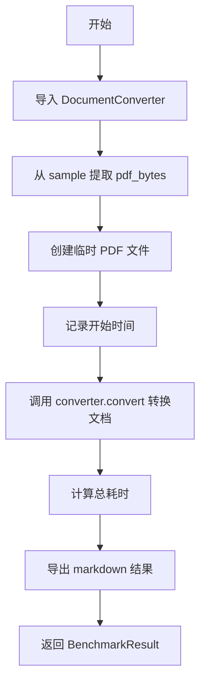
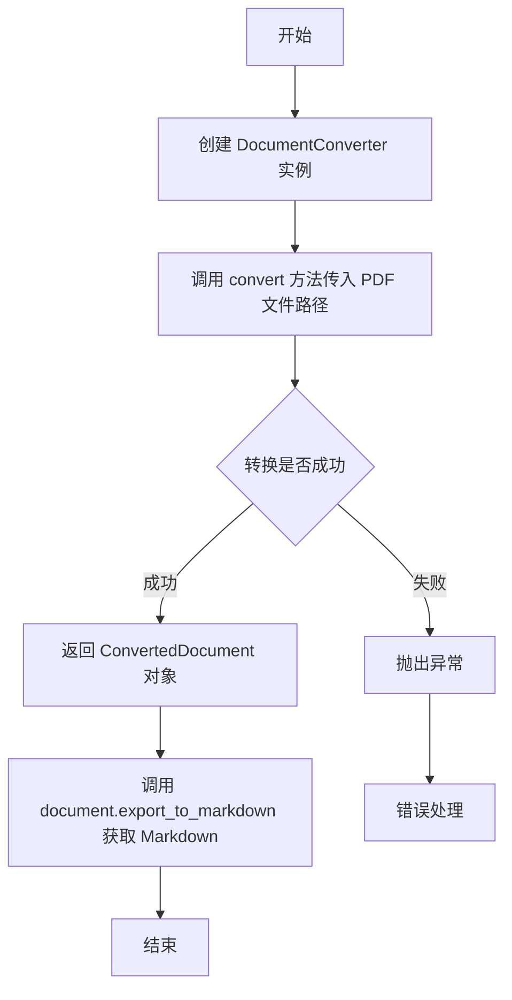
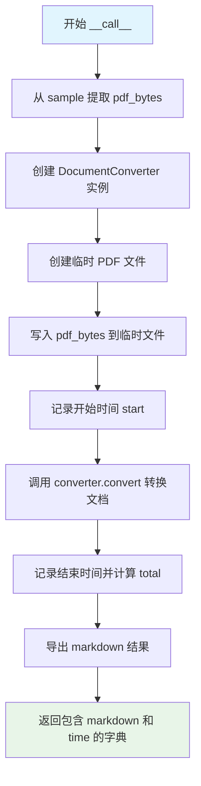

# `marker\benchmarks\overall\methods\docling.py` 详细设计文档

这是一个基于 Docling 库的文档转换方法类，继承自 BaseMethod，用于将 PDF 文档转换为 Markdown 格式，并返回转换结果和耗时信息的基准测试方法。

## 整体流程



## 类结构

```
BaseMethod (抽象基类)
└── DoclingMethod (文档转换方法)
```

## 全局变量及字段


### `DoclingMethod.model_dict`
    
模型配置字典，用于存储模型相关参数，默认为None

类型：`dict`
    


### `DoclingMethod.use_llm`
    
是否使用大语言模型的标志位，默认为False

类型：`bool`
    
    

## 全局函数及方法


### `DocumentConverter`

DocumentConverter 是 docling 库中的核心类，用于将 PDF 文档转换为其他格式（如 Markdown）。在当前代码中，它被实例化后用于读取 PDF 文件并将其内容转换为 Markdown 格式。

参数：

- `file_path`：`str`，要转换的 PDF 文件路径
- `**kwargs`：其他可选参数（如格式选项、OCR 设置等）

返回值：`ConvertedDocument`，包含转换后的文档对象及其导出方法（如 `export_to_markdown()`）

#### 流程图



#### 带注释源码

```python
# 从 docling 库导入 DocumentConverter 类
from docling.document_converter import DocumentConverter

# 实例化转换器
converter = DocumentConverter()

# 调用 convert 方法进行文档转换
# 参数: f.name - PDF 文件的完整路径（字符串类型）
# 返回值: result - 包含转换结果的 DocumentConverterResult 对象
#         该对象的 .document 属性指向转换后的文档对象
result = converter.convert(f.name)

# 通过文档对象的 export_to_markdown 方法导出为 Markdown 格式
# 返回值类型: str - Markdown 格式的字符串
markdown_content = result.document.export_to_markdown()
```

---

### 附加信息

#### 关键组件信息

| 名称 | 描述 |
|------|------|
| `DocumentConverter` | docling 库的核心转换器类，负责 PDF 到多种格式的转换 |
| `ConvertedDocument` | 转换结果容器类，提供 `export_to_markdown()` 等导出方法 |
| `BaseMethod` | 基准测试方法的抽象基类，定义了调用接口 |

#### 潜在的技术债务或优化空间

1. **重复实例化问题**：每次调用 `__call__` 都会创建新的 `DocumentConverter` 实例，如果高频调用应考虑复用实例或使用连接池
2. **临时文件管理**：使用 `tempfile.NamedTemporaryFile` 创建临时文件后未显式删除，可能造成临时文件积累
3. **缺乏错误处理**：代码未处理 PDF 读取失败、转换超时等异常情况
4. **硬编码依赖**：DocumentConverter 在方法内部导入，不利于依赖注入和单元测试

#### 其他项目

**设计目标与约束：**
- 目标：将 PDF 文档快速转换为 Markdown 格式
- 约束：输入为单页 PDF（`sample["pdf"]` 为字节数据）

**错误处理与异常设计：**
- 当前代码缺少 try-except 保护
- 建议添加：文件写入异常、转换超时、PDF 解析失败等异常处理

**数据流与状态机：**
```
PDF Bytes → 临时文件 → DocumentConverter.convert() → ConvertedDocument → Markdown String
```

**外部依赖与接口契约：**
- 依赖：`docling` 库（`docling.document_converter.DocumentConverter`）
- 输入契约：`sample["pdf"]` 必须为有效的 PDF 字节数据
- 输出契约：返回包含 `markdown`（str）和 `time`（float）的字典


### `DoclingMethod.__call__`

该方法接收一个包含 PDF 字节数据的样本对象，使用 Docling 的 DocumentConverter 将 PDF 文档转换为 Markdown 格式，并记录转换耗时，最终返回包含 Markdown 内容和耗时的 BenchmarkResult 字典。

**参数：**

- `sample`：`dict`，包含 PDF 字节数据的样本字典，需包含键 `"pdf"` 其值为单页 PDF 的字节数据

**返回值：** `BenchmarkResult`，返回包含转换结果的字典，结构为 `{"markdown": str, "time": float}`，其中 `markdown` 为转换后的文档内容，`time` 为转换过程消耗的秒数

#### 流程图



#### 带注释源码

```python
def __call__(self, sample) -> BenchmarkResult:
    # 导入 DocumentConverter 类
    from docling.document_converter import DocumentConverter
    
    # 从样本字典中提取 PDF 字节数据（单页 PDF）
    pdf_bytes = sample["pdf"]
    
    # 创建 Docling 文档转换器实例
    converter = DocumentConverter()

    # 创建临时 PDF 文件（自动清理）
    with tempfile.NamedTemporaryFile(suffix=".pdf", mode="wb") as f:
        # 将 PDF 字节写入临时文件
        f.write(pdf_bytes)
        
        # 记录转换开始时间
        start = time.time()
        
        # 执行 PDF 到 Markdown 的转换
        result = converter.convert(f.name)
        
        # 计算总耗时
        total = time.time() - start

    # 返回包含转换结果和耗时的字典
    return {
        "markdown": result.document.export_to_markdown(),  # 导出为 Markdown 格式
        "time": total  # 转换耗时（秒）
    }
```

## 关键组件


### 核心功能概述

该代码实现了一个 PDF 到 Markdown 的文档转换方法，利用 docling 库的 DocumentConverter 将单页 PDF 文档转换为 Markdown 格式，并记录转换耗时。

### 文件运行流程

1. 接收包含 PDF 数据的样本输入
2. 将 PDF 字节数据写入临时文件
3. 创建 DocumentConverter 实例
4. 调用 convert 方法执行文档转换
5. 导出转换结果为 Markdown 格式
6. 记录并返回转换结果和耗时

### 类详细信息

#### DoclingMethod 类

**类字段：**
- `model_dict: dict` - 模型配置字典（当前为 None）
- `use_llm: bool` - 是否使用 LLM（当前设为 False）

**类方法：**
- `__call__(self, sample) -> BenchmarkResult`
  - **参数：** `sample` (dict) - 包含 "pdf" 键的样本字典，值为 PDF 字节数据
  - **返回值：** `BenchmarkResult` - 包含 markdown 内容和转换时间的字典
  - **描述：** 使类实例可调用，执行 PDF 到 Markdown 的转换

```python
def __call__(self, sample) -> BenchmarkResult:
    from docling.document_converter import DocumentConverter
    pdf_bytes = sample["pdf"]  # This is a single page PDF
    converter = DocumentConverter()

    with tempfile.NamedTemporaryFile(suffix=".pdf", mode="wb") as f:
        f.write(pdf_bytes)
        start = time.time()
        result = converter.convert(f.name)
        total = time.time() - start

    return {
        "markdown": result.document.export_to_markdown(),
        "time": total
    }
```

### 关键组件信息

#### DocumentConverter
docling 库的文档转换器核心类，负责将 PDF 文档解析并转换为结构化文档对象

#### 临时文件管理
使用 tempfile.NamedTemporaryFile 创建临时 PDF 文件，供 DocumentConverter 读取

#### 性能计时模块
使用 time.time() 记录转换操作的开始和结束时间，计算总耗时

### 潜在技术债务与优化空间

1. **重复创建转换器**：每次调用都创建新的 DocumentConverter 实例，可考虑复用或使用单例模式
2. **临时文件 I/O**：写入临时文件再读取增加了 I/O 开销，可评估是否支持直接操作字节流
3. **模型配置未使用**：model_dict 字段定义但未使用，设计上可能预留但未实现
4. **缺少错误处理**：PDF 解析失败、文件写入失败等异常情况未做处理

### 其它项目

#### 设计目标与约束
- 目标：将单页 PDF 转换为 Markdown 格式
- 约束：输入为单页 PDF 字节数据

#### 错误处理与异常设计
- 当前实现缺少异常捕获机制
- 建议添加：PDF 解析异常、文件 I/O 异常、转换超时等处理

#### 数据流与状态机
- 输入：sample["pdf"] (bytes) → 临时文件 → DocumentConverter → Markdown (str)
- 无状态保持设计，为无状态转换方法

#### 外部依赖与接口契约
- 依赖：docling.document_converter.DocumentConverter
- 依赖：tempfile, time 标准库
- 输入接口：dict with "pdf" key (bytes)
- 输出接口：dict with "markdown" (str) and "time" (float) keys


## 问题及建议


### 已知问题

- **重复创建转换器对象**：`DocumentConverter()` 在每次方法调用时都会创建新实例，应该在 `__init__` 方法中创建一次并复用，避免不必要的对象创建开销
- **临时文件使用模式存在潜在问题**：虽然使用了 `with` 语句，但在调用 `converter.convert(f.name)` 时文件仍然处于打开状态，可能存在跨平台兼容性问题
- **缺少异常处理机制**：没有处理可能的异常情况，如 PDF 解析失败、文件写入失败、转换超时等，会导致程序直接崩溃
- **未使用的类字段**：`model_dict` 和 `use_llm` 两个字段定义但未在任何地方使用，造成代码冗余和混淆
- **缺少资源清理逻辑**：没有显式的资源释放和清理逻辑，可能导致资源泄漏
- **类型注解不完整**：字段 `model_dict` 和 `use_llm` 缺少类型注解

### 优化建议

- 将 `DocumentConverter` 的初始化移到 `__init__` 方法中作为实例变量，避免重复创建
- 考虑使用 `io.BytesIO` 替代临时文件，直接在内存中处理 PDF 字节流，减少 I/O 操作
- 添加 try-except 异常处理，捕获并妥善处理可能的异常，返回有意义的错误信息
- 如果 `model_dict` 和 `use_llm` 确实不需要，应删除这些字段以保持代码简洁
- 添加超时机制，防止转换操作无限等待
- 考虑添加日志记录，便于调试和监控转换性能

## 其它


### 设计目标与约束

本代码的设计目标是将PDF文档（特别是单页PDF）高效转换为Markdown格式，便于后续的文档处理和分析。约束条件包括：仅支持单页PDF处理，依赖docling库进行转换，不支持自定义转换选项，且每次调用都会创建临时文件。

### 错误处理与异常设计

代码中未显式处理异常，主要风险点包括：PDF字节数据为空或无效时可能导致DocumentConverter.convert()抛出异常；临时文件写入失败；docling库内部转换错误。建议添加异常捕获机制，对PDF数据有效性进行预检，并处理可能的转换超时情况。

### 数据流与状态机

数据流为：输入样本(sample) → 提取PDF字节 → 写入临时文件 → 调用DocumentConverter.convert() → 导出Markdown结果 → 返回BenchmarkResult。状态机较为简单，主要状态包括：待处理、处理中、转换完成、返回结果。

### 外部依赖与接口契约

主要外部依赖包括：docling.document_converter.DocumentConverter类、tempfile模块、time模块、BenchmarkResult类型（来自benchmarks.overall.methods）。接口契约要求输入sample必须包含"pdf"键且值为PDF字节数据，返回值必须为包含"markdown"和"time"键的字典。

### 性能考虑

当前实现每次调用都会创建新的DocumentConverter实例，造成资源浪费。临时文件的创建和写入也有一定开销。建议缓存DocumentConverter实例以提高批量处理性能，考虑使用内存缓冲区替代临时文件以减少I/O操作。

### 安全性考虑

代码使用tempfile.NamedTemporaryFile创建临时文件，存在路径注入风险。PDF数据未经过验证直接写入文件，可能面临恶意文件攻击。建议对输入PDF数据进行格式验证，限制文件大小，并确保临时文件在使用后及时清理。

### 配置管理

当前代码硬编码了文件后缀为".pdf"，未提供配置接口。建议将临时文件路径、转换选项、超时设置等抽取为配置参数，支持通过model_dict或初始化参数进行配置。

### 测试策略

建议添加以下测试用例：正常PDF转换功能测试、空PDF数据测试、损坏PDF数据测试、大文件性能测试、并发调用测试、临时文件清理验证测试。

    