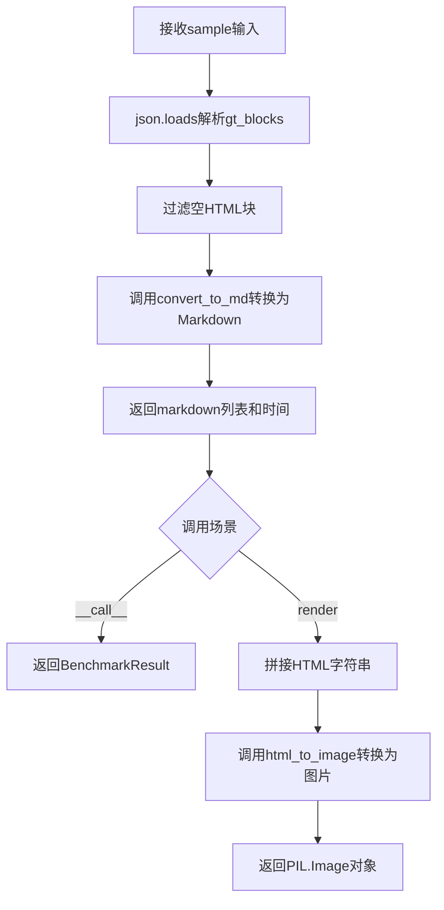
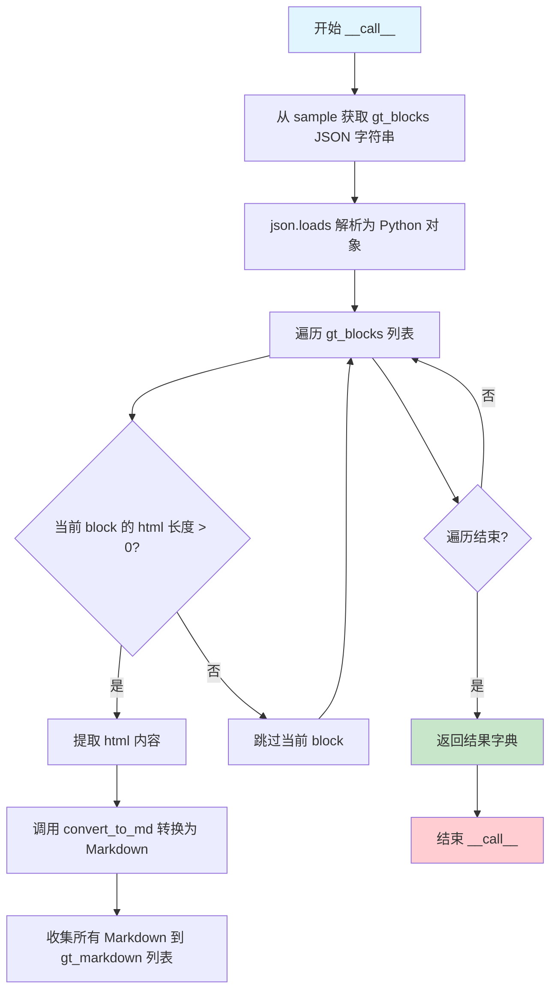
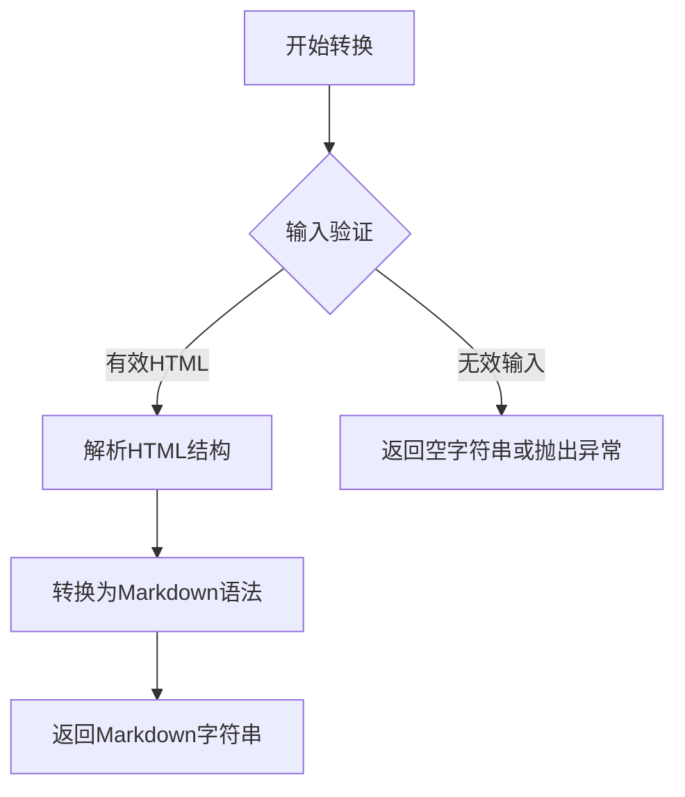
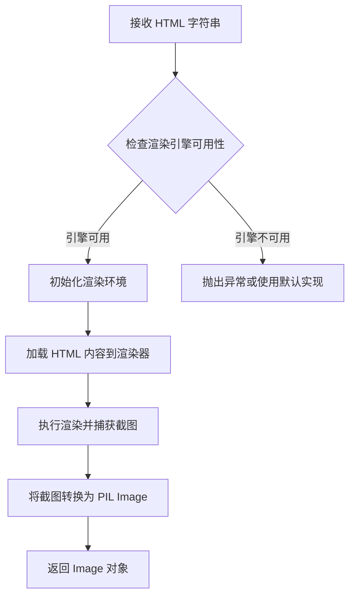

# `marker\benchmarks\overall\methods\gt.py` 详细设计文档

该代码实现了一个Ground Truth（GT）方法类GTMethod，继承自BaseMethod，用于将样本数据中的JSON格式gt_blocks解析为HTML，再转换为Markdown，并提供HTML渲染为图像的功能。主要用于基准测试中的结果对比和可视化。

## 整体流程



## 类结构

```
BaseMethod (抽象基类)
└── GTMethod (地面真值方法实现类)
```

## 全局变量及字段


### `GTMethod.convert_to_md`
    
将HTML块转换为Markdown格式的抽象方法

类型：`function (inherited from BaseMethod)`
    


### `GTMethod.html_to_image`
    
将HTML字符串渲染为PIL图像的抽象方法

类型：`function (inherited from BaseMethod)`
    


### `GTMethod.__call__`
    
使类实例可调用，处理样本提取ground truth blocks并转换为markdown

类型：`function`
    


### `GTMethod.render`
    
将HTML字符串列表渲染为PIL图像

类型：`function`
    
    

## 全局函数及方法


### `GTMethod.__call__`

该方法是 `GTMethod` 类的核心调用方法，负责将样本数据中的地面真值（Ground Truth）HTML 块转换为 Markdown 格式，并返回基准测试结果。它首先解析 JSON 格式的 `gt_blocks`，提取非空的 HTML 内容，然后将其转换为 Markdown，最后以字典形式返回包含 Markdown 列表和执行时间的结果。

参数：

- `sample`：`Dict`，包含地面真值数据的样本对象，需包含 "gt_blocks" 键（JSON 格式的字符串）

返回值：`Dict[str, Any]`，返回包含 "markdown"（转换后的 Markdown 列表）和 "time"（执行时间，固定为 0）的字典

#### 流程图



#### 带注释源码

```python
def __call__(self, sample) -> BenchmarkResult:
    """
    执行地面真值方法，将样本中的 HTML 块转换为 Markdown 格式
    
    参数:
        sample: 包含 gt_blocks 键的字典，gt_blocks 为 JSON 格式的字符串
    
    返回:
        包含 markdown 列表和 time 的字典
    """
    # 第一步：从样本中获取 "gt_blocks" 字段（JSON 字符串格式）
    gt_blocks = json.loads(sample["gt_blocks"])
    
    # 第二步：列表推导式提取所有非空的 HTML 内容
    # 遍历每个 block，筛选 html 长度大于 0 的项
    gt_html = [block["html"] for block in gt_blocks if len(block["html"]) > 0]
    
    # 第三步：将每个 HTML 转换为 Markdown 格式
    # 调用类的 convert_to_md 方法进行转换
    gt_markdown = [self.convert_to_md(block) for block in gt_html]
    
    # 第四步：返回基准测试结果字典
    # 包含转换后的 Markdown 列表和执行时间（此处固定为 0）
    return {
        "markdown": gt_markdown,
        "time": 0
    }
```


### `GTMethod.render`

将HTML片段列表渲染为PIL图像对象，通过将HTML片段拼接成完整文档后转换为图像。

参数：

- `self`：调用对象本身（隐式参数）
- `html`：`List[str]`，HTML片段列表，待渲染的HTML内容列表

返回值：`Image.Image`，PIL图像对象，渲染后的HTML页面图像

#### 流程图

```mermaid
flowchart TD
    A[开始 render 方法] --> B[接收 html 列表]
    B --> C{检查 html 是否为空}
    C -->|空列表| D[joined = '']
    C -->|非空| E[使用 "\n\n" 连接 html 列表]
    E --> D
    D --> F[拼接完整 HTML 文档]
    F --> G[去除首尾空白字符]
    G --> H[调用 html_to_image 转换为图像]
    H --> I[返回 PIL Image 对象]
```

#### 带注释源码

```python
def render(self, html: List[str]) -> Image.Image:
    """
    将HTML片段列表渲染为PIL图像对象
    
    参数:
        html: HTML片段列表
    
    返回:
        渲染后的图像对象
    """
    # 使用双换行符将HTML片段列表连接成单个字符串
    # 双换行符通常用于在HTML中创建段落分隔
    joined = "\n\n".join(html)
    
    # 构建完整的HTML文档结构
    # 包含<head>和<body>标签，将拼接后的HTML内容放入<body>中
    html = f"""
<html>
<head></head>
<body>
{joined}
</body>
</html>
""".strip()  # 去除首尾空白字符以获得干净的HTML文档
    
    # 调用继承的html_to_image方法将HTML转换为PIL图像
    # 该方法通常使用无头浏览器或WebKit引擎进行渲染
    return self.html_to_image(html)
```


### `BaseMethod.convert_to_md`

该方法继承自 `BaseMethod` 基类，负责将 HTML 字符串转换为 Markdown 格式。在 `GTMethod` 类中，它被用于将地面真值（Ground Truth）的 HTML 块转换为 Markdown 文本，以便后续的渲染和评估。

参数：

- `block`：`str`，需要转换的 HTML 字符串，来自地面真值数据中的 `html` 字段

返回值：`str`，转换后的 Markdown 格式字符串

#### 流程图



#### 带注释源码

```
# 假设 BaseMethod 中 convert_to_md 方法的典型实现

def convert_to_md(self, block: str) -> str:
    """
    将 HTML 字符串转换为 Markdown 格式
    
    参数:
        block: HTML 字符串
    
    返回:
        转换后的 Markdown 字符串
    """
    # 由于源代码中 BaseMethod 的实现未提供
    # 以下为基于使用场景的合理推断实现
    
    if not block or not isinstance(block, str):
        return ""
    
    # HTML 到 Markdown 的转换逻辑
    # 通常包括:
    # 1. 解析 HTML 标签
    # 2. 转换元素为对应的 Markdown 语法
    # 3. 处理嵌套结构
    
    markdown = self._html_to_markdown_parser(block)
    
    return markdown

def _html_to_markdown_parser(self, html: str) -> str:
    """
    内部方法：实际的 HTML 到 Markdown 解析逻辑
    """
    # <h1>-<h6> -> # ## ### ...
    # <p> -> 保持段落格式
    # <strong> -> **text**
    # <em> -> *text*
    # <a href="url">text</a> -> [text](url)
    # <ul><li> -> - item
    # <ol><li> -> 1. item
    # 等等...
    
    return markdown_result
```

> **注意**：由于 `BaseMethod` 类的源代码在提供的代码片段中未完整展示，上述源码为基于该方法在 `GTMethod` 中使用方式的合理推断。实际的 `convert_to_md` 实现可能包含更多细节，如错误处理、特殊 HTML 标签支持等。建议查阅 `benchmarks.overall.methods` 模块中的 `BaseMethod` 完整定义以获取准确实现。


### `BaseMethod.html_to_image`

将 HTML 字符串渲染为 PIL Image 对象的抽象方法，由子类实现具体的渲染逻辑。

参数：

- `html`：`str`，需要渲染的 HTML 字符串内容

返回值：`Image.Image`，渲染后的 PIL 图像对象

#### 流程图



#### 带注释源码

```python
def html_to_image(self, html: str) -> Image.Image:
    """
    将 HTML 字符串渲染为 PIL Image 对象
    
    参数:
        html: str - HTML 标记内容，包含完整的文档结构
        
    返回:
        Image.Image - 渲染后的图像对象，可用于保存或进一步处理
        
    注意:
        - 这是一个抽象方法，具体实现由子类提供
        - 子类实现可能使用 selenium、playwright 等浏览器自动化工具
        - 或使用 pillow-html 等库直接渲染 HTML/CSS
    """
    raise NotImplementedError("子类必须实现 html_to_image 方法")
```

## 关键组件


### GTMethod 类

主处理类，继承自 BaseMethod，负责将样本中的地面真实（Ground Truth）HTML块转换为Markdown格式，并可选择性地将HTML渲染为图像。

### __call__ 方法

核心执行方法，接收样本数据，解析JSON格式的gt_blocks，提取非空HTML并转换为Markdown列表，返回包含markdown和time的BenchmarkResult字典。

### render 方法

渲染方法，将HTML字符串列表拼接后包装成完整HTML文档，调用html_to_image将HTML转换为PIL Image对象返回。

### convert_to_md 方法（继承）

继承自BaseMethod的抽象方法，将单个HTML块转换为Markdown格式。

### html_to_image 方法（继承）

继承自BaseMethod的抽象方法，将HTML字符串转换为PIL Image对象。

### BaseMethod 基类

定义接口契约的抽象基类，规定子类必须实现convert_to_md和html_to_image方法。

### BenchmarkResult 类型

基准测试结果的数据结构，通常包含markdown结果列表和time耗时字段。

### JSON 解析组件

使用json.loads将sample中的gt_blocks字符串解析为Python对象列表。

### HTML 到图像转换管道

包含HTML拼接、HTML文档包装、html_to_image转换的完整渲染流水线。


## 问题及建议


### 已知问题

-   **JSON解析缺乏错误处理**：`json.loads(sample["gt_blocks"])` 未对键不存在或JSON格式错误的情况进行异常捕获，可能导致运行时崩溃
-   **缺少参数类型提示**：`sample` 参数缺少类型注解，影响代码可读性和类型检查
-   **数据验证不足**：未对 `sample["gt_blocks"]` 的结构进行验证，假设其始终为合法的JSON数组格式
-   **空值未处理**：`block["html"]` 可能不存在或为None，但代码直接访问未做防护；`gt_markdown` 列表可能包含None元素
-   **魔法字符串**：HTML模板字符串直接写在代码中，未提取为常量，重复使用时会增加维护成本
-   **资源未释放**：`render` 方法返回的 `PIL.Image` 对象未使用 `with` 语句或显式关闭，长期运行可能导致资源泄漏
-   **返回值类型不一致**：`__call__` 方法声明返回 `BenchmarkResult` 类型，但实际返回字典字面量，类型安全不足

### 优化建议

-   为 `sample` 参数添加类型提示（如 `Dict[str, Any]`），并对字典结构进行验证或使用Pydantic模型
-   将HTML模板提取为类常量 `HTML_TEMPLATE`，提高复用性和可维护性
-   添加try-except捕获 `json.JSONDecodeError` 和 `KeyError`，返回有意义的错误结果或记录日志
-   使用 `block.get("html", "")` 安全访问可能缺失的键，并过滤空值确保 `gt_markdown` 数据质量
-   考虑使用 `typing.TypeAlias` 或 dataclass 定义统一的返回值结构，增强类型安全性
-   在 `render` 方法中考虑图像对象的生命周期管理，或在调用方负责资源释放

## 其它


### 设计目标与约束

该类旨在为基准测试提供 ground truth（真实值）方法的实现，核心目标是将样本中的 gt_blocks 数据转换为 Markdown 格式并支持图像渲染。设计约束包括：1）必须继承 BaseMethod 抽象基类以保持接口一致性；2）输出格式需符合 BenchmarkResult 标准格式（包含 markdown 和 time 字段）；3）渲染功能依赖 PIL 库进行 HTML 到图像的转换。

### 错误处理与异常设计

代码存在以下错误处理缺陷：1）json.loads 缺乏异常捕获，当 sample["gt_blocks"] 格式非法时会导致程序崩溃；2）未对 sample 字典的键值进行空值检查；3）convert_to_md 和 html_to_image 方法在基类中未定义，调用时会引发 AttributeError；4）render 方法未处理空 HTML 列表的边界情况。建议增加 try-except 块处理 JSON 解析异常，增加键存在性校验，并为必需方法添加抽象方法定义或接口约束。

### 数据流与状态机

数据流路径如下：输入样本（字典）→ 提取 gt_blocks JSON 字符串 → JSON 解析为 Python 对象 → 过滤非空 HTML 块 → 转换为 Markdown 列表 → 组装 BenchmarkResult 字典返回。render 方法接收 HTML 字符串列表 → 拼接为完整 HTML 文档 → 调用 html_to_image 转换为 PIL Image 对象。该流程为单向线性处理，无状态机设计。

### 外部依赖与接口契约

外部依赖包括：1）typing.List 类型提示；2）json 标准库用于 JSON 解析；3）PIL.Image 用于图像生成；4）benchmarks.overall.methods 中的 BaseMethod 和 BenchmarkResult。接口契约要求：1）__call__ 方法必须接收包含 gt_blocks 键的样本字典，返回符合 BenchmarkResult 类型的字典；2）render 方法接收字符串列表返回 PIL Image 对象；3）convert_to_md 和 html_to_image 方法需由子类或基类提供实现。

### 性能考虑

当前实现存在性能优化空间：1）render 方法每次调用都重新构建完整的 HTML 文档字符串，频繁的字符串拼接效率较低；2）__call__ 方法中列表推导式和 filter 操作可以合并以减少迭代次数；3）未对 gt_blocks 进行缓存处理，重复调用时会重复解析相同数据。建议考虑引入缓存机制和字符串预编译优化。

### 安全考虑

render 方法存在潜在安全风险：1）直接将 HTML 内容拼接至模板中，未对用户输入进行转义处理，可能导致 XSS 漏洞；2）未对 HTML 内容进行净化，建议使用 HTML 清理库（如 bleach）处理输入。convert_to_md 方法需确保 Markdown 转换过程不会产生安全风险。

### 测试策略建议

建议补充以下测试用例：1）正常输入的单元测试，验证 markdown 列表生成正确；2）空 gt_blocks 的边界测试；3）JSON 格式错误的异常测试；4）render 方法的空输入和单元素输入测试；5）性能基准测试。建议使用 pytest 框架编写测试用例。

### 扩展性设计

当前设计支持以下扩展：1）可继承 GTMethod 并重写 convert_to_md 实现自定义 Markdown 转换逻辑；2）可重写 render 方法支持不同的渲染引擎（如 Selenium、Playwright）；3）可在 __call__ 方法中增加预处理和后处理步骤。建议将 convert_to_md 和 html_to_image 定义为抽象方法或钩子方法，以提高代码的可测试性和扩展性。

### 配置与常量

代码中未抽取配置项，以下内容建议外部化：1）HTML 模板结构（head、body 标签）可提取为配置；2）空 HTML 块的过滤阈值（len(block["html"]) > 0）可配置；3）渲染输出图像的默认尺寸和格式可作为参数传入。建议使用配置文件或构造函数参数管理这些可变项。

    