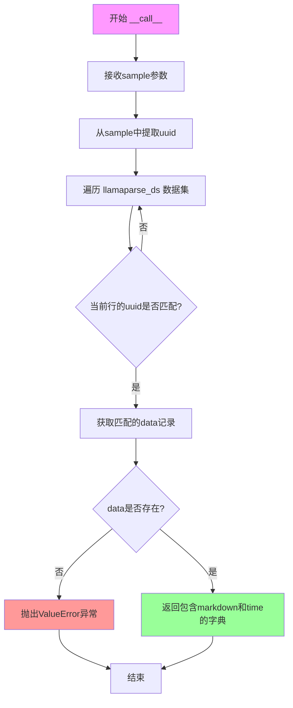

# `marker\benchmarks\overall\methods\llamaparse.py` 详细设计文档

该代码实现了一个文档解析方法类LlamaParseMethod，用于从预加载的数据集中根据uuid查找对应的文档内容和解析时间，并返回包含markdown和time的BenchmarkResult结果。

## 整体流程

```mermaid
graph TD
A[开始 __call__] --> B[获取 sample['uuid']]
B --> C[初始化 data = None]
C --> D{遍历 llamaparse_ds}
D --> E{当前行 uuid == sample uuid?}
E -- 是 --> F[data = 当前行数据]
E -- 否 --> D
D --> G{data 是否为空?}
G -- 是 --> H[抛出 ValueError]
G -- 否 --> I[返回 {'markdown': data['md'], 'time': data['time']}]
```

## 类结构

```
BaseMethod (基类)
└── LlamaParseMethod (文档解析方法实现类)
```

## 全局变量及字段


### `LlamaParseMethod.llamaparse_ds`
    
存储LlamaParse解析后的文档数据集

类型：`datasets.Dataset`
    
    

## 全局函数及方法


### `LlamaParseMethod.__call__`

该方法是一个可调用对象（通过`__call__`实现），接收包含uuid的样本数据字典，在llamaparse数据集中查找匹配的记录，并返回包含markdown内容和解析时间的BenchmarkResult字典。

参数：

- `sample`：`dict`，包含uuid的样本数据字典

返回值：`BenchmarkResult (dict)`，包含markdown内容(md字段)和解析时间(time字段)的字典

#### 流程图



#### 带注释源码

```python
def __call__(self, sample) -> BenchmarkResult:
    """
    调用方法：根据sample中的uuid在llamaparse数据集中查找匹配的记录并返回结果
    
    参数:
        sample: 包含uuid的样本数据字典
        
    返回:
        包含markdown内容和解析时间的字典
        
    异常:
        ValueError: 当找不到对应uuid的数据时抛出
    """
    # 从sample字典中提取uuid字段
    uuid = sample["uuid"]
    
    # 初始化data为None
    data = None
    
    # 遍历整个llamaparse_ds数据集
    for row in self.llamaparse_ds:
        # 字符串比较，确保类型一致性
        if str(row["uuid"]) == str(uuid):
            # 找到匹配的记录，保存到data变量
            data = row
            # 找到后立即退出循环，提高效率
            break
    
    # 如果未找到匹配的数据，抛出异常
    if not data:
        raise ValueError(f"Could not find data for uuid {uuid}")
    
    # 返回包含markdown内容和解析时间的BenchmarkResult字典
    return {
        "markdown": data["md"],    # markdown格式的内容
        "time": data["time"]       # 解析耗时
    }
```


### `LlamaParseMethod.__call__`

该方法是 LlamaParseMethod 类的可调用接口，通过传入的 sample 参数中的 uuid 在 llamaparse_ds 数据集中查找对应的数据记录，并返回包含 markdown 内容和处理时间的 BenchmarkResult 格式数据。

参数：

- `sample`：`dict`，抽象方法参数

返回值：`BenchmarkResult`，基准测试结果

#### 流程图

```mermaid
flowchart TD
    A[开始 __call__] --> B[从sample中获取uuid]
    B --> C[初始化 data = None]
    C --> D[遍历 llamaparse_ds 数据集]
    D --> E{当前 row 的 uuid == 输入 uuid?}
    E -->|是| F[设置 data = row]
    F --> G[跳出循环]
    E -->|否| D
    D --> G
    G --> H{data 是否为空?}
    H -->|是| I[抛出 ValueError: Could not find data for uuid {uuid}]
    H -->|否| J[返回字典: markdown 和 time]
    I --> K[结束 - 异常]
    J --> L[结束 - 返回结果]
```

#### 带注释源码

```python
def __call__(self, sample) -> BenchmarkResult:
    """
    可调用接口方法，根据 sample 中的 uuid 在数据集中查找对应数据
    
    参数:
        sample: 包含 uuid 键的字典，uuid 用于定位数据记录
    
    返回:
        包含 markdown 内容和处理时间的字典
    """
    # 从输入样本中提取 uuid 用于数据查找
    uuid = sample["uuid"]
    # 初始化 data 为 None，作为是否找到数据的标记
    data = None
    # 遍历整个 llamaparse_ds 数据集
    for row in self.llamaparse_ds:
        # 将行数据的 uuid 与输入 uuid 进行字符串比较（处理类型不一致的情况）
        if str(row["uuid"]) == str(uuid):
            # 找到匹配记录，保存数据
            data = row
            # 跳出循环，避免不必要的遍历
            break
    
    # 检查是否找到对应数据
    if not data:
        # 未找到数据时抛出异常，说明数据集中不存在该 uuid 的记录
        raise ValueError(f"Could not find data for uuid {uuid}")
    
    # 返回包含 markdown 内容和处理时间的结果字典
    return {
        "markdown": data["md"],    # 从找到的数据中提取 markdown 内容
        "time": data["time"]       # 从找到的数据中提取处理时间
    }
```

## 关键组件


### 数据集线性搜索

通过for循环遍历整个llamaparse_ds数据集，逐行比对uuid进行数据查找，未使用任何索引优化机制。

### UUID匹配逻辑

将sample中的uuid与数据集中的uuid都转换为字符串后进行比较，确保类型一致性。

### 结果映射结构

返回包含markdown内容和处理时间的字典结构，键名为"markdown"和"time"。

### 错误处理机制

当未找到对应uuid的数据时，抛出ValueError异常并附带具体的uuid信息。


## 问题及建议


### 已知问题

-   **线性搜索效率低下**：使用 `for row in self.llamaparse_ds` 遍历整个数据集查找 UUID，时间复杂度为 O(n)，数据量较大时性能严重受影响
-   **重复字符串转换开销**：循环内每次迭代都执行 `str(row["uuid"]) == str(uuid)` 字符串转换，可预先统一转换后进行比较
-   **缺少空值保护**：未检查 `self.llamaparse_ds` 是否为 `None`，直接遍历会导致 `TypeError`
-   **返回值类型不一致**：方法签名声明返回 `BenchmarkResult`，但实际返回 `dict`，与类型注解不符
-   **硬编码字段名**：字段名 "uuid"、"md"、"time" 散落多处，耦合度高，字段名变更需修改多处代码
-   **未利用数据集索引**：datasets.Dataset 支持通过索引或键直接访问，未充分利用其高效查找能力

### 优化建议

-   **构建 UUID 索引映射**：在初始化时构建 `uuid -> row` 的字典映射，将查找复杂度从 O(n) 降至 O(1)
-   **提取常量字段名**：将字段名定义为类常量或配置，提高可维护性
-   **添加空值校验**：在方法开始处检查 `self.llamaparse_ds` 是否为 `None`，并抛出明确的异常信息
-   **统一返回值类型**：确保返回值符合 `BenchmarkResult` 类型定义，或调整类型注解以匹配实际返回的字典结构
-   **缓存预处理结果**：如果数据集在运行期间不变，可在 `__init__` 或首次调用时构建索引缓存，避免重复计算

## 其它


### 设计目标与约束

本代码的设计目标是实现一个基于 LlamaParse 的文档解析方法，通过 UUID 从数据集中检索对应的 Markdown 内容和解析时间。设计约束包括：输入必须包含有效的 uuid 字段，数据集必须包含 uuid、md 和 time 字段，且 uuid 必须唯一。

### 错误处理与异常设计

主要异常情况包括：数据为空、数据集中未找到对应 uuid、数据集字段缺失。当未找到对应 uuid 时，抛出 ValueError 并包含具体的 uuid 信息以便调试。数据为空时同样抛出 ValueError 异常。

### 数据流与状态机

数据流为：输入 sample（包含 uuid）-> 遍历 llamaparse_ds 数据集 -> 匹配 uuid -> 提取 md 和 time 字段 -> 返回 BenchmarkResult 字典。状态机较为简单，主要为初始化状态和执行状态。

### 外部依赖与接口契约

外部依赖包括 datasets 库和 benchmarks.overall.methods 模块中的 BaseMethod 类与 BenchmarkResult 类型。接口契约要求：输入 sample 必须包含 uuid 字段且值为字符串或可转换为字符串；llamaparse_ds 数据集必须包含 uuid、md、time 字段；返回值为包含 markdown 和 time 键的字典。

### 性能考虑与优化空间

当前实现使用线性遍历查找 uuid，时间复杂度为 O(n)。当数据集较大时性能较差，可考虑使用字典或哈希表进行 O(1) 查找或预先建立 uuid 到数据行的映射。此外，每次调用都会遍历整个数据集，可考虑在初始化时构建索引。

### 安全性考虑

输入的 uuid 通过 str() 转换处理，需要确保转换后的 uuid 存在于数据集中。同时需要注意数据集中的 md 字段可能包含恶意内容，前端渲染时需进行安全处理。

### 测试策略建议

应包含单元测试验证正常查找流程、异常测试验证未找到 uuid 时的错误处理、空数据测试、边界情况测试（空数据集、重复 uuid 等）以及性能测试验证大数据集下的响应时间。

    