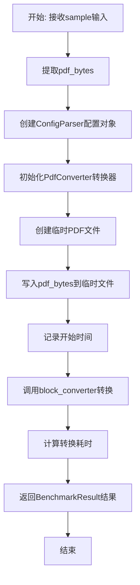
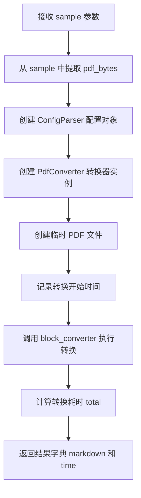

# `marker\benchmarks\overall\methods\marker.py` 详细设计文档

该代码实现了一个名为MarkerMethod的PDF转Markdown方法类，继承自BaseMethod，利用marker库的PdfConverter和ConfigParser将PDF文档转换为Markdown格式，支持可选的LLM增强功能以提升转换质量，适用于文档转换基准测试场景。

## 整体流程



## 类结构

```
BaseMethod (抽象基类)
└── MarkerMethod (PDF转Markdown方法类)
```

## 全局变量及字段


### `MarkerMethod.model_dict`
    
模型字典配置，用于传递模型相关的配置参数

类型：`dict`
    


### `MarkerMethod.use_llm`
    
是否使用LLM增强，控制是否启用大语言模型来提升转换质量

类型：`bool`
    
    

## 全局函数及方法


### `MarkerMethod.__call__`

执行 PDF 到 Markdown 转换的主方法，负责接收包含 PDF 数据的样本，通过配置解析器和 PDF 转换器将 PDF 内容渲染为 Markdown 格式，并返回转换结果和耗时信息。

#### 参数

- `sample`：`dict`，包含 PDF 数据的输入样本，必须包含键 `"pdf"`，值为 PDF 文件的字节数据

#### 返回值

`BenchmarkResult`（实际为 dict），返回包含以下键的字典：
- `markdown`：转换后的 Markdown 字符串
- `time`：转换过程消耗的时间（秒）

#### 流程图



#### 带注释源码

```python
def __call__(self, sample) -> BenchmarkResult:
    # 从样本中提取 PDF 字节数据（单页 PDF）
    pdf_bytes = sample["pdf"]
    
    # 创建配置解析器，设置转换参数：
    # - page_range: "0" 表示只处理第一页
    # - disable_tqdm: True 禁用进度条
    # - use_llm: 是否使用 LLM 增强转换
    # - redo_inline_math: 使用 LLM 时重新处理行内数学公式
    # - llm_service: 指定 Google Vertex LLM 服务
    parser = ConfigParser({
        "page_range": "0",
        "disable_tqdm": True,
        "use_llm": self.use_llm,
        "redo_inline_math": self.use_llm,
        "llm_service": "marker.services.vertex.GoogleVertexService",
        "vertex_project_id": os.getenv("VERTEX_PROJECT_ID"),
    })

    # 初始化 PDF 转换器，传入模型字典、配置和 LLM 服务
    block_converter = PdfConverter(
        artifact_dict=self.model_dict,
        config=parser.generate_config_dict(),
        llm_service=parser.get_llm_service()
    )

    # 创建临时 PDF 文件并写入 PDF 字节数据
    with tempfile.NamedTemporaryFile(suffix=".pdf", mode="wb") as f:
        f.write(pdf_bytes)
        # 记录转换开始时间
        start = time.time()
        # 调用转换器将 PDF 渲染为 Markdown
        rendered = block_converter(f.name)
        # 计算总耗时
        total = time.time() - start

    # 返回包含 Markdown 内容和转换耗时的结果字典
    return {
        "markdown": rendered.markdown,
        "time": total
    }
```

## 关键组件


### MarkerMethod

主类，继承BaseMethod，用于将PDF文档转换为Markdown格式，并返回转换结果和耗时信息。

### model_dict

类属性，字典类型，存储PdfConverter所需的模型工件字典配置。

### use_llm

类属性，布尔类型，控制是否使用LLM服务进行更高级的转换处理。

### __call__

核心方法，接受样本输入，提取PDF字节流，配置转换器，执行PDF到Markdown的转换，返回包含markdown内容和转换耗时的BenchmarkResult。

### ConfigParser

配置解析器类，负责生成marker转换器的配置字典，包括页码范围、tqdm禁用、LLM服务等参数。

### PdfConverter

PDF转换器类，基于marker库实现，负责将PDF文件渲染为包含markdown结构的对象。

### BaseMethod

基准测试方法的抽象基类，定义了callable接口和BenchmarkResult返回类型规范。

### BenchmarkResult

基准测试结果字典类型，包含markdown字段（转换后的文本）和time字段（转换耗时）。

### tempfile.NamedTemporaryFile

上下文管理器，用于创建临时PDF文件以供PdfConverter读取处理。

### time

时间模块，用于测量PDF转换过程的执行耗时。

## 问题及建议


### 已知问题

-   **重复初始化开销**：每次调用都创建新的 `ConfigParser` 和 `PdfConverter` 实例，导致模型和配置重复加载，性能低下
-   **临时文件 I/O 冗余**：先将 `pdf_bytes` 写入临时文件再读取，而非直接使用内存中的字节数据，增加不必要的磁盘 I/O 操作
-   **类变量误用**：`model_dict` 和 `use_llm` 定义为类变量，但作为实例状态使用，可能导致多实例间状态共享的潜在 bug
-   **硬编码配置**：LLM 服务类路径 `"marker.services.vertex.GoogleVertexService"` 和项目 ID 环境变量名硬编码，缺乏灵活性
-   **类型安全缺失**：`__call__` 方法返回类型声明为 `BenchmarkResult`，但实际返回字典 `{"markdown": ..., "time": ...}`，类型不一致
-   **异常处理缺失**：文件操作和 PDF 转换过程无异常捕获，可能导致资源泄漏
-   **环境变量未校验**：依赖 `VERTEX_PROJECT_ID` 环境变量但未检查是否存在，运行时可能抛出异常
-   **配置参数化不足**：`page_range: "0"` 写死在配置中，无法根据 sample 动态调整

### 优化建议

-   **实例级缓存**：将 `ConfigParser` 和 `PdfConverter` 的初始化移至 `__init__` 方法，仅在实例创建时初始化一次
-   **内存直接处理**：使用 `PdfConverter` 支持的内存输入方式（如果有），或使用 `io.BytesIO` 替代临时文件，减少 I/O
-   **修复变量作用域**：将 `model_dict` 和 `use_llm` 改为实例变量（在 `__init__` 中定义）
-   **配置外部化**：通过构造函数参数或配置文件传入 LLM 服务类和环境变量，提升可测试性和可配置性
-   **返回类型统一**：确保返回 `BenchmarkResult` 对象，或修改类型声明为 `dict`
-   **添加异常处理**：使用 try-except 包裹转换逻辑，确保临时文件等资源正确释放
-   **环境变量校验**：在读取环境变量前检查其是否存在，提供明确的错误信息

## 其它


### 设计目标与约束

该模块旨在实现将单页PDF文档高效转换为Markdown格式的核心功能，支持可选的LLM增强处理以提升转换质量。设计约束包括：仅支持单页PDF处理（page_range固定为"0"），依赖Google Vertex服务进行LLM调用，需要配置VERTEX_PROJECT_ID环境变量，转换结果通过BenchmarkResult结构返回markdown内容和耗时统计。

### 错误处理与异常设计

代码中未包含显式的异常处理机制，存在以下潜在风险点：环境变量VERTEX_PROJECT_ID未设置时可能导致后续LLM服务调用失败；PDF写入临时文件失败或临时文件被意外删除会引发异常；PdfConverter内部异常会导致整个转换流程中断。建议增加：环境变量缺失时的默认值或明确错误提示；临时文件操作的异常捕获；PdfConverter调用结果的验证逻辑。

### 数据流与状态机

数据流如下：输入样本(sample)包含pdf_bytes → 创建ConfigParser配置对象 → 初始化PdfConverter → 将pdf_bytes写入临时PDF文件 → 调用block_converter执行转换 → 提取rendered.markdown和耗时统计 → 返回BenchmarkResult。状态转换简单线性，无分支状态机设计，转换过程为同步阻塞模式。

### 外部依赖与接口契约

主要外部依赖包括：BaseMethod（基类，定义__call__接口）、BenchmarkResult（返回值类型约束）、ConfigParser（marker.config.parser配置解析器）、PdfConverter（marker.converters.pdf转换器）、GoogleVertexService（LLM服务接口）。输入契约：sample字典必须包含"pdf"键，值为PDF字节数据；model_dict必须为有效模型字典。输出契约：返回字典包含"markdown"（字符串）和"time"（浮点数）两个键。

### 性能考虑

每次调用都会创建新的ConfigParser和PdfConverter实例，存在重复初始化开销；临时文件IO操作引入额外开销；LLM服务调用为阻塞同步模式。建议优化方向：考虑对象复用或连接池机制；对于批量处理场景可考虑异步或批处理模式；评估临时文件策略（可尝试内存缓冲）。

### 安全性考虑

代码依赖环境变量VERTEX_PROJECT_ID存储敏感项目ID信息，建议通过安全渠道注入；临时文件使用NamedTemporaryFile自动清理，但写入的PDF内容可能包含敏感信息，需确保处理环境安全；无用户输入验证机制，pdf_bytes内容需在上游进行安全审查。

### 配置管理

配置通过ConfigParser集中管理，可配置项包括：page_range（当前固定为"0"）、disable_tqdm、use_llm、redo_inline_math、llm_service、vertex_project_id。当前use_llm由类属性控制，建议增加更灵活的配置方式以支持运行时切换；配置值硬编码程度较高，可考虑外部化配置源。

### 测试策略建议

建议补充以下测试用例：正常PDF转换功能测试；PDF字节为空或格式错误的异常场景；VERTEX_PROJECT_ID未设置时的降级或报错测试；PdfConverter初始化失败的异常处理测试；多次连续调用的性能和资源泄漏检测；不同use_llm配置下的行为差异测试。

### 部署要求

部署时需确保：VERTEX_PROJECT_ID环境变量已正确配置；marker及相关依赖包已安装；具有Google Vertex服务访问权限；临时目录有写权限；如启用LLM，需确保网络连通性。建议提供Dockerfile或环境配置清单以保证部署一致性。
    